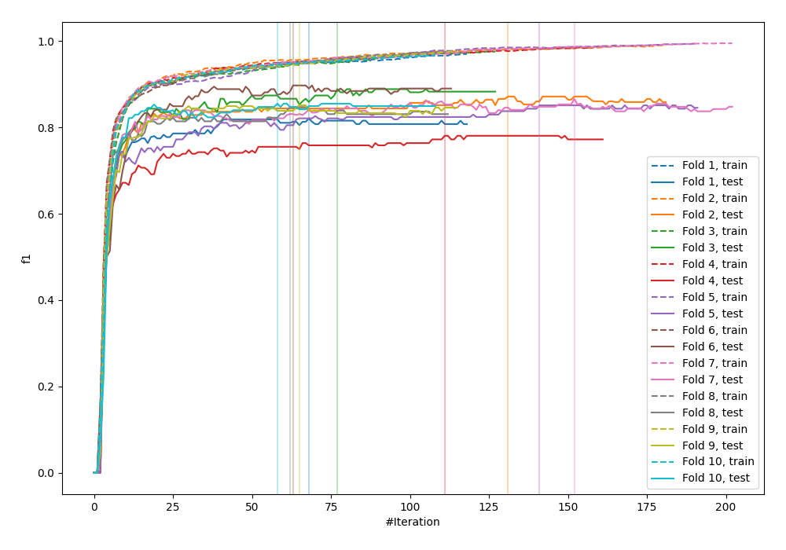
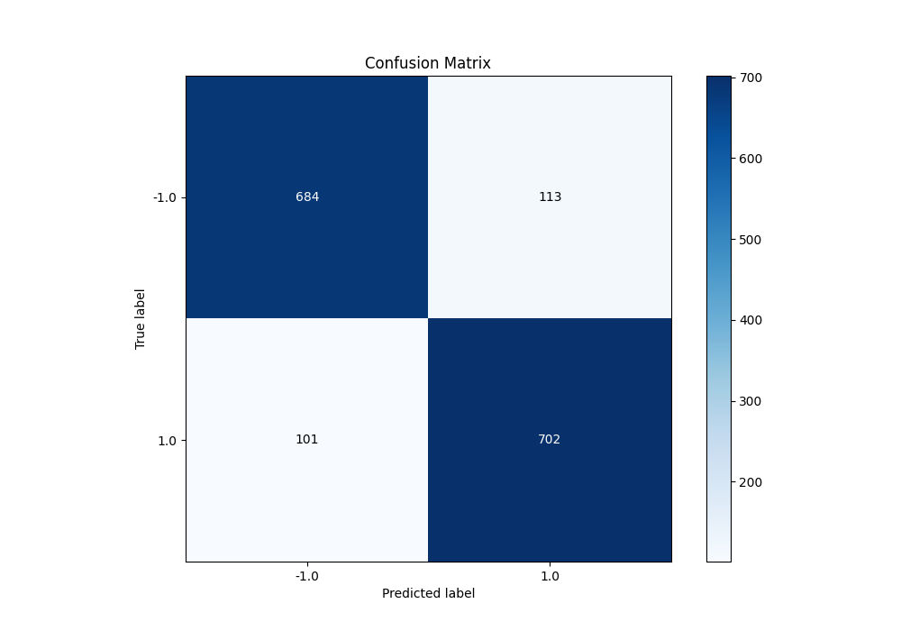
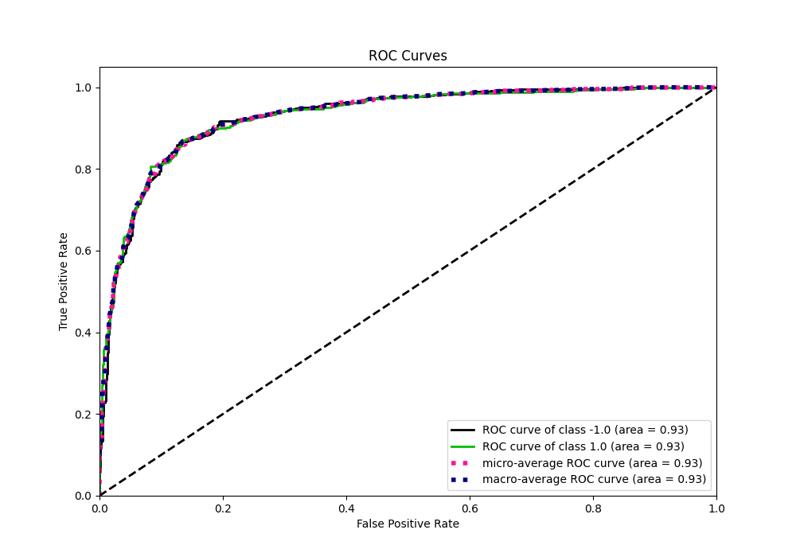
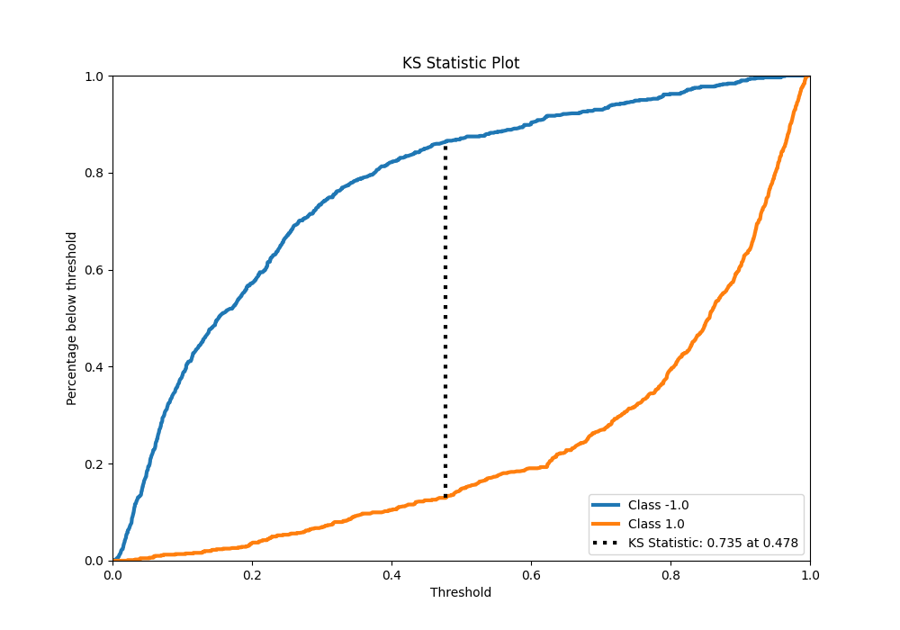
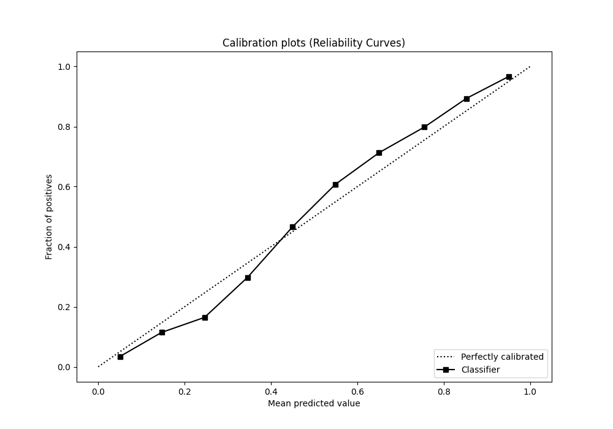
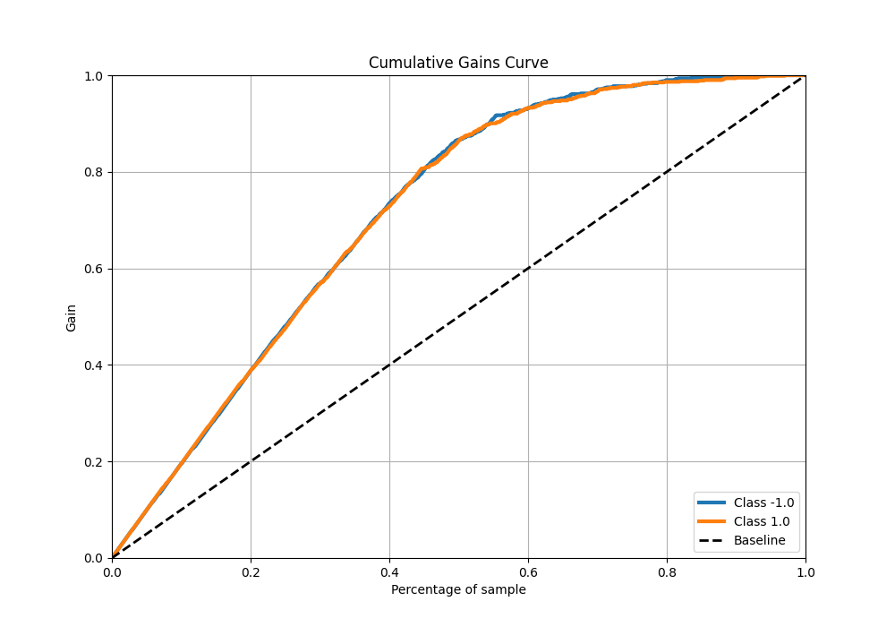
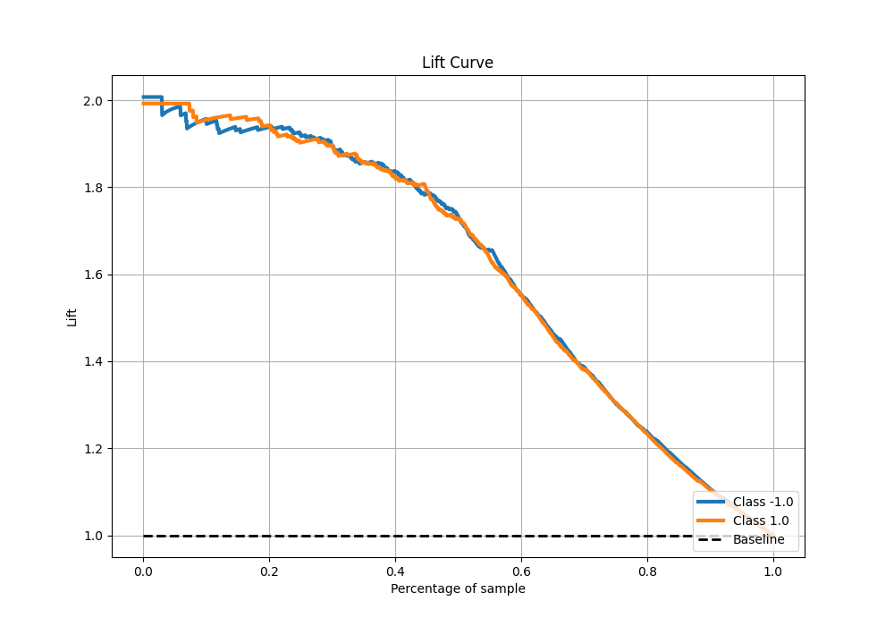

# Summary of 12_Xgboost

[<< Go back](../README.md)

## Extreme Gradient Boosting (Xgboost)
- **n_jobs**: -1
- **objective**: binary:logistic
- **eta**: 0.1
- **max_depth**: 7
- **min_child_weight**: 5
- **subsample**: 1.0
- **colsample_bytree**: 0.5
- **eval_metric**: f1
- **explain_level**: 0

## Validation
 - **validation_type**: kfold
 - **shuffle**: True
 - **stratify**: True
 - **k_folds**: 10

## Optimized metric
f1

## Training time

26.6 seconds

## Metric details
|           |    score |    threshold |
|:----------|---------:|-------------:|
| logloss   | 0.345513 | nan          |
| auc       | 0.928586 | nan          |
| f1        | 0.867738 |   0.462301   |
| accuracy  | 0.86625  |   0.462301   |
| precision | 1        |   0.965477   |
| recall    | 1        |   0.00184526 |
| mcc       | 0.732564 |   0.462301   |

## Metric details with threshold from accuracy metric
|           |    score |   threshold |
|:----------|---------:|------------:|
| logloss   | 0.345513 |  nan        |
| auc       | 0.928586 |  nan        |
| f1        | 0.867738 |    0.462301 |
| accuracy  | 0.86625  |    0.462301 |
| precision | 0.86135  |    0.462301 |
| recall    | 0.874222 |    0.462301 |
| mcc       | 0.732564 |    0.462301 |

## Confusion matrix (at threshold=0.462301)
|                 |   Predicted as -1.0 |   Predicted as 1.0 |
|:----------------|--------------------:|-------------------:|
| Labeled as -1.0 |                 684 |                113 |
| Labeled as 1.0  |                 101 |                702 |

## Learning curves

## Confusion Matrix

## Normalized Confusion Matrix

## ROC Curve

## Kolmogorov-Smirnov Statistic

## Precision-Recall Curve

## Calibration Curve

## Cumulative Gains Curve

## Lift Curve

[<< Go back](../README.md)
