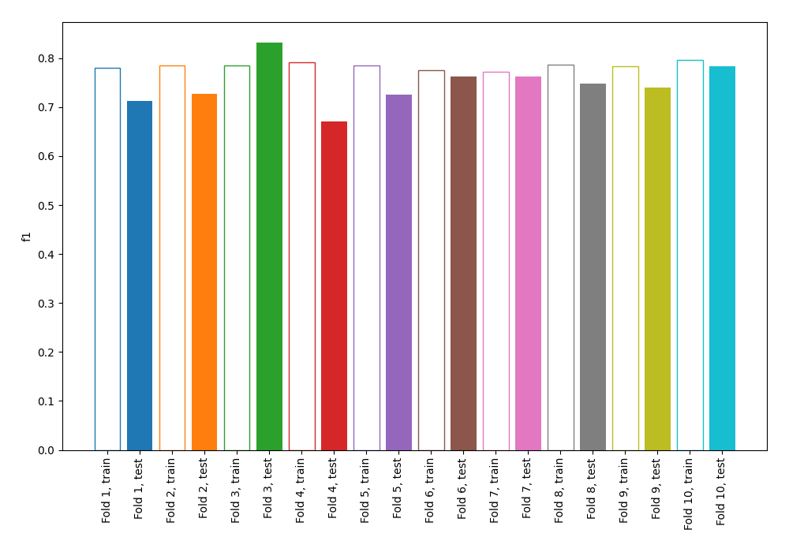
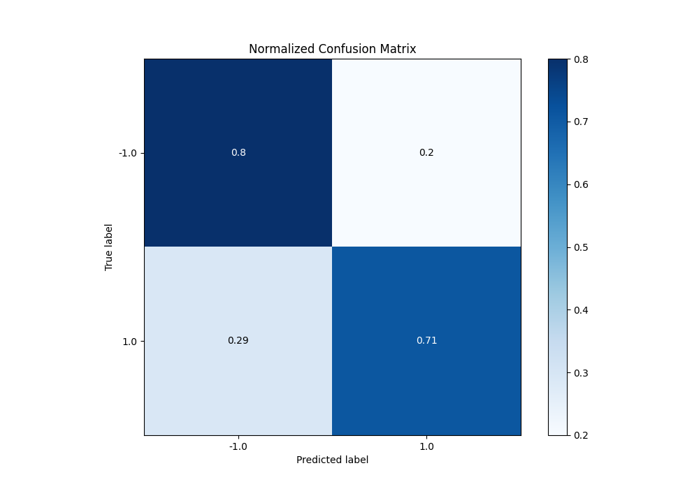
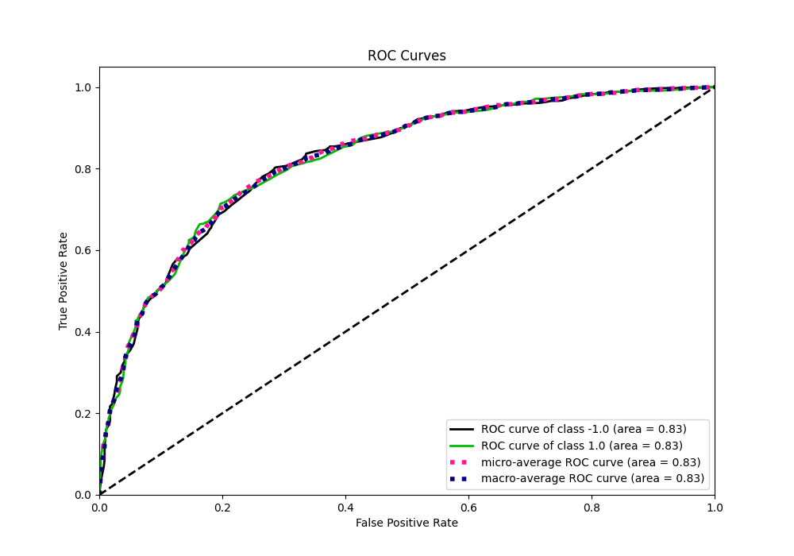
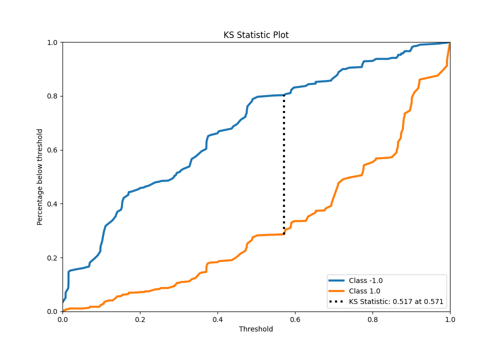
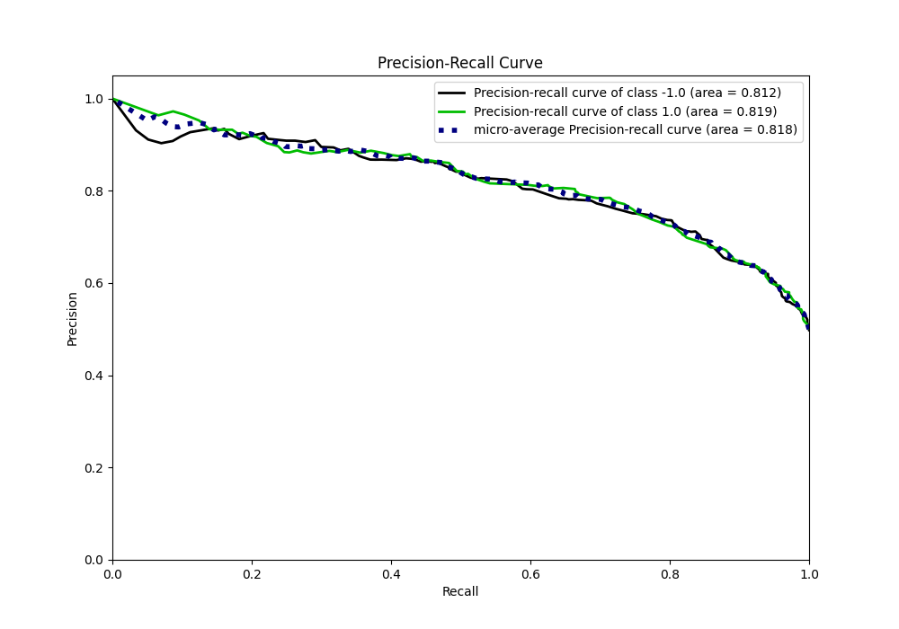
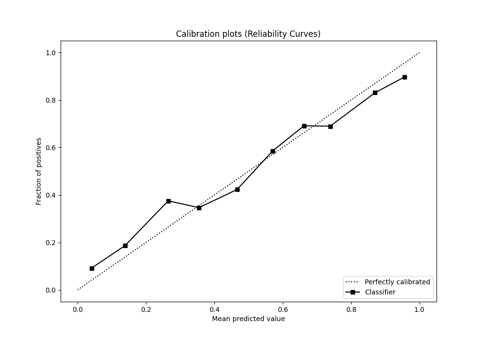
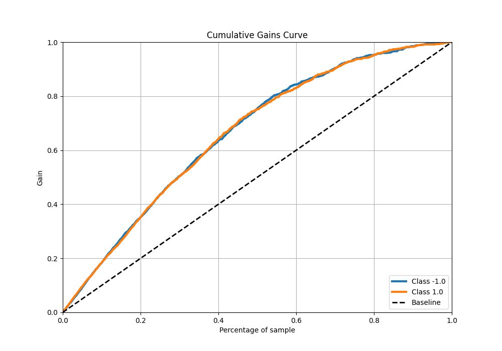
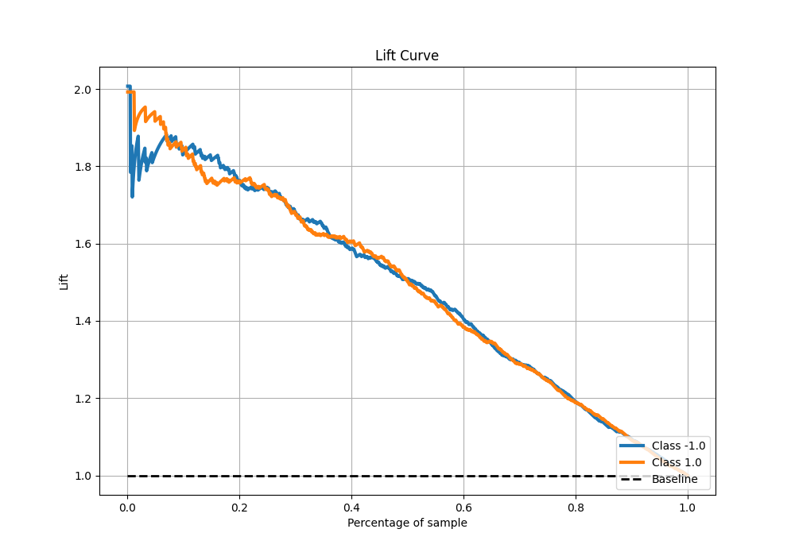

# Summary of 1_DecisionTree

[<< Go back](../README.md)

## Decision Tree
- **n_jobs**: -1
- **criterion**: entropy
- **max_depth**: 4
- **explain_level**: 0

## Validation
 - **validation_type**: kfold
 - **shuffle**: True
 - **stratify**: True
 - **k_folds**: 10

## Optimized metric
f1

## Training time

7.7 seconds

## Metric details
|           |    score |   threshold |
|:----------|---------:|------------:|
| logloss   | 0.54808  |  nan        |
| auc       | 0.825435 |  nan        |
| f1        | 0.761853 |    0.333333 |
| accuracy  | 0.758125 |    0.54717  |
| precision | 0.972222 |    0.992248 |
| recall    | 0.997509 |    0        |
| mcc       | 0.518449 |    0.54717  |

## Metric details with threshold from accuracy metric
|           |    score |   threshold |
|:----------|---------:|------------:|
| logloss   | 0.54808  |   nan       |
| auc       | 0.825435 |   nan       |
| f1        | 0.747883 |     0.54717 |
| accuracy  | 0.758125 |     0.54717 |
| precision | 0.784153 |     0.54717 |
| recall    | 0.714819 |     0.54717 |
| mcc       | 0.518449 |     0.54717 |

## Confusion matrix (at threshold=0.54717)
|                 |   Predicted as -1.0 |   Predicted as 1.0 |
|:----------------|--------------------:|-------------------:|
| Labeled as -1.0 |                 639 |                158 |
| Labeled as 1.0  |                 229 |                574 |

## Learning curves

## Confusion Matrix

## Normalized Confusion Matrix

## ROC Curve

## Kolmogorov-Smirnov Statistic

## Precision-Recall Curve

## Calibration Curve

## Cumulative Gains Curve

## Lift Curve

[<< Go back](../README.md)
