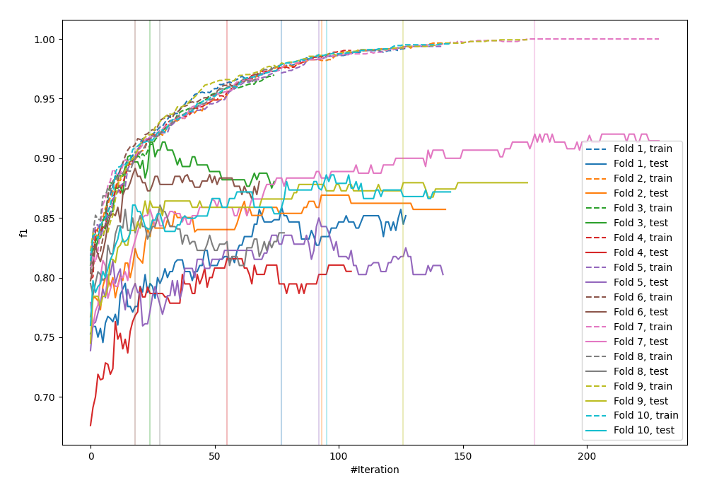
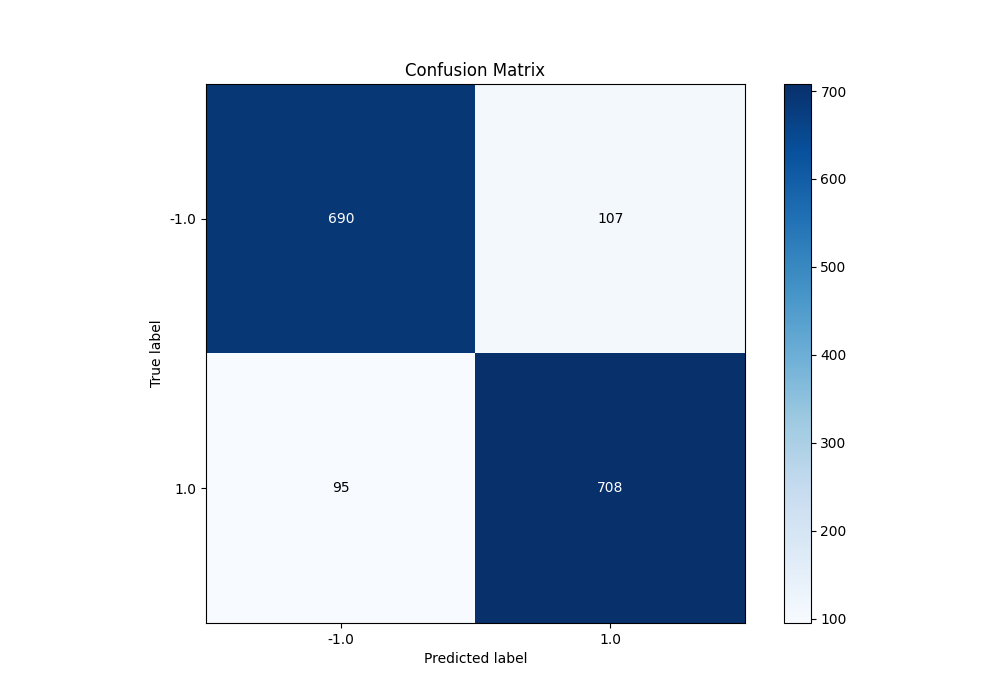
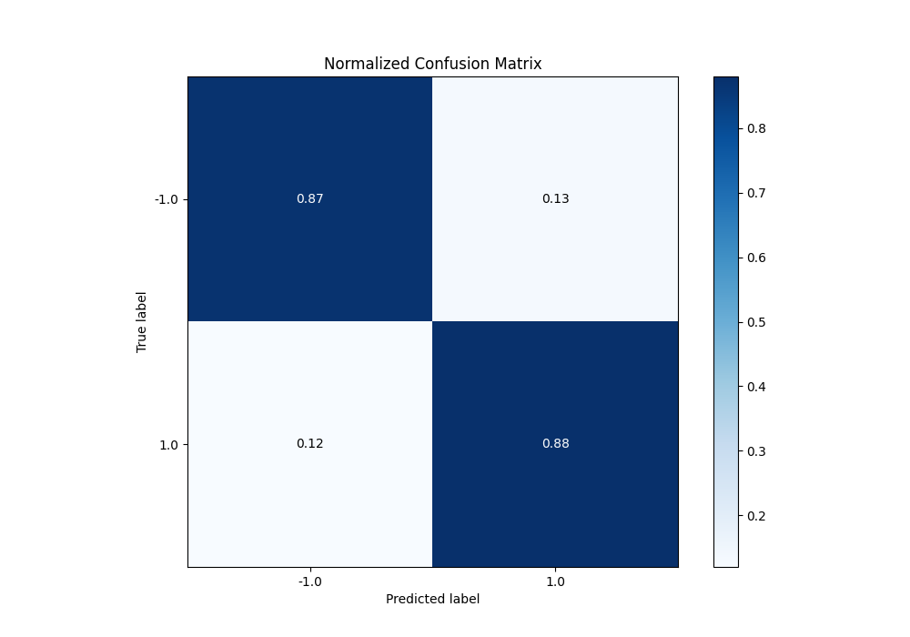
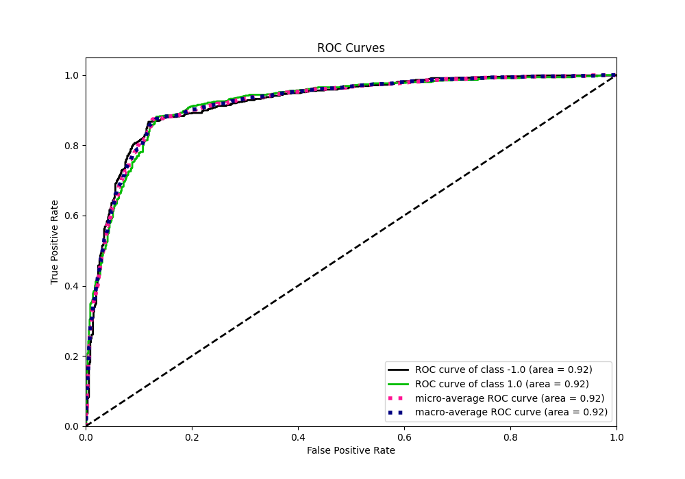
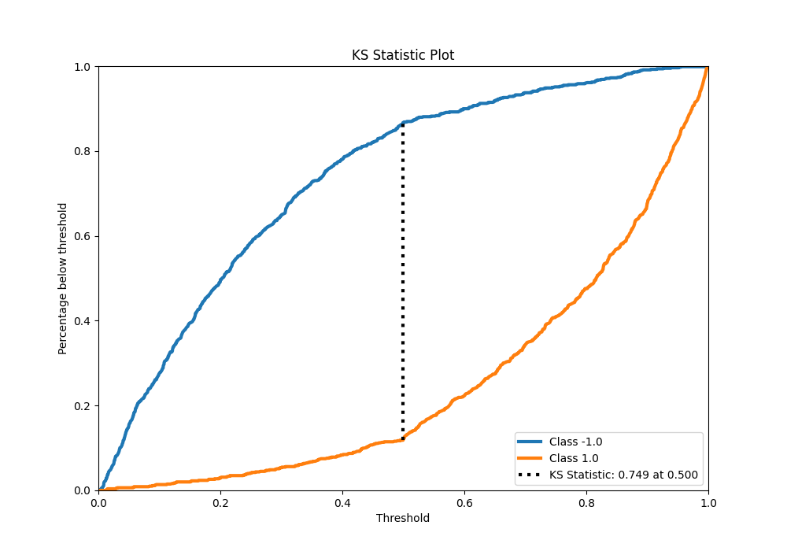
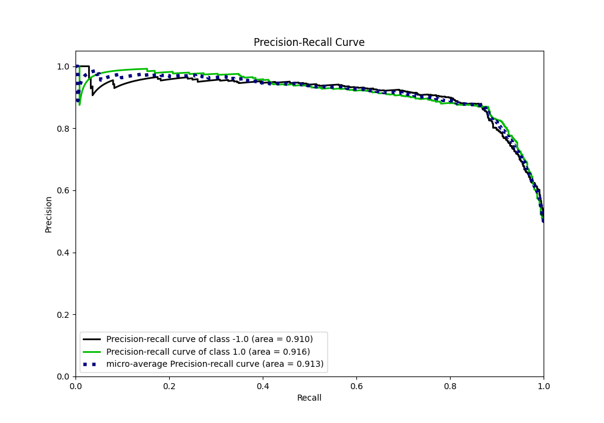
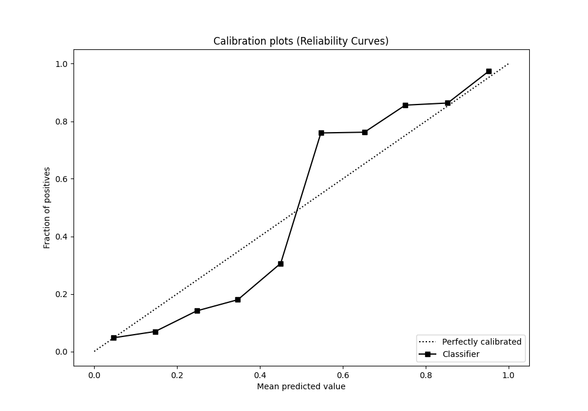
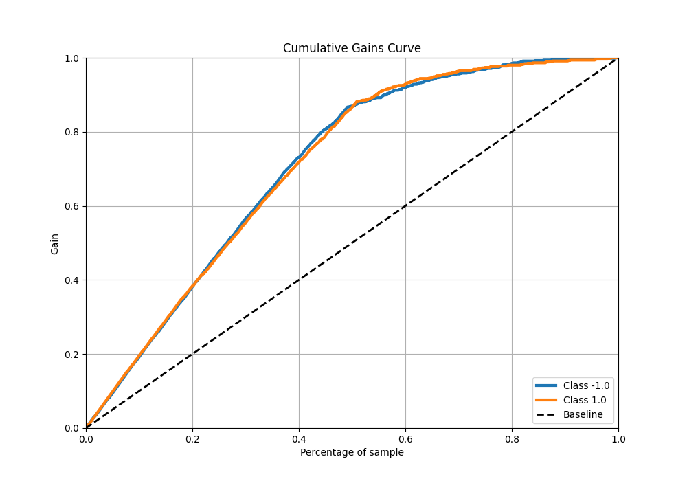
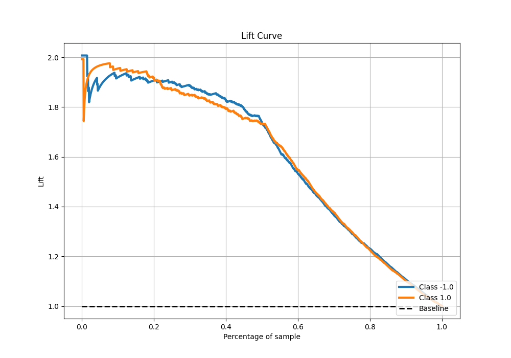

# Summary of 22_LightGBM

[<< Go back](../README.md)

## LightGBM
- **n_jobs**: -1
- **objective**: binary
- **num_leaves**: 15
- **learning_rate**: 0.1
- **feature_fraction**: 0.8
- **bagging_fraction**: 0.5
- **min_data_in_leaf**: 5
- **metric**: custom
- **custom_eval_metric_name**: f1
- **explain_level**: 0

## Validation
 - **validation_type**: kfold
 - **shuffle**: True
 - **stratify**: True
 - **k_folds**: 10

## Optimized metric
f1

## Training time

26.8 seconds

## Metric details
|           |    score |    threshold |
|:----------|---------:|-------------:|
| logloss   | 0.375779 | nan          |
| auc       | 0.919793 | nan          |
| f1        | 0.875155 |   0.499477   |
| accuracy  | 0.87375  |   0.499477   |
| precision | 0.990991 |   0.96154    |
| recall    | 1        |   0.00145529 |
| mcc       | 0.747566 |   0.499477   |

## Metric details with threshold from accuracy metric
|           |    score |   threshold |
|:----------|---------:|------------:|
| logloss   | 0.375779 |  nan        |
| auc       | 0.919793 |  nan        |
| f1        | 0.875155 |    0.499477 |
| accuracy  | 0.87375  |    0.499477 |
| precision | 0.868712 |    0.499477 |
| recall    | 0.881694 |    0.499477 |
| mcc       | 0.747566 |    0.499477 |

## Confusion matrix (at threshold=0.499477)
|                 |   Predicted as -1.0 |   Predicted as 1.0 |
|:----------------|--------------------:|-------------------:|
| Labeled as -1.0 |                 690 |                107 |
| Labeled as 1.0  |                  95 |                708 |

## Learning curves

## Confusion Matrix

## Normalized Confusion Matrix

## ROC Curve

## Kolmogorov-Smirnov Statistic

## Precision-Recall Curve

## Calibration Curve

## Cumulative Gains Curve

## Lift Curve

[<< Go back](../README.md)
