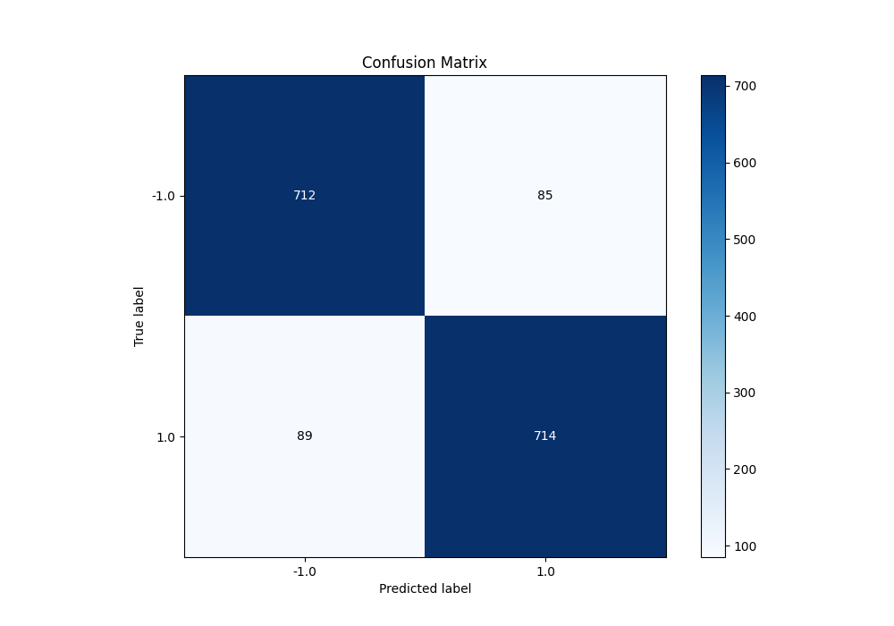
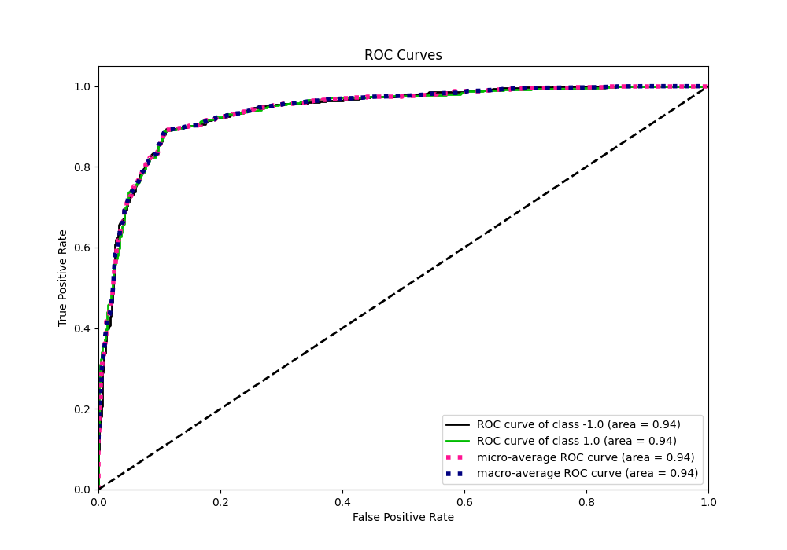
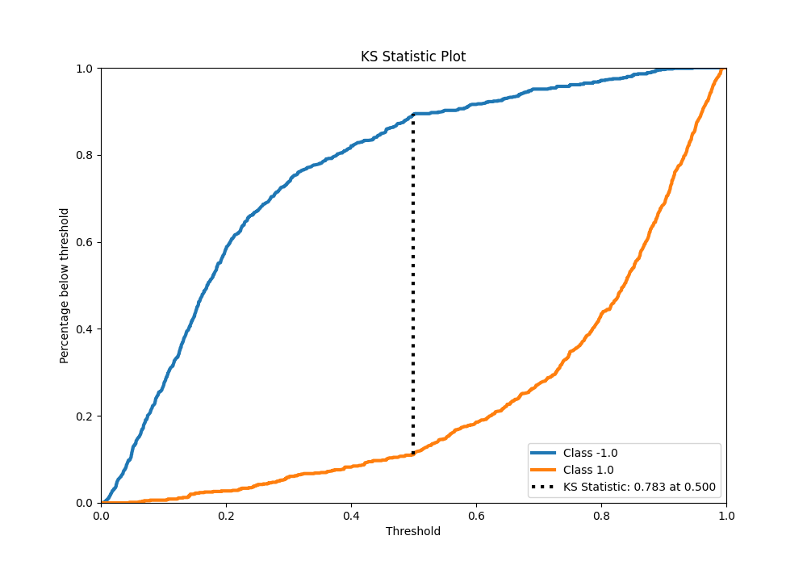
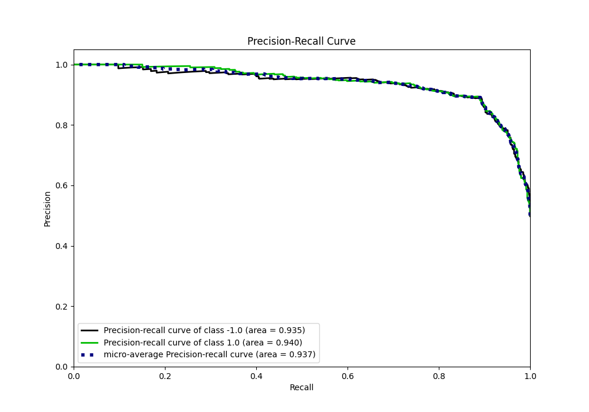
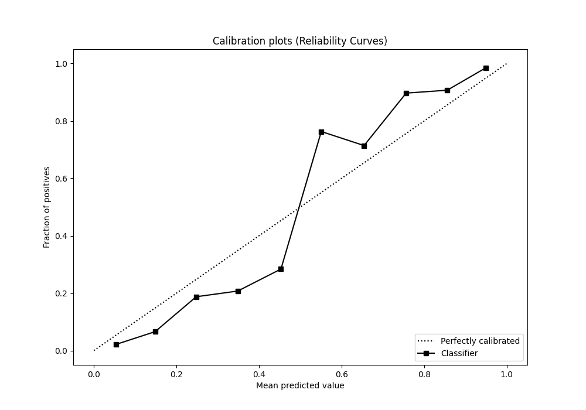
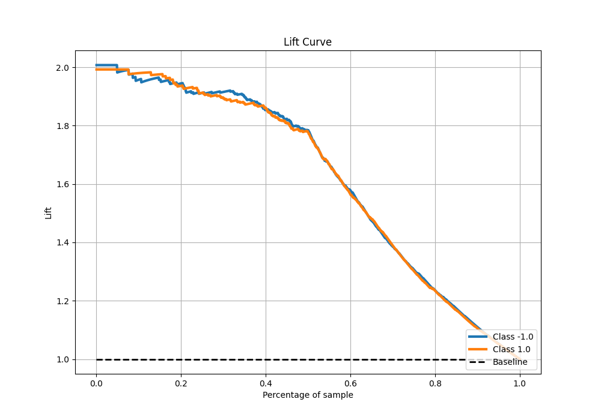

# Summary of 30_CatBoost

[<< Go back](../README.md)

## CatBoost
- **n_jobs**: -1
- **learning_rate**: 0.1
- **depth**: 7
- **rsm**: 0.8
- **loss_function**: Logloss
- **eval_metric**: F1
- **explain_level**: 0

## Validation
 - **validation_type**: kfold
 - **shuffle**: True
 - **stratify**: True
 - **k_folds**: 10

## Optimized metric
f1

## Training time

21.7 seconds

## Metric details
|           |    score |    threshold |
|:----------|---------:|-------------:|
| logloss   | 0.333167 | nan          |
| auc       | 0.938913 | nan          |
| f1        | 0.891386 |   0.500255   |
| accuracy  | 0.89125  |   0.500255   |
| precision | 1        |   0.950697   |
| recall    | 1        |   0.00552915 |
| mcc       | 0.782511 |   0.500255   |

## Metric details with threshold from accuracy metric
|           |    score |   threshold |
|:----------|---------:|------------:|
| logloss   | 0.333167 |  nan        |
| auc       | 0.938913 |  nan        |
| f1        | 0.891386 |    0.500255 |
| accuracy  | 0.89125  |    0.500255 |
| precision | 0.893617 |    0.500255 |
| recall    | 0.889166 |    0.500255 |
| mcc       | 0.782511 |    0.500255 |

## Confusion matrix (at threshold=0.500255)
|                 |   Predicted as -1.0 |   Predicted as 1.0 |
|:----------------|--------------------:|-------------------:|
| Labeled as -1.0 |                 712 |                 85 |
| Labeled as 1.0  |                  89 |                714 |

## Learning curves

## Confusion Matrix

## Normalized Confusion Matrix

## ROC Curve

## Kolmogorov-Smirnov Statistic

## Precision-Recall Curve

## Calibration Curve

## Cumulative Gains Curve

## Lift Curve

[<< Go back](../README.md)
