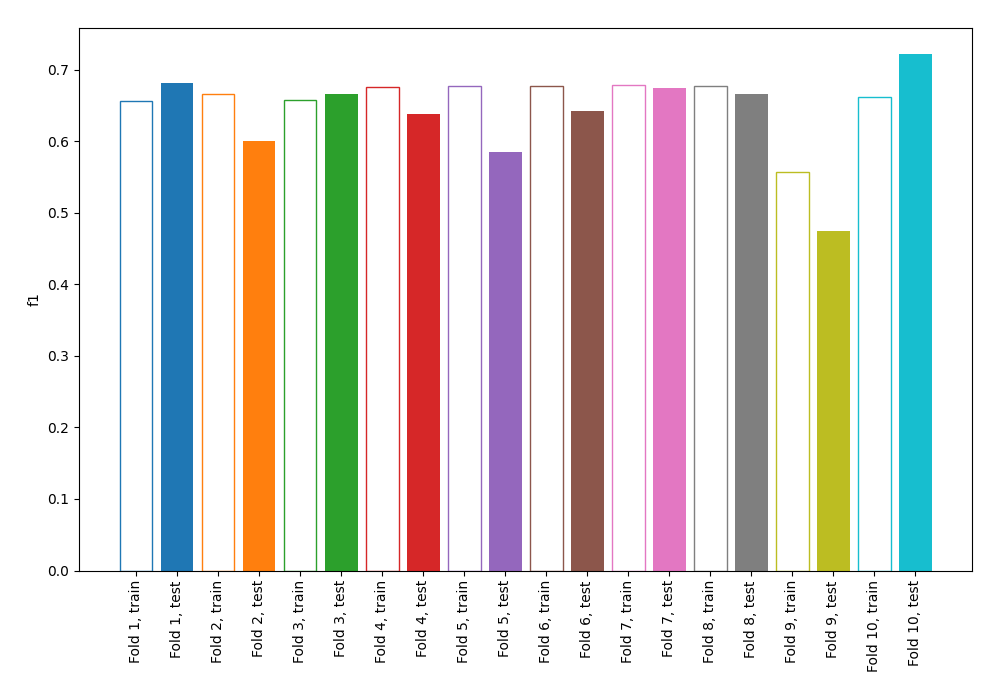
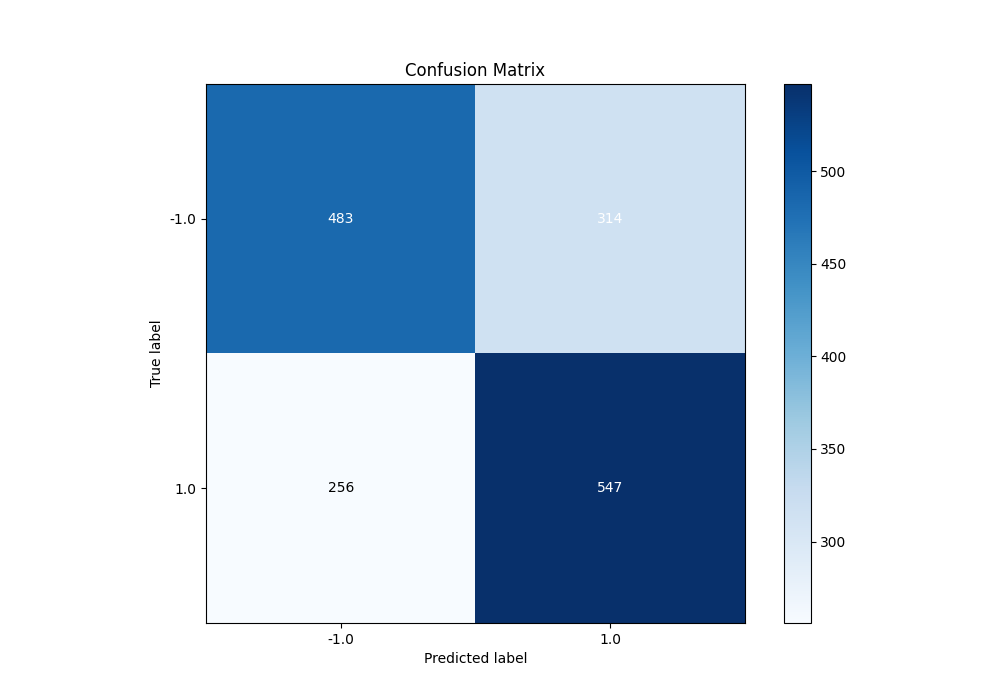
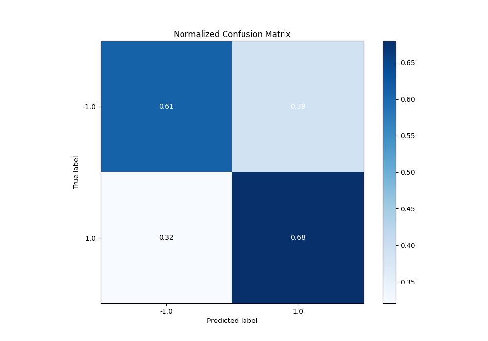
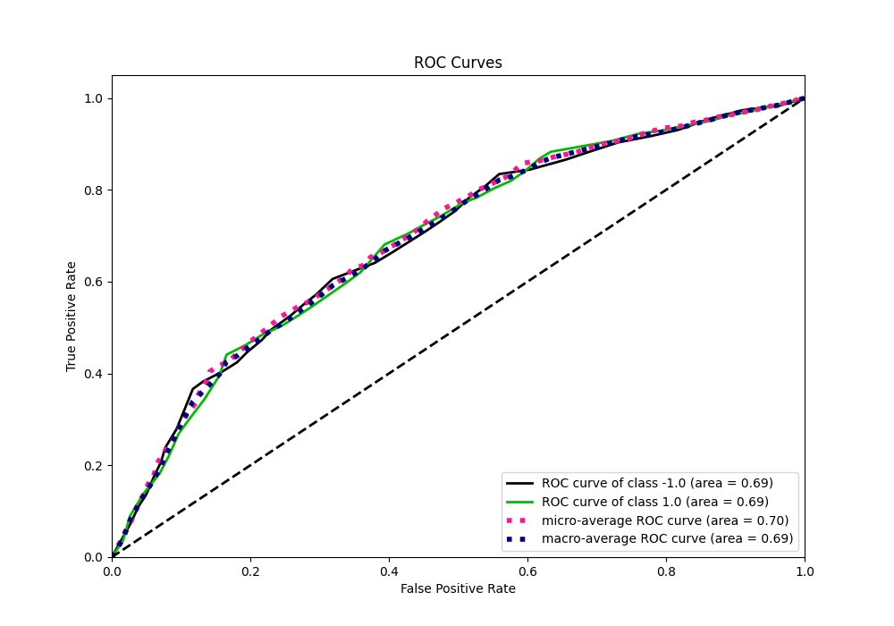
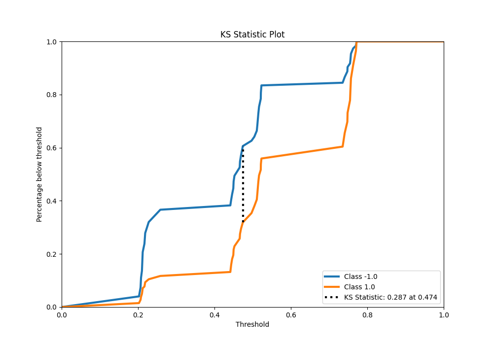
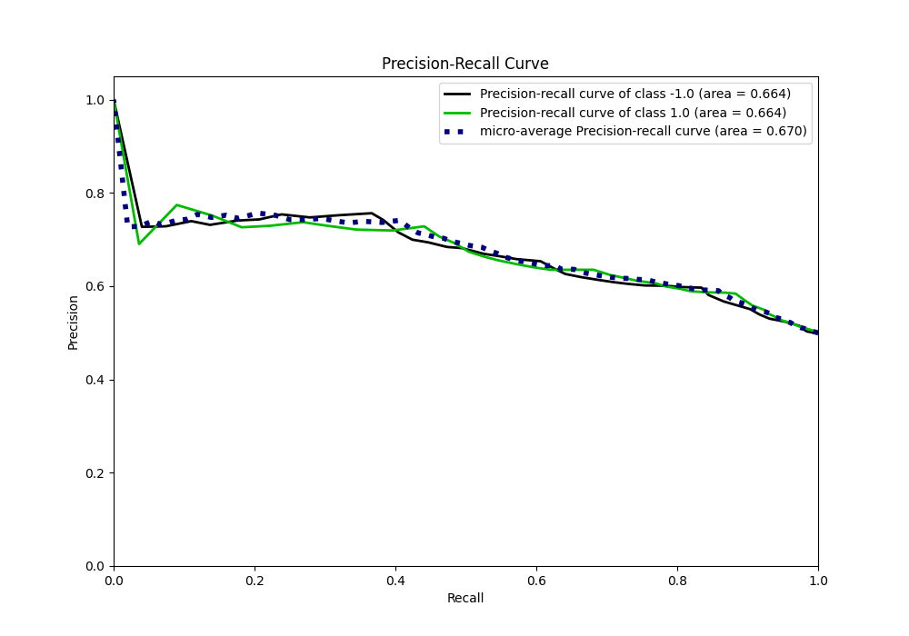
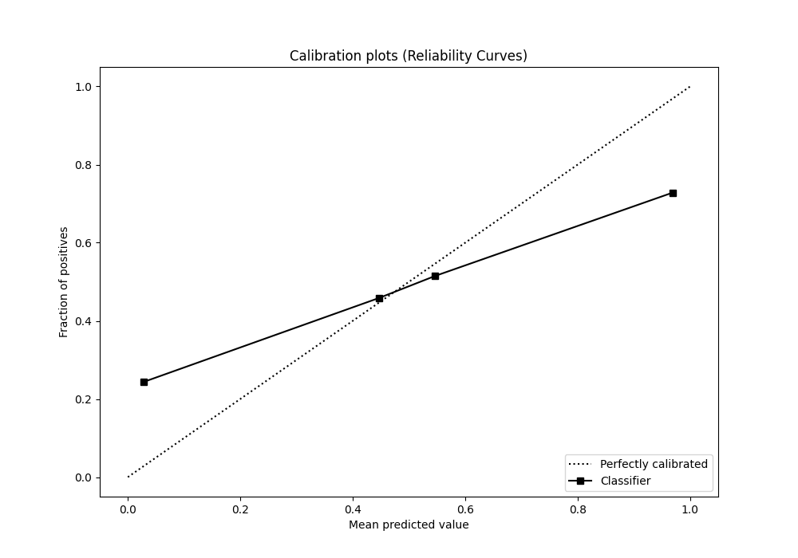
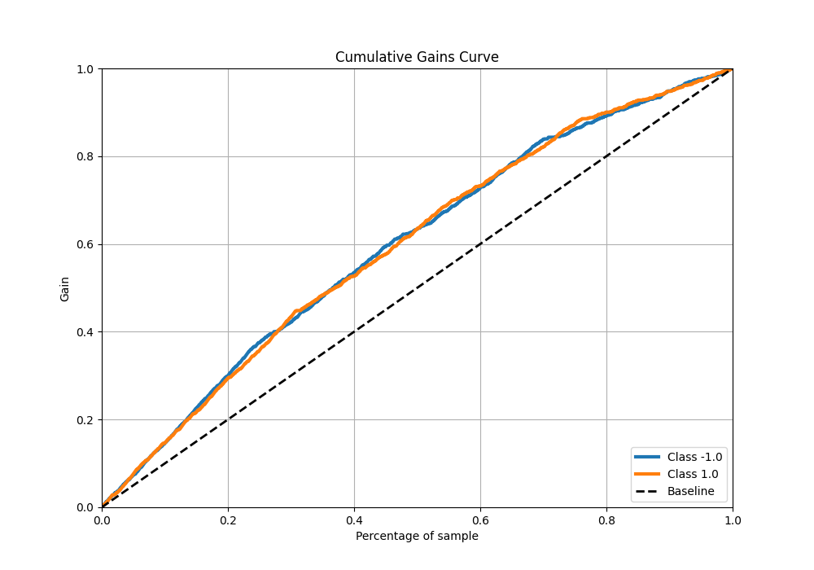
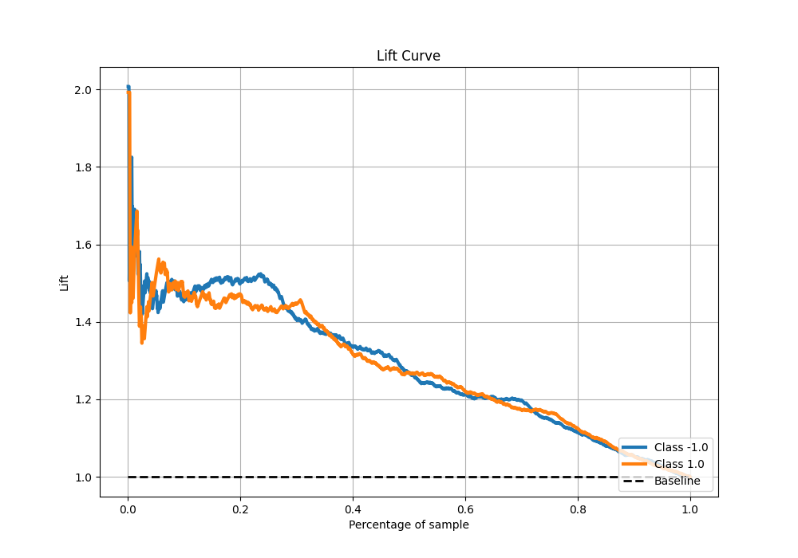

# Summary of 3_DecisionTree

[<< Go back](../README.md)

## Decision Tree
- **n_jobs**: -1
- **criterion**: gini
- **max_depth**: 2
- **explain_level**: 0

## Validation
 - **validation_type**: kfold
 - **shuffle**: True
 - **stratify**: True
 - **k_folds**: 10

## Optimized metric
f1

## Training time

8.3 seconds

## Metric details
|           |    score |   threshold |
|:----------|---------:|------------:|
| logloss   | 0.628486 |  nan        |
| auc       | 0.690439 |  nan        |
| f1        | 0.703024 |    0.258312 |
| accuracy  | 0.64375  |    0.474286 |
| precision | 0.774194 |    0.762963 |
| recall    | 1        |    0.182209 |
| mcc       | 0.299237 |    0.522936 |

## Metric details with threshold from accuracy metric
|           |    score |   threshold |
|:----------|---------:|------------:|
| logloss   | 0.628486 |  nan        |
| auc       | 0.690439 |  nan        |
| f1        | 0.657452 |    0.474286 |
| accuracy  | 0.64375  |    0.474286 |
| precision | 0.635308 |    0.474286 |
| recall    | 0.681196 |    0.474286 |
| mcc       | 0.288055 |    0.474286 |

## Confusion matrix (at threshold=0.474286)
|                 |   Predicted as -1.0 |   Predicted as 1.0 |
|:----------------|--------------------:|-------------------:|
| Labeled as -1.0 |                 483 |                314 |
| Labeled as 1.0  |                 256 |                547 |

## Learning curves

## Confusion Matrix

## Normalized Confusion Matrix

## ROC Curve

## Kolmogorov-Smirnov Statistic

## Precision-Recall Curve

## Calibration Curve

## Cumulative Gains Curve

## Lift Curve

[<< Go back](../README.md)
