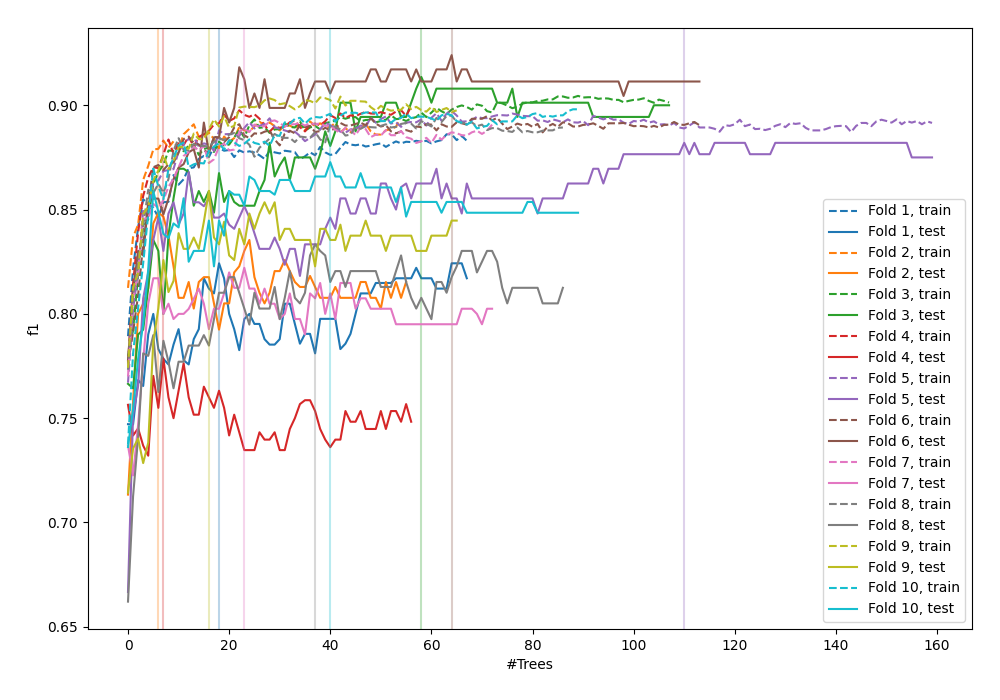
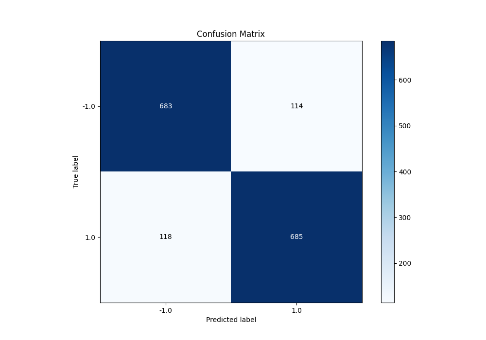
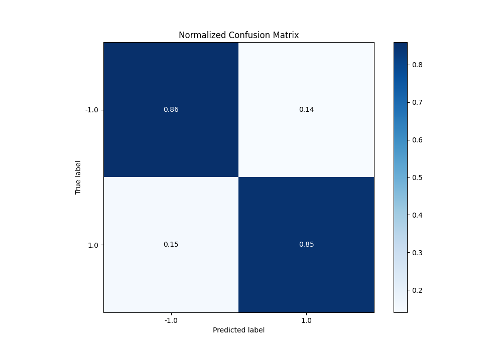
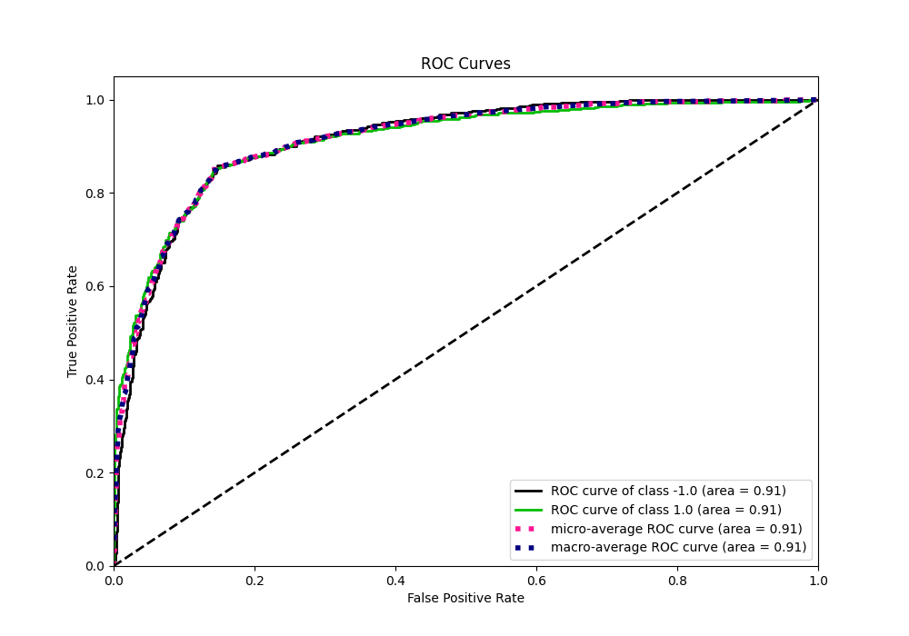
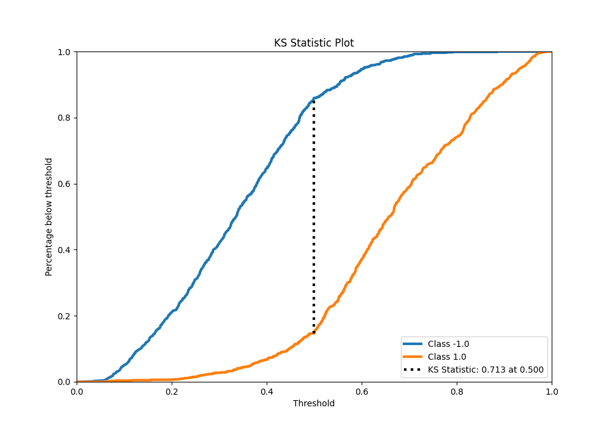
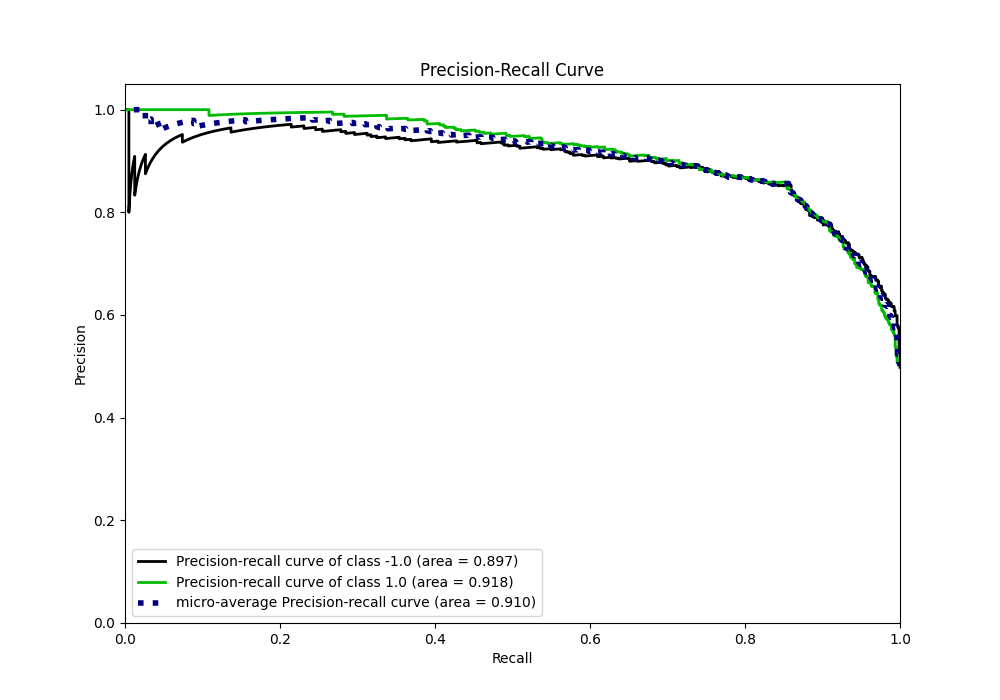
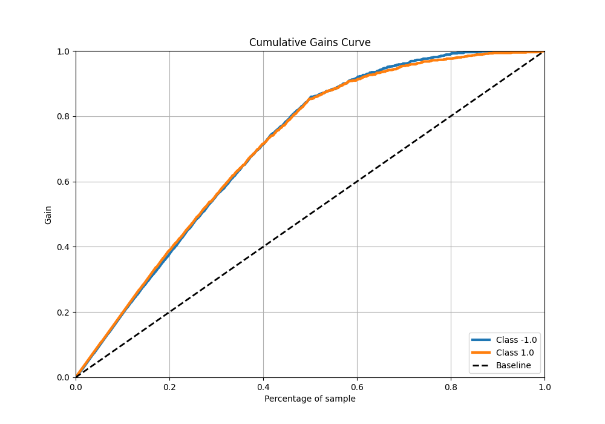
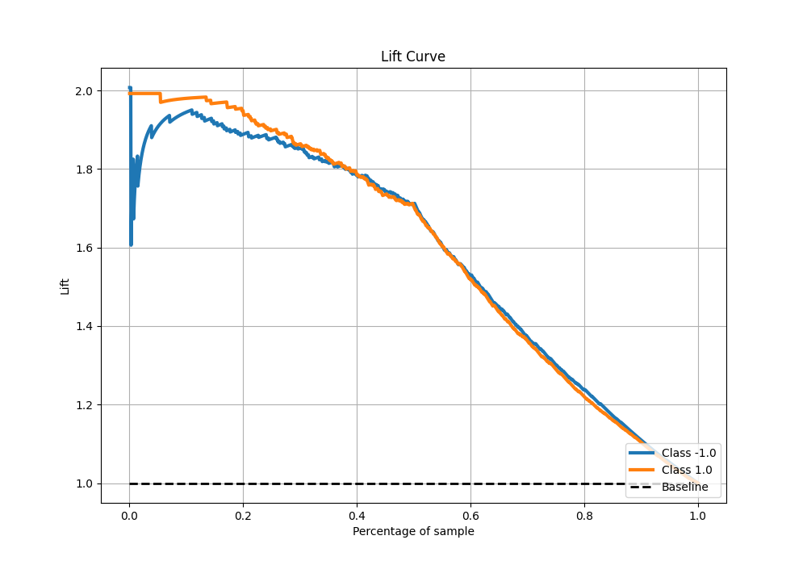

# Summary of 48_ExtraTrees

[<< Go back](../README.md)

## Extra Trees Classifier (Extra Trees)
- **n_jobs**: -1
- **criterion**: entropy
- **max_features**: 0.8
- **min_samples_split**: 50
- **max_depth**: 7
- **eval_metric_name**: f1
- **explain_level**: 0

## Validation
 - **validation_type**: kfold
 - **shuffle**: True
 - **stratify**: True
 - **k_folds**: 10

## Optimized metric
f1

## Training time

24.3 seconds

## Metric details
|           |    score |   threshold |
|:----------|---------:|------------:|
| logloss   | 0.451532 | nan         |
| auc       | 0.912638 | nan         |
| f1        | 0.855181 |   0.499608  |
| accuracy  | 0.855    |   0.499608  |
| precision | 1        |   0.897608  |
| recall    | 1        |   0.0297781 |
| mcc       | 0.71001  |   0.499608  |

## Metric details with threshold from accuracy metric
|           |    score |   threshold |
|:----------|---------:|------------:|
| logloss   | 0.451532 |  nan        |
| auc       | 0.912638 |  nan        |
| f1        | 0.855181 |    0.499608 |
| accuracy  | 0.855    |    0.499608 |
| precision | 0.857322 |    0.499608 |
| recall    | 0.853051 |    0.499608 |
| mcc       | 0.71001  |    0.499608 |

## Confusion matrix (at threshold=0.499608)
|                 |   Predicted as -1.0 |   Predicted as 1.0 |
|:----------------|--------------------:|-------------------:|
| Labeled as -1.0 |                 683 |                114 |
| Labeled as 1.0  |                 118 |                685 |

## Learning curves

## Confusion Matrix

## Normalized Confusion Matrix

## ROC Curve

## Kolmogorov-Smirnov Statistic

## Precision-Recall Curve

## Calibration Curve

## Cumulative Gains Curve

## Lift Curve

[<< Go back](../README.md)
