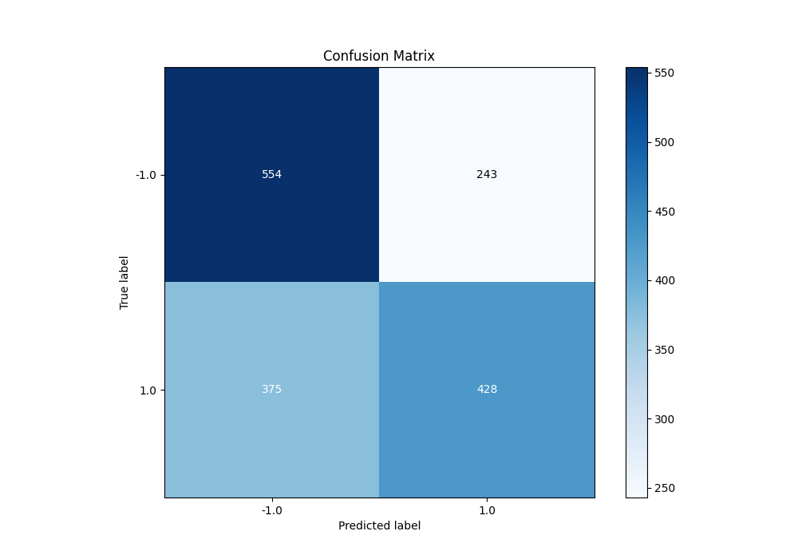
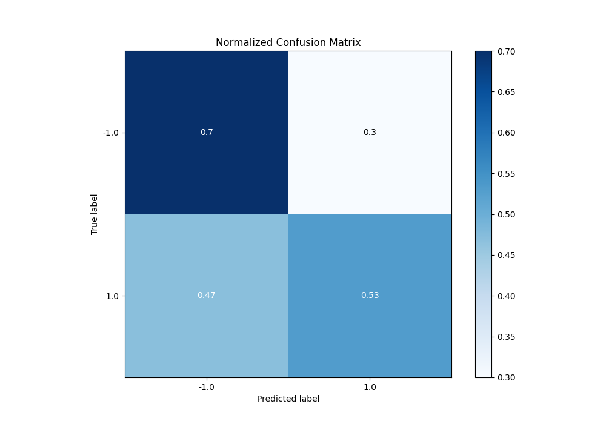
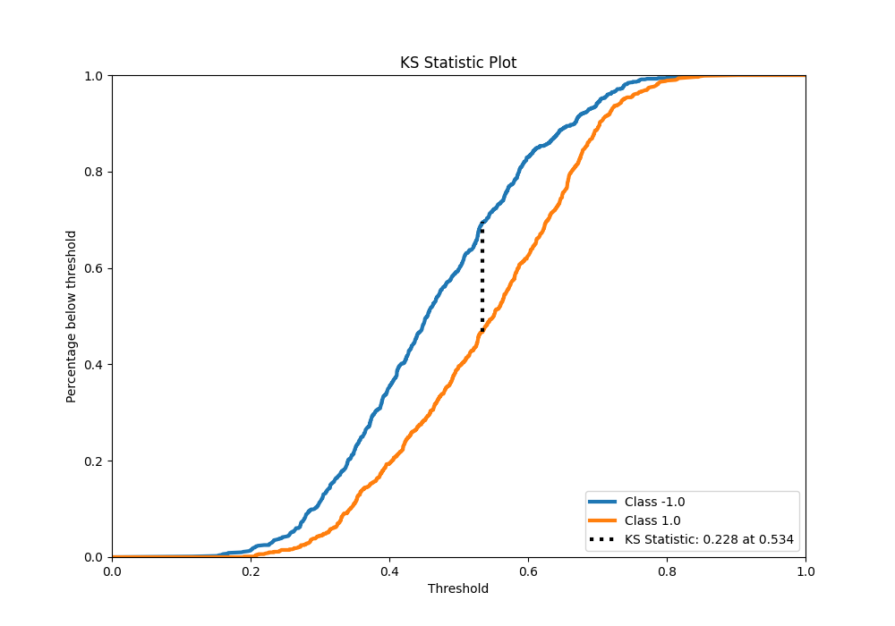
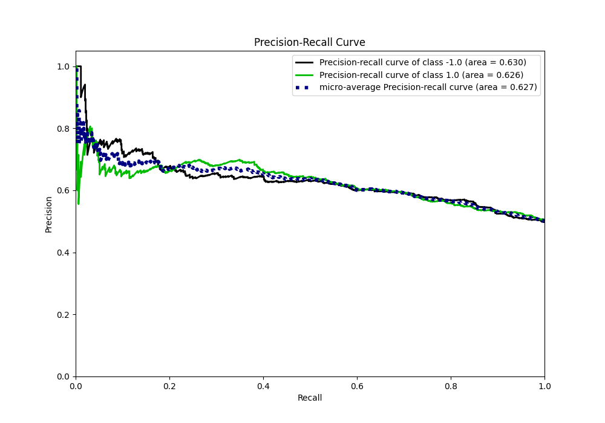
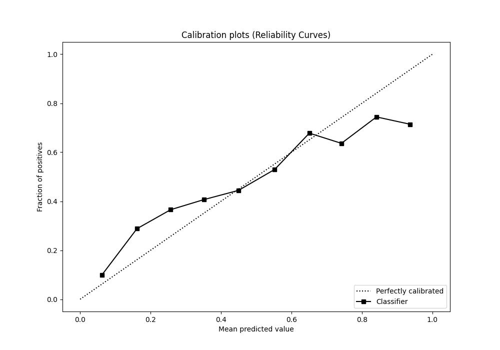
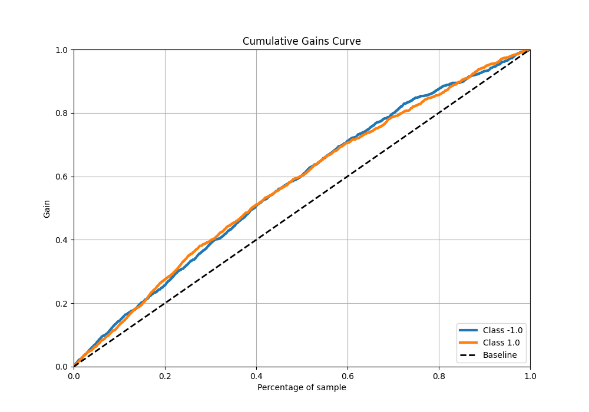
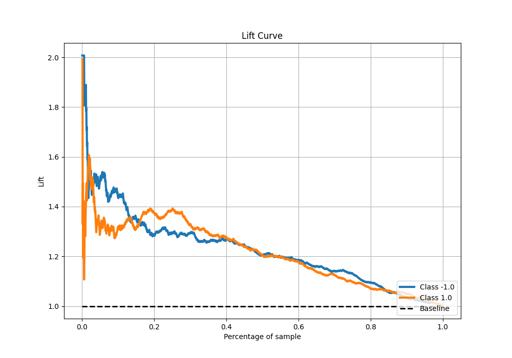

# Summary of 4_Linear

[<< Go back](../README.md)

## Logistic Regression (Linear)
- **n_jobs**: -1
- **explain_level**: 0

## Validation
 - **validation_type**: kfold
 - **shuffle**: True
 - **stratify**: True
 - **k_folds**: 10

## Optimized metric
f1

## Training time

18.7 seconds

## Metric details
|           |    score |   threshold |
|:----------|---------:|------------:|
| logloss   | 0.661748 |  nan        |
| auc       | 0.644414 |  nan        |
| f1        | 0.676705 |    0.308207 |
| accuracy  | 0.61375  |    0.534506 |
| precision | 0.806452 |    0.771404 |
| recall    | 1        |    0.103667 |
| mcc       | 0.231131 |    0.534506 |

## Metric details with threshold from accuracy metric
|           |    score |   threshold |
|:----------|---------:|------------:|
| logloss   | 0.661748 |  nan        |
| auc       | 0.644414 |  nan        |
| f1        | 0.580733 |    0.534506 |
| accuracy  | 0.61375  |    0.534506 |
| precision | 0.637854 |    0.534506 |
| recall    | 0.533001 |    0.534506 |
| mcc       | 0.231131 |    0.534506 |

## Confusion matrix (at threshold=0.534506)
|                 |   Predicted as -1.0 |   Predicted as 1.0 |
|:----------------|--------------------:|-------------------:|
| Labeled as -1.0 |                 554 |                243 |
| Labeled as 1.0  |                 375 |                428 |

## Learning curves

## Confusion Matrix

## Normalized Confusion Matrix

## ROC Curve

## Kolmogorov-Smirnov Statistic

## Precision-Recall Curve

## Calibration Curve

## Cumulative Gains Curve

## Lift Curve

[<< Go back](../README.md)
