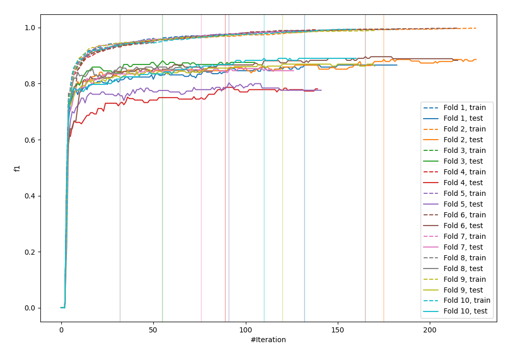
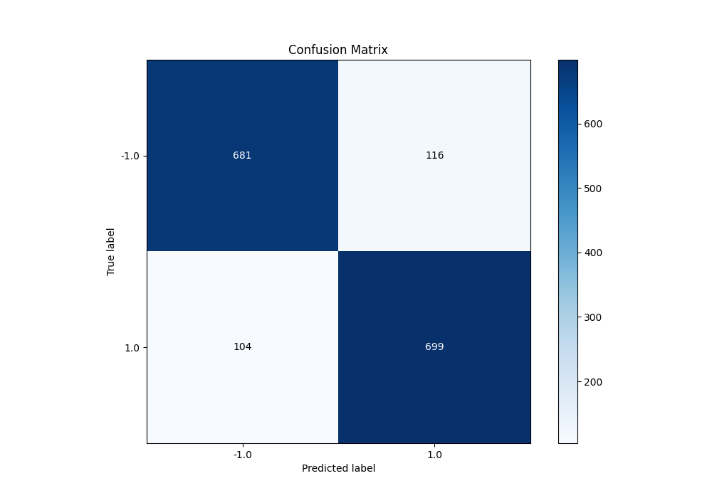
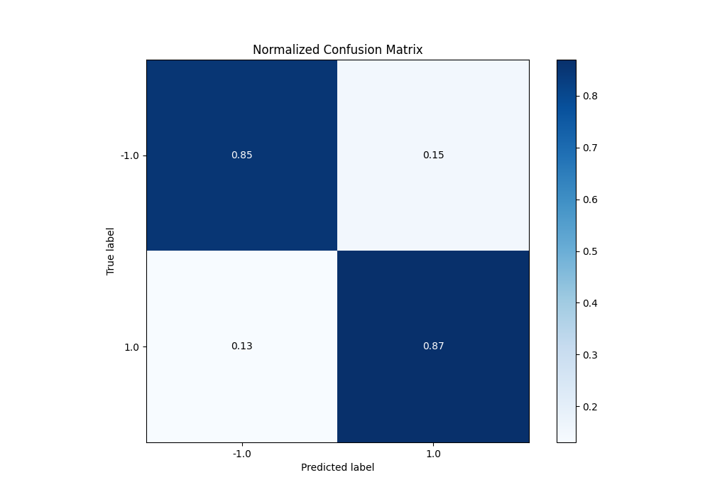
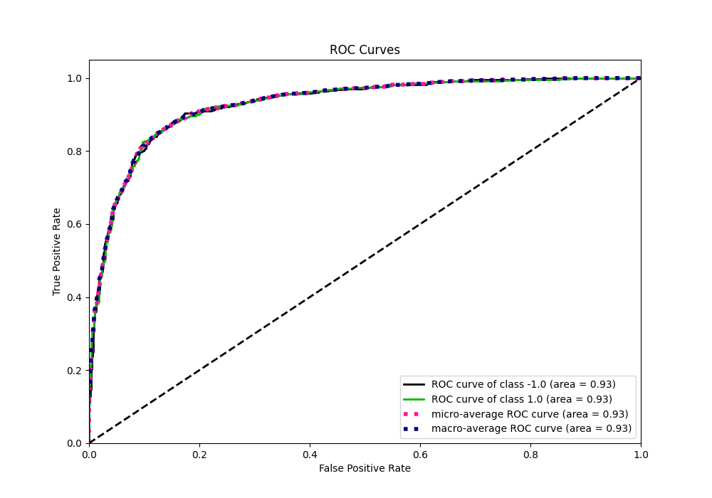
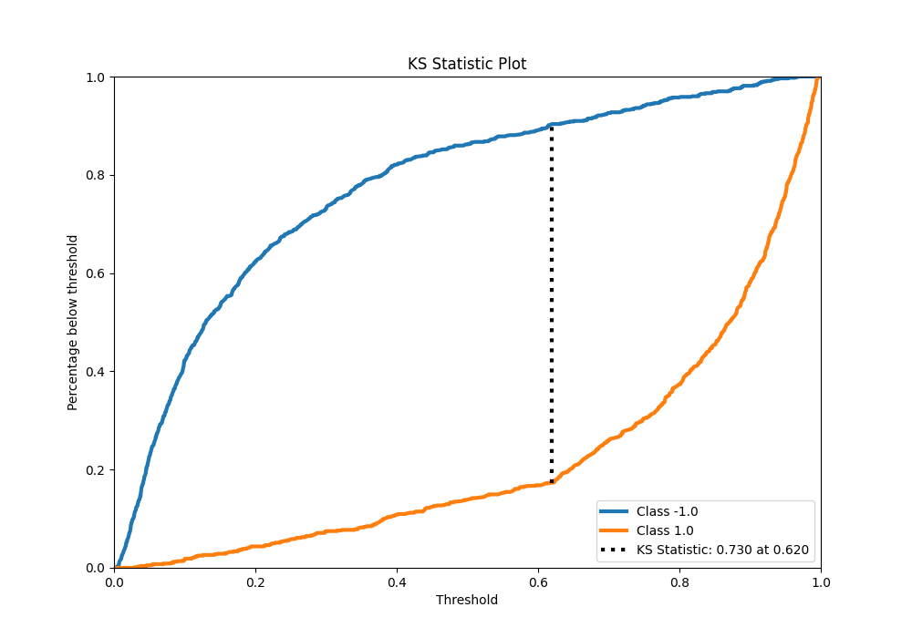
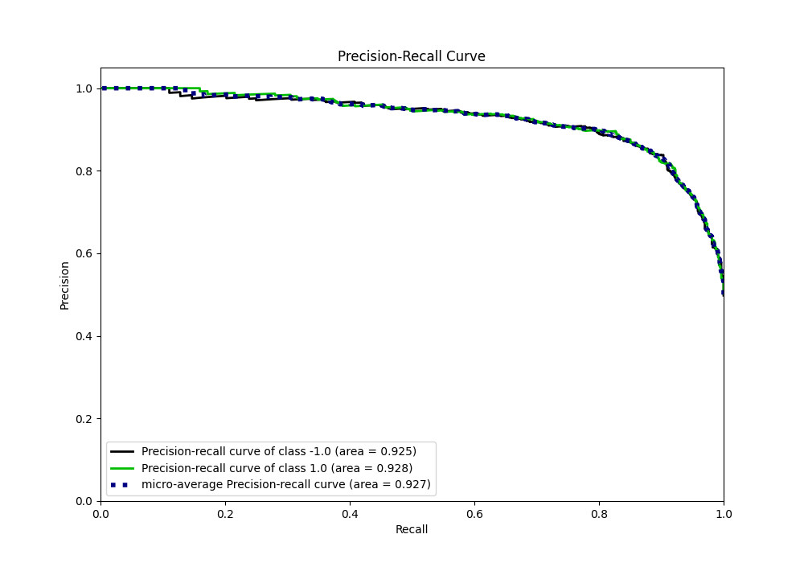
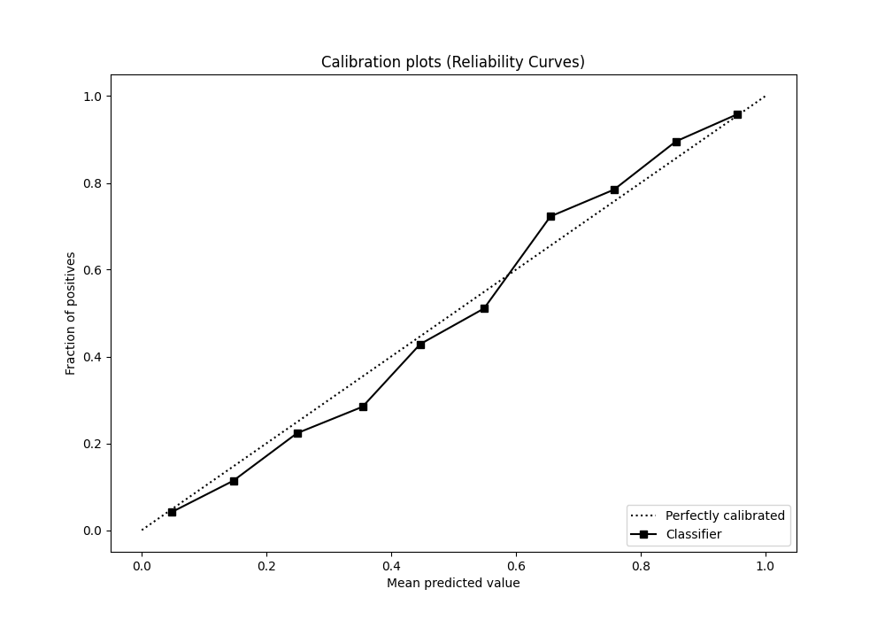
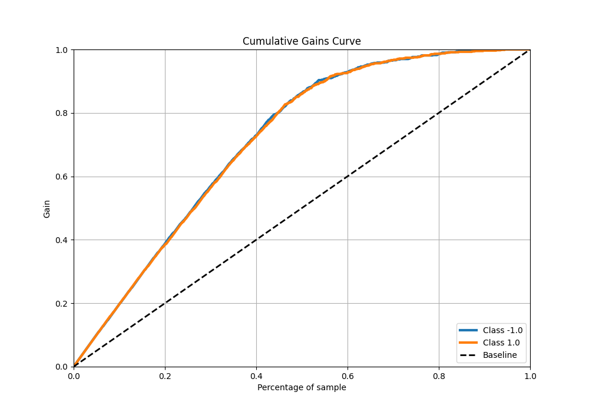
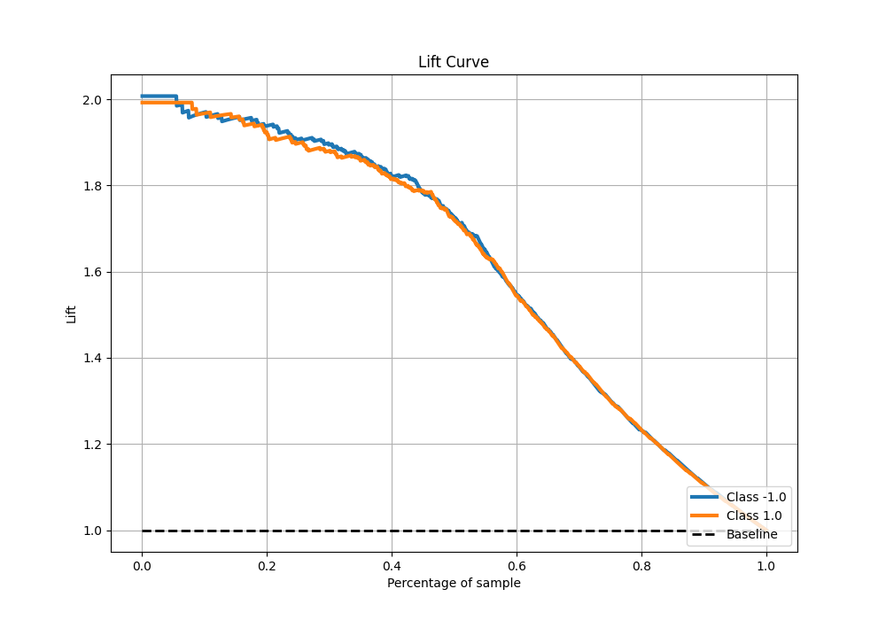

# Summary of 6_Default_Xgboost

[<< Go back](../README.md)

## Extreme Gradient Boosting (Xgboost)
- **n_jobs**: -1
- **objective**: binary:logistic
- **eta**: 0.075
- **max_depth**: 6
- **min_child_weight**: 1
- **subsample**: 1.0
- **colsample_bytree**: 1.0
- **eval_metric**: f1
- **explain_level**: 0

## Validation
 - **validation_type**: kfold
 - **shuffle**: True
 - **stratify**: True
 - **k_folds**: 10

## Optimized metric
f1

## Training time

31.2 seconds

## Metric details
|           |    score |    threshold |
|:----------|---------:|-------------:|
| logloss   | 0.342794 | nan          |
| auc       | 0.927927 | nan          |
| f1        | 0.864242 |   0.421614   |
| accuracy  | 0.8625   |   0.473508   |
| precision | 1        |   0.967105   |
| recall    | 1        |   0.00405596 |
| mcc       | 0.726599 |   0.607598   |

## Metric details with threshold from accuracy metric
|           |    score |   threshold |
|:----------|---------:|------------:|
| logloss   | 0.342794 |  nan        |
| auc       | 0.927927 |  nan        |
| f1        | 0.86403  |    0.473508 |
| accuracy  | 0.8625   |    0.473508 |
| precision | 0.857669 |    0.473508 |
| recall    | 0.870486 |    0.473508 |
| mcc       | 0.725062 |    0.473508 |

## Confusion matrix (at threshold=0.473508)
|                 |   Predicted as -1.0 |   Predicted as 1.0 |
|:----------------|--------------------:|-------------------:|
| Labeled as -1.0 |                 681 |                116 |
| Labeled as 1.0  |                 104 |                699 |

## Learning curves

## Confusion Matrix

## Normalized Confusion Matrix

## ROC Curve

## Kolmogorov-Smirnov Statistic

## Precision-Recall Curve

## Calibration Curve

## Cumulative Gains Curve

## Lift Curve

[<< Go back](../README.md)
