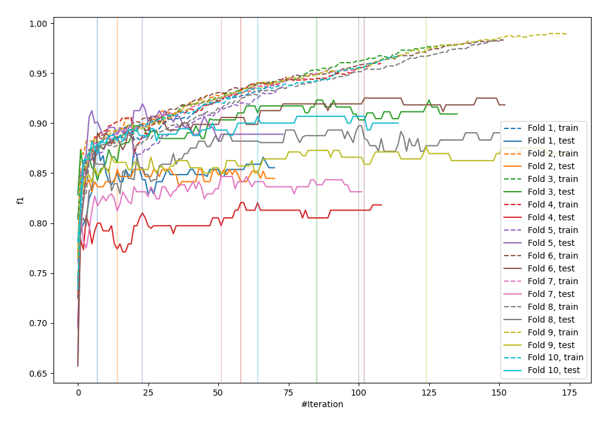
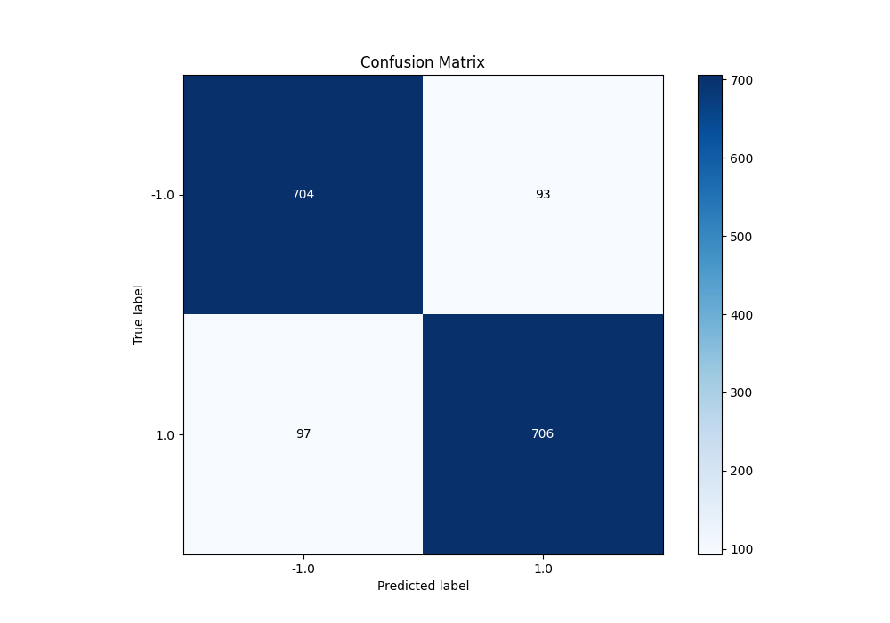
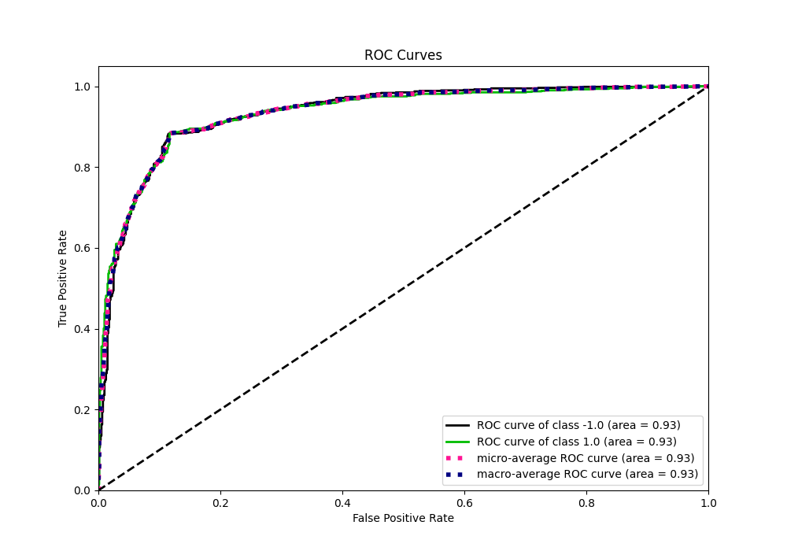
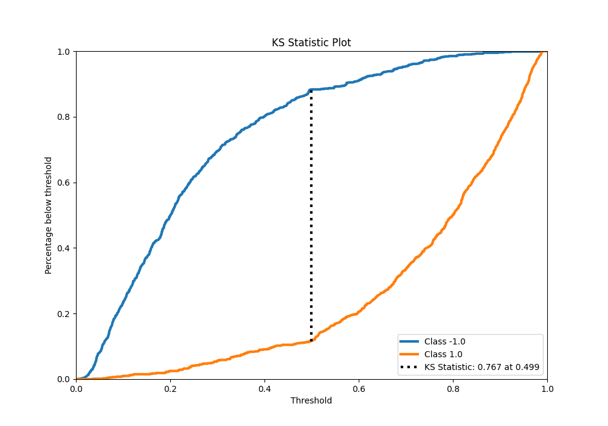
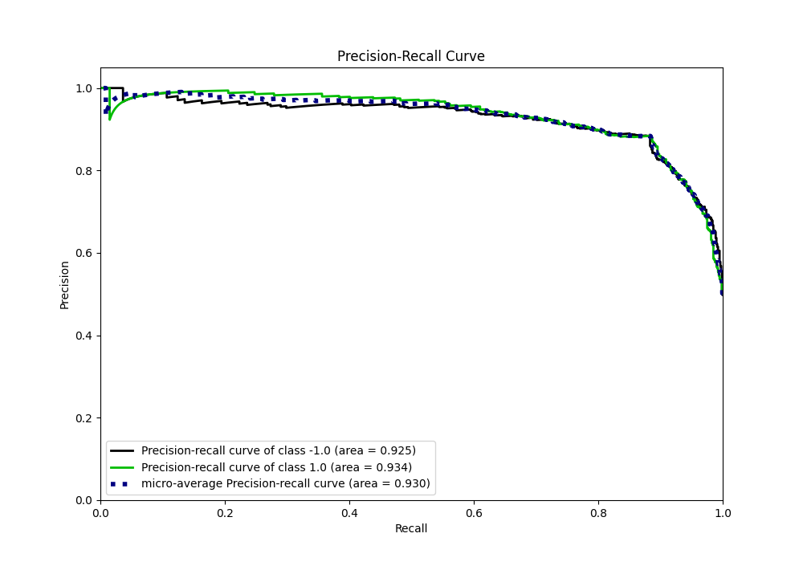
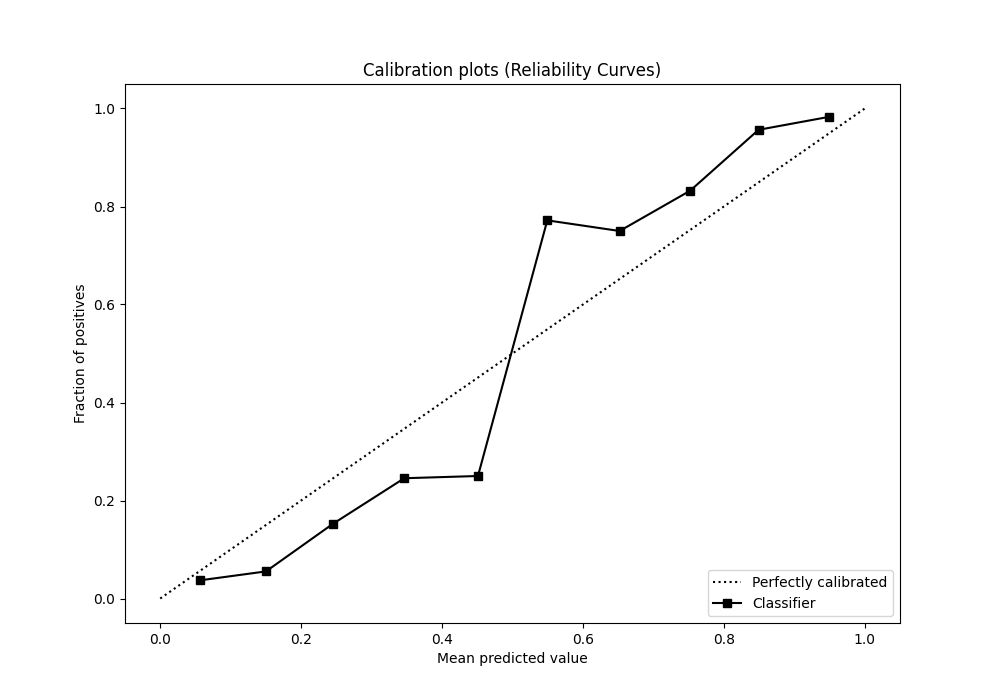
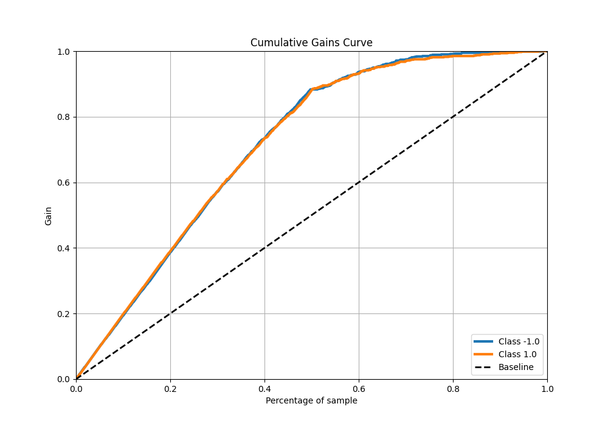
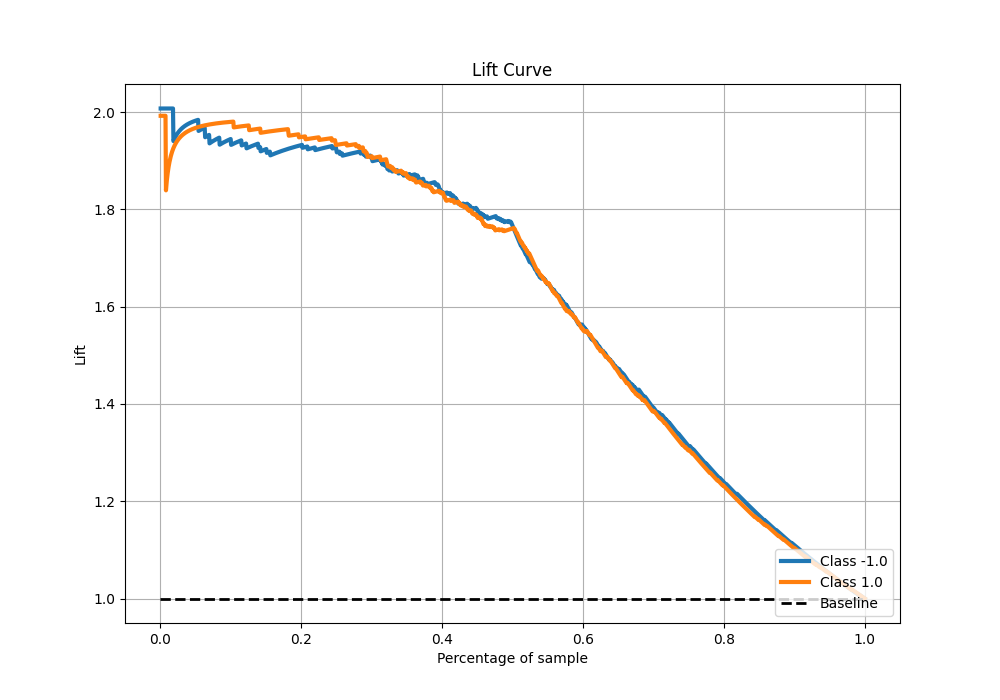

# Summary of 7_Default_CatBoost

[<< Go back](../README.md)

## CatBoost
- **n_jobs**: -1
- **learning_rate**: 0.1
- **depth**: 6
- **rsm**: 1
- **loss_function**: Logloss
- **eval_metric**: F1
- **explain_level**: 0

## Validation
 - **validation_type**: kfold
 - **shuffle**: True
 - **stratify**: True
 - **k_folds**: 10

## Optimized metric
f1

## Training time

18.2 seconds

## Metric details
|           |    score |   threshold |
|:----------|---------:|------------:|
| logloss   | 0.356826 | nan         |
| auc       | 0.93296  | nan         |
| f1        | 0.881398 |   0.506696  |
| accuracy  | 0.88125  |   0.506696  |
| precision | 0.993711 |   0.926652  |
| recall    | 1        |   0.0097811 |
| mcc       | 0.762511 |   0.506696  |

## Metric details with threshold from accuracy metric
|           |    score |   threshold |
|:----------|---------:|------------:|
| logloss   | 0.356826 |  nan        |
| auc       | 0.93296  |  nan        |
| f1        | 0.881398 |    0.506696 |
| accuracy  | 0.88125  |    0.506696 |
| precision | 0.883605 |    0.506696 |
| recall    | 0.879203 |    0.506696 |
| mcc       | 0.762511 |    0.506696 |

## Confusion matrix (at threshold=0.506696)
|                 |   Predicted as -1.0 |   Predicted as 1.0 |
|:----------------|--------------------:|-------------------:|
| Labeled as -1.0 |                 704 |                 93 |
| Labeled as 1.0  |                  97 |                706 |

## Learning curves

## Confusion Matrix

## Normalized Confusion Matrix

## ROC Curve

## Kolmogorov-Smirnov Statistic

## Precision-Recall Curve

## Calibration Curve

## Cumulative Gains Curve

## Lift Curve

[<< Go back](../README.md)
