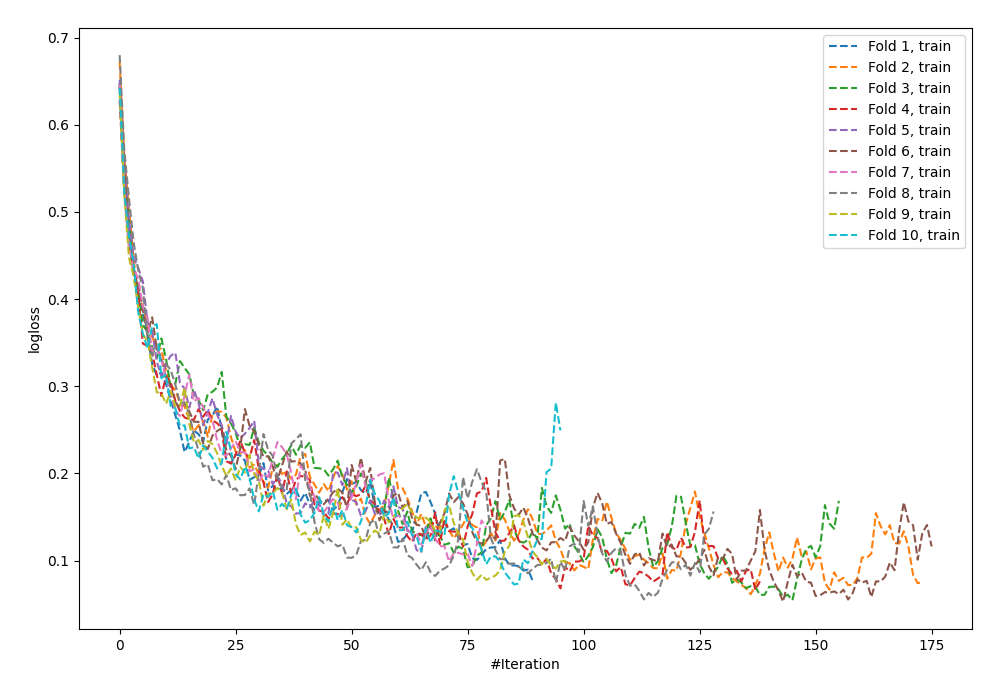
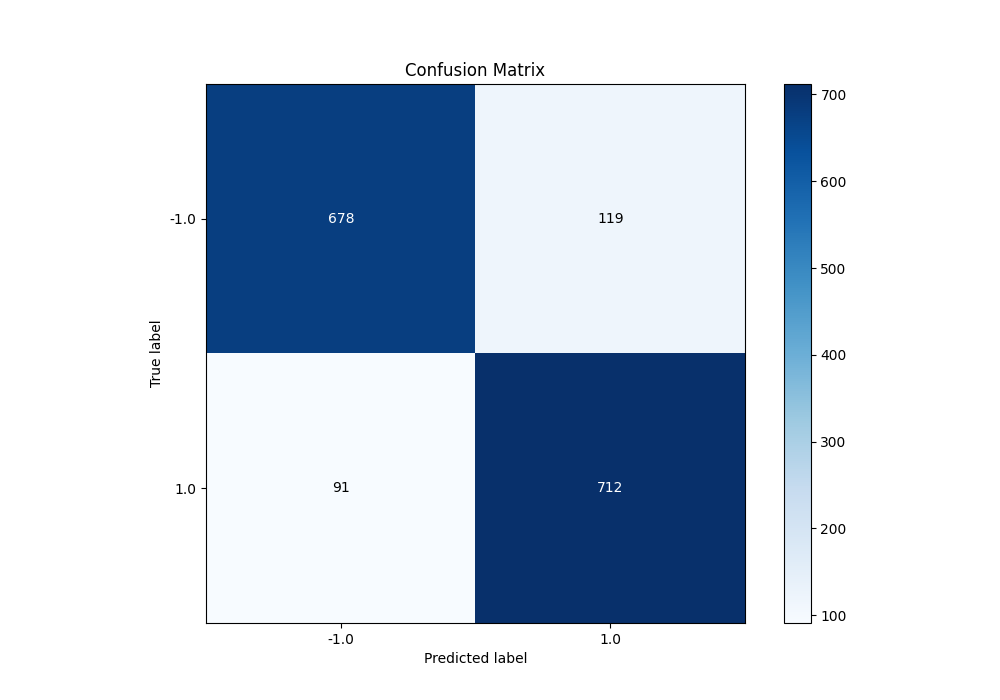
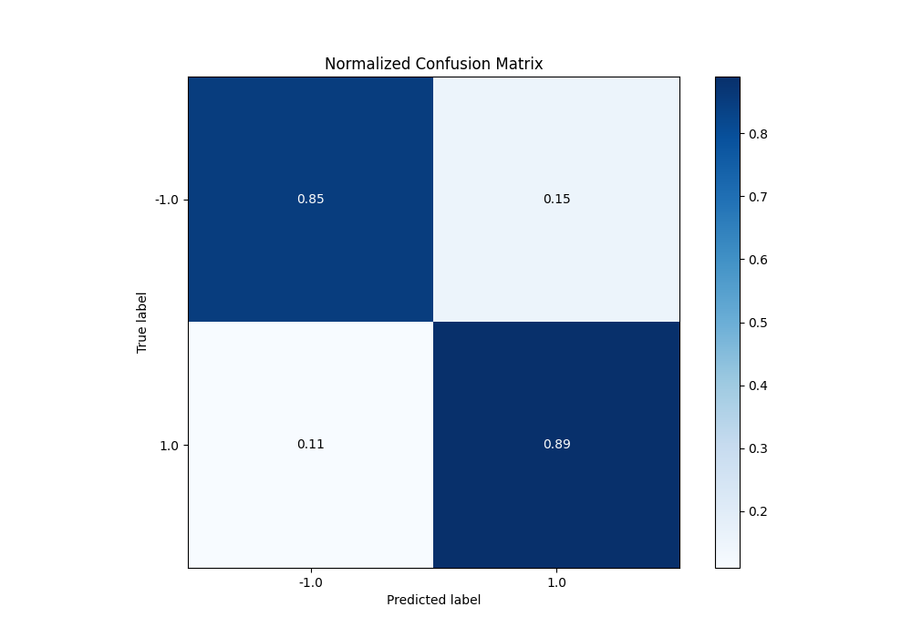
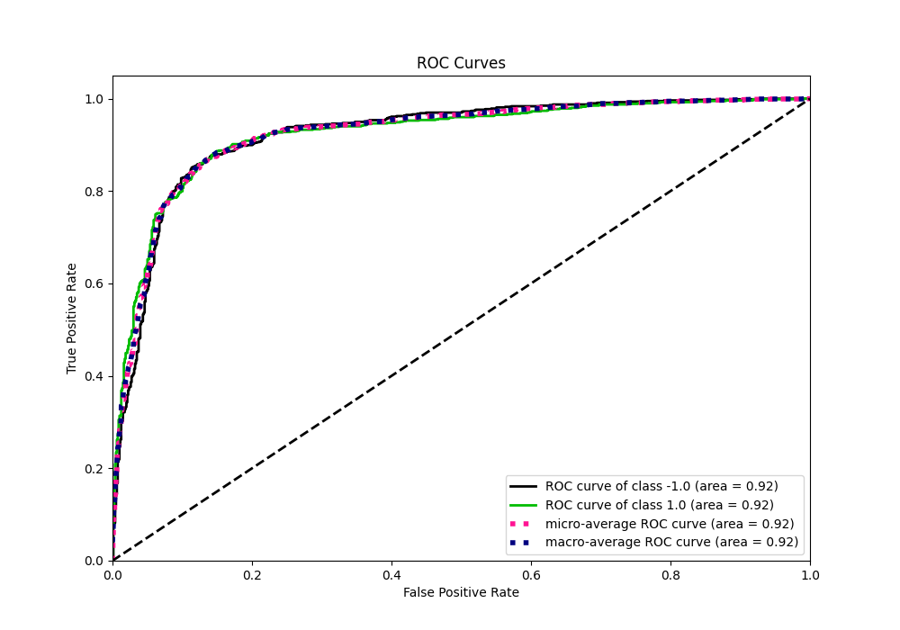
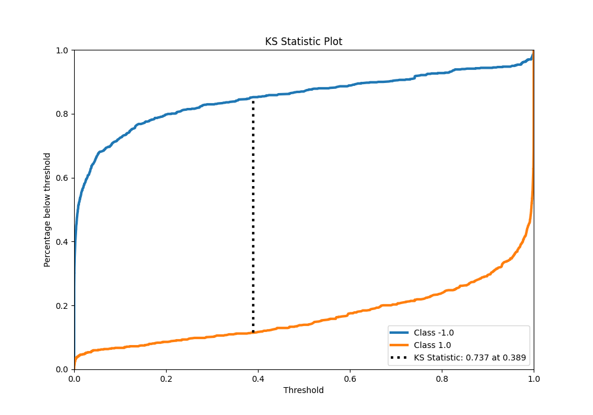
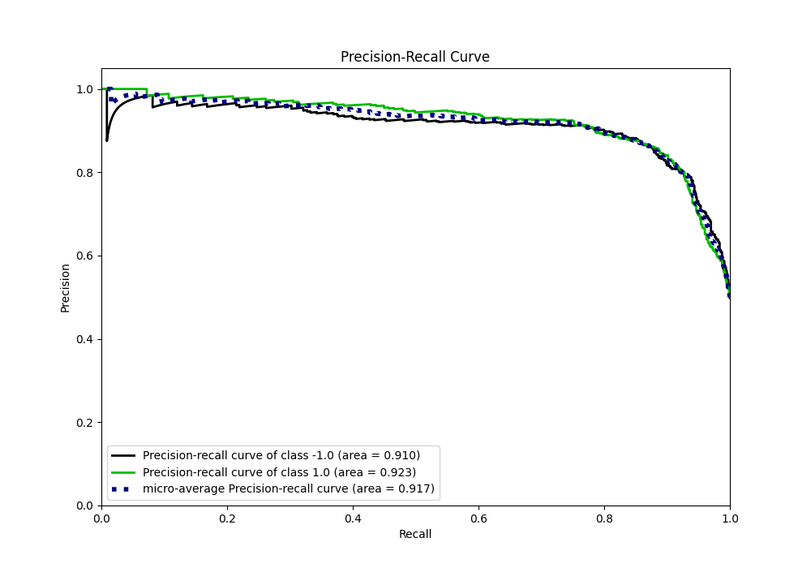
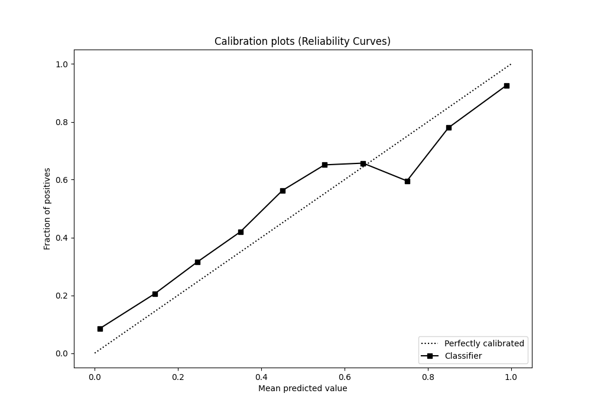
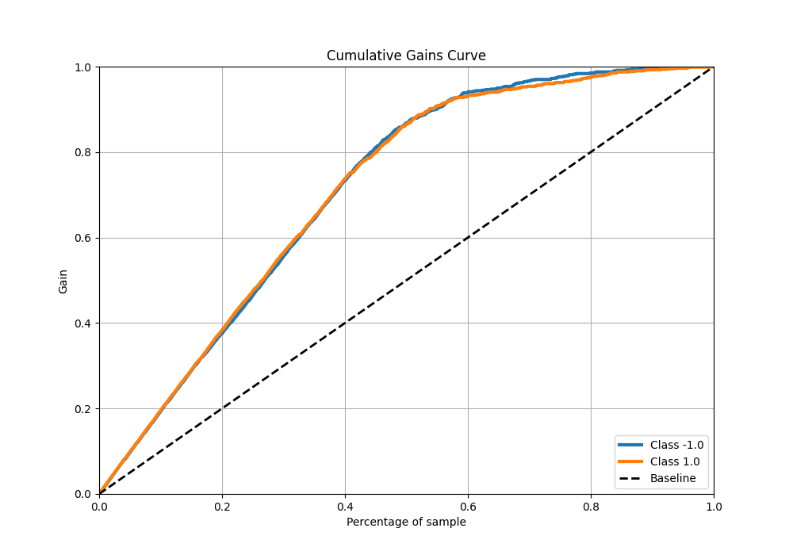
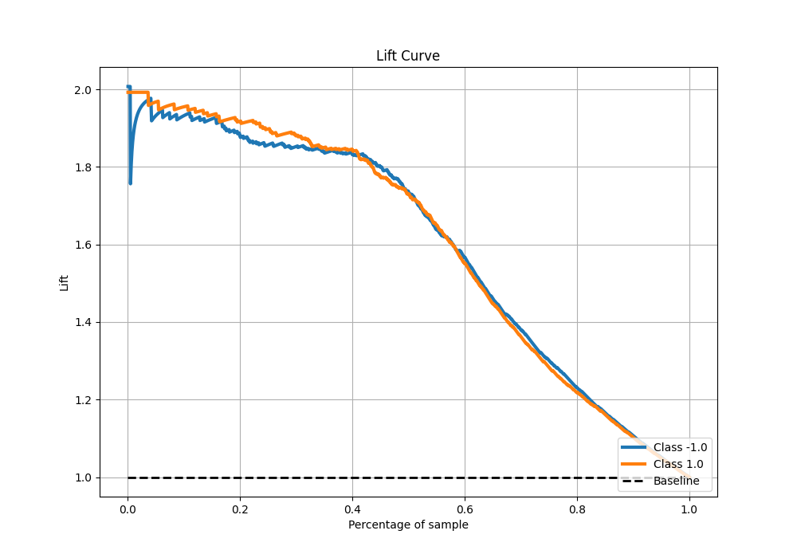

# Summary of 8_Default_NeuralNetwork

[<< Go back](../README.md)

## Neural Network
- **n_jobs**: -1
- **dense_1_size**: 32
- **dense_2_size**: 16
- **learning_rate**: 0.05
- **explain_level**: 0

## Validation
 - **validation_type**: kfold
 - **shuffle**: True
 - **stratify**: True
 - **k_folds**: 10

## Optimized metric
f1

## Training time

17.5 seconds

## Metric details
|           |    score |     threshold |
|:----------|---------:|--------------:|
| logloss   | 0.518585 | nan           |
| auc       | 0.922679 | nan           |
| f1        | 0.871481 |   0.38414     |
| accuracy  | 0.86875  |   0.38414     |
| precision | 1        |   1           |
| recall    | 1        |   6.38294e-21 |
| mcc       | 0.737914 |   0.38414     |

## Metric details with threshold from accuracy metric
|           |    score |   threshold |
|:----------|---------:|------------:|
| logloss   | 0.518585 |   nan       |
| auc       | 0.922679 |   nan       |
| f1        | 0.871481 |     0.38414 |
| accuracy  | 0.86875  |     0.38414 |
| precision | 0.856799 |     0.38414 |
| recall    | 0.886675 |     0.38414 |
| mcc       | 0.737914 |     0.38414 |

## Confusion matrix (at threshold=0.38414)
|                 |   Predicted as -1.0 |   Predicted as 1.0 |
|:----------------|--------------------:|-------------------:|
| Labeled as -1.0 |                 678 |                119 |
| Labeled as 1.0  |                  91 |                712 |

## Learning curves

## Confusion Matrix

## Normalized Confusion Matrix

## ROC Curve

## Kolmogorov-Smirnov Statistic

## Precision-Recall Curve

## Calibration Curve

## Cumulative Gains Curve

## Lift Curve

[<< Go back](../README.md)
