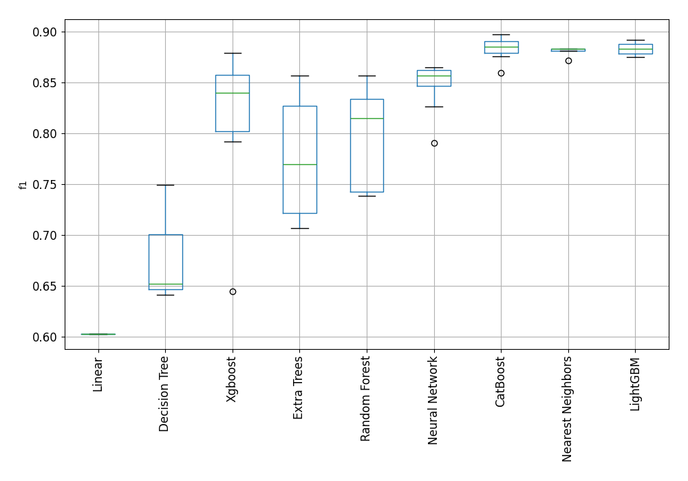

# AutoML Leaderboard

| Best model   | name                                                                               | model_type        | metric_type   |   metric_value |   train_time |
|:-------------|:-----------------------------------------------------------------------------------|:------------------|:--------------|---------------:|-------------:|
|              | [1_DecisionTree](1_DecisionTree/README.md)                                         | Decision Tree     | f1            |       0.749035 |         9.61 |
|              | [2_DecisionTree](2_DecisionTree/README.md)                                         | Decision Tree     | f1            |       0.65162  |         9.28 |
|              | [3_DecisionTree](3_DecisionTree/README.md)                                         | Decision Tree     | f1            |       0.640741 |        10.08 |
|              | [4_Linear](4_Linear/README.md)                                                     | Linear            | f1            |       0.602484 |        20.64 |
|              | [5_Default_LightGBM](5_Default_LightGBM/README.md)                                 | LightGBM          | f1            |       0.882861 |        32.64 |
|              | [6_Default_Xgboost](6_Default_Xgboost/README.md)                                   | Xgboost           | f1            |       0.862305 |        33.56 |
|              | [7_Default_CatBoost](7_Default_CatBoost/README.md)                                 | CatBoost          | f1            |       0.884184 |        20.35 |
|              | [8_Default_NeuralNetwork](8_Default_NeuralNetwork/README.md)                       | Neural Network    | f1            |       0.864831 |        19.46 |
|              | [9_Default_RandomForest](9_Default_RandomForest/README.md)                         | Random Forest     | f1            |       0.823602 |        26.53 |
|              | [10_Default_ExtraTrees](10_Default_ExtraTrees/README.md)                           | Extra Trees       | f1            |       0.769231 |        20.2  |
|              | [11_Default_NearestNeighbors](11_Default_NearestNeighbors/README.md)               | Nearest Neighbors | f1            |       0.871411 |        10.56 |
|              | [21_LightGBM](21_LightGBM/README.md)                                               | LightGBM          | f1            |       0.882426 |        23.97 |
|              | [12_Xgboost](12_Xgboost/README.md)                                                 | Xgboost           | f1            |       0.860377 |        28.7  |
|              | [30_CatBoost](30_CatBoost/README.md)                                               | CatBoost          | f1            |       0.891386 |        23.83 |
|              | [39_RandomForest](39_RandomForest/README.md)                                       | Random Forest     | f1            |       0.848823 |        26.75 |
|              | [48_ExtraTrees](48_ExtraTrees/README.md)                                           | Extra Trees       | f1            |       0.85625  |        26.16 |
|              | [57_NeuralNetwork](57_NeuralNetwork/README.md)                                     | Neural Network    | f1            |       0.825955 |        20.17 |
|              | [66_NearestNeighbors](66_NearestNeighbors/README.md)                               | Nearest Neighbors | f1            |       0.880597 |        11    |
|              | [22_LightGBM](22_LightGBM/README.md)                                               | LightGBM          | f1            |       0.875    |        28.96 |
|              | [13_Xgboost](13_Xgboost/README.md)                                                 | Xgboost           | f1            |       0.791667 |        47.85 |
|              | [31_CatBoost](31_CatBoost/README.md)                                               | CatBoost          | f1            |       0.886392 |        22.42 |
|              | [40_RandomForest](40_RandomForest/README.md)                                       | Random Forest     | f1            |       0.738369 |        29.51 |
|              | [49_ExtraTrees](49_ExtraTrees/README.md)                                           | Extra Trees       | f1            |       0.721088 |        30.73 |
|              | [58_NeuralNetwork](58_NeuralNetwork/README.md)                                     | Neural Network    | f1            |       0.790021 |        29.21 |
|              | [67_NearestNeighbors](67_NearestNeighbors/README.md)                               | Nearest Neighbors | f1            |       0.882939 |        14.29 |
|              | [23_LightGBM](23_LightGBM/README.md)                                               | LightGBM          | f1            |       0.876391 |        97.59 |
|              | [14_Xgboost](14_Xgboost/README.md)                                                 | Xgboost           | f1            |       0.84795  |        36.95 |
|              | [32_CatBoost](32_CatBoost/README.md)                                               | CatBoost          | f1            |       0.886265 |        55.54 |
|              | [41_RandomForest](41_RandomForest/README.md)                                       | Random Forest     | f1            |       0.74051  |        28.66 |
|              | [50_ExtraTrees](50_ExtraTrees/README.md)                                           | Extra Trees       | f1            |       0.732769 |        24.81 |
|              | [59_NeuralNetwork](59_NeuralNetwork/README.md)                                     | Neural Network    | f1            |       0.863091 |        21.48 |
|              | [68_NearestNeighbors](68_NearestNeighbors/README.md)                               | Nearest Neighbors | f1            |       0.882939 |        14.6  |
|              | [24_LightGBM](24_LightGBM/README.md)                                               | LightGBM          | f1            |       0.887647 |        36.91 |
|              | [15_Xgboost](15_Xgboost/README.md)                                                 | Xgboost           | f1            |       0.831559 |        38.08 |
|              | [33_CatBoost](33_CatBoost/README.md)                                               | CatBoost          | f1            |       0.859119 |        20.79 |
|              | [42_RandomForest](42_RandomForest/README.md)                                       | Random Forest     | f1            |       0.814586 |        28.38 |
|              | [51_ExtraTrees](51_ExtraTrees/README.md)                                           | Extra Trees       | f1            |       0.772448 |        27.01 |
|              | [60_NeuralNetwork](60_NeuralNetwork/README.md)                                     | Neural Network    | f1            |       0.846154 |        22.94 |
|              | [69_NearestNeighbors](69_NearestNeighbors/README.md)                               | Nearest Neighbors | f1            |       0.882939 |        15.23 |
|              | [25_LightGBM](25_LightGBM/README.md)                                               | LightGBM          | f1            |       0.88323  |        29.11 |
|              | [16_Xgboost](16_Xgboost/README.md)                                                 | Xgboost           | f1            |       0.644638 |        38.48 |
|              | [34_CatBoost](34_CatBoost/README.md)                                               | CatBoost          | f1            |       0.875387 |        24.77 |
|              | [43_RandomForest](43_RandomForest/README.md)                                       | Random Forest     | f1            |       0.742293 |        26.97 |
|              | [52_ExtraTrees](52_ExtraTrees/README.md)                                           | Extra Trees       | f1            |       0.70625  |        26.56 |
|              | [61_NeuralNetwork](61_NeuralNetwork/README.md)                                     | Neural Network    | f1            |       0.856265 |        22.86 |
|              | [70_NearestNeighbors](70_NearestNeighbors/README.md)                               | Nearest Neighbors | f1            |       0.880597 |        15.94 |
|              | [26_LightGBM](26_LightGBM/README.md)                                               | LightGBM          | f1            |       0.890123 |        33.04 |
|              | [17_Xgboost](17_Xgboost/README.md)                                                 | Xgboost           | f1            |       0.844221 |        36.53 |
|              | [35_CatBoost](35_CatBoost/README.md)                                               | CatBoost          | f1            |       0.883375 |        25.21 |
|              | [44_RandomForest](44_RandomForest/README.md)                                       | Random Forest     | f1            |       0.836474 |        34.4  |
|              | [53_ExtraTrees](53_ExtraTrees/README.md)                                           | Extra Trees       | f1            |       0.826467 |        28.24 |
|              | [62_NeuralNetwork](62_NeuralNetwork/README.md)                                     | Neural Network    | f1            |       0.861631 |        25.13 |
|              | [71_NearestNeighbors](71_NearestNeighbors/README.md)                               | Nearest Neighbors | f1            |       0.882939 |        16.43 |
|              | [27_LightGBM](27_LightGBM/README.md)                                               | LightGBM          | f1            |       0.875776 |        31.55 |
|              | [18_Xgboost](18_Xgboost/README.md)                                                 | Xgboost           | f1            |       0.792167 |        38.81 |
|              | [36_CatBoost](36_CatBoost/README.md)                                               | CatBoost          | f1            |       0.897324 |        28.95 |
|              | [45_RandomForest](45_RandomForest/README.md)                                       | Random Forest     | f1            |       0.856789 |        36.96 |
|              | [54_ExtraTrees](54_ExtraTrees/README.md)                                           | Extra Trees       | f1            |       0.846869 |        28.72 |
|              | [63_NeuralNetwork](63_NeuralNetwork/README.md)                                     | Neural Network    | f1            |       0.854489 |        23.96 |
|              | [72_NearestNeighbors](72_NearestNeighbors/README.md)                               | Nearest Neighbors | f1            |       0.882243 |        17.7  |
|              | [28_LightGBM](28_LightGBM/README.md)                                               | LightGBM          | f1            |       0.886687 |        38.93 |
|              | [19_Xgboost](19_Xgboost/README.md)                                                 | Xgboost           | f1            |       0.878505 |        39.7  |
|              | [37_CatBoost](37_CatBoost/README.md)                                               | CatBoost          | f1            |       0.893168 |        37.5  |
|              | [46_RandomForest](46_RandomForest/README.md)                                       | Random Forest     | f1            |       0.742192 |        31.4  |
|              | [55_ExtraTrees](55_ExtraTrees/README.md)                                           | Extra Trees       | f1            |       0.715265 |        30.64 |
|              | [64_NeuralNetwork](64_NeuralNetwork/README.md)                                     | Neural Network    | f1            |       0.857321 |        27.56 |
|              | [29_LightGBM](29_LightGBM/README.md)                                               | LightGBM          | f1            |       0.891775 |        33.96 |
|              | [20_Xgboost](20_Xgboost/README.md)                                                 | Xgboost           | f1            |       0.835316 |        45.73 |
|              | [38_CatBoost](38_CatBoost/README.md)                                               | CatBoost          | f1            |       0.877323 |        26.37 |
|              | [47_RandomForest](47_RandomForest/README.md)                                       | Random Forest     | f1            |       0.814545 |        33.13 |
|              | [56_ExtraTrees](56_ExtraTrees/README.md)                                           | Extra Trees       | f1            |       0.741259 |        39.9  |
|              | [65_NeuralNetwork](65_NeuralNetwork/README.md)                                     | Neural Network    | f1            |       0.844337 |        49.21 |
|              | [36_CatBoost_GoldenFeatures](36_CatBoost_GoldenFeatures/README.md)                 | CatBoost          | f1            |       0.895131 |        69    |
|              | [37_CatBoost_GoldenFeatures](37_CatBoost_GoldenFeatures/README.md)                 | CatBoost          | f1            |       0.893855 |        49.65 |
|              | [29_LightGBM_GoldenFeatures](29_LightGBM_GoldenFeatures/README.md)                 | LightGBM          | f1            |       0.882905 |        38.88 |
|              | [36_CatBoost_KMeansFeatures](36_CatBoost_KMeansFeatures/README.md)                 | CatBoost          | f1            |       0.891656 |        51.64 |
|              | [37_CatBoost_KMeansFeatures](37_CatBoost_KMeansFeatures/README.md)                 | CatBoost          | f1            |       0.889438 |        53.83 |
|              | [29_LightGBM_KMeansFeatures](29_LightGBM_KMeansFeatures/README.md)                 | LightGBM          | f1            |       0.88404  |        39.95 |
|              | [36_CatBoost_RandomFeature](36_CatBoost_RandomFeature/README.md)                   | CatBoost          | f1            |       0.899254 |        38.72 |
|              | [73_CatBoost](73_CatBoost/README.md)                                               | CatBoost          | f1            |       0.889027 |        28.6  |
|              | [74_CatBoost](74_CatBoost/README.md)                                               | CatBoost          | f1            |       0.897022 |        41.12 |
|              | [75_CatBoost_GoldenFeatures](75_CatBoost_GoldenFeatures/README.md)                 | CatBoost          | f1            |       0.890411 |        30.77 |
|              | [76_CatBoost_GoldenFeatures](76_CatBoost_GoldenFeatures/README.md)                 | CatBoost          | f1            |       0.885965 |        50.29 |
|              | [77_CatBoost_GoldenFeatures](77_CatBoost_GoldenFeatures/README.md)                 | CatBoost          | f1            |       0.891791 |        38.5  |
|              | [78_CatBoost_GoldenFeatures](78_CatBoost_GoldenFeatures/README.md)                 | CatBoost          | f1            |       0.898946 |        71.8  |
|              | [79_LightGBM](79_LightGBM/README.md)                                               | LightGBM          | f1            |       0.885714 |        38.9  |
|              | [80_LightGBM](80_LightGBM/README.md)                                               | LightGBM          | f1            |       0.889574 |        38.2  |
|              | [81_LightGBM](81_LightGBM/README.md)                                               | LightGBM          | f1            |       0.887931 |        36.4  |
|              | [82_LightGBM](82_LightGBM/README.md)                                               | LightGBM          | f1            |       0.885327 |        38.38 |
|              | [83_LightGBM](83_LightGBM/README.md)                                               | LightGBM          | f1            |       0.87995  |        40.89 |
|              | [84_LightGBM](84_LightGBM/README.md)                                               | LightGBM          | f1            |       0.882134 |        48.9  |
|              | [85_NearestNeighbors](85_NearestNeighbors/README.md)                               | Nearest Neighbors | f1            |       0.87375  |        23.06 |
|              | [86_NearestNeighbors](86_NearestNeighbors/README.md)                               | Nearest Neighbors | f1            |       0.87375  |        22.74 |
|              | [87_NearestNeighbors](87_NearestNeighbors/README.md)                               | Nearest Neighbors | f1            |       0.87375  |        23.18 |
|              | [88_Xgboost](88_Xgboost/README.md)                                                 | Xgboost           | f1            |       0.878353 |        46.82 |
|              | [89_Xgboost](89_Xgboost/README.md)                                                 | Xgboost           | f1            |       0.873981 |        41.53 |
|              | [90_NeuralNetwork](90_NeuralNetwork/README.md)                                     | Neural Network    | f1            |       0.847565 |        31.79 |
|              | [91_NeuralNetwork](91_NeuralNetwork/README.md)                                     | Neural Network    | f1            |       0.875628 |        31.9  |
|              | [92_NeuralNetwork](92_NeuralNetwork/README.md)                                     | Neural Network    | f1            |       0.86446  |        33.15 |
|              | [93_Xgboost](93_Xgboost/README.md)                                                 | Xgboost           | f1            |       0.849231 |        46.95 |
|              | [94_Xgboost](94_Xgboost/README.md)                                                 | Xgboost           | f1            |       0.859638 |        43.12 |
|              | [95_NeuralNetwork](95_NeuralNetwork/README.md)                                     | Neural Network    | f1            |       0.860523 |        33.51 |
|              | [96_NeuralNetwork](96_NeuralNetwork/README.md)                                     | Neural Network    | f1            |       0.863436 |        40.82 |
|              | [97_Xgboost](97_Xgboost/README.md)                                                 | Xgboost           | f1            |       0.851597 |        43.58 |
|              | [98_Xgboost](98_Xgboost/README.md)                                                 | Xgboost           | f1            |       0.859825 |        38.94 |
|              | [99_RandomForest](99_RandomForest/README.md)                                       | Random Forest     | f1            |       0.850403 |        46.1  |
|              | [100_RandomForest](100_RandomForest/README.md)                                     | Random Forest     | f1            |       0.858919 |        46.2  |
|              | [101_ExtraTrees](101_ExtraTrees/README.md)                                         | Extra Trees       | f1            |       0.851782 |        37.55 |
|              | [102_ExtraTrees](102_ExtraTrees/README.md)                                         | Extra Trees       | f1            |       0.859443 |        40.03 |
|              | [103_RandomForest](103_RandomForest/README.md)                                     | Random Forest     | f1            |       0.849383 |        41.89 |
|              | [104_RandomForest](104_RandomForest/README.md)                                     | Random Forest     | f1            |       0.847395 |        42.94 |
|              | [105_ExtraTrees](105_ExtraTrees/README.md)                                         | Extra Trees       | f1            |       0.836658 |        39.27 |
|              | [106_ExtraTrees](106_ExtraTrees/README.md)                                         | Extra Trees       | f1            |       0.848371 |        39.93 |
|              | [107_RandomForest](107_RandomForest/README.md)                                     | Random Forest     | f1            |       0.842813 |        44.73 |
|              | [108_RandomForest](108_RandomForest/README.md)                                     | Random Forest     | f1            |       0.836186 |        44.77 |
|              | [109_ExtraTrees](109_ExtraTrees/README.md)                                         | Extra Trees       | f1            |       0.817326 |        38.73 |
|              | [110_ExtraTrees](110_ExtraTrees/README.md)                                         | Extra Trees       | f1            |       0.829932 |        40.37 |
|              | [111_DecisionTree](111_DecisionTree/README.md)                                     | Decision Tree     | f1            |       0.737825 |        26.77 |
|              | [112_CatBoost](112_CatBoost/README.md)                                             | CatBoost          | f1            |       0.899128 |        59.69 |
|              | [113_LightGBM](113_LightGBM/README.md)                                             | LightGBM          | f1            |       0.881481 |        45.61 |
|              | [114_LightGBM](114_LightGBM/README.md)                                             | LightGBM          | f1            |       0.879162 |        43.69 |
|              | [115_LightGBM](115_LightGBM/README.md)                                             | LightGBM          | f1            |       0.884328 |        39.17 |
|              | [116_LightGBM](116_LightGBM/README.md)                                             | LightGBM          | f1            |       0.886687 |        48.37 |
|              | [117_Xgboost](117_Xgboost/README.md)                                               | Xgboost           | f1            |       0.870324 |        47.89 |
|              | [118_Xgboost](118_Xgboost/README.md)                                               | Xgboost           | f1            |       0.869457 |        45.33 |
|              | [119_Xgboost](119_Xgboost/README.md)                                               | Xgboost           | f1            |       0.870486 |        50.91 |
|              | [120_Xgboost](120_Xgboost/README.md)                                               | Xgboost           | f1            |       0.881694 |        48.23 |
|              | [121_Xgboost](121_Xgboost/README.md)                                               | Xgboost           | f1            |       0.866083 |        46.64 |
|              | [122_Xgboost](122_Xgboost/README.md)                                               | Xgboost           | f1            |       0.873346 |        48.49 |
|              | [123_ExtraTrees](123_ExtraTrees/README.md)                                         | Extra Trees       | f1            |       0.859443 |        41.04 |
|              | [124_RandomForest](124_RandomForest/README.md)                                     | Random Forest     | f1            |       0.852195 |        49.58 |
|              | [125_ExtraTrees](125_ExtraTrees/README.md)                                         | Extra Trees       | f1            |       0.85056  |        43.74 |
|              | [126_RandomForest](126_RandomForest/README.md)                                     | Random Forest     | f1            |       0.848148 |        50.93 |
|              | [112_CatBoost_BoostOnErrors](112_CatBoost_BoostOnErrors/README.md)                 | CatBoost          | f1            |       0.902228 |        65.18 |
|              | [Ensemble](Ensemble/README.md)                                                     | Ensemble          | f1            |       0.902907 |        72.88 |
|              | [112_CatBoost_Stacked](112_CatBoost_Stacked/README.md)                             | CatBoost          | f1            |       0.906617 |       128.54 |
|              | [29_LightGBM_Stacked](29_LightGBM_Stacked/README.md)                               | LightGBM          | f1            |       0.913503 |        40.05 |
|              | [120_Xgboost_Stacked](120_Xgboost_Stacked/README.md)                               | Xgboost           | f1            |       0.910549 |        46.05 |
|              | [91_NeuralNetwork_Stacked](91_NeuralNetwork_Stacked/README.md)                     | Neural Network    | f1            |       0.890529 |        36.25 |
|              | [123_ExtraTrees_Stacked](123_ExtraTrees_Stacked/README.md)                         | Extra Trees       | f1            |       0.918216 |        40.89 |
|              | [100_RandomForest_Stacked](100_RandomForest_Stacked/README.md)                     | Random Forest     | f1            |       0.915423 |        82.57 |
|              | [78_CatBoost_GoldenFeatures_Stacked](78_CatBoost_GoldenFeatures_Stacked/README.md) | CatBoost          | f1            |       0.915275 |       129.49 |
|              | [26_LightGBM_Stacked](26_LightGBM_Stacked/README.md)                               | LightGBM          | f1            |       0.914392 |        43.8  |
|              | [19_Xgboost_Stacked](19_Xgboost_Stacked/README.md)                                 | Xgboost           | f1            |       0.906617 |        49.5  |
|              | [8_Default_NeuralNetwork_Stacked](8_Default_NeuralNetwork_Stacked/README.md)       | Neural Network    | f1            |       0.887538 |        41.08 |
|              | [102_ExtraTrees_Stacked](102_ExtraTrees_Stacked/README.md)                         | Extra Trees       | f1            |       0.911001 |        43.7  |
|              | [45_RandomForest_Stacked](45_RandomForest_Stacked/README.md)                       | Random Forest     | f1            |       0.917443 |        72.04 |
|              | [36_CatBoost_Stacked](36_CatBoost_Stacked/README.md)                               | CatBoost          | f1            |       0.914286 |        61.27 |
|              | [80_LightGBM_Stacked](80_LightGBM_Stacked/README.md)                               | LightGBM          | f1            |       0.916667 |        51.04 |
|              | [88_Xgboost_Stacked](88_Xgboost_Stacked/README.md)                                 | Xgboost           | f1            |       0.911345 |        47.25 |
|              | [92_NeuralNetwork_Stacked](92_NeuralNetwork_Stacked/README.md)                     | Neural Network    | f1            |       0.888474 |        38.83 |
|              | [48_ExtraTrees_Stacked](48_ExtraTrees_Stacked/README.md)                           | Extra Trees       | f1            |       0.912585 |        43.16 |
|              | [124_RandomForest_Stacked](124_RandomForest_Stacked/README.md)                     | Random Forest     | f1            |       0.91791  |        87.42 |
| **the best** | [74_CatBoost_Stacked](74_CatBoost_Stacked/README.md)                               | CatBoost          | f1            |       0.919455 |        89.68 |
|              | [81_LightGBM_Stacked](81_LightGBM_Stacked/README.md)                               | LightGBM          | f1            |       0.916409 |        39.37 |
|              | [89_Xgboost_Stacked](89_Xgboost_Stacked/README.md)                                 | Xgboost           | f1            |       0.905497 |        44.22 |
|              | [96_NeuralNetwork_Stacked](96_NeuralNetwork_Stacked/README.md)                     | Neural Network    | f1            |       0.890378 |        42.27 |
|              | [101_ExtraTrees_Stacked](101_ExtraTrees_Stacked/README.md)                         | Extra Trees       | f1            |       0.916459 |        47.05 |
|              | [99_RandomForest_Stacked](99_RandomForest_Stacked/README.md)                       | Random Forest     | f1            |       0.916201 |        75.85 |
|              | [36_CatBoost_GoldenFeatures_Stacked](36_CatBoost_GoldenFeatures_Stacked/README.md) | CatBoost          | f1            |       0.911692 |        64.69 |
|              | [24_LightGBM_Stacked](24_LightGBM_Stacked/README.md)                               | LightGBM          | f1            |       0.915212 |        53.98 |
|              | [122_Xgboost_Stacked](122_Xgboost_Stacked/README.md)                               | Xgboost           | f1            |       0.913718 |        50.11 |
|              | [59_NeuralNetwork_Stacked](59_NeuralNetwork_Stacked/README.md)                     | Neural Network    | f1            |       0.892989 |        41.02 |
|              | [125_ExtraTrees_Stacked](125_ExtraTrees_Stacked/README.md)                         | Extra Trees       | f1            |       0.911801 |        45.34 |
|              | [103_RandomForest_Stacked](103_RandomForest_Stacked/README.md)                     | Random Forest     | f1            |       0.914604 |        75.18 |
|              | [37_CatBoost_GoldenFeatures_Stacked](37_CatBoost_GoldenFeatures_Stacked/README.md) | CatBoost          | f1            |       0.915633 |       103.94 |
|              | [28_LightGBM_Stacked](28_LightGBM_Stacked/README.md)                               | LightGBM          | f1            |       0.91496  |        62.7  |
|              | [119_Xgboost_Stacked](119_Xgboost_Stacked/README.md)                               | Xgboost           | f1            |       0.912693 |        57.15 |
|              | [62_NeuralNetwork_Stacked](62_NeuralNetwork_Stacked/README.md)                     | Neural Network    | f1            |       0.880588 |        49.41 |
|              | [106_ExtraTrees_Stacked](106_ExtraTrees_Stacked/README.md)                         | Extra Trees       | f1            |       0.916201 |        51.31 |
|              | [39_RandomForest_Stacked](39_RandomForest_Stacked/README.md)                       | Random Forest     | f1            |       0.914072 |        82.96 |
|              | [37_CatBoost_Stacked](37_CatBoost_Stacked/README.md)                               | CatBoost          | f1            |       0.917749 |        89.4  |
|              | [95_NeuralNetwork_Stacked](95_NeuralNetwork_Stacked/README.md)                     | Neural Network    | f1            |       0.88589  |        46.77 |
|              | [Ensemble_Stacked](Ensemble_Stacked/README.md)                                     | Ensemble          | f1            |       0.919455 |       123.17 |

### AutoML Performance

### AutoML Performance Boxplot

### Spearman Correlation of Models

