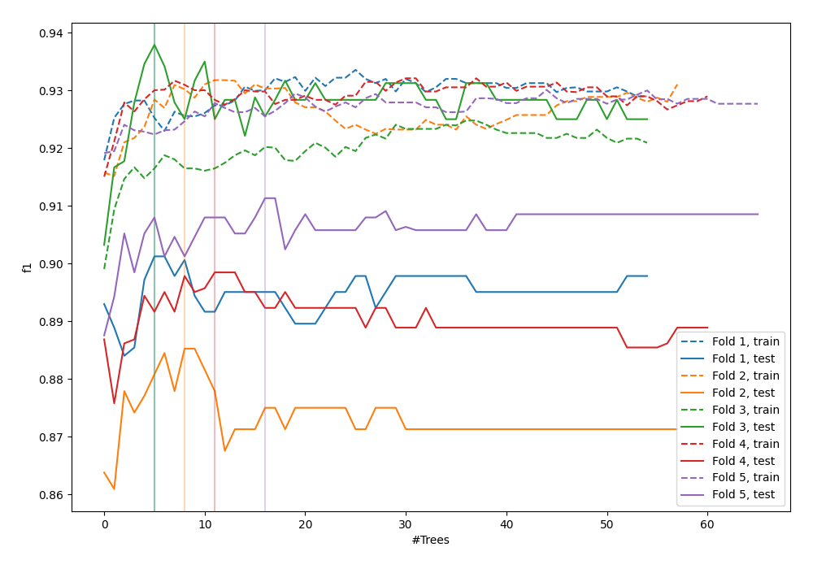
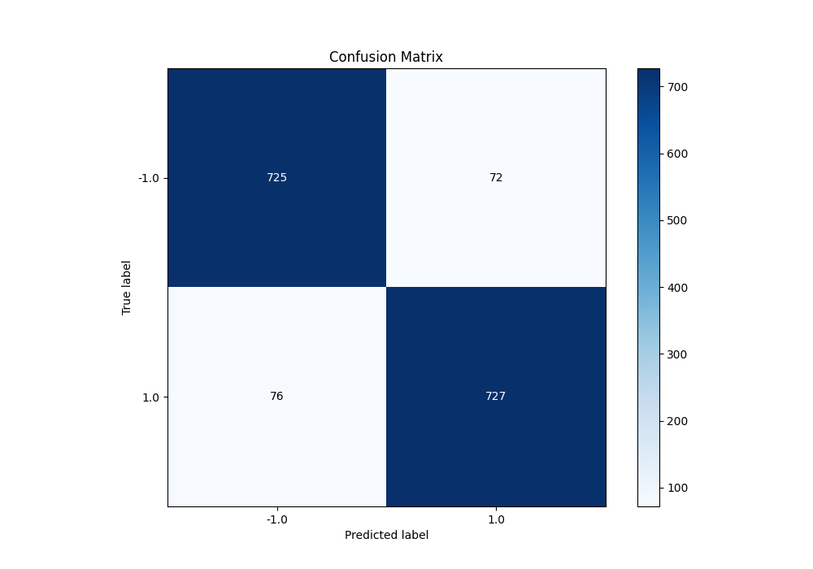
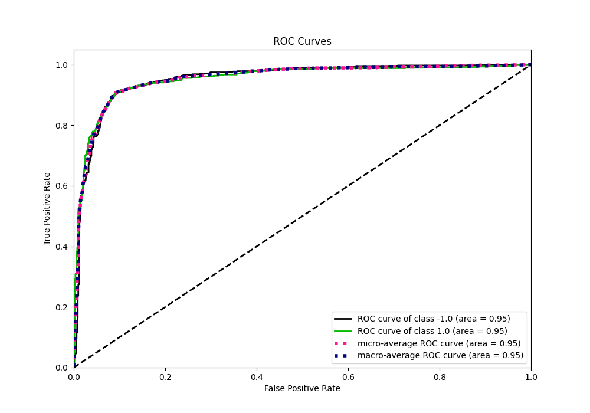
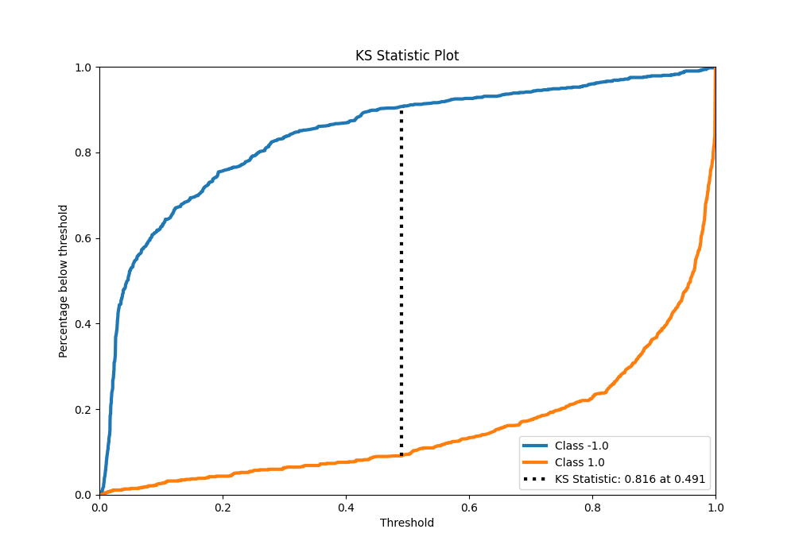
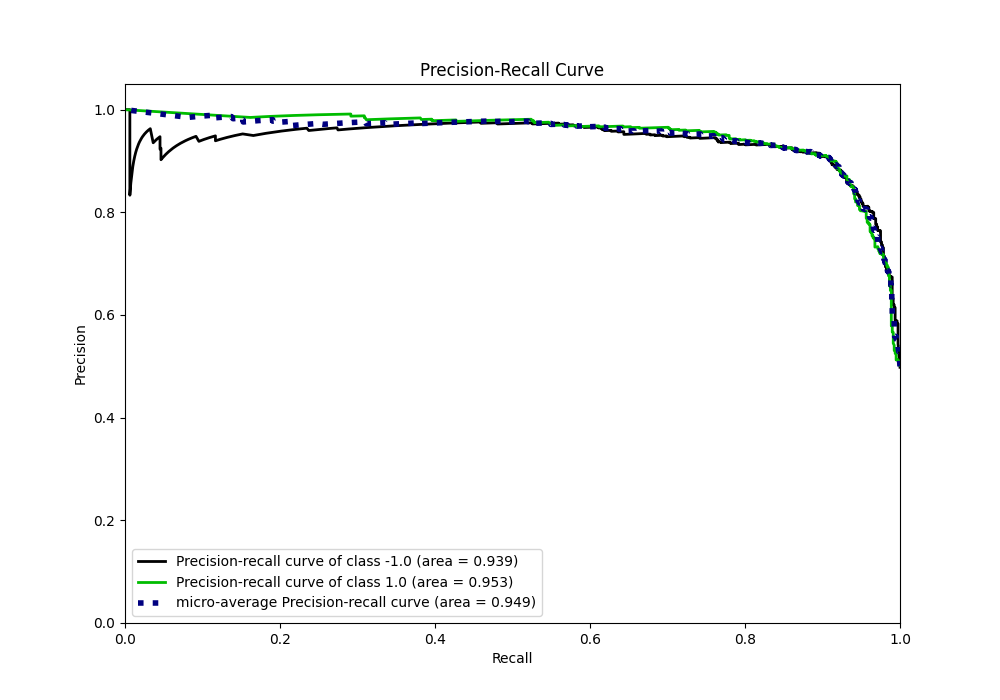
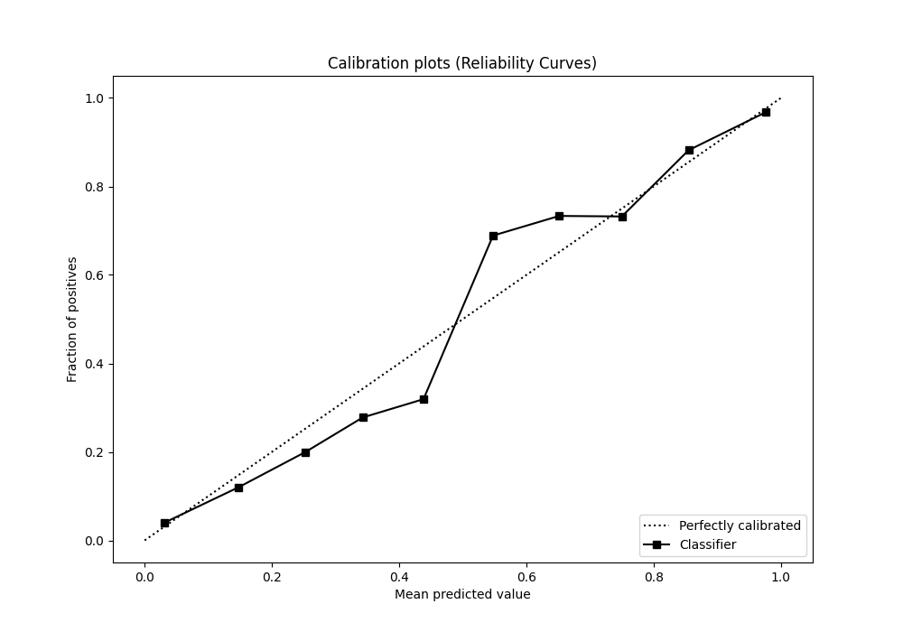
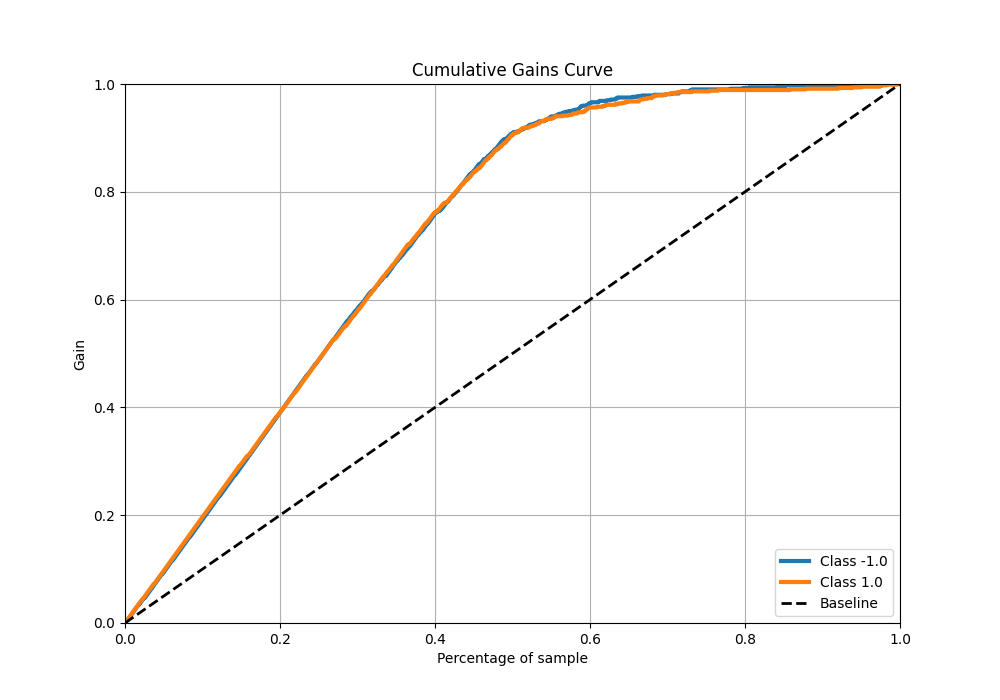
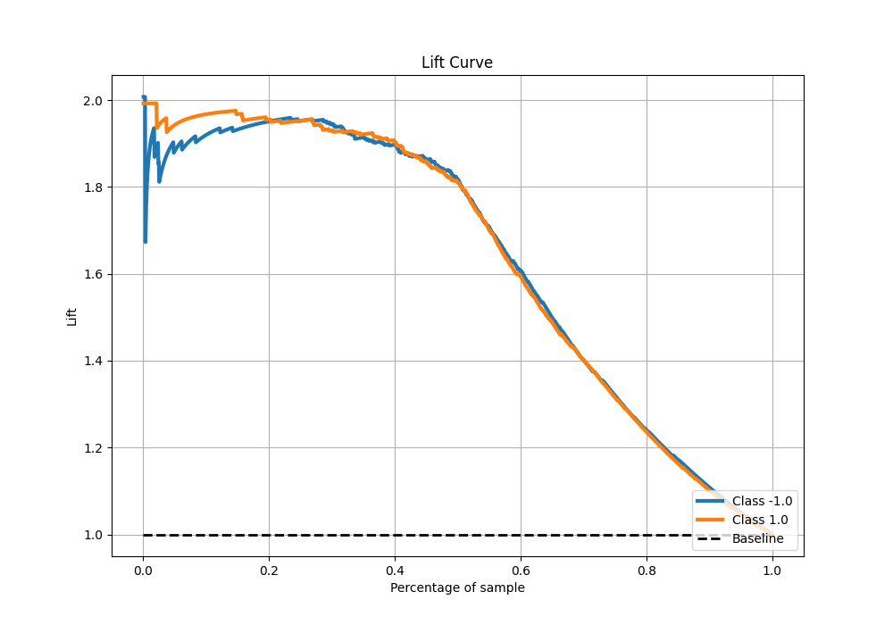

# Summary of 100_ExtraTrees_Stacked

[<< Go back](../README.md)

## Extra Trees Classifier (Extra Trees)
- **n_jobs**: -1
- **criterion**: entropy
- **max_features**: 0.9
- **min_samples_split**: 50
- **max_depth**: 7
- **eval_metric_name**: f1
- **explain_level**: 0

## Validation
 - **validation_type**: kfold
 - **shuffle**: True
 - **stratify**: True
 - **k_folds**: 5

## Optimized metric
f1

## Training time

22.9 seconds

## Metric details
|           |    score |   threshold |
|:----------|---------:|------------:|
| logloss   | 0.281436 |  nan        |
| auc       | 0.953133 |  nan        |
| f1        | 0.907615 |    0.502444 |
| accuracy  | 0.9075   |    0.502444 |
| precision | 0.991031 |    0.989084 |
| recall    | 1        |    0        |
| mcc       | 0.815011 |    0.502444 |

## Metric details with threshold from accuracy metric
|           |    score |   threshold |
|:----------|---------:|------------:|
| logloss   | 0.281436 |  nan        |
| auc       | 0.953133 |  nan        |
| f1        | 0.907615 |    0.502444 |
| accuracy  | 0.9075   |    0.502444 |
| precision | 0.909887 |    0.502444 |
| recall    | 0.905355 |    0.502444 |
| mcc       | 0.815011 |    0.502444 |

## Confusion matrix (at threshold=0.502444)
|                 |   Predicted as -1.0 |   Predicted as 1.0 |
|:----------------|--------------------:|-------------------:|
| Labeled as -1.0 |                 725 |                 72 |
| Labeled as 1.0  |                  76 |                727 |

## Learning curves

## Confusion Matrix

## Normalized Confusion Matrix

## ROC Curve

## Kolmogorov-Smirnov Statistic

## Precision-Recall Curve

## Calibration Curve

## Cumulative Gains Curve

## Lift Curve

[<< Go back](../README.md)
