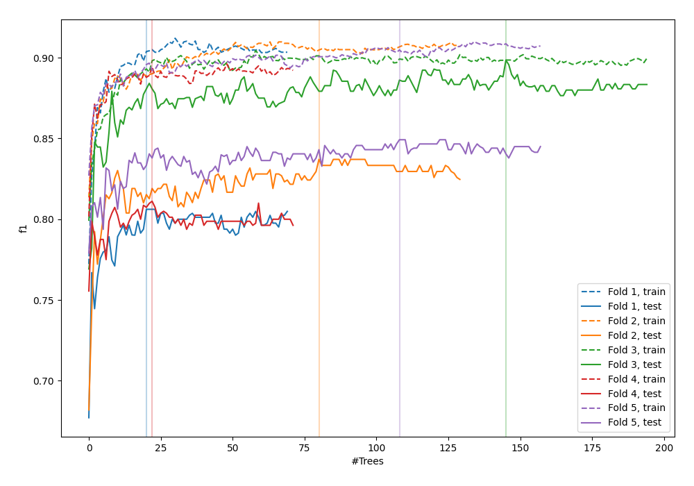
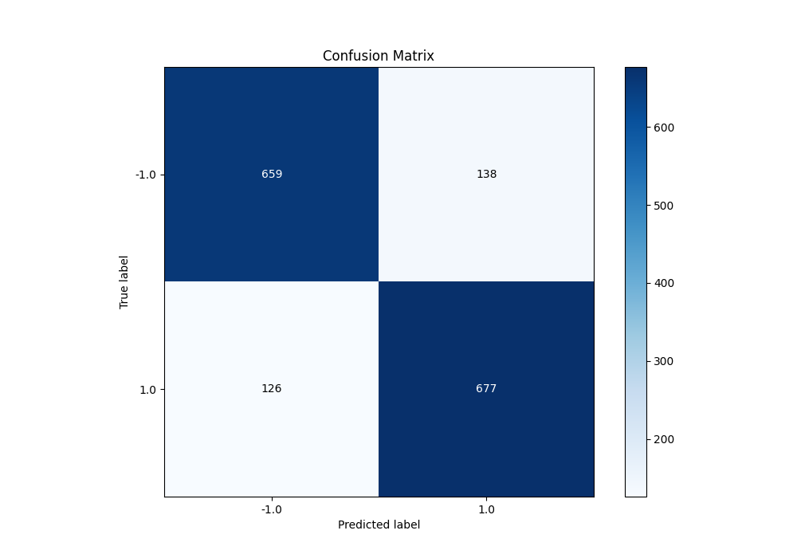
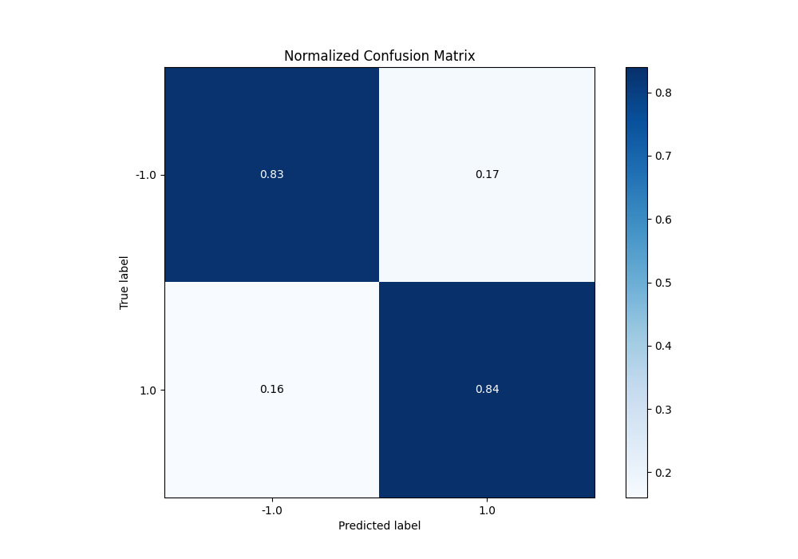
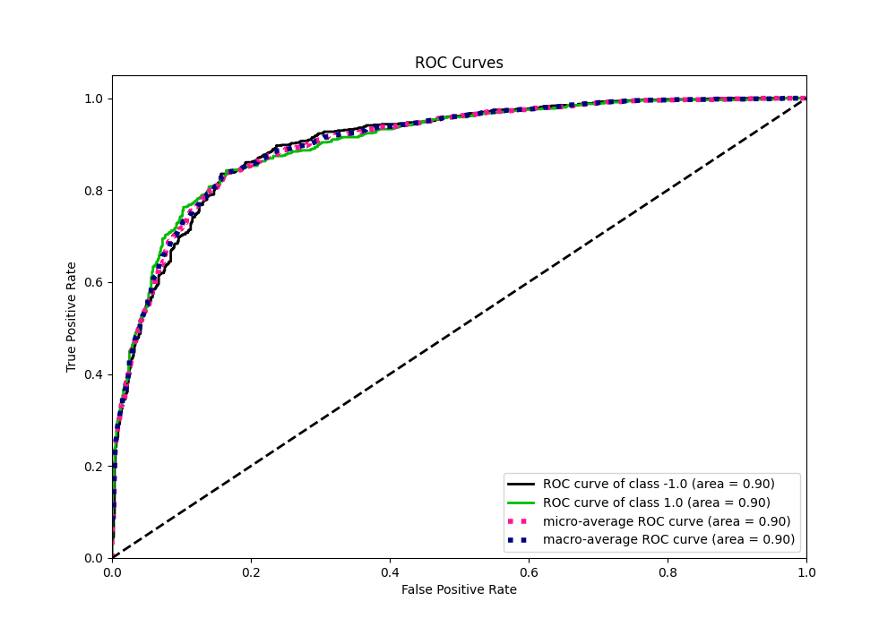
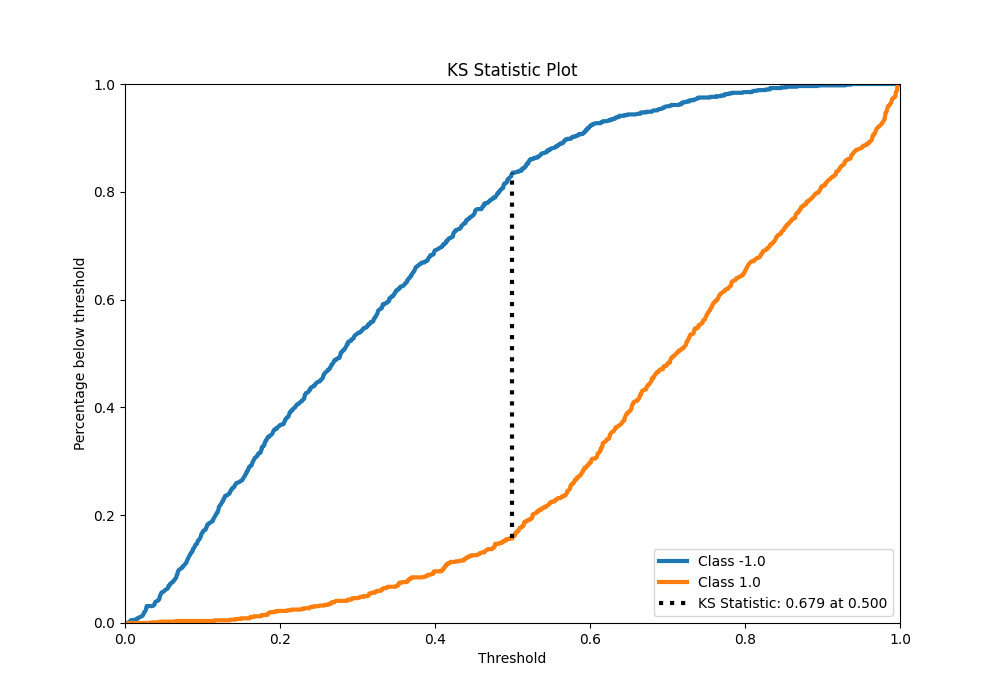
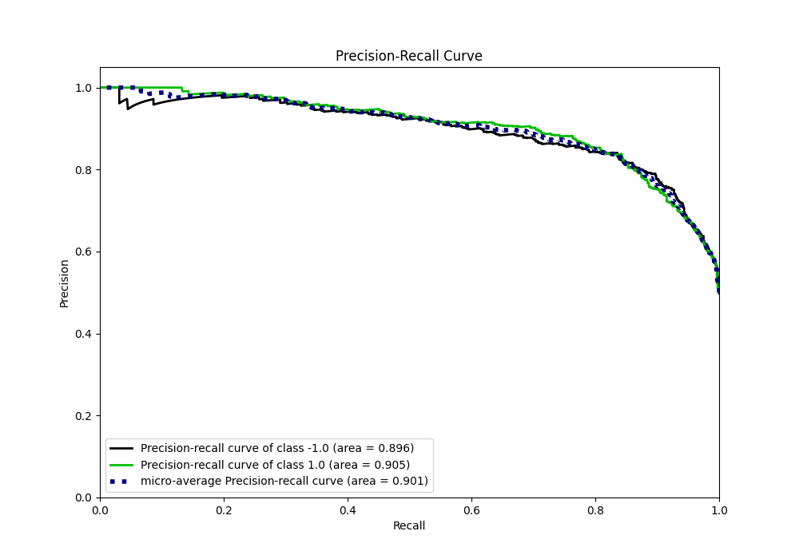
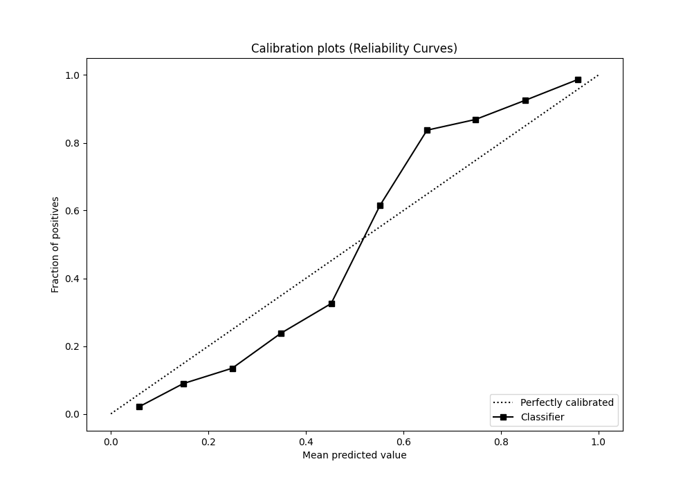
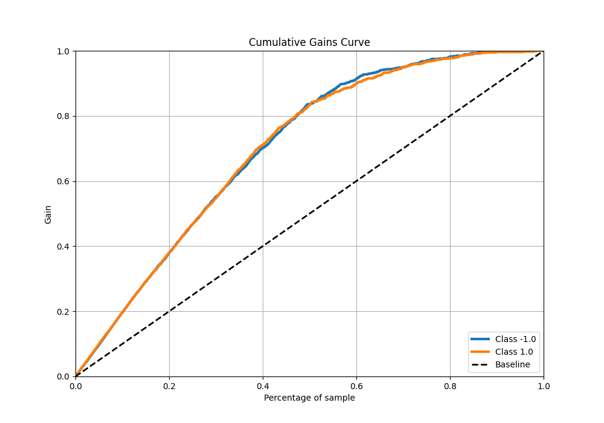
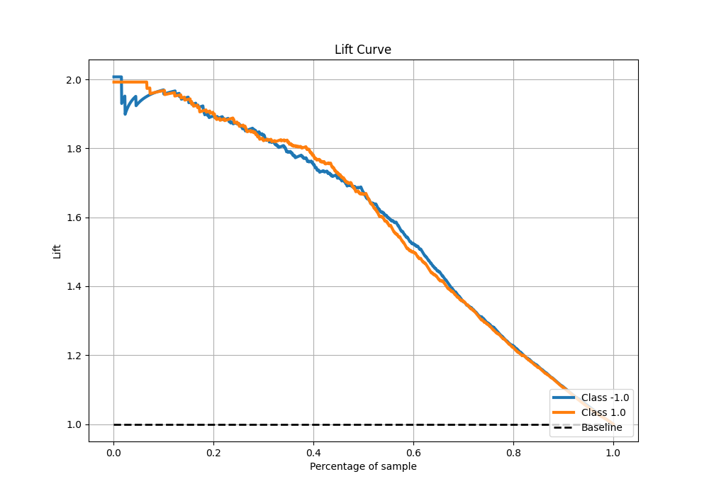

# Summary of 101_RandomForest

[<< Go back](../README.md)

## Random Forest
- **n_jobs**: -1
- **criterion**: entropy
- **max_features**: 0.7
- **min_samples_split**: 50
- **max_depth**: 7
- **eval_metric_name**: f1
- **explain_level**: 0

## Validation
 - **validation_type**: kfold
 - **shuffle**: True
 - **stratify**: True
 - **k_folds**: 5

## Optimized metric
f1

## Training time

27.2 seconds

## Metric details
|           |    score |    threshold |
|:----------|---------:|-------------:|
| logloss   | 0.422861 | nan          |
| auc       | 0.902897 | nan          |
| f1        | 0.836836 |   0.497116   |
| accuracy  | 0.835    |   0.497116   |
| precision | 1        |   0.95083    |
| recall    | 1        |   0.00569672 |
| mcc       | 0.670052 |   0.497116   |

## Metric details with threshold from accuracy metric
|           |    score |   threshold |
|:----------|---------:|------------:|
| logloss   | 0.422861 |  nan        |
| auc       | 0.902897 |  nan        |
| f1        | 0.836836 |    0.497116 |
| accuracy  | 0.835    |    0.497116 |
| precision | 0.830675 |    0.497116 |
| recall    | 0.843088 |    0.497116 |
| mcc       | 0.670052 |    0.497116 |

## Confusion matrix (at threshold=0.497116)
|                 |   Predicted as -1.0 |   Predicted as 1.0 |
|:----------------|--------------------:|-------------------:|
| Labeled as -1.0 |                 659 |                138 |
| Labeled as 1.0  |                 126 |                677 |

## Learning curves

## Confusion Matrix

## Normalized Confusion Matrix

## ROC Curve

## Kolmogorov-Smirnov Statistic

## Precision-Recall Curve

## Calibration Curve

## Cumulative Gains Curve

## Lift Curve

[<< Go back](../README.md)
