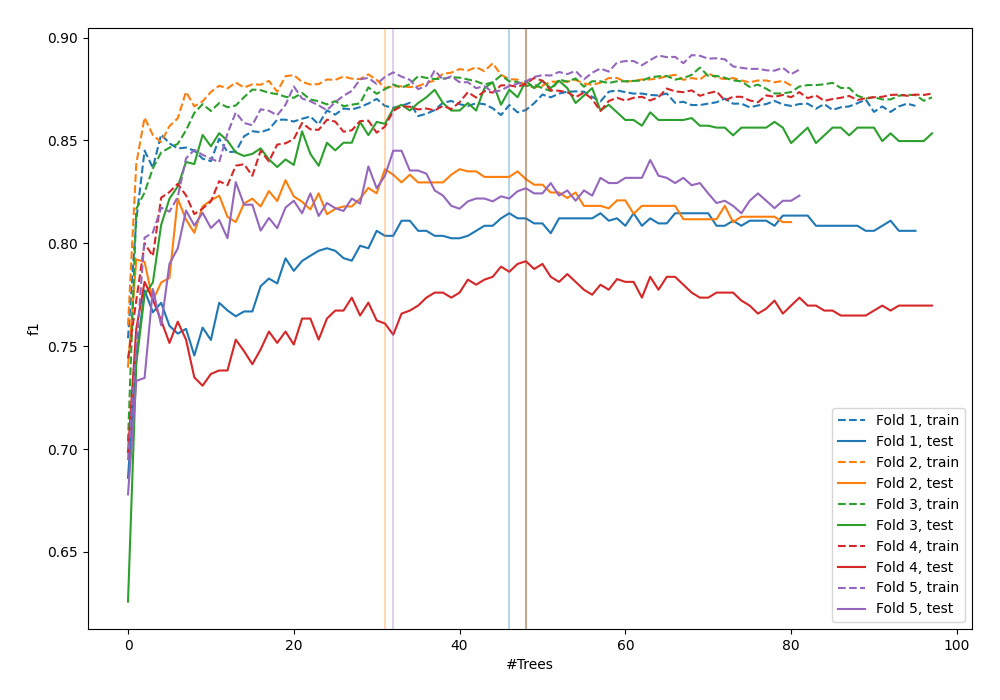
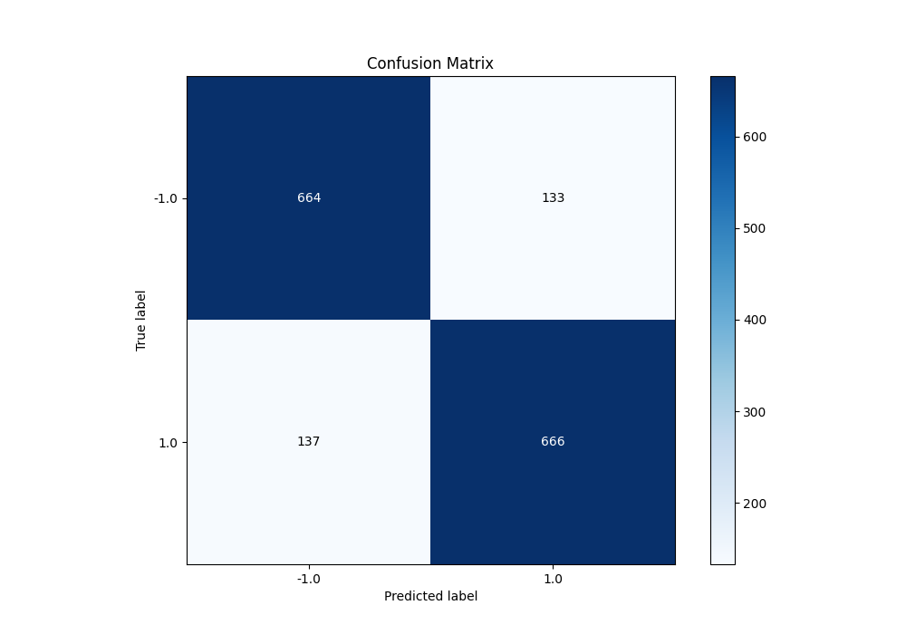
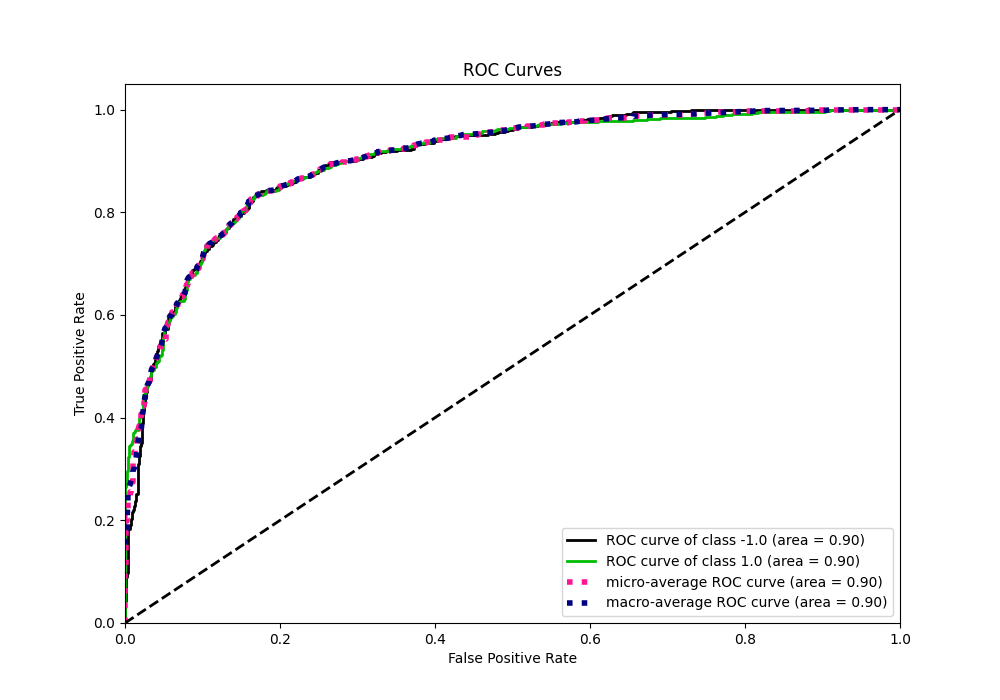
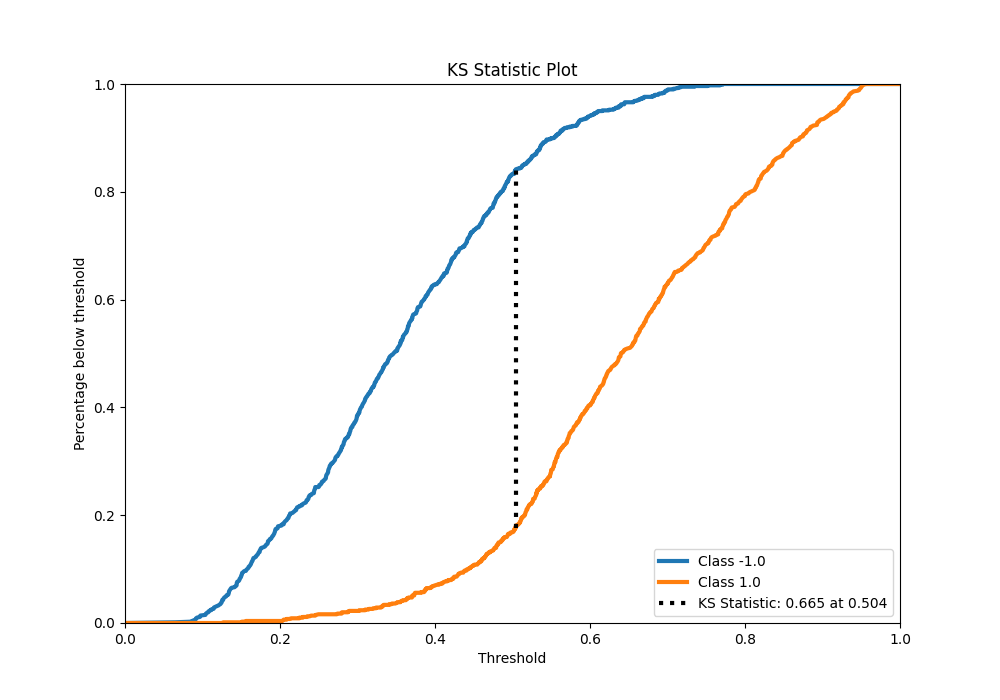
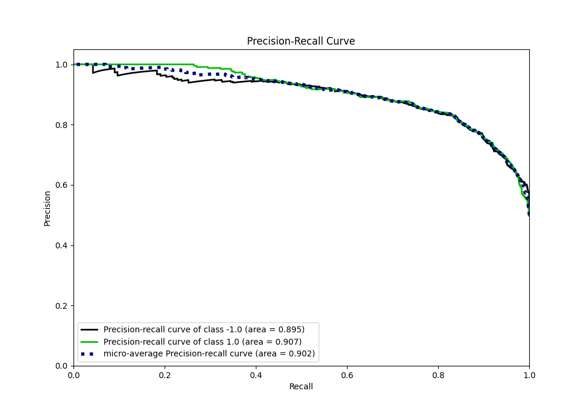
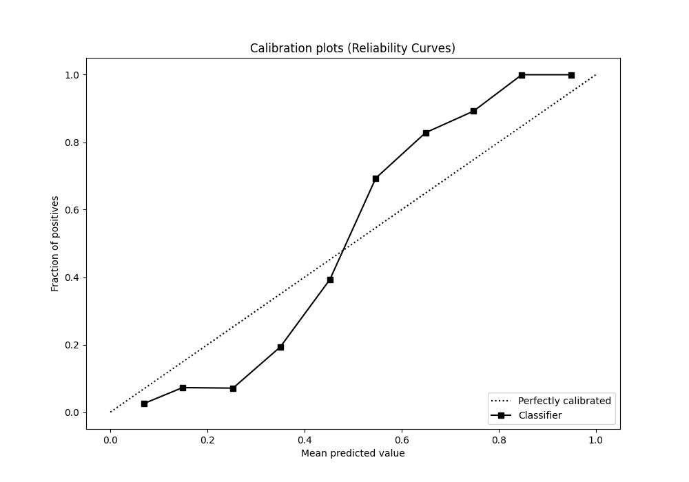
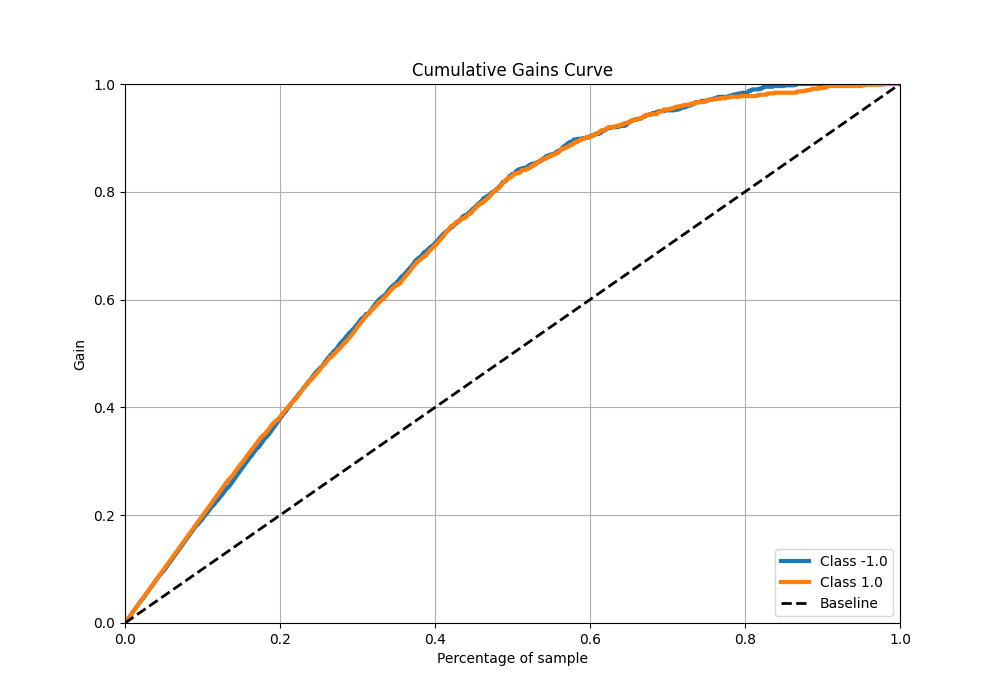
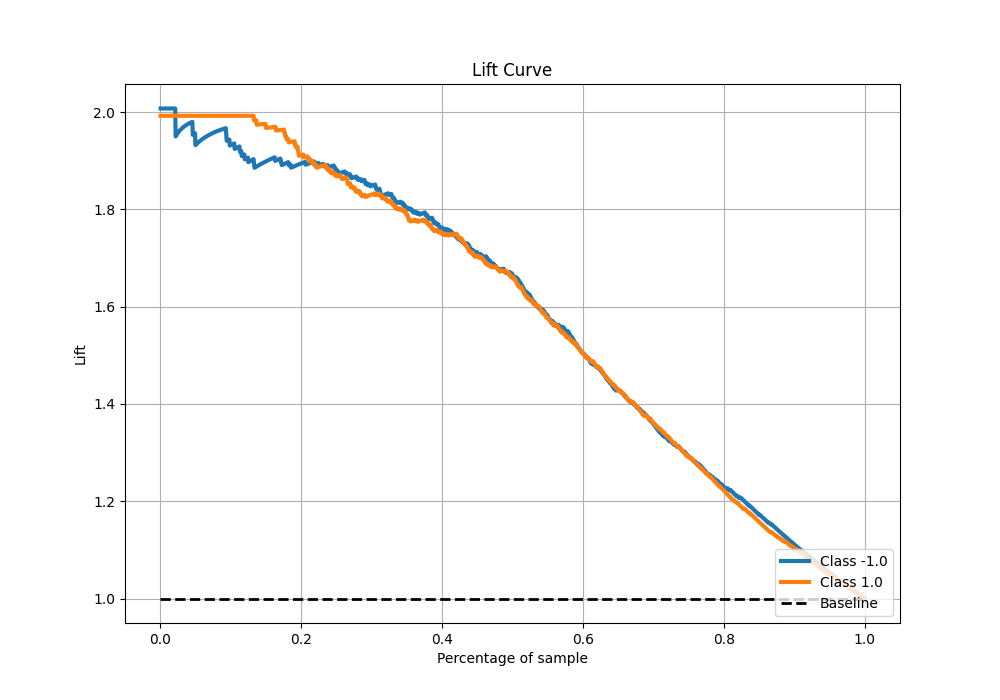

# Summary of 103_ExtraTrees

[<< Go back](../README.md)

## Extra Trees Classifier (Extra Trees)
- **n_jobs**: -1
- **criterion**: entropy
- **max_features**: 0.7
- **min_samples_split**: 40
- **max_depth**: 6
- **eval_metric_name**: f1
- **explain_level**: 0

## Validation
 - **validation_type**: kfold
 - **shuffle**: True
 - **stratify**: True
 - **k_folds**: 5

## Optimized metric
f1

## Training time

21.9 seconds

## Metric details
|           |    score |   threshold |
|:----------|---------:|------------:|
| logloss   | 0.470801 | nan         |
| auc       | 0.901713 | nan         |
| f1        | 0.831461 |   0.501677  |
| accuracy  | 0.83125  |   0.501677  |
| precision | 1        |   0.773427  |
| recall    | 1        |   0.0577343 |
| mcc       | 0.66251  |   0.501677  |

## Metric details with threshold from accuracy metric
|           |    score |   threshold |
|:----------|---------:|------------:|
| logloss   | 0.470801 |  nan        |
| auc       | 0.901713 |  nan        |
| f1        | 0.831461 |    0.501677 |
| accuracy  | 0.83125  |    0.501677 |
| precision | 0.833542 |    0.501677 |
| recall    | 0.82939  |    0.501677 |
| mcc       | 0.66251  |    0.501677 |

## Confusion matrix (at threshold=0.501677)
|                 |   Predicted as -1.0 |   Predicted as 1.0 |
|:----------------|--------------------:|-------------------:|
| Labeled as -1.0 |                 664 |                133 |
| Labeled as 1.0  |                 137 |                666 |

## Learning curves

## Confusion Matrix

## Normalized Confusion Matrix

## ROC Curve

## Kolmogorov-Smirnov Statistic

## Precision-Recall Curve

## Calibration Curve

## Cumulative Gains Curve

## Lift Curve

[<< Go back](../README.md)
