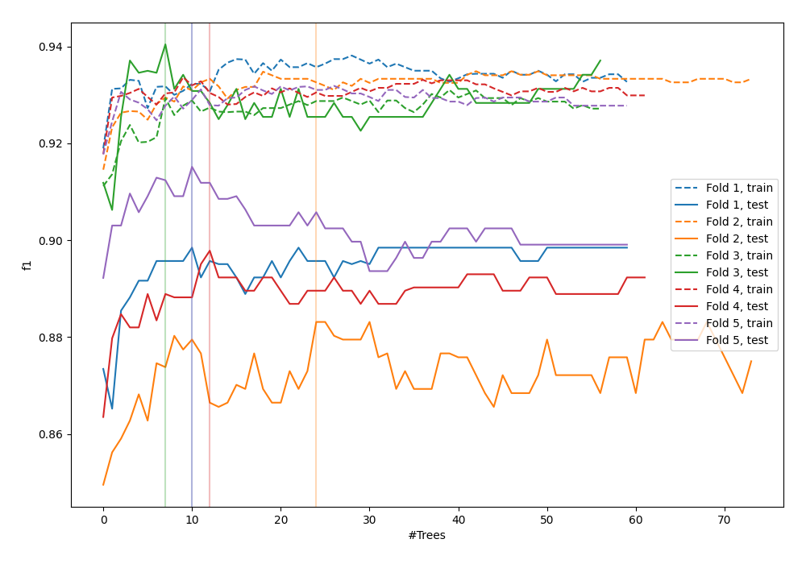
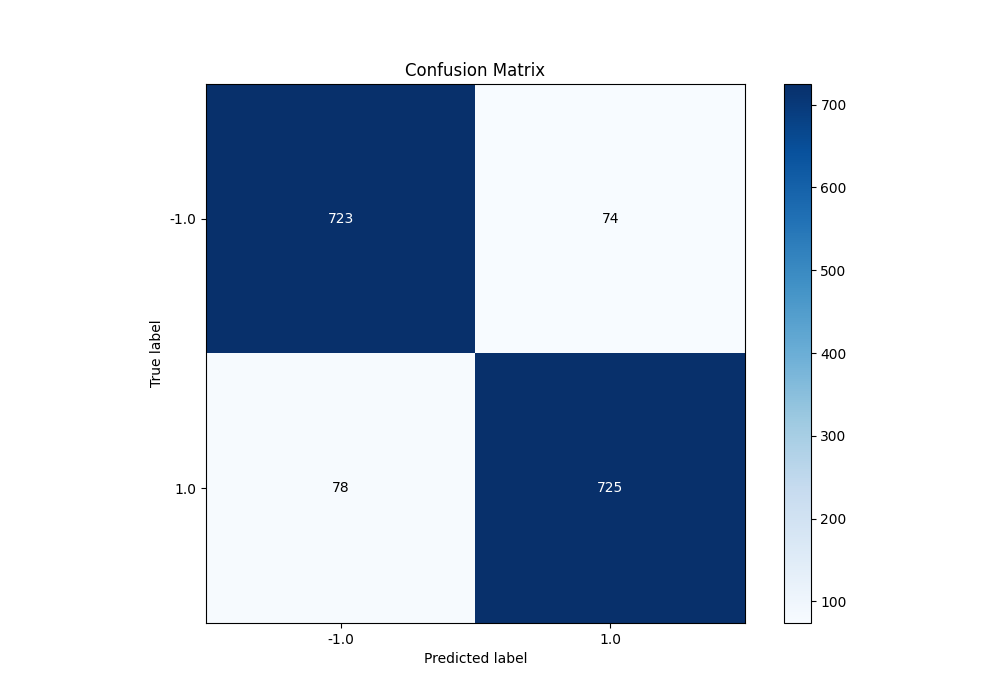
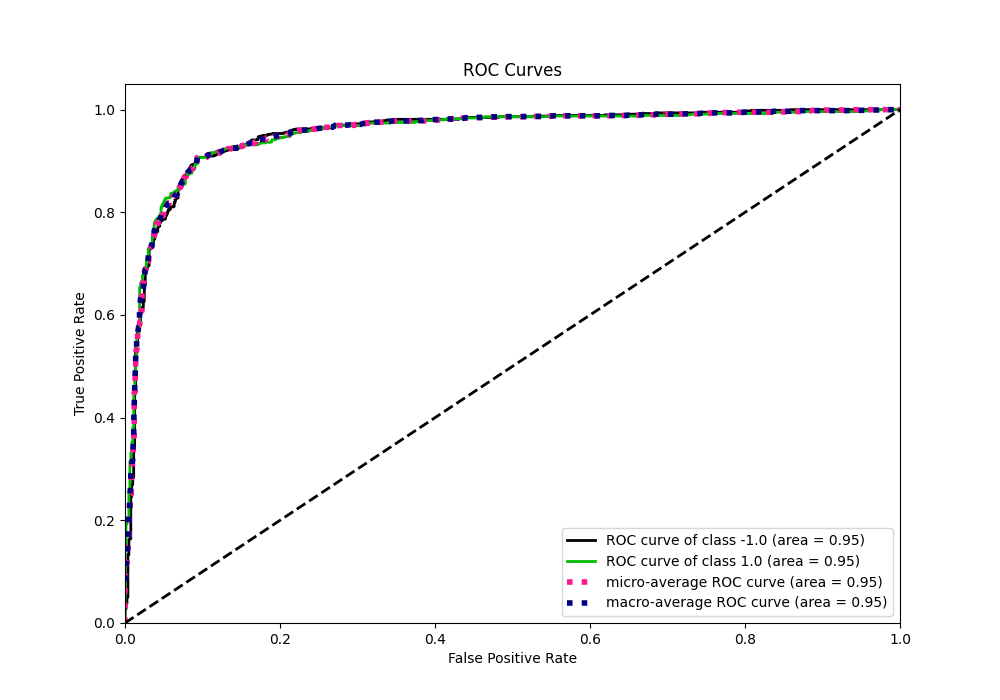
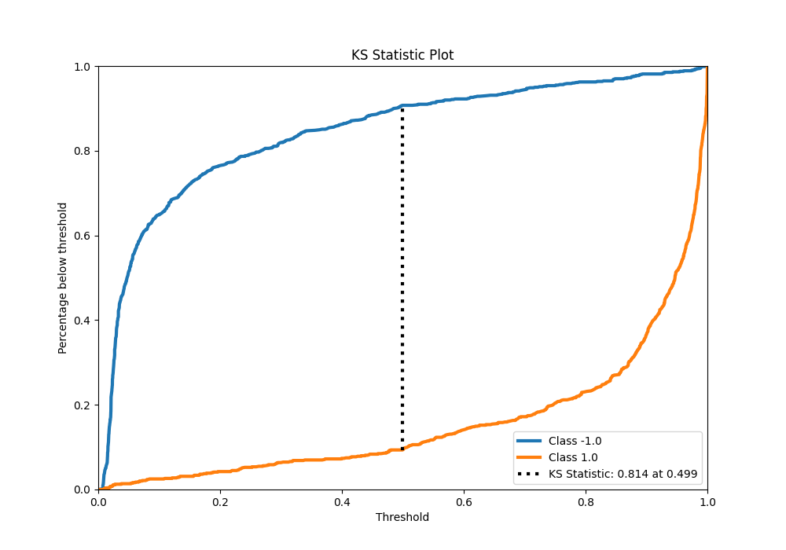
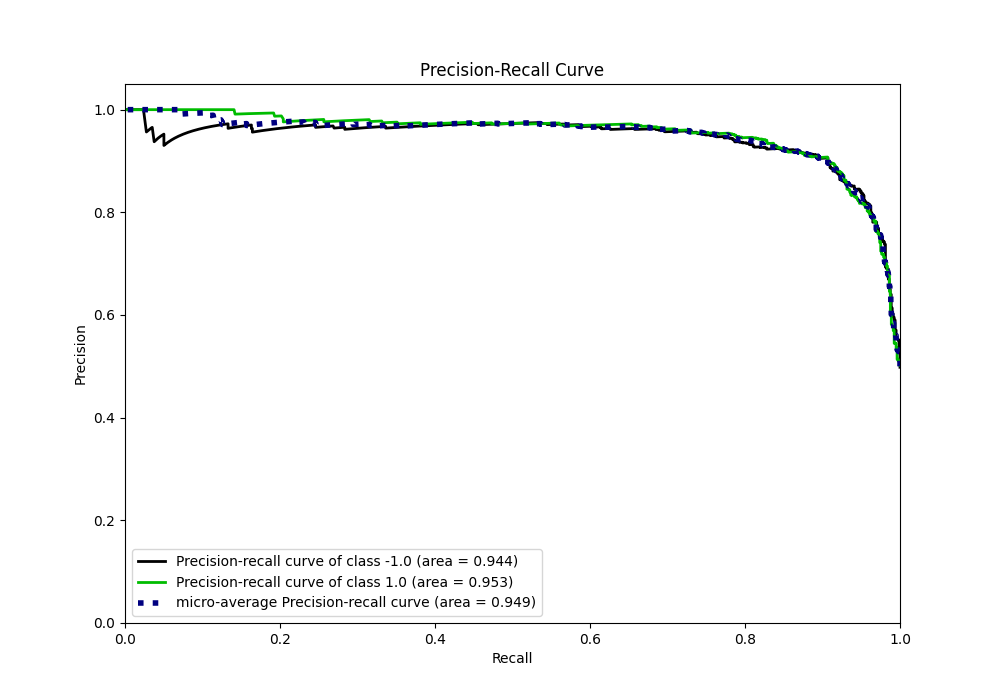
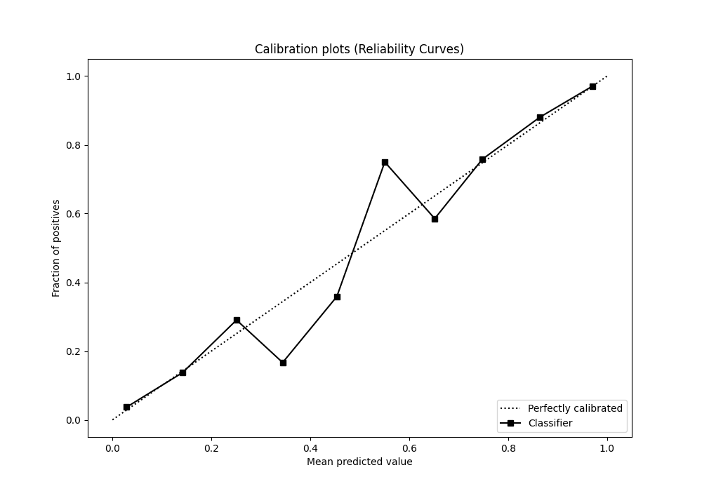
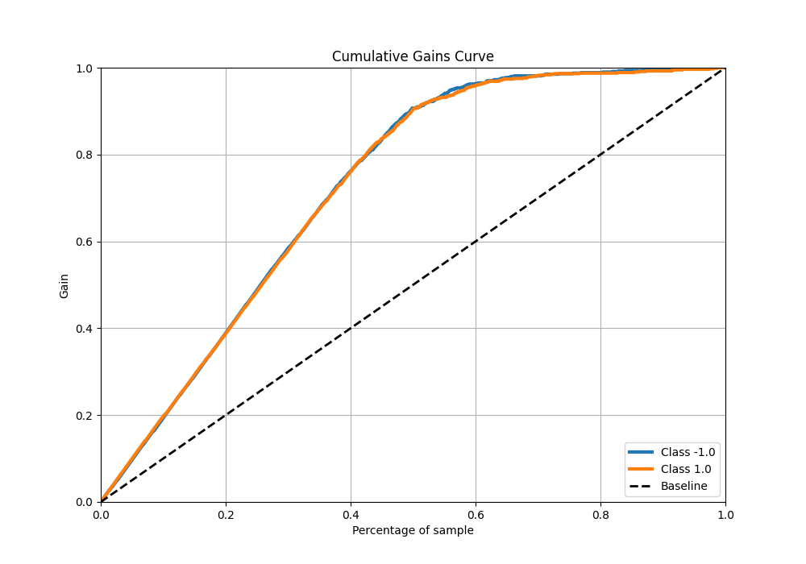
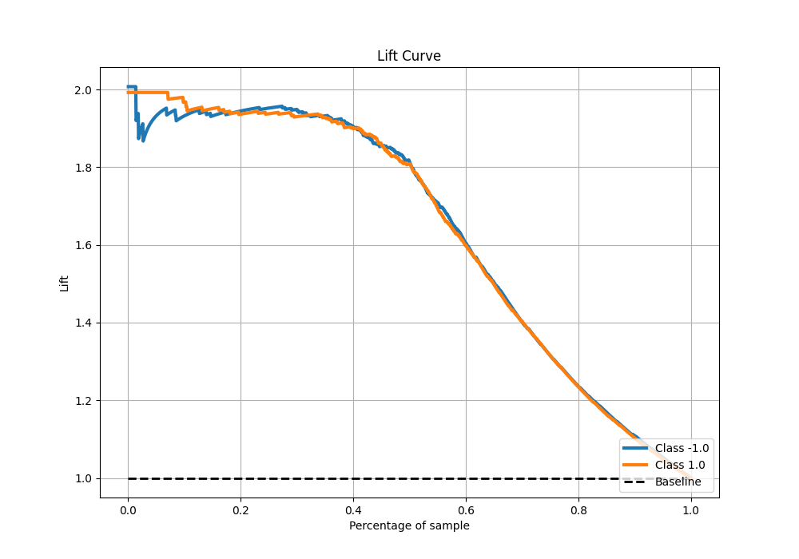

# Summary of 104_ExtraTrees_Stacked

[<< Go back](../README.md)

## Extra Trees Classifier (Extra Trees)
- **n_jobs**: -1
- **criterion**: entropy
- **max_features**: 0.9
- **min_samples_split**: 40
- **max_depth**: 6
- **eval_metric_name**: f1
- **explain_level**: 0

## Validation
 - **validation_type**: kfold
 - **shuffle**: True
 - **stratify**: True
 - **k_folds**: 5

## Optimized metric
f1

## Training time

24.6 seconds

## Metric details
|           |    score |    threshold |
|:----------|---------:|-------------:|
| logloss   | 0.269923 | nan          |
| auc       | 0.953664 | nan          |
| f1        | 0.905119 |   0.502588   |
| accuracy  | 0.905    |   0.502588   |
| precision | 1        |   0.995868   |
| recall    | 1        |   0.00584263 |
| mcc       | 0.810011 |   0.502588   |

## Metric details with threshold from accuracy metric
|           |    score |   threshold |
|:----------|---------:|------------:|
| logloss   | 0.269923 |  nan        |
| auc       | 0.953664 |  nan        |
| f1        | 0.905119 |    0.502588 |
| accuracy  | 0.905    |    0.502588 |
| precision | 0.907384 |    0.502588 |
| recall    | 0.902864 |    0.502588 |
| mcc       | 0.810011 |    0.502588 |

## Confusion matrix (at threshold=0.502588)
|                 |   Predicted as -1.0 |   Predicted as 1.0 |
|:----------------|--------------------:|-------------------:|
| Labeled as -1.0 |                 723 |                 74 |
| Labeled as 1.0  |                  78 |                725 |

## Learning curves

## Confusion Matrix

## Normalized Confusion Matrix

## ROC Curve

## Kolmogorov-Smirnov Statistic

## Precision-Recall Curve

## Calibration Curve

## Cumulative Gains Curve

## Lift Curve

[<< Go back](../README.md)
