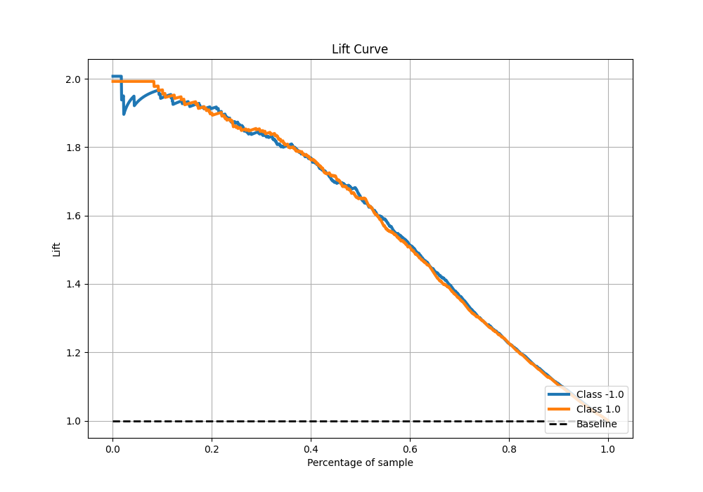

# Summary of 105_RandomForest

[<< Go back](../README.md)

## Random Forest
- **n_jobs**: -1
- **criterion**: entropy
- **max_features**: 0.8
- **min_samples_split**: 20
- **max_depth**: 5
- **eval_metric_name**: f1
- **explain_level**: 0

## Validation
 - **validation_type**: kfold
 - **shuffle**: True
 - **stratify**: True
 - **k_folds**: 5

## Optimized metric
f1

## Training time

26.1 seconds

## Metric details
|           |    score |   threshold |
|:----------|---------:|------------:|
| logloss   | 0.422857 | nan         |
| auc       | 0.901699 | nan         |
| f1        | 0.834363 |   0.499955  |
| accuracy  | 0.8325   |   0.499955  |
| precision | 1        |   0.918698  |
| recall    | 1        |   0.0152087 |
| mcc       | 0.665051 |   0.499955  |

## Metric details with threshold from accuracy metric
|           |    score |   threshold |
|:----------|---------:|------------:|
| logloss   | 0.422857 |  nan        |
| auc       | 0.901699 |  nan        |
| f1        | 0.834363 |    0.499955 |
| accuracy  | 0.8325   |    0.499955 |
| precision | 0.828221 |    0.499955 |
| recall    | 0.840598 |    0.499955 |
| mcc       | 0.665051 |    0.499955 |

## Confusion matrix (at threshold=0.499955)
|                 |   Predicted as -1.0 |   Predicted as 1.0 |
|:----------------|--------------------:|-------------------:|
| Labeled as -1.0 |                 657 |                140 |
| Labeled as 1.0  |                 128 |                675 |

## Learning curves

## Confusion Matrix

## Normalized Confusion Matrix

## ROC Curve

## Kolmogorov-Smirnov Statistic

## Precision-Recall Curve

## Calibration Curve

## Cumulative Gains Curve

## Lift Curve

[<< Go back](../README.md)
