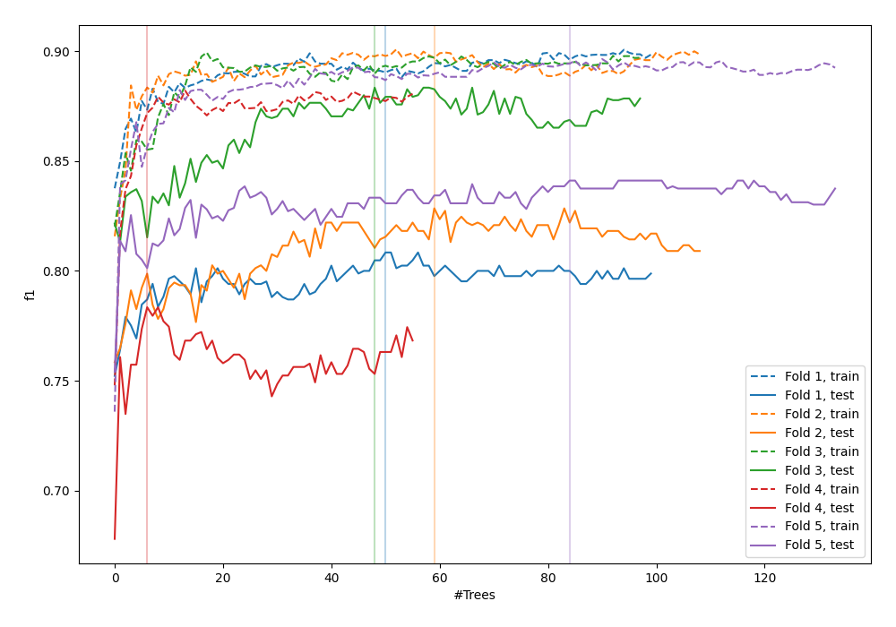
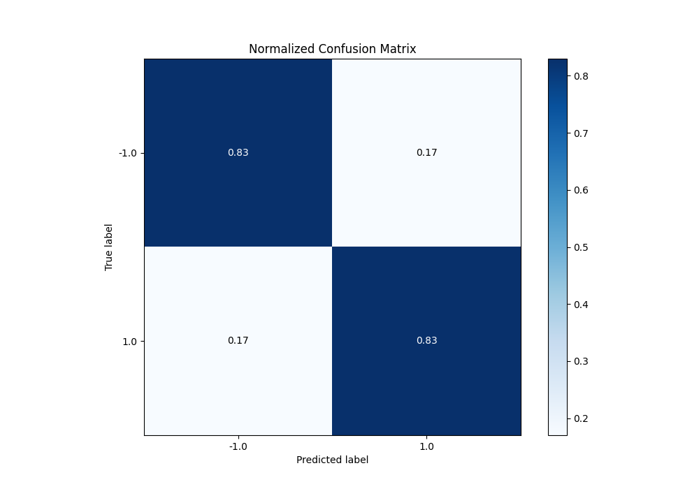
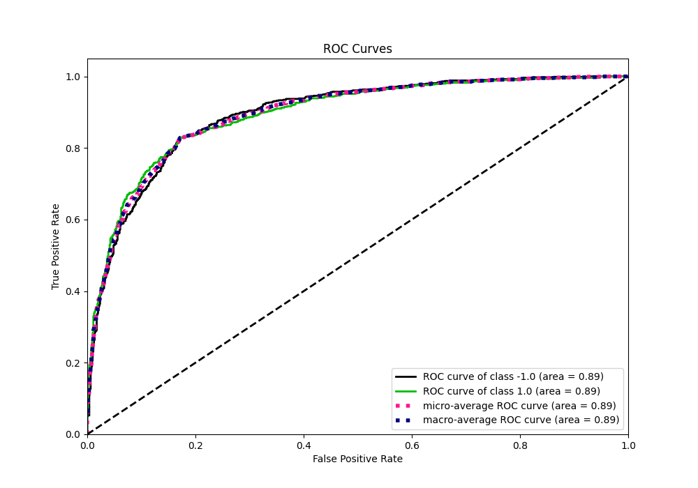
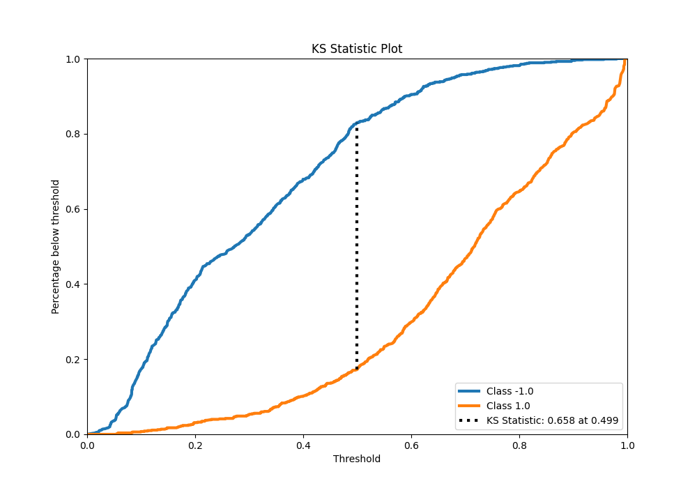
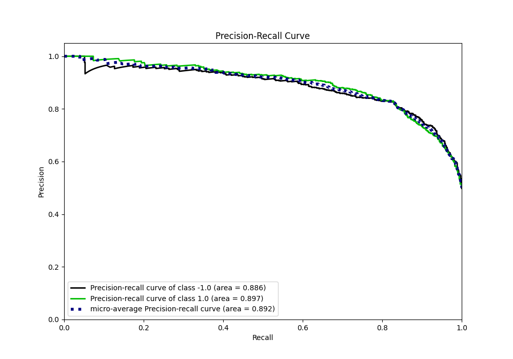
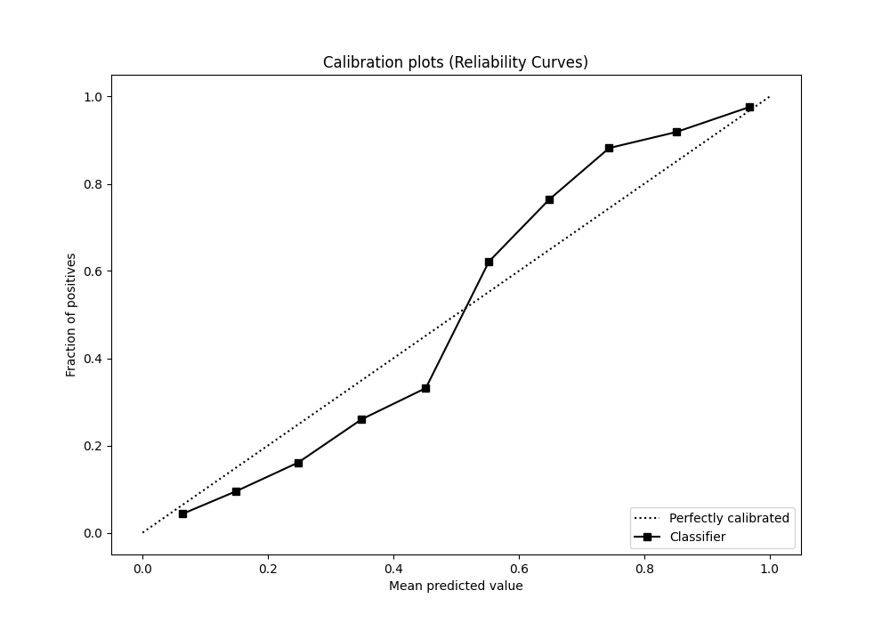
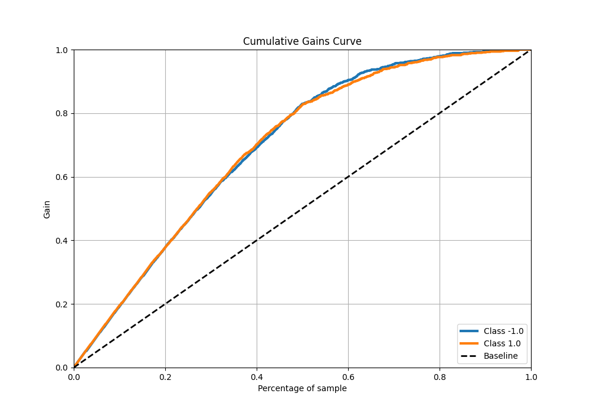
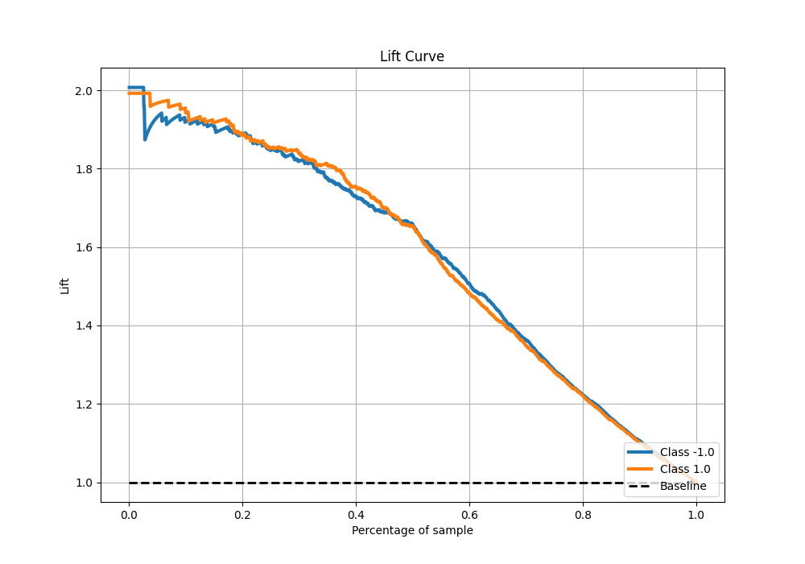

# Summary of 106_RandomForest

[<< Go back](../README.md)

## Random Forest
- **n_jobs**: -1
- **criterion**: entropy
- **max_features**: 1.0
- **min_samples_split**: 20
- **max_depth**: 5
- **eval_metric_name**: f1
- **explain_level**: 0

## Validation
 - **validation_type**: kfold
 - **shuffle**: True
 - **stratify**: True
 - **k_folds**: 5

## Optimized metric
f1

## Training time

26.6 seconds

## Metric details
|           |    score |    threshold |
|:----------|---------:|-------------:|
| logloss   | 0.430603 | nan          |
| auc       | 0.8944   | nan          |
| f1        | 0.827715 |   0.500722   |
| accuracy  | 0.8275   |   0.500722   |
| precision | 1        |   0.988275   |
| recall    | 1        |   0.00844685 |
| mcc       | 0.65501  |   0.500722   |

## Metric details with threshold from accuracy metric
|           |    score |   threshold |
|:----------|---------:|------------:|
| logloss   | 0.430603 |  nan        |
| auc       | 0.8944   |  nan        |
| f1        | 0.827715 |    0.500722 |
| accuracy  | 0.8275   |    0.500722 |
| precision | 0.829787 |    0.500722 |
| recall    | 0.825654 |    0.500722 |
| mcc       | 0.65501  |    0.500722 |

## Confusion matrix (at threshold=0.500722)
|                 |   Predicted as -1.0 |   Predicted as 1.0 |
|:----------------|--------------------:|-------------------:|
| Labeled as -1.0 |                 661 |                136 |
| Labeled as 1.0  |                 140 |                663 |

## Learning curves

## Confusion Matrix

## Normalized Confusion Matrix

## ROC Curve

## Kolmogorov-Smirnov Statistic

## Precision-Recall Curve

## Calibration Curve

## Cumulative Gains Curve

## Lift Curve

[<< Go back](../README.md)
