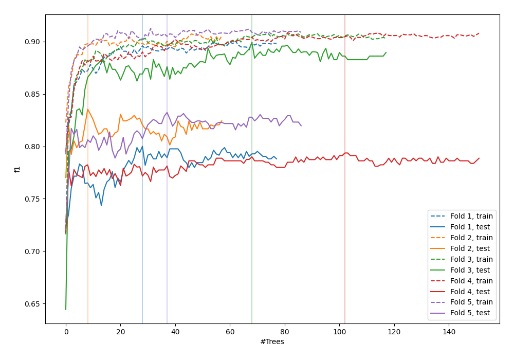
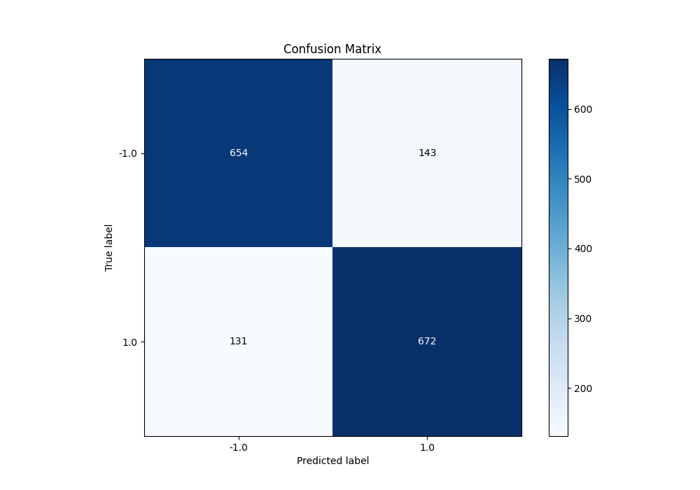
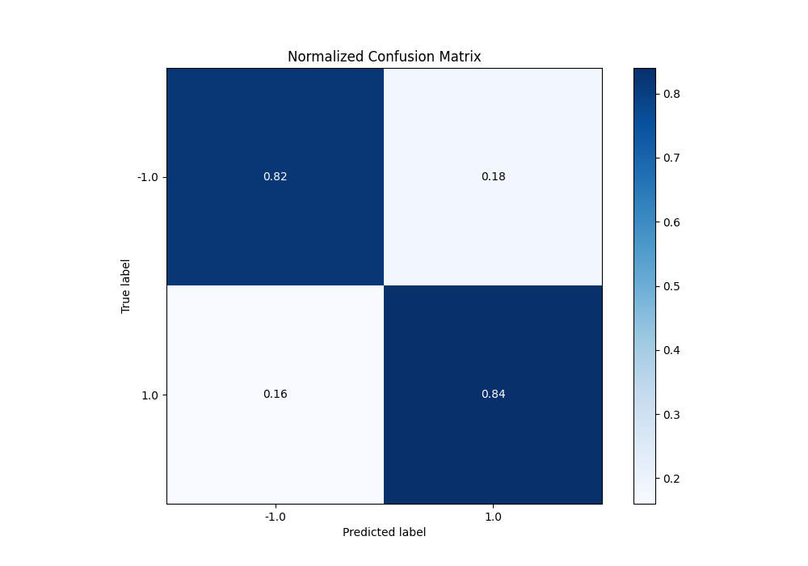
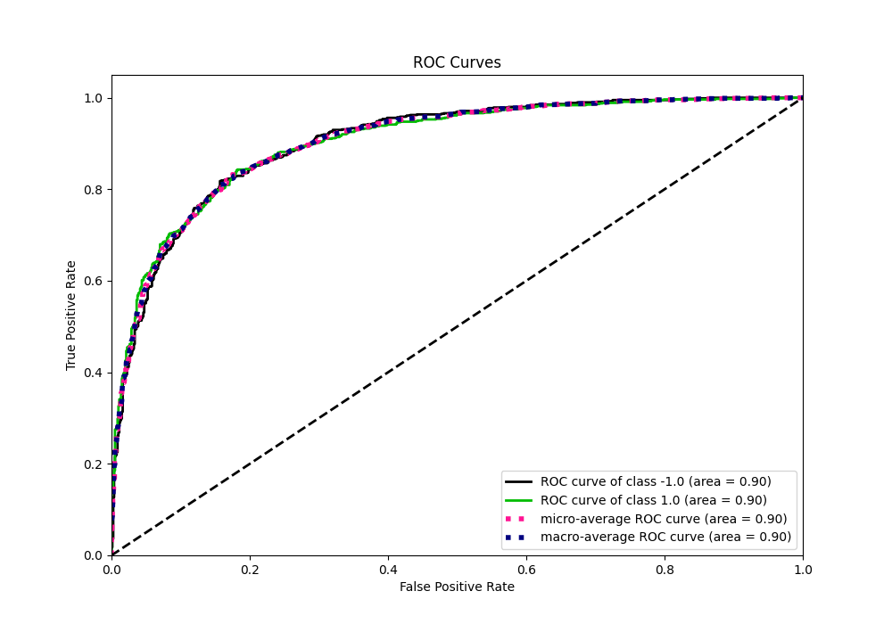
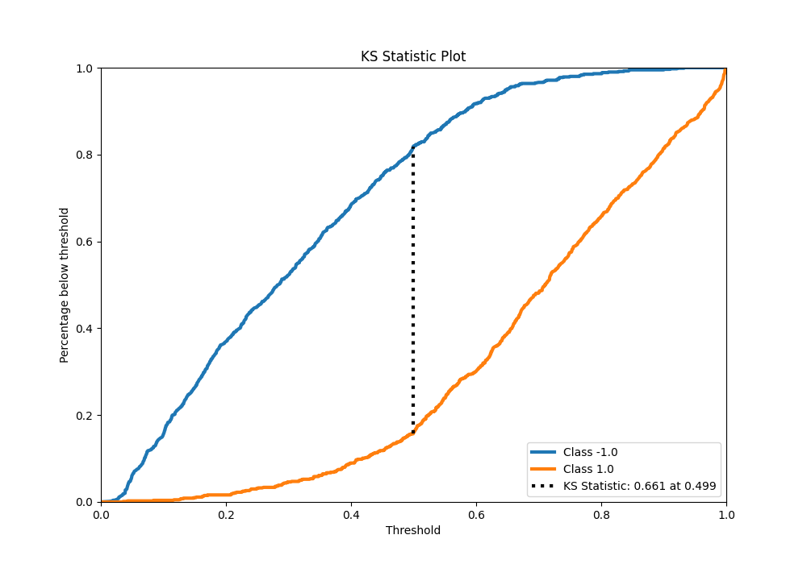
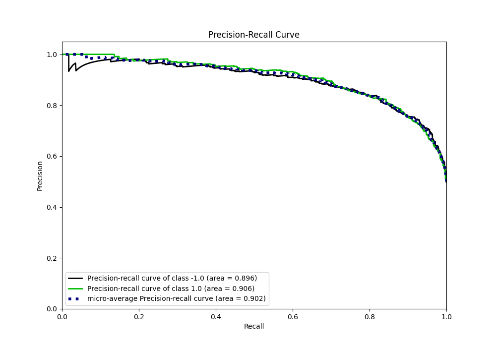
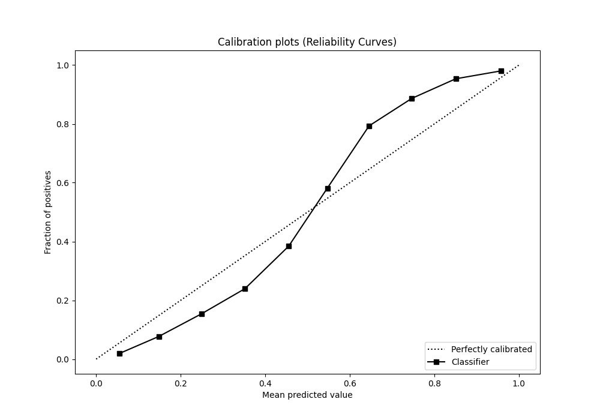
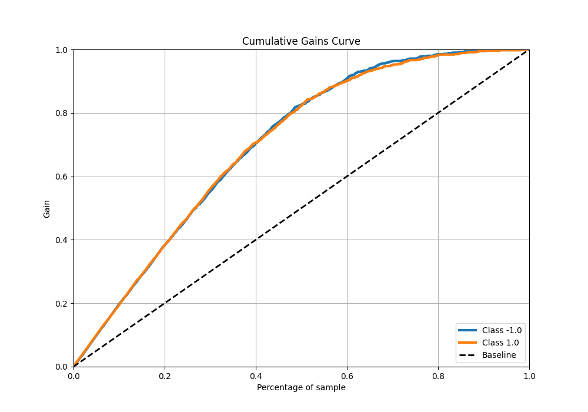
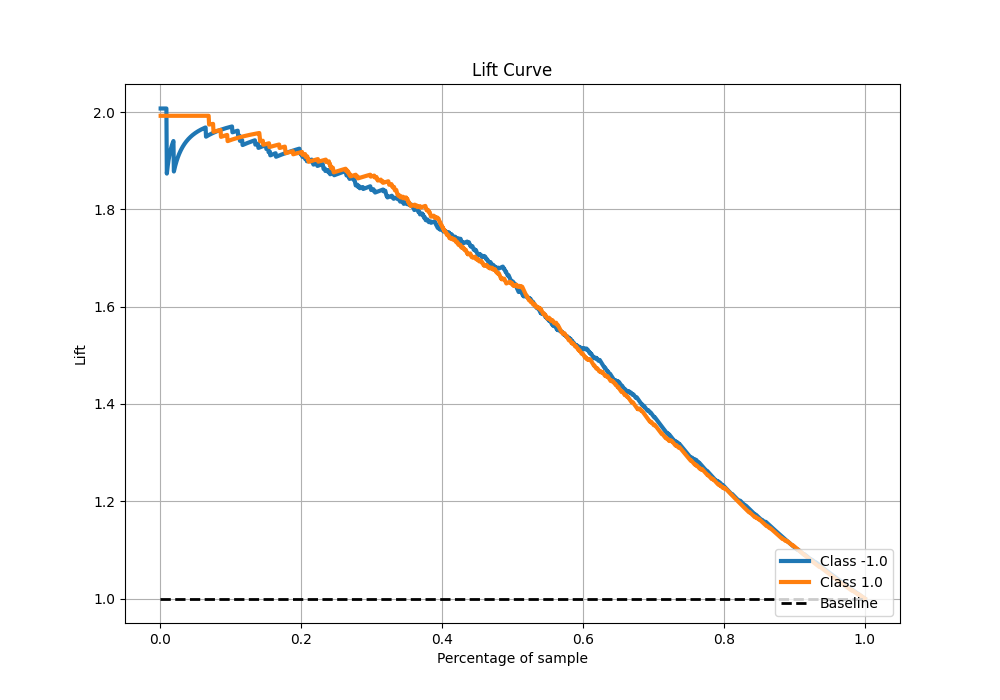

# Summary of 107_RandomForest

[<< Go back](../README.md)

## Random Forest
- **n_jobs**: -1
- **criterion**: entropy
- **max_features**: 0.7
- **min_samples_split**: 40
- **max_depth**: 6
- **eval_metric_name**: f1
- **explain_level**: 0

## Validation
 - **validation_type**: kfold
 - **shuffle**: True
 - **stratify**: True
 - **k_folds**: 5

## Optimized metric
f1

## Training time

25.4 seconds

## Metric details
|           |    score |   threshold |
|:----------|---------:|------------:|
| logloss   | 0.423481 | nan         |
| auc       | 0.9033   | nan         |
| f1        | 0.830655 |   0.501823  |
| accuracy  | 0.82875  |   0.501823  |
| precision | 1        |   0.949916  |
| recall    | 1        |   0.0122412 |
| mcc       | 0.65755  |   0.501823  |

## Metric details with threshold from accuracy metric
|           |    score |   threshold |
|:----------|---------:|------------:|
| logloss   | 0.423481 |  nan        |
| auc       | 0.9033   |  nan        |
| f1        | 0.830655 |    0.501823 |
| accuracy  | 0.82875  |    0.501823 |
| precision | 0.82454  |    0.501823 |
| recall    | 0.836862 |    0.501823 |
| mcc       | 0.65755  |    0.501823 |

## Confusion matrix (at threshold=0.501823)
|                 |   Predicted as -1.0 |   Predicted as 1.0 |
|:----------------|--------------------:|-------------------:|
| Labeled as -1.0 |                 654 |                143 |
| Labeled as 1.0  |                 131 |                672 |

## Learning curves

## Confusion Matrix

## Normalized Confusion Matrix

## ROC Curve

## Kolmogorov-Smirnov Statistic

## Precision-Recall Curve

## Calibration Curve

## Cumulative Gains Curve

## Lift Curve

[<< Go back](../README.md)
