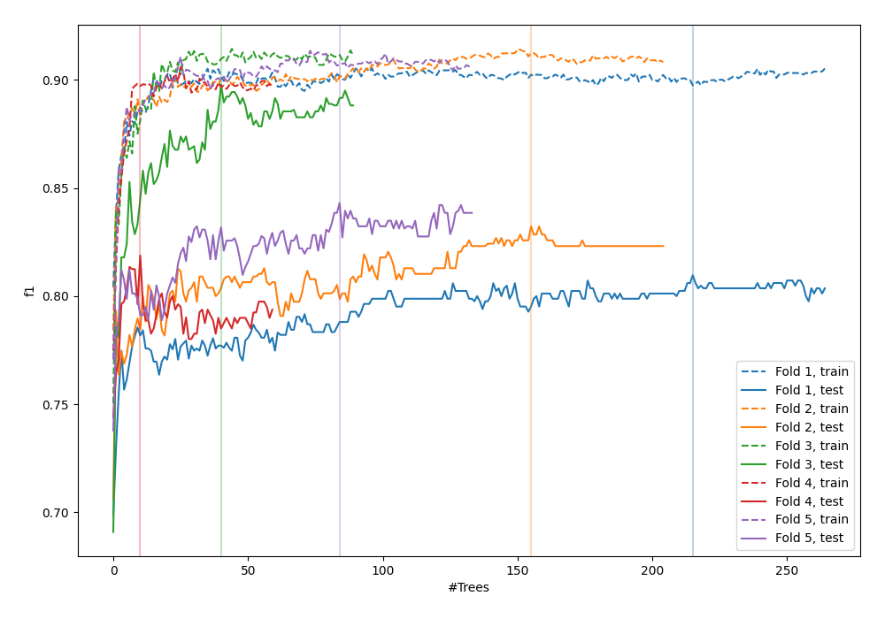
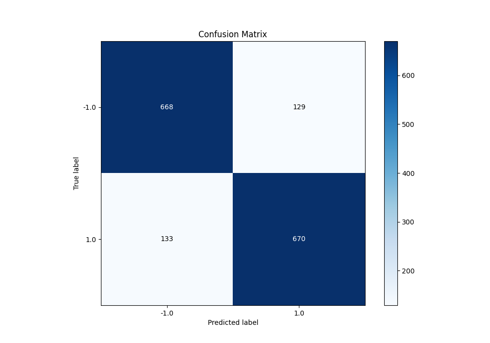
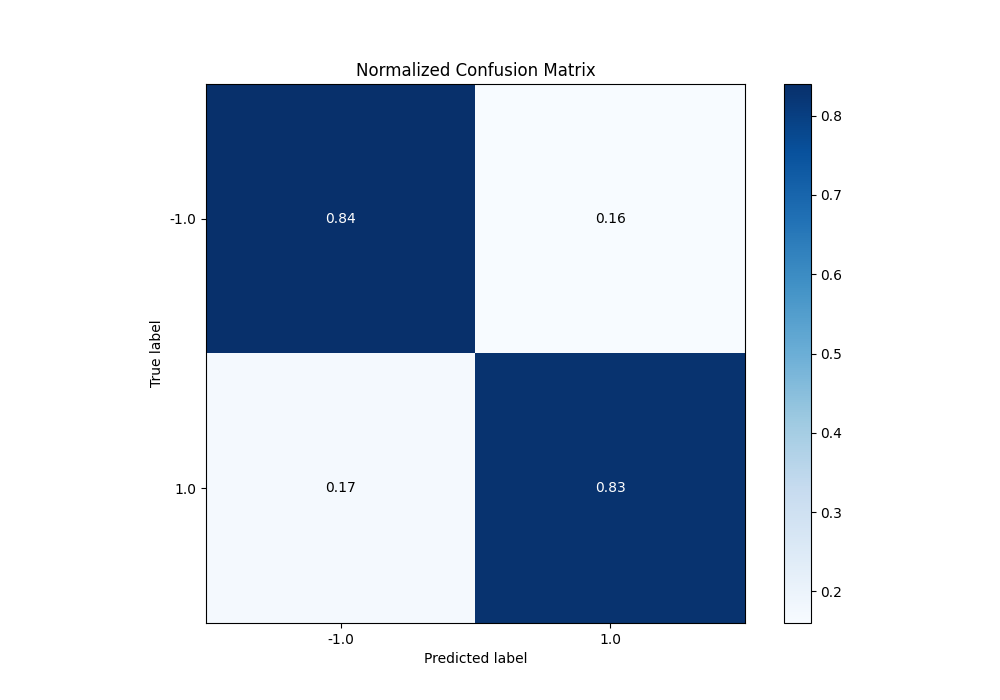
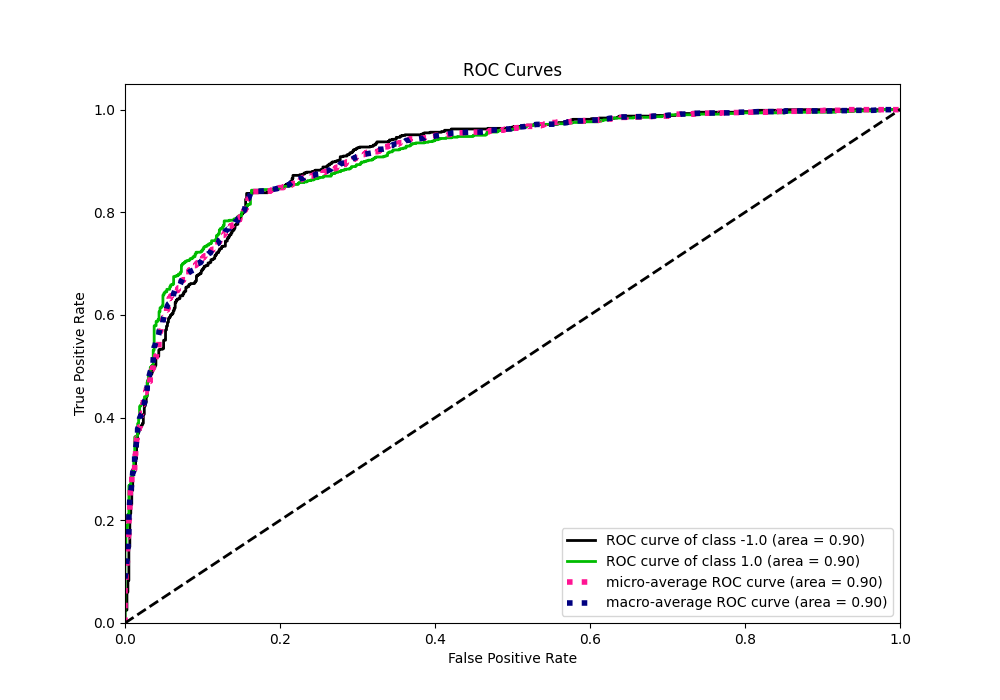
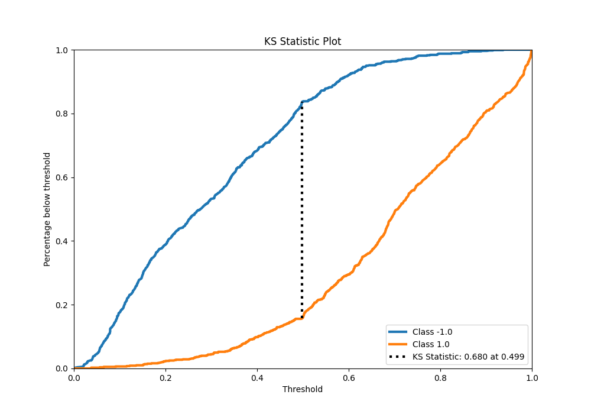
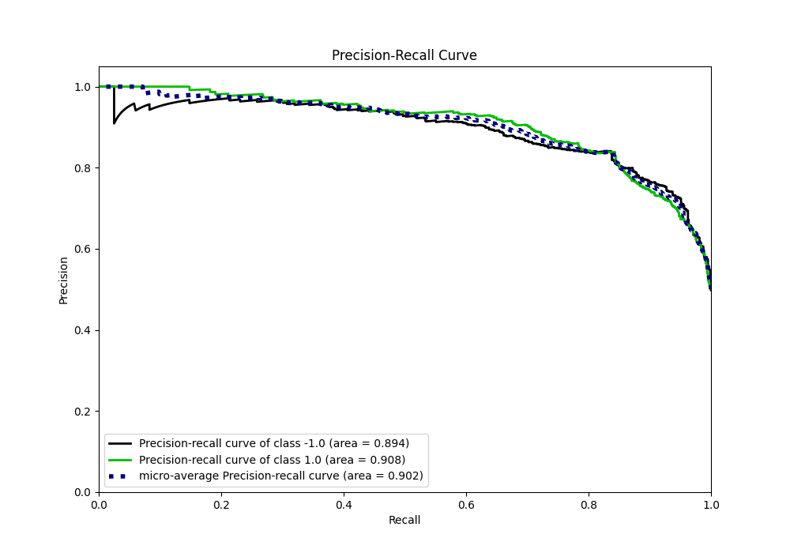
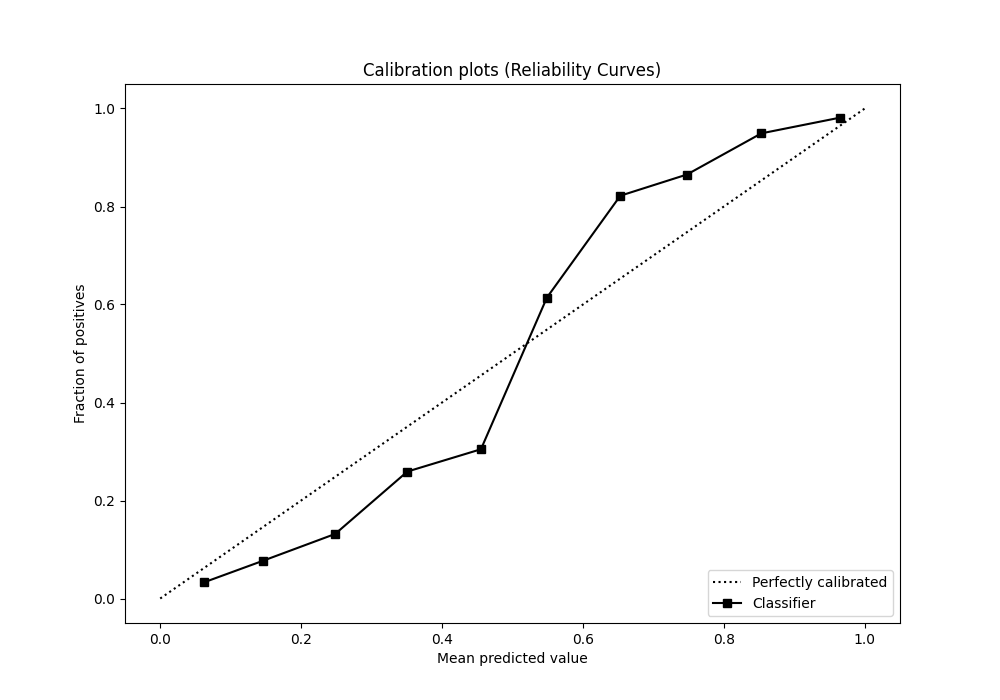
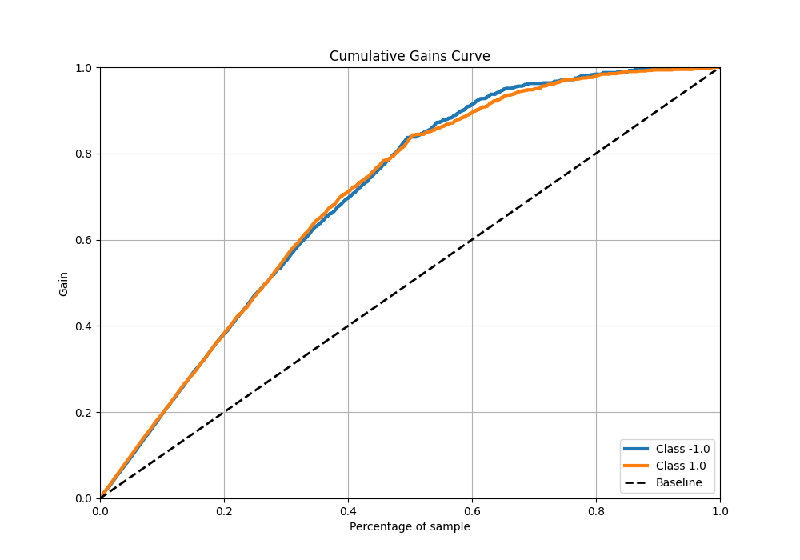
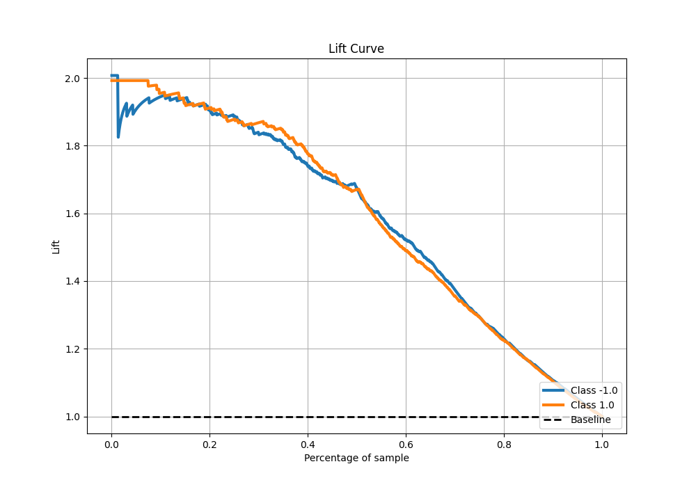

# Summary of 108_RandomForest

[<< Go back](../README.md)

## Random Forest
- **n_jobs**: -1
- **criterion**: entropy
- **max_features**: 0.9
- **min_samples_split**: 40
- **max_depth**: 6
- **eval_metric_name**: f1
- **explain_level**: 0

## Validation
 - **validation_type**: kfold
 - **shuffle**: True
 - **stratify**: True
 - **k_folds**: 5

## Optimized metric
f1

## Training time

31.6 seconds

## Metric details
|           |    score |    threshold |
|:----------|---------:|-------------:|
| logloss   | 0.420534 | nan          |
| auc       | 0.903558 | nan          |
| f1        | 0.836836 |   0.496568   |
| accuracy  | 0.83625  |   0.501839   |
| precision | 1        |   0.944148   |
| recall    | 1        |   0.00296443 |
| mcc       | 0.67251  |   0.501839   |

## Metric details with threshold from accuracy metric
|           |    score |   threshold |
|:----------|---------:|------------:|
| logloss   | 0.420534 |  nan        |
| auc       | 0.903558 |  nan        |
| f1        | 0.836454 |    0.501839 |
| accuracy  | 0.83625  |    0.501839 |
| precision | 0.838548 |    0.501839 |
| recall    | 0.834371 |    0.501839 |
| mcc       | 0.67251  |    0.501839 |

## Confusion matrix (at threshold=0.501839)
|                 |   Predicted as -1.0 |   Predicted as 1.0 |
|:----------------|--------------------:|-------------------:|
| Labeled as -1.0 |                 668 |                129 |
| Labeled as 1.0  |                 133 |                670 |

## Learning curves

## Confusion Matrix

## Normalized Confusion Matrix

## ROC Curve

## Kolmogorov-Smirnov Statistic

## Precision-Recall Curve

## Calibration Curve

## Cumulative Gains Curve

## Lift Curve

[<< Go back](../README.md)
