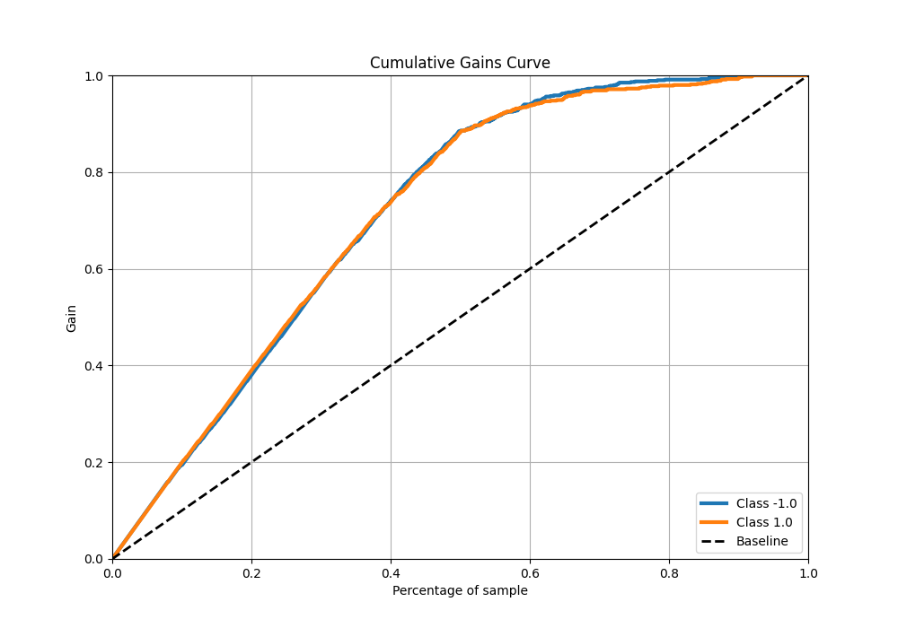

# Summary of 111_CatBoost

[<< Go back](../README.md)

## CatBoost
- **n_jobs**: -1
- **learning_rate**: 0.05
- **depth**: 9
- **rsm**: 1.0
- **loss_function**: Logloss
- **eval_metric**: F1
- **explain_level**: 0

## Validation
 - **validation_type**: kfold
 - **shuffle**: True
 - **stratify**: True
 - **k_folds**: 5

## Optimized metric
f1

## Training time

39.0 seconds

## Metric details
|           |    score |    threshold |
|:----------|---------:|-------------:|
| logloss   | 0.333696 | nan          |
| auc       | 0.935307 | nan          |
| f1        | 0.883895 |   0.502376   |
| accuracy  | 0.88375  |   0.502376   |
| precision | 1        |   0.950842   |
| recall    | 1        |   0.00675737 |
| mcc       | 0.767511 |   0.502376   |

## Metric details with threshold from accuracy metric
|           |    score |   threshold |
|:----------|---------:|------------:|
| logloss   | 0.333696 |  nan        |
| auc       | 0.935307 |  nan        |
| f1        | 0.883895 |    0.502376 |
| accuracy  | 0.88375  |    0.502376 |
| precision | 0.886108 |    0.502376 |
| recall    | 0.881694 |    0.502376 |
| mcc       | 0.767511 |    0.502376 |

## Confusion matrix (at threshold=0.502376)
|                 |   Predicted as -1.0 |   Predicted as 1.0 |
|:----------------|--------------------:|-------------------:|
| Labeled as -1.0 |                 706 |                 91 |
| Labeled as 1.0  |                  95 |                708 |

## Learning curves

## Confusion Matrix

## Normalized Confusion Matrix

## ROC Curve

## Kolmogorov-Smirnov Statistic

## Precision-Recall Curve

## Calibration Curve

## Cumulative Gains Curve

## Lift Curve

[<< Go back](../README.md)
