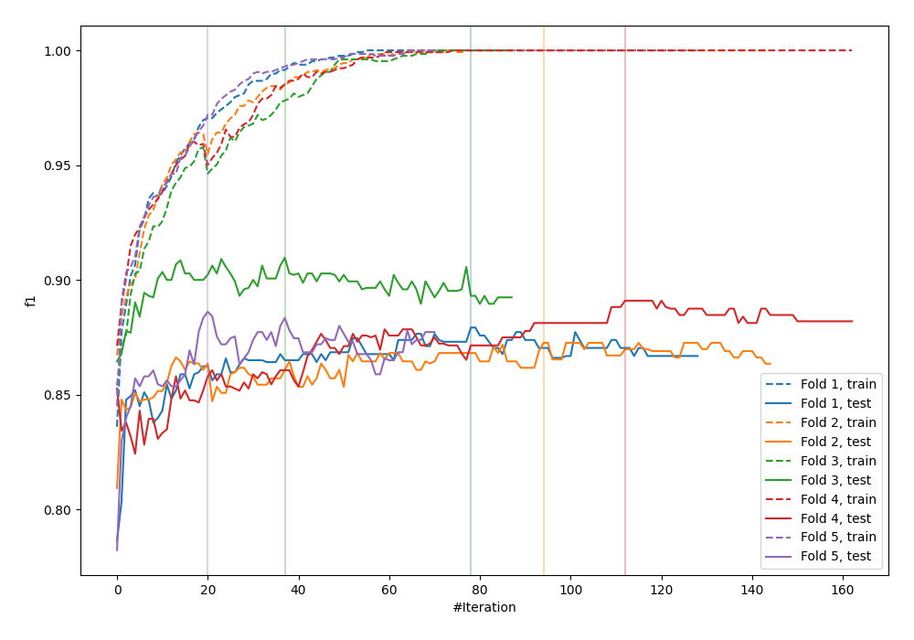

# Summary of 112_CatBoost

[<< Go back](../README.md)

## CatBoost
- **n_jobs**: -1
- **learning_rate**: 0.2
- **depth**: 9
- **rsm**: 1.0
- **loss_function**: Logloss
- **eval_metric**: F1
- **explain_level**: 0

## Validation
 - **validation_type**: kfold
 - **shuffle**: True
 - **stratify**: True
 - **k_folds**: 5

## Optimized metric
f1

## Training time

34.2 seconds

## Metric details
|           |    score |     threshold |
|:----------|---------:|--------------:|
| logloss   | 0.310759 | nan           |
| auc       | 0.940604 | nan           |
| f1        | 0.886392 |   0.50344     |
| accuracy  | 0.88625  |   0.50344     |
| precision | 1        |   0.98532     |
| recall    | 1        |   0.000581662 |
| mcc       | 0.772511 |   0.50344     |

## Metric details with threshold from accuracy metric
|           |    score |   threshold |
|:----------|---------:|------------:|
| logloss   | 0.310759 |   nan       |
| auc       | 0.940604 |   nan       |
| f1        | 0.886392 |     0.50344 |
| accuracy  | 0.88625  |     0.50344 |
| precision | 0.888611 |     0.50344 |
| recall    | 0.884184 |     0.50344 |
| mcc       | 0.772511 |     0.50344 |

## Confusion matrix (at threshold=0.50344)
|                 |   Predicted as -1.0 |   Predicted as 1.0 |
|:----------------|--------------------:|-------------------:|
| Labeled as -1.0 |                 708 |                 89 |
| Labeled as 1.0  |                  93 |                710 |

## Learning curves

## Confusion Matrix

## Normalized Confusion Matrix

## ROC Curve

## Kolmogorov-Smirnov Statistic

## Precision-Recall Curve

## Calibration Curve

## Cumulative Gains Curve

## Lift Curve

[<< Go back](../README.md)
