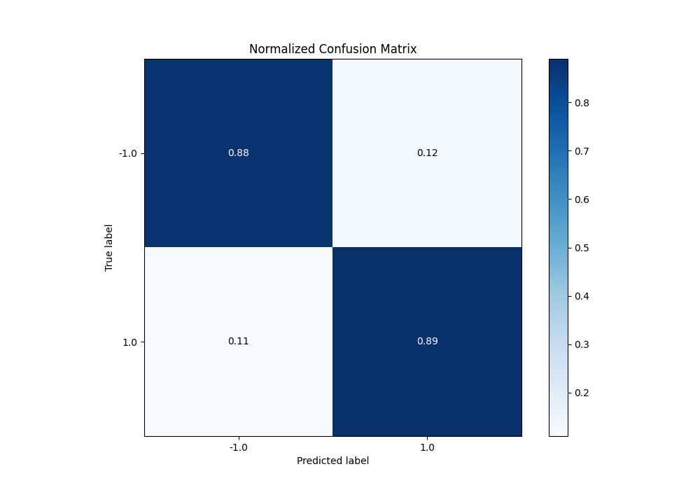

# Summary of 113_CatBoost

[<< Go back](../README.md)

## CatBoost
- **n_jobs**: -1
- **learning_rate**: 0.05
- **depth**: 8
- **rsm**: 1.0
- **loss_function**: Logloss
- **eval_metric**: F1
- **explain_level**: 0

## Validation
 - **validation_type**: kfold
 - **shuffle**: True
 - **stratify**: True
 - **k_folds**: 5

## Optimized metric
f1

## Training time

27.6 seconds

## Metric details
|           |    score |   threshold |
|:----------|---------:|------------:|
| logloss   | 0.346759 | nan         |
| auc       | 0.935496 | nan         |
| f1        | 0.886279 |   0.494624  |
| accuracy  | 0.885    |   0.494624  |
| precision | 1        |   0.977903  |
| recall    | 1        |   0.0129416 |
| mcc       | 0.77007  |   0.494624  |

## Metric details with threshold from accuracy metric
|           |    score |   threshold |
|:----------|---------:|------------:|
| logloss   | 0.346759 |  nan        |
| auc       | 0.935496 |  nan        |
| f1        | 0.886279 |    0.494624 |
| accuracy  | 0.885    |    0.494624 |
| precision | 0.879755 |    0.494624 |
| recall    | 0.892902 |    0.494624 |
| mcc       | 0.77007  |    0.494624 |

## Confusion matrix (at threshold=0.494624)
|                 |   Predicted as -1.0 |   Predicted as 1.0 |
|:----------------|--------------------:|-------------------:|
| Labeled as -1.0 |                 699 |                 98 |
| Labeled as 1.0  |                  86 |                717 |

## Learning curves

## Confusion Matrix

## Normalized Confusion Matrix

## ROC Curve

## Kolmogorov-Smirnov Statistic

## Precision-Recall Curve

## Calibration Curve

## Cumulative Gains Curve

## Lift Curve

[<< Go back](../README.md)
