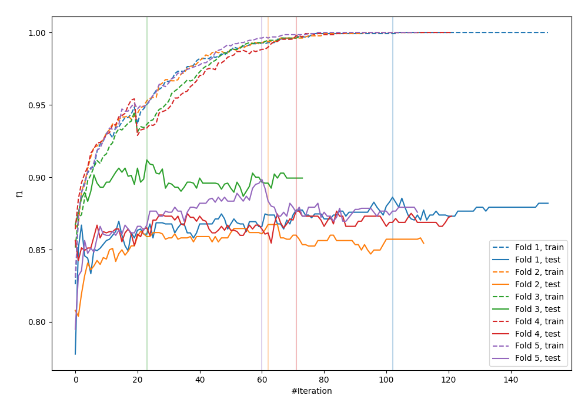
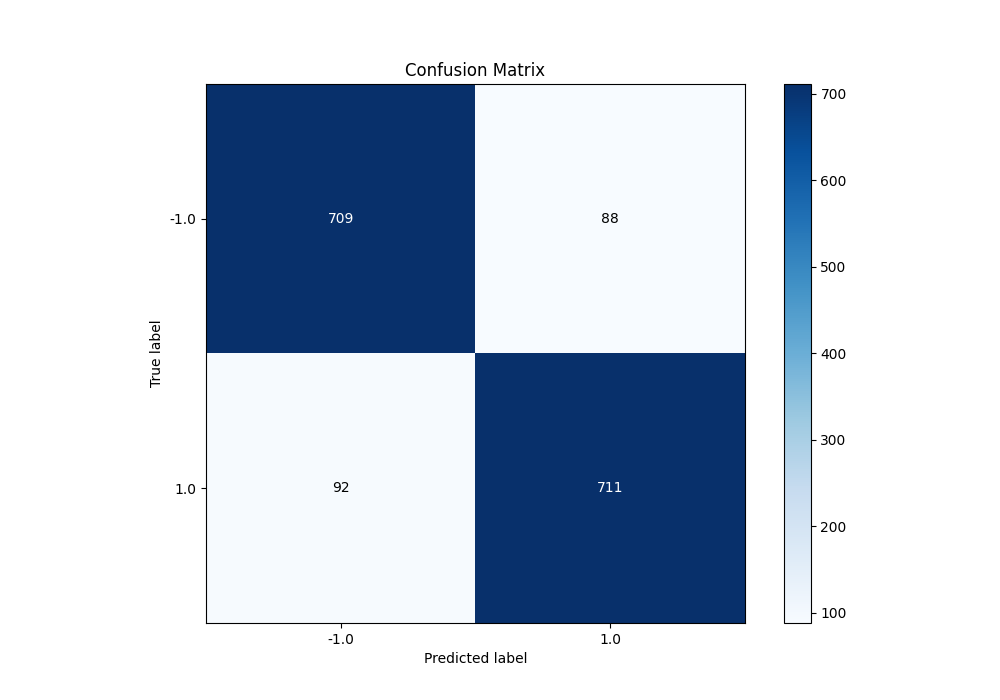
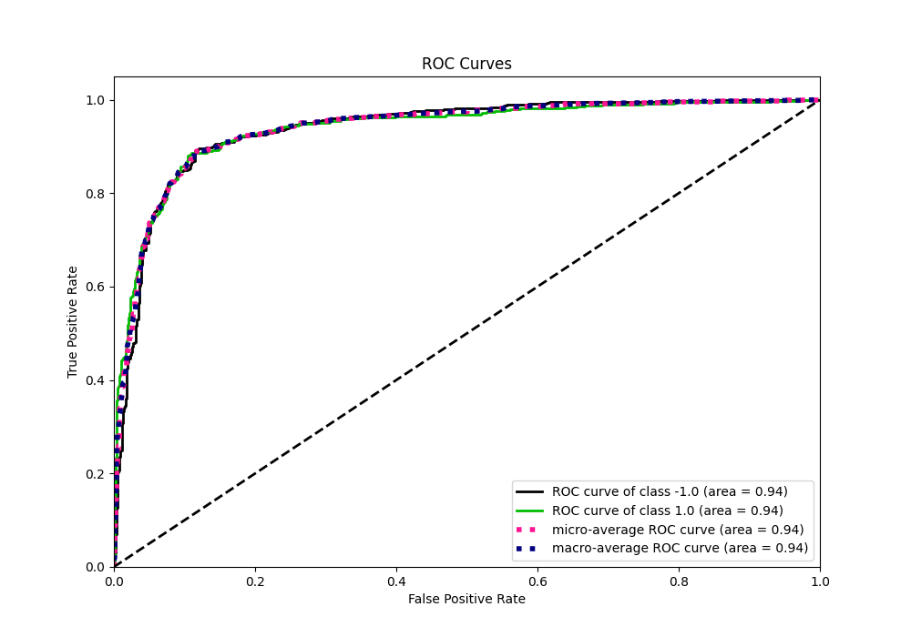
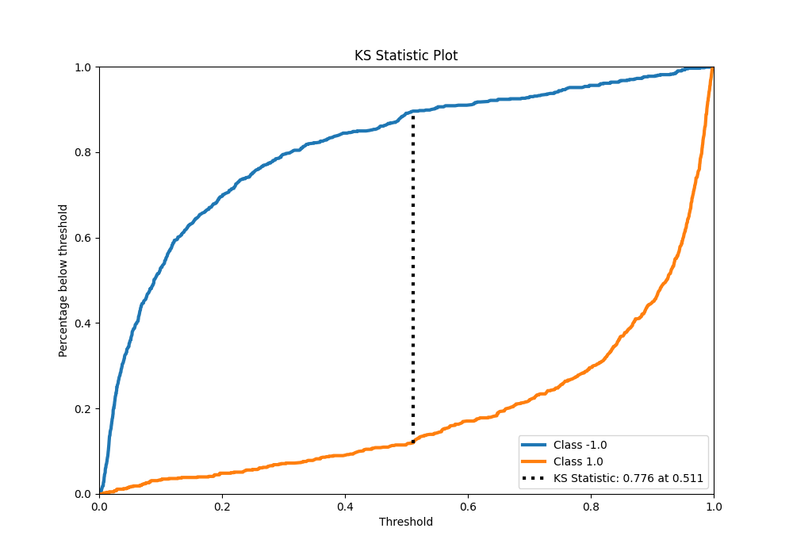
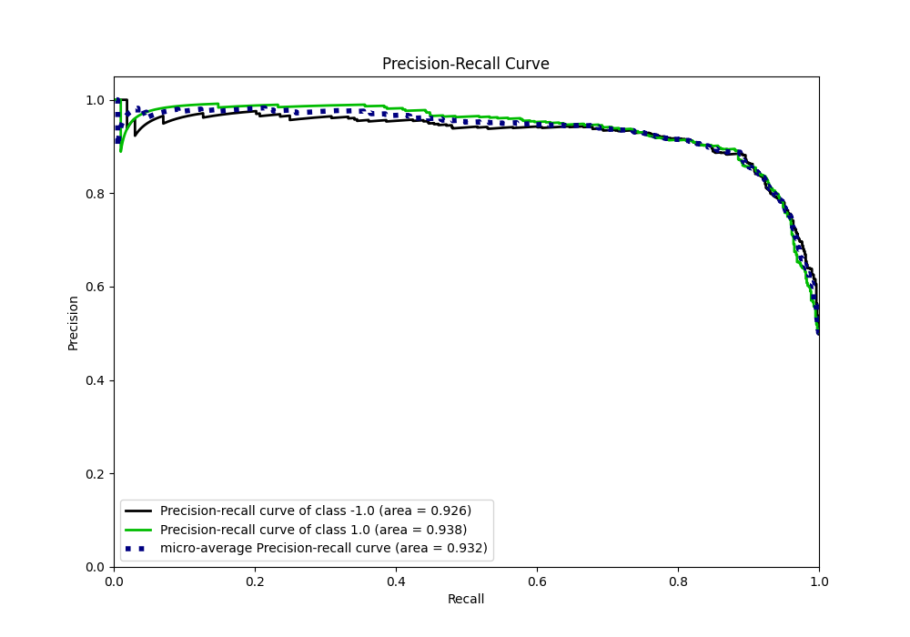
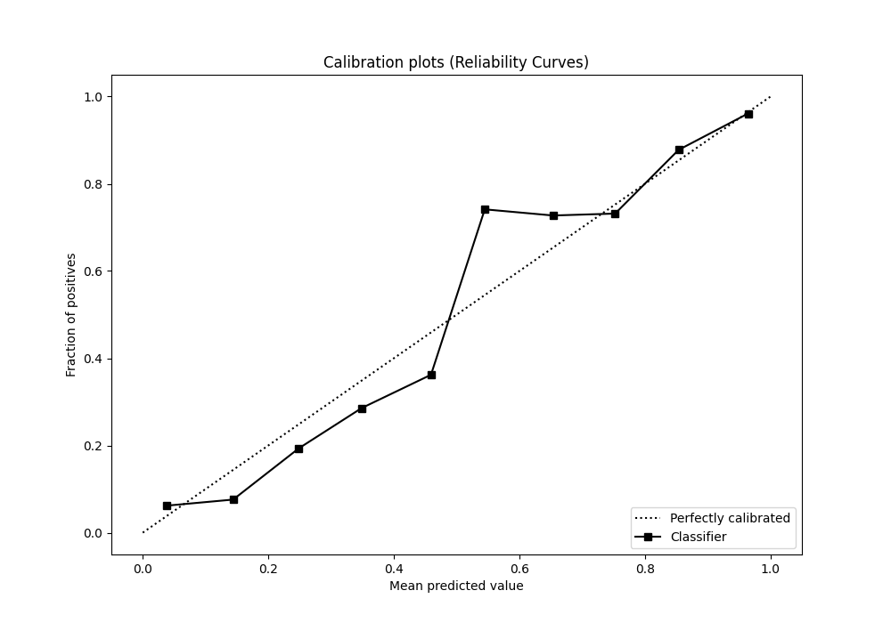
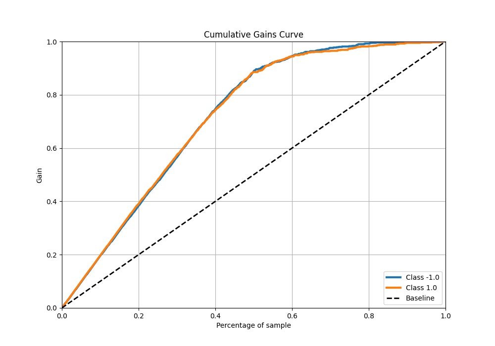
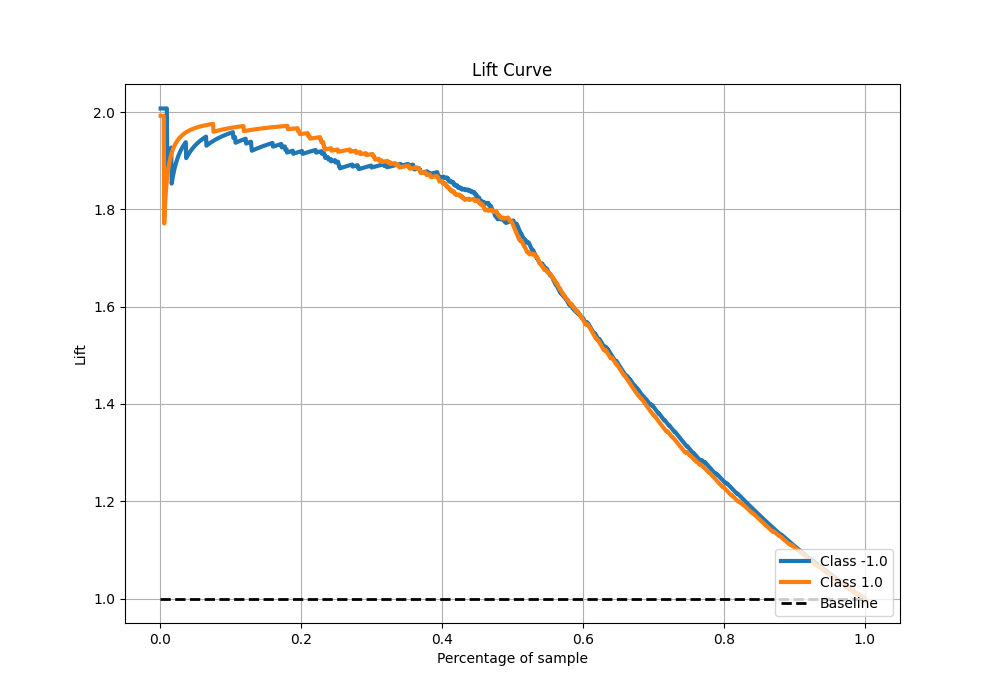

# Summary of 114_CatBoost

[<< Go back](../README.md)

## CatBoost
- **n_jobs**: -1
- **learning_rate**: 0.2
- **depth**: 8
- **rsm**: 1.0
- **loss_function**: Logloss
- **eval_metric**: F1
- **explain_level**: 0

## Validation
 - **validation_type**: kfold
 - **shuffle**: True
 - **stratify**: True
 - **k_folds**: 5

## Optimized metric
f1

## Training time

25.4 seconds

## Metric details
|           |    score |    threshold |
|:----------|---------:|-------------:|
| logloss   | 0.31713  | nan          |
| auc       | 0.937799 | nan          |
| f1        | 0.88764  |   0.49905    |
| accuracy  | 0.8875   |   0.49905    |
| precision | 0.990991 |   0.986478   |
| recall    | 1        |   0.00246116 |
| mcc       | 0.775011 |   0.49905    |

## Metric details with threshold from accuracy metric
|           |    score |   threshold |
|:----------|---------:|------------:|
| logloss   | 0.31713  |   nan       |
| auc       | 0.937799 |   nan       |
| f1        | 0.88764  |     0.49905 |
| accuracy  | 0.8875   |     0.49905 |
| precision | 0.889862 |     0.49905 |
| recall    | 0.88543  |     0.49905 |
| mcc       | 0.775011 |     0.49905 |

## Confusion matrix (at threshold=0.49905)
|                 |   Predicted as -1.0 |   Predicted as 1.0 |
|:----------------|--------------------:|-------------------:|
| Labeled as -1.0 |                 709 |                 88 |
| Labeled as 1.0  |                  92 |                711 |

## Learning curves

## Confusion Matrix

## Normalized Confusion Matrix

## ROC Curve

## Kolmogorov-Smirnov Statistic

## Precision-Recall Curve

## Calibration Curve

## Cumulative Gains Curve

## Lift Curve

[<< Go back](../README.md)
