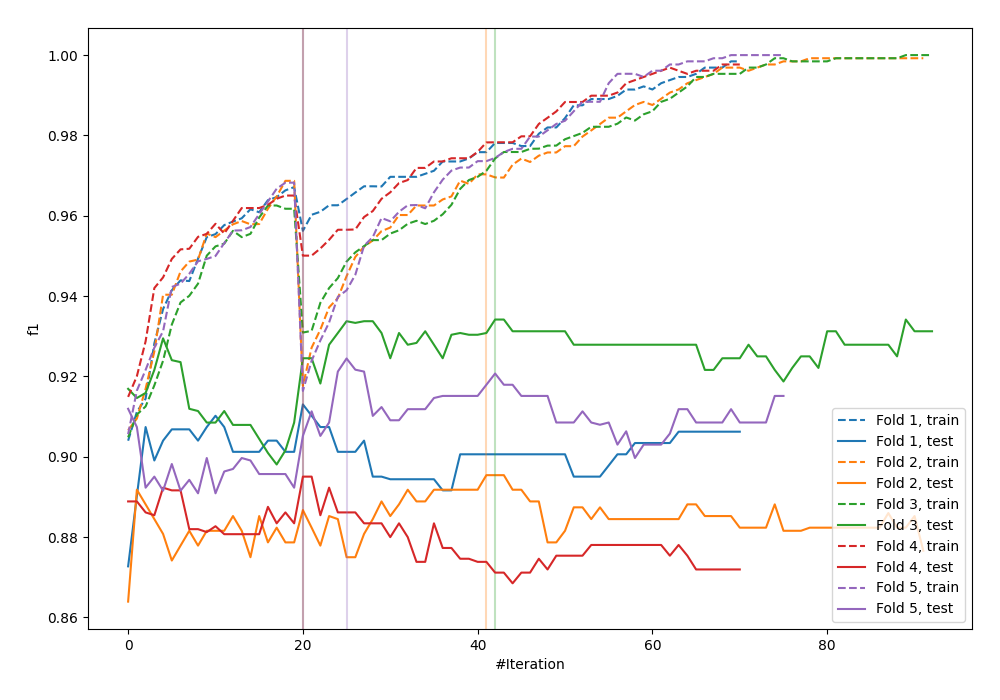
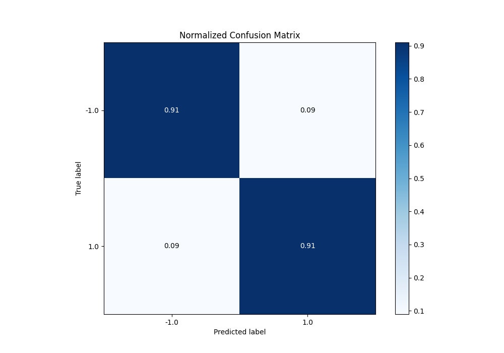
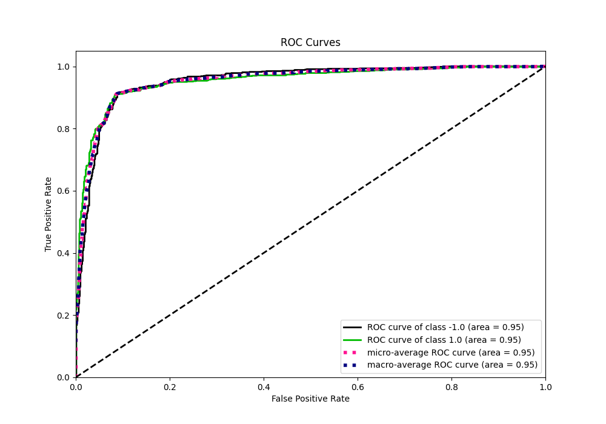
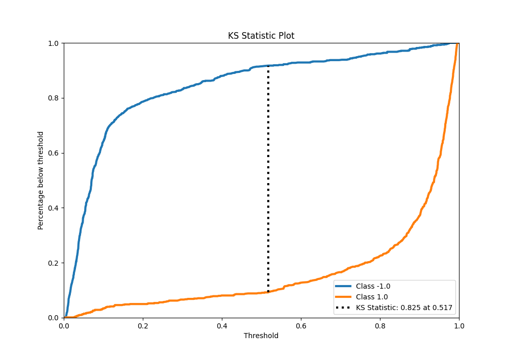
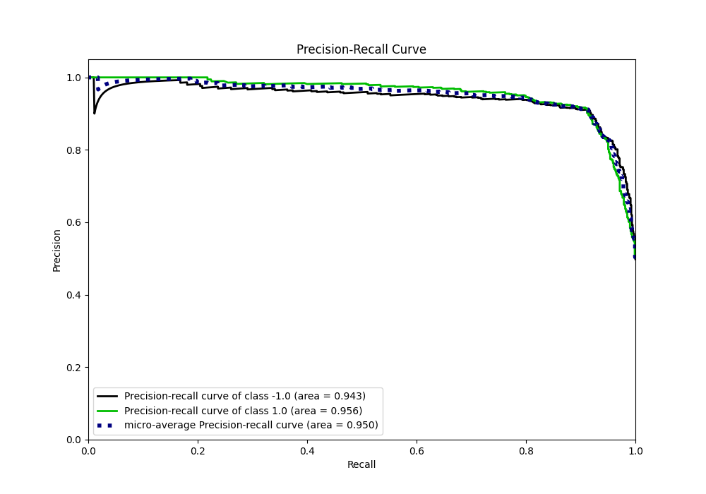
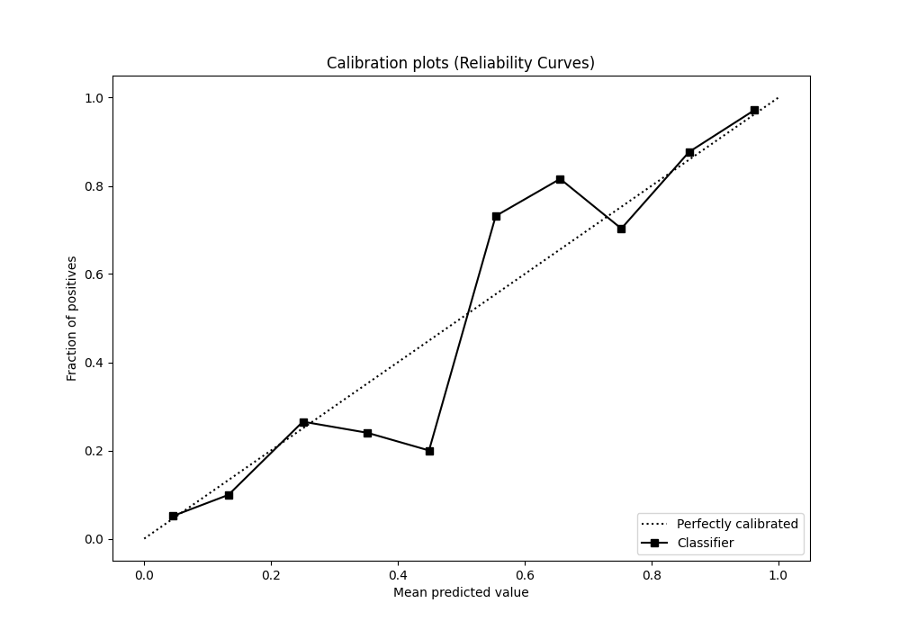
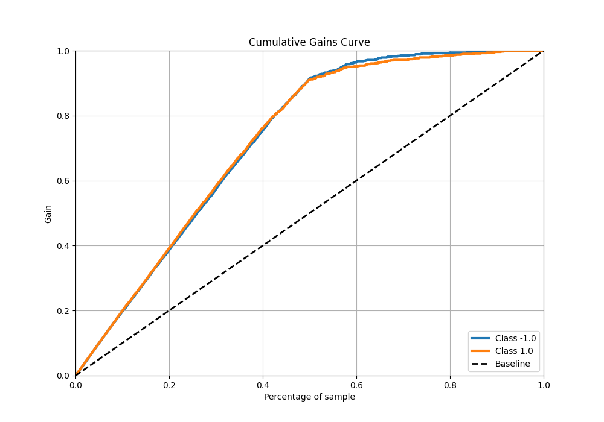
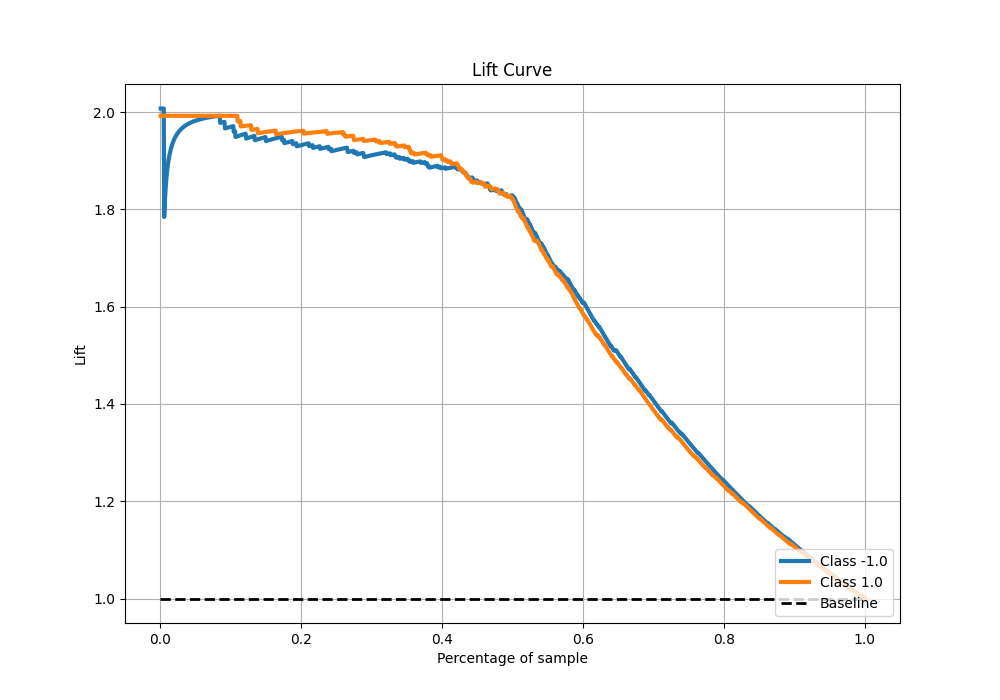

# Summary of 114_CatBoost_Stacked

[<< Go back](../README.md)

## CatBoost
- **n_jobs**: -1
- **learning_rate**: 0.2
- **depth**: 8
- **rsm**: 1.0
- **loss_function**: Logloss
- **eval_metric**: F1
- **explain_level**: 0

## Validation
 - **validation_type**: kfold
 - **shuffle**: True
 - **stratify**: True
 - **k_folds**: 5

## Optimized metric
f1

## Training time

42.9 seconds

## Metric details
|           |    score |    threshold |
|:----------|---------:|-------------:|
| logloss   | 0.267962 | nan          |
| auc       | 0.953067 | nan          |
| f1        | 0.912609 |   0.500325   |
| accuracy  | 0.9125   |   0.500325   |
| precision | 1        |   0.974969   |
| recall    | 1        |   0.00325978 |
| mcc       | 0.825011 |   0.500325   |

## Metric details with threshold from accuracy metric
|           |    score |   threshold |
|:----------|---------:|------------:|
| logloss   | 0.267962 |  nan        |
| auc       | 0.953067 |  nan        |
| f1        | 0.912609 |    0.500325 |
| accuracy  | 0.9125   |    0.500325 |
| precision | 0.914894 |    0.500325 |
| recall    | 0.910336 |    0.500325 |
| mcc       | 0.825011 |    0.500325 |

## Confusion matrix (at threshold=0.500325)
|                 |   Predicted as -1.0 |   Predicted as 1.0 |
|:----------------|--------------------:|-------------------:|
| Labeled as -1.0 |                 729 |                 68 |
| Labeled as 1.0  |                  72 |                731 |

## Learning curves

## Confusion Matrix

## Normalized Confusion Matrix

## ROC Curve

## Kolmogorov-Smirnov Statistic

## Precision-Recall Curve

## Calibration Curve

## Cumulative Gains Curve

## Lift Curve

[<< Go back](../README.md)
