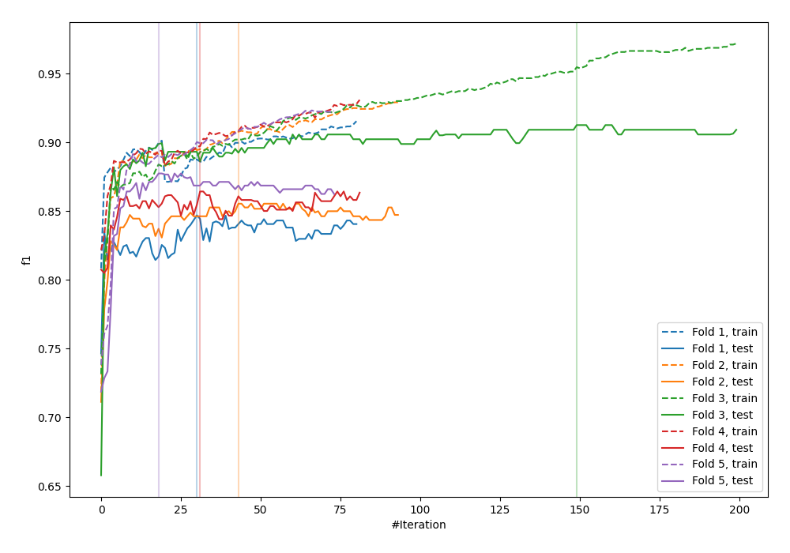
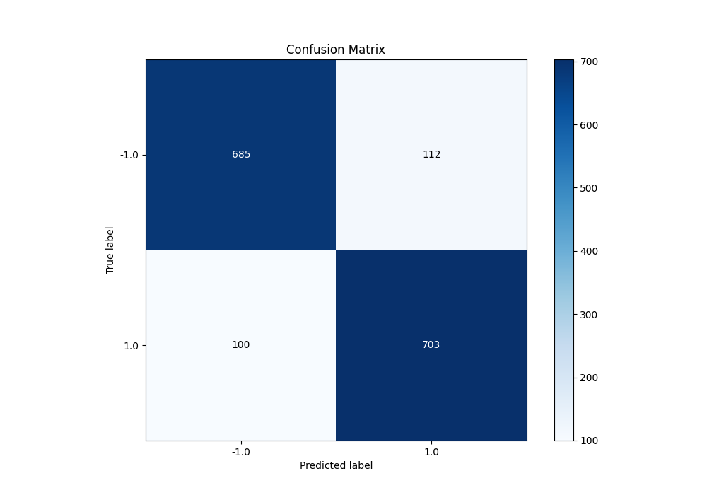
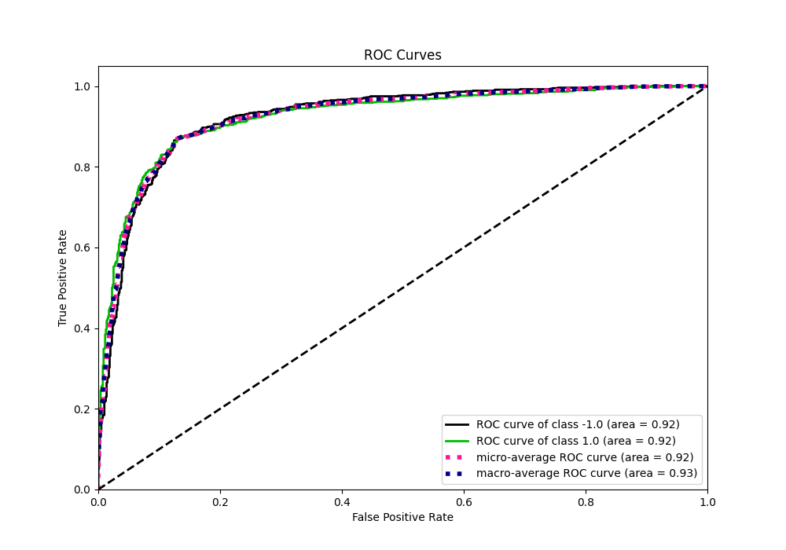
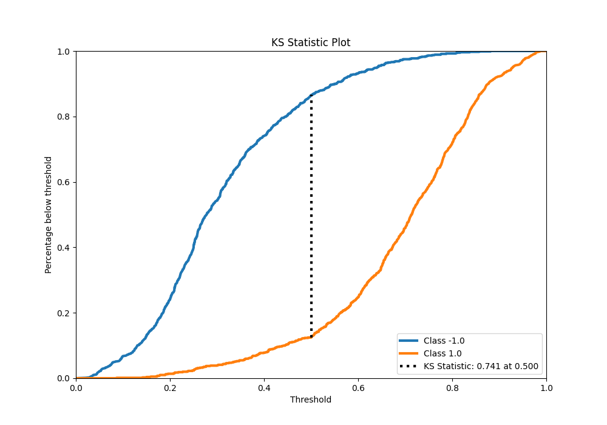
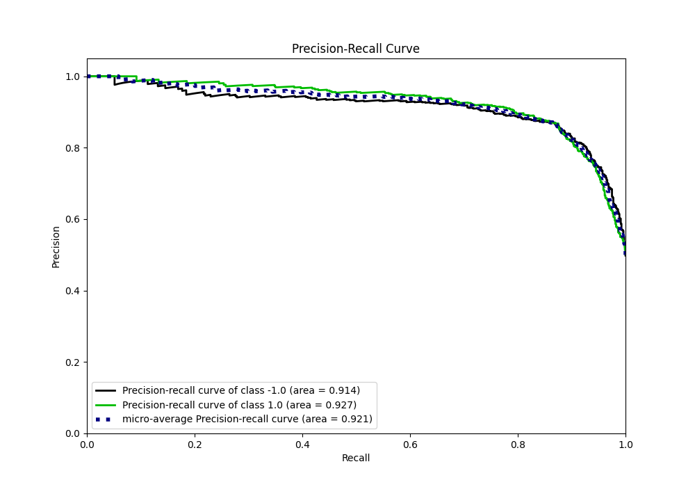
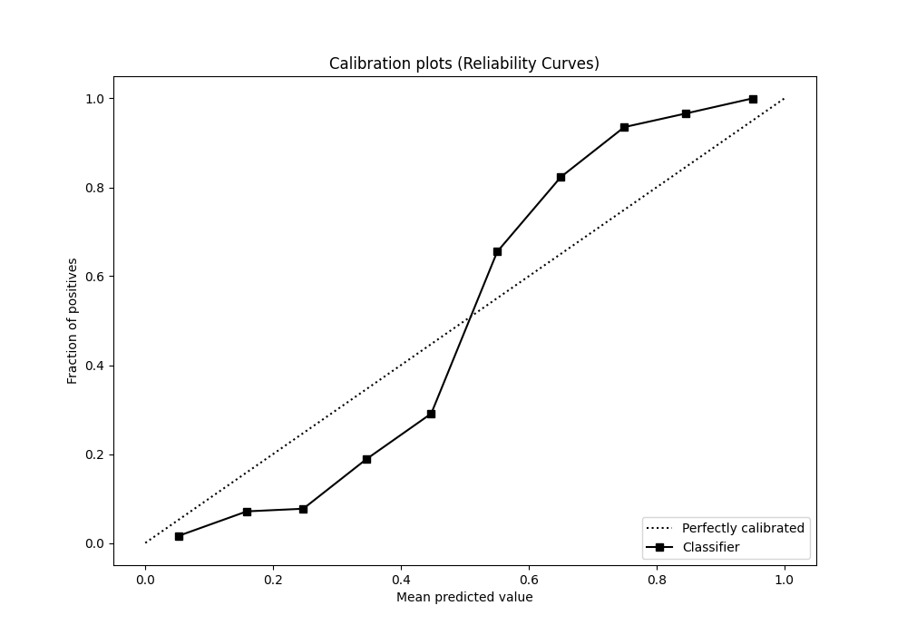
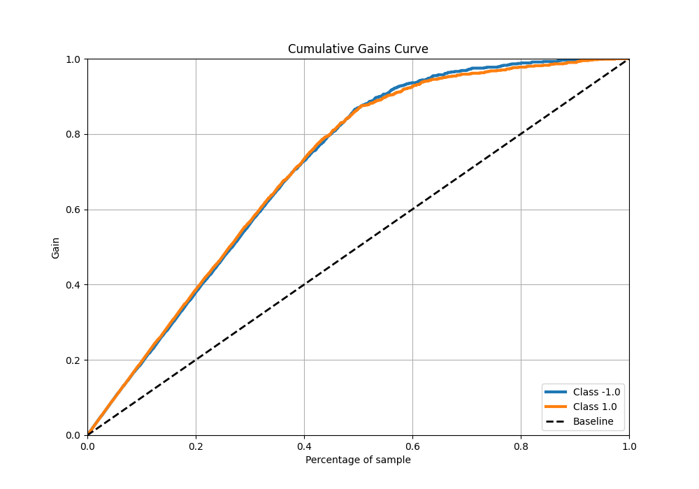
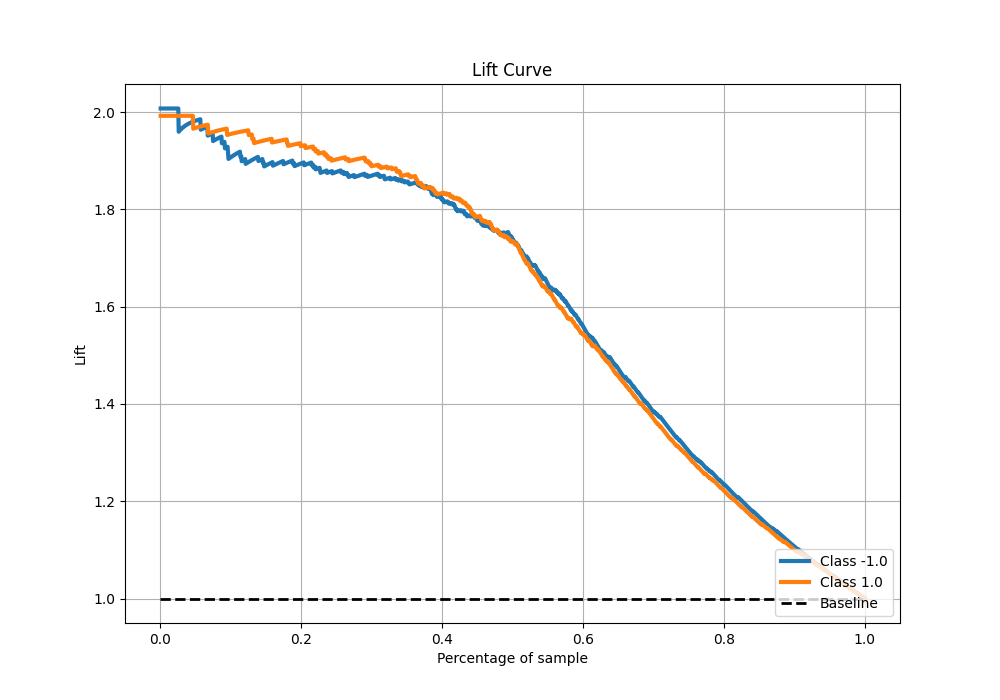

# Summary of 115_CatBoost

[<< Go back](../README.md)

## CatBoost
- **n_jobs**: -1
- **learning_rate**: 0.05
- **depth**: 6
- **rsm**: 1
- **loss_function**: Logloss
- **eval_metric**: F1
- **explain_level**: 0

## Validation
 - **validation_type**: kfold
 - **shuffle**: True
 - **stratify**: True
 - **k_folds**: 5

## Optimized metric
f1

## Training time

19.2 seconds

## Metric details
|           |    score |   threshold |
|:----------|---------:|------------:|
| logloss   | 0.415756 | nan         |
| auc       | 0.924772 | nan         |
| f1        | 0.868974 |   0.497349  |
| accuracy  | 0.8675   |   0.497349  |
| precision | 1        |   0.89868   |
| recall    | 1        |   0.0186094 |
| mcc       | 0.735064 |   0.497349  |

## Metric details with threshold from accuracy metric
|           |    score |   threshold |
|:----------|---------:|------------:|
| logloss   | 0.415756 |  nan        |
| auc       | 0.924772 |  nan        |
| f1        | 0.868974 |    0.497349 |
| accuracy  | 0.8675   |    0.497349 |
| precision | 0.862577 |    0.497349 |
| recall    | 0.875467 |    0.497349 |
| mcc       | 0.735064 |    0.497349 |

## Confusion matrix (at threshold=0.497349)
|                 |   Predicted as -1.0 |   Predicted as 1.0 |
|:----------------|--------------------:|-------------------:|
| Labeled as -1.0 |                 685 |                112 |
| Labeled as 1.0  |                 100 |                703 |

## Learning curves

## Confusion Matrix

## Normalized Confusion Matrix

## ROC Curve

## Kolmogorov-Smirnov Statistic

## Precision-Recall Curve

## Calibration Curve

## Cumulative Gains Curve

## Lift Curve

[<< Go back](../README.md)
