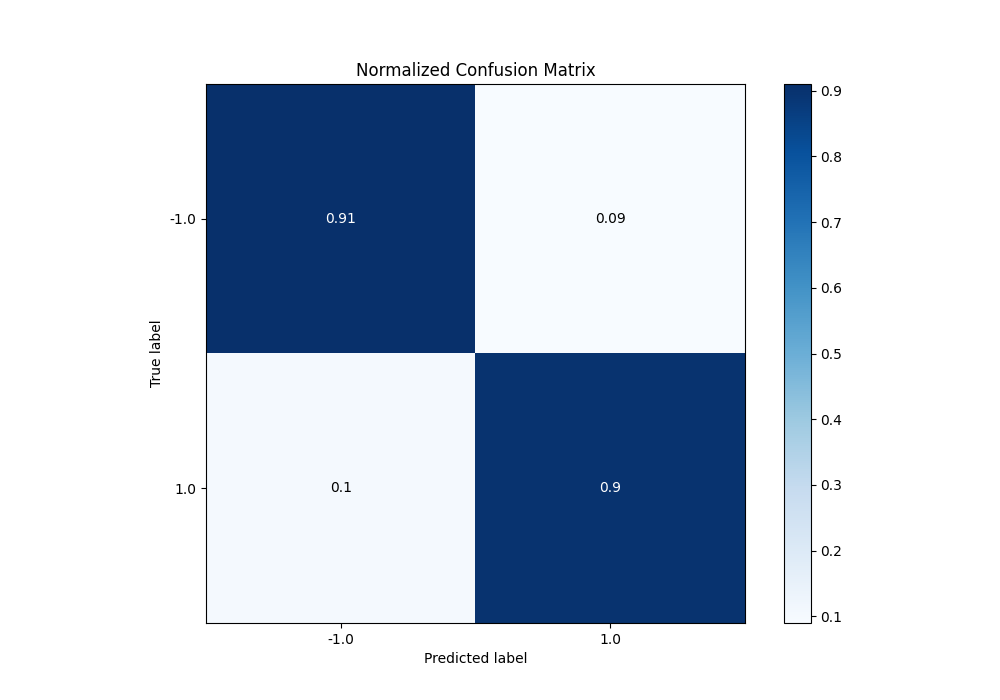

# Summary of 116_CatBoost_Stacked

[<< Go back](../README.md)

## CatBoost
- **n_jobs**: -1
- **learning_rate**: 0.2
- **depth**: 6
- **rsm**: 1
- **loss_function**: Logloss
- **eval_metric**: F1
- **explain_level**: 0

## Validation
 - **validation_type**: kfold
 - **shuffle**: True
 - **stratify**: True
 - **k_folds**: 5

## Optimized metric
f1

## Training time

25.9 seconds

## Metric details
|           |    score |    threshold |
|:----------|---------:|-------------:|
| logloss   | 0.270778 | nan          |
| auc       | 0.953628 | nan          |
| f1        | 0.906367 |   0.492933   |
| accuracy  | 0.90625  |   0.492933   |
| precision | 1        |   0.994094   |
| recall    | 1        |   0.00607004 |
| mcc       | 0.812511 |   0.492933   |

## Metric details with threshold from accuracy metric
|           |    score |   threshold |
|:----------|---------:|------------:|
| logloss   | 0.270778 |  nan        |
| auc       | 0.953628 |  nan        |
| f1        | 0.906367 |    0.492933 |
| accuracy  | 0.90625  |    0.492933 |
| precision | 0.908636 |    0.492933 |
| recall    | 0.90411  |    0.492933 |
| mcc       | 0.812511 |    0.492933 |

## Confusion matrix (at threshold=0.492933)
|                 |   Predicted as -1.0 |   Predicted as 1.0 |
|:----------------|--------------------:|-------------------:|
| Labeled as -1.0 |                 724 |                 73 |
| Labeled as 1.0  |                  77 |                726 |

## Learning curves

## Confusion Matrix

## Normalized Confusion Matrix

## ROC Curve

## Kolmogorov-Smirnov Statistic

## Precision-Recall Curve

## Calibration Curve

## Cumulative Gains Curve

## Lift Curve

[<< Go back](../README.md)
