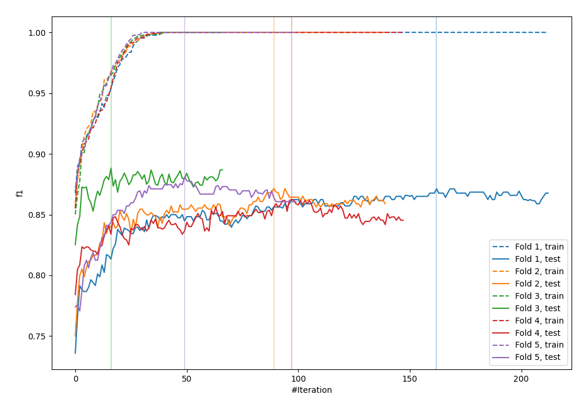
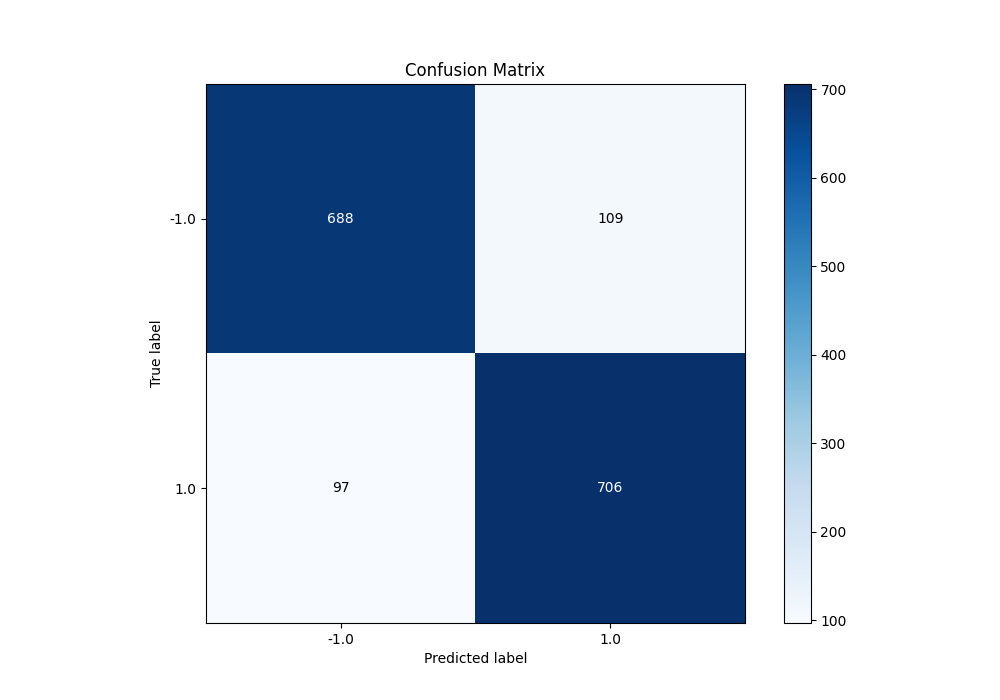
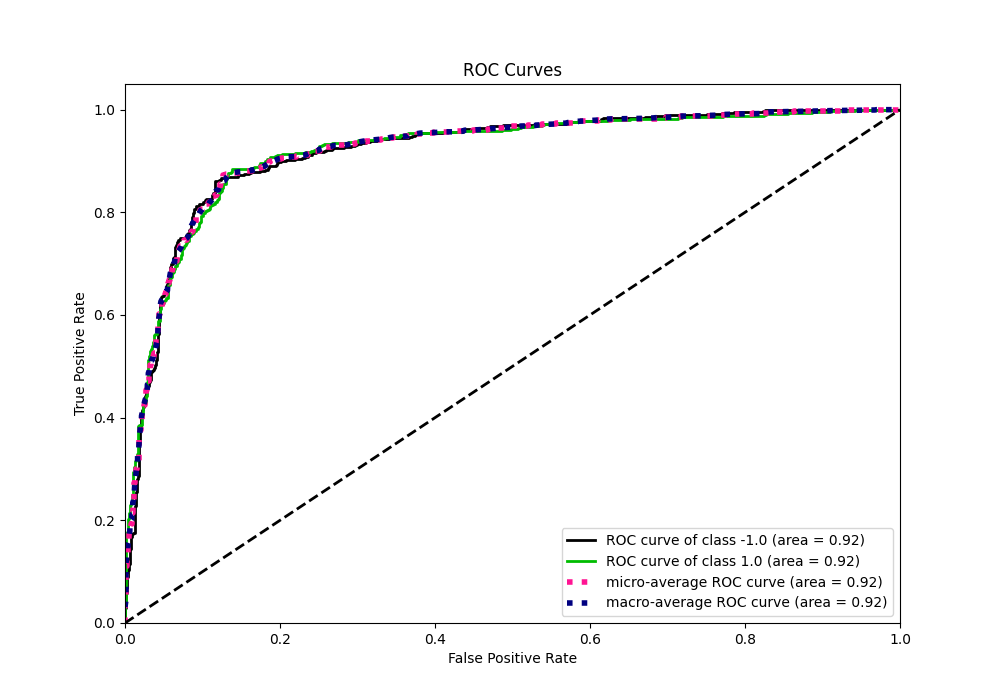
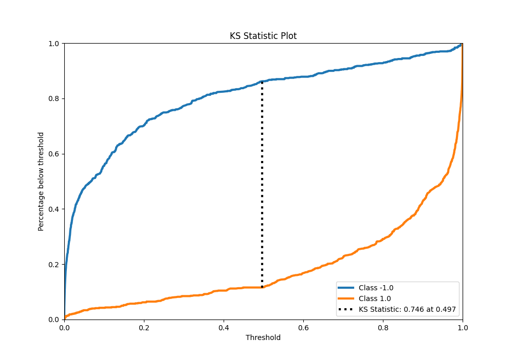
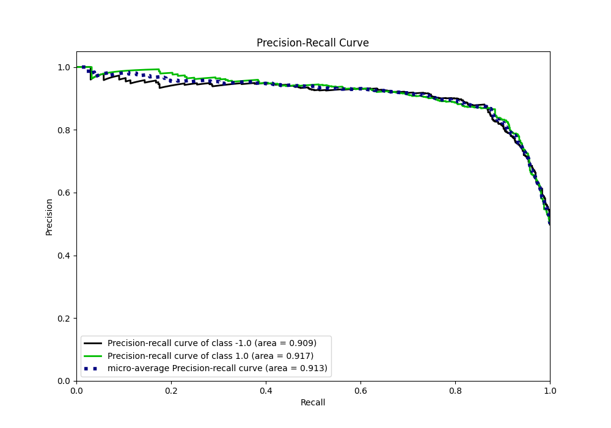
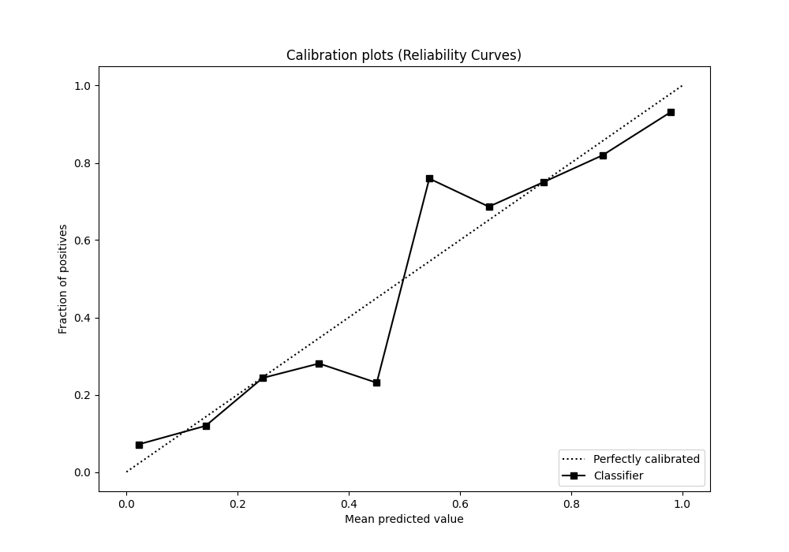
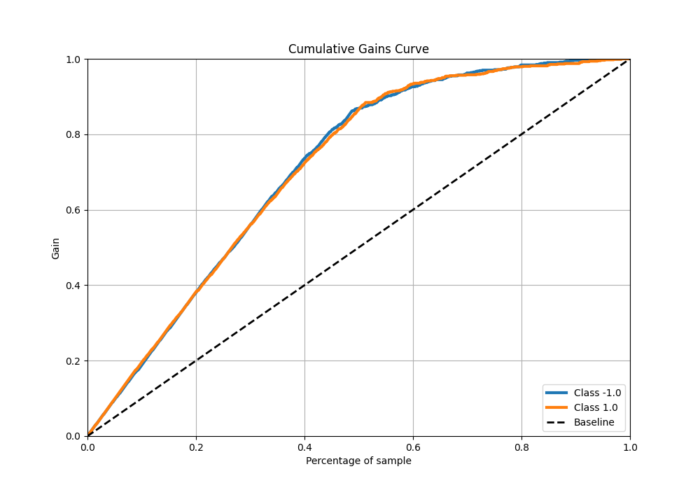
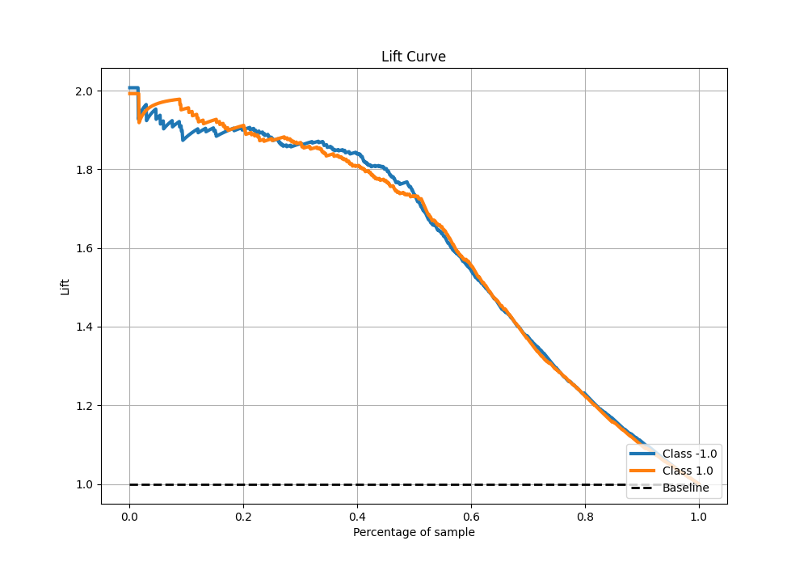

# Summary of 119_LightGBM

[<< Go back](../README.md)

## LightGBM
- **n_jobs**: -1
- **objective**: binary
- **num_leaves**: 63
- **learning_rate**: 0.1
- **feature_fraction**: 0.9
- **bagging_fraction**: 0.8
- **min_data_in_leaf**: 15
- **metric**: custom
- **custom_eval_metric_name**: f1
- **explain_level**: 0

## Validation
 - **validation_type**: kfold
 - **shuffle**: True
 - **stratify**: True
 - **k_folds**: 5

## Optimized metric
f1

## Training time

26.8 seconds

## Metric details
|           |    score |     threshold |
|:----------|---------:|--------------:|
| logloss   | 0.395198 | nan           |
| auc       | 0.919672 | nan           |
| f1        | 0.872682 |   0.507837    |
| accuracy  | 0.87125  |   0.507837    |
| precision | 1        |   0.999977    |
| recall    | 1        |   4.62053e-07 |
| mcc       | 0.742565 |   0.507837    |

## Metric details with threshold from accuracy metric
|           |    score |   threshold |
|:----------|---------:|------------:|
| logloss   | 0.395198 |  nan        |
| auc       | 0.919672 |  nan        |
| f1        | 0.872682 |    0.507837 |
| accuracy  | 0.87125  |    0.507837 |
| precision | 0.866258 |    0.507837 |
| recall    | 0.879203 |    0.507837 |
| mcc       | 0.742565 |    0.507837 |

## Confusion matrix (at threshold=0.507837)
|                 |   Predicted as -1.0 |   Predicted as 1.0 |
|:----------------|--------------------:|-------------------:|
| Labeled as -1.0 |                 688 |                109 |
| Labeled as 1.0  |                  97 |                706 |

## Learning curves

## Confusion Matrix

## Normalized Confusion Matrix

## ROC Curve

## Kolmogorov-Smirnov Statistic

## Precision-Recall Curve

## Calibration Curve

## Cumulative Gains Curve

## Lift Curve

[<< Go back](../README.md)
