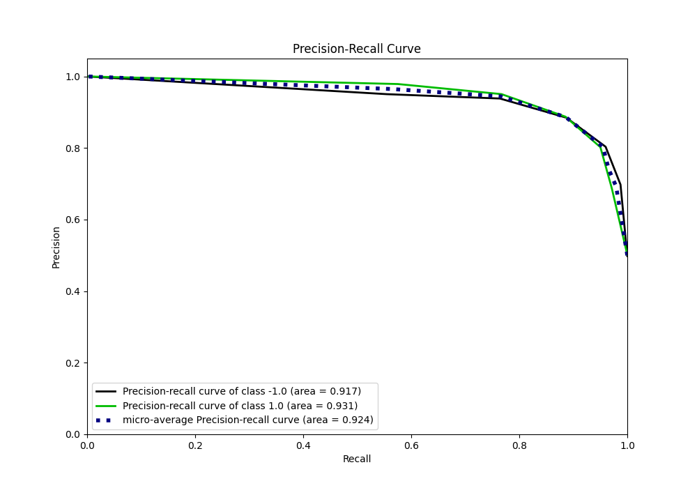

# Summary of 11_Default_NearestNeighbors

[<< Go back](../README.md)

## k-Nearest Neighbors (Nearest Neighbors)
- **n_jobs**: -1
- **n_neighbors**: 5
- **weights**: uniform
- **explain_level**: 0

## Validation
 - **validation_type**: kfold
 - **shuffle**: True
 - **stratify**: True
 - **k_folds**: 5

## Optimized metric
f1

## Training time

6.3 seconds

## Metric details
|           |    score |   threshold |
|:----------|---------:|------------:|
| logloss   | 0.493557 |       nan   |
| auc       | 0.943077 |       nan   |
| f1        | 0.886534 |         0.4 |
| accuracy  | 0.88625  |         0.4 |
| precision | 0.978814 |         0.8 |
| recall    | 0.971357 |         0   |
| mcc       | 0.772501 |         0.4 |

## Metric details with threshold from accuracy metric
|           |    score |   threshold |
|:----------|---------:|------------:|
| logloss   | 0.493557 |       nan   |
| auc       | 0.943077 |       nan   |
| f1        | 0.886534 |         0.4 |
| accuracy  | 0.88625  |         0.4 |
| precision | 0.88764  |         0.4 |
| recall    | 0.88543  |         0.4 |
| mcc       | 0.772501 |         0.4 |

## Confusion matrix (at threshold=0.4)
|                 |   Predicted as -1.0 |   Predicted as 1.0 |
|:----------------|--------------------:|-------------------:|
| Labeled as -1.0 |                 707 |                 90 |
| Labeled as 1.0  |                  92 |                711 |

## Learning curves

## Confusion Matrix

## Normalized Confusion Matrix

## ROC Curve

## Kolmogorov-Smirnov Statistic

## Precision-Recall Curve

## Calibration Curve

## Cumulative Gains Curve

## Lift Curve

[<< Go back](../README.md)
