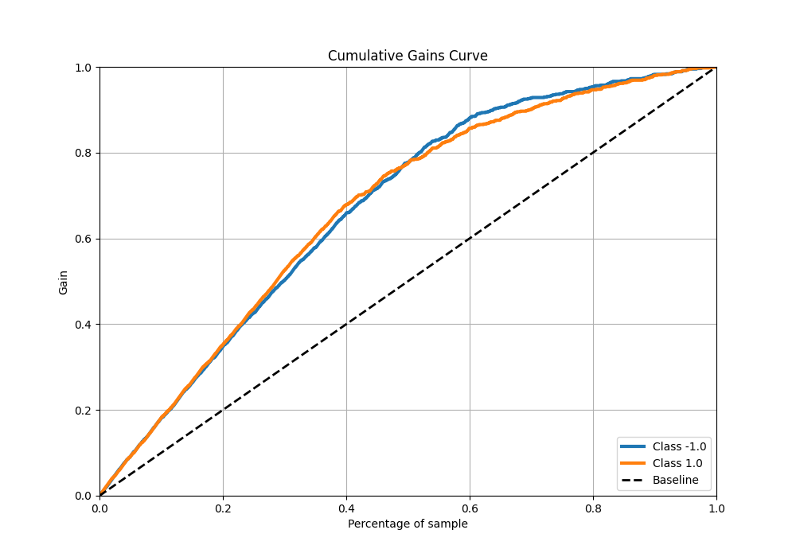

# Summary of 13_Xgboost

[<< Go back](../README.md)

## Extreme Gradient Boosting (Xgboost)
- **n_jobs**: -1
- **objective**: binary:logistic
- **eta**: 0.15
- **max_depth**: 6
- **min_child_weight**: 25
- **subsample**: 0.5
- **colsample_bytree**: 0.5
- **eval_metric**: f1
- **explain_level**: 0

## Validation
 - **validation_type**: kfold
 - **shuffle**: True
 - **stratify**: True
 - **k_folds**: 5

## Optimized metric
f1

## Training time

22.9 seconds

## Metric details
|           |    score |    threshold |
|:----------|---------:|-------------:|
| logloss   | 0.501612 | nan          |
| auc       | 0.841088 | nan          |
| f1        | 0.780931 |   0.394872   |
| accuracy  | 0.785    |   0.516681   |
| precision | 1        |   0.95811    |
| recall    | 1        |   0.00650863 |
| mcc       | 0.572201 |   0.529756   |

## Metric details with threshold from accuracy metric
|           |    score |   threshold |
|:----------|---------:|------------:|
| logloss   | 0.501612 |  nan        |
| auc       | 0.841088 |  nan        |
| f1        | 0.778636 |    0.516681 |
| accuracy  | 0.785    |    0.516681 |
| precision | 0.805593 |    0.516681 |
| recall    | 0.753425 |    0.516681 |
| mcc       | 0.571306 |    0.516681 |

## Confusion matrix (at threshold=0.516681)
|                 |   Predicted as -1.0 |   Predicted as 1.0 |
|:----------------|--------------------:|-------------------:|
| Labeled as -1.0 |                 651 |                146 |
| Labeled as 1.0  |                 198 |                605 |

## Learning curves

## Confusion Matrix

## Normalized Confusion Matrix

## ROC Curve

## Kolmogorov-Smirnov Statistic

## Precision-Recall Curve

## Calibration Curve

## Cumulative Gains Curve

## Lift Curve

[<< Go back](../README.md)
