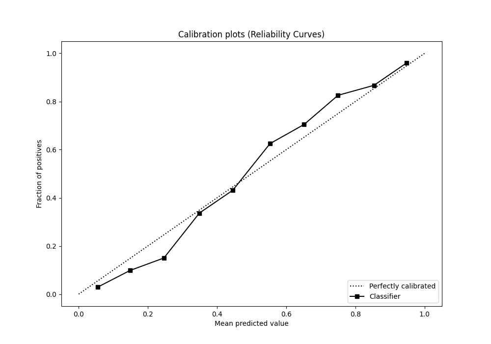

# Summary of 14_Xgboost

[<< Go back](../README.md)

## Extreme Gradient Boosting (Xgboost)
- **n_jobs**: -1
- **objective**: binary:logistic
- **eta**: 0.05
- **max_depth**: 9
- **min_child_weight**: 10
- **subsample**: 0.8
- **colsample_bytree**: 0.6
- **eval_metric**: f1
- **explain_level**: 0

## Validation
 - **validation_type**: kfold
 - **shuffle**: True
 - **stratify**: True
 - **k_folds**: 5

## Optimized metric
f1

## Training time

26.2 seconds

## Metric details
|           |    score |   threshold |
|:----------|---------:|------------:|
| logloss   | 0.379569 | nan         |
| auc       | 0.914452 | nan         |
| f1        | 0.84994  |   0.424755  |
| accuracy  | 0.84625  |   0.512589  |
| precision | 1        |   0.974031  |
| recall    | 1        |   0.0047417 |
| mcc       | 0.692741 |   0.512589  |

## Metric details with threshold from accuracy metric
|           |    score |   threshold |
|:----------|---------:|------------:|
| logloss   | 0.379569 |  nan        |
| auc       | 0.914452 |  nan        |
| f1        | 0.844893 |    0.512589 |
| accuracy  | 0.84625  |    0.512589 |
| precision | 0.855683 |    0.512589 |
| recall    | 0.834371 |    0.512589 |
| mcc       | 0.692741 |    0.512589 |

## Confusion matrix (at threshold=0.512589)
|                 |   Predicted as -1.0 |   Predicted as 1.0 |
|:----------------|--------------------:|-------------------:|
| Labeled as -1.0 |                 684 |                113 |
| Labeled as 1.0  |                 133 |                670 |

## Learning curves

## Confusion Matrix

## Normalized Confusion Matrix

## ROC Curve

## Kolmogorov-Smirnov Statistic

## Precision-Recall Curve

## Calibration Curve

## Cumulative Gains Curve

## Lift Curve

[<< Go back](../README.md)
