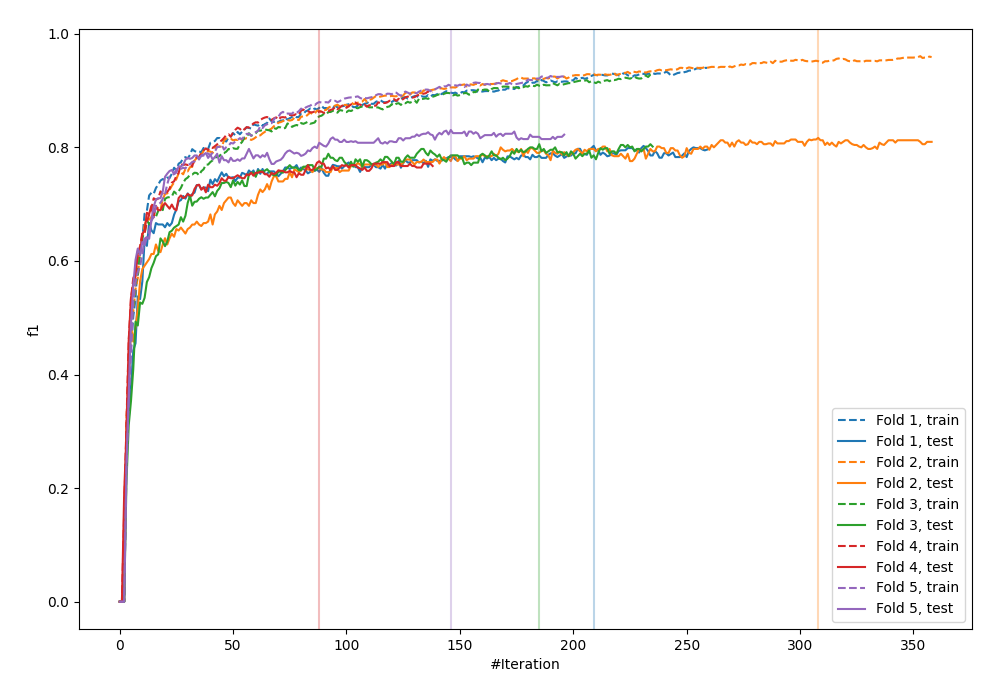
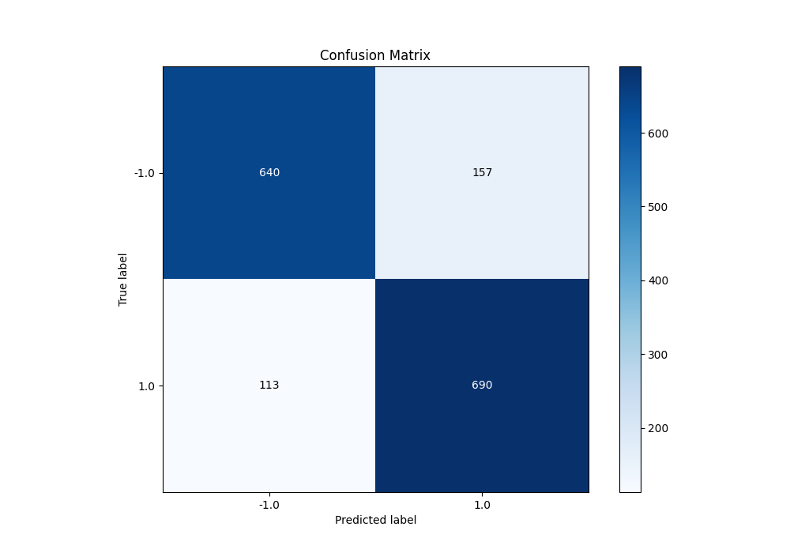
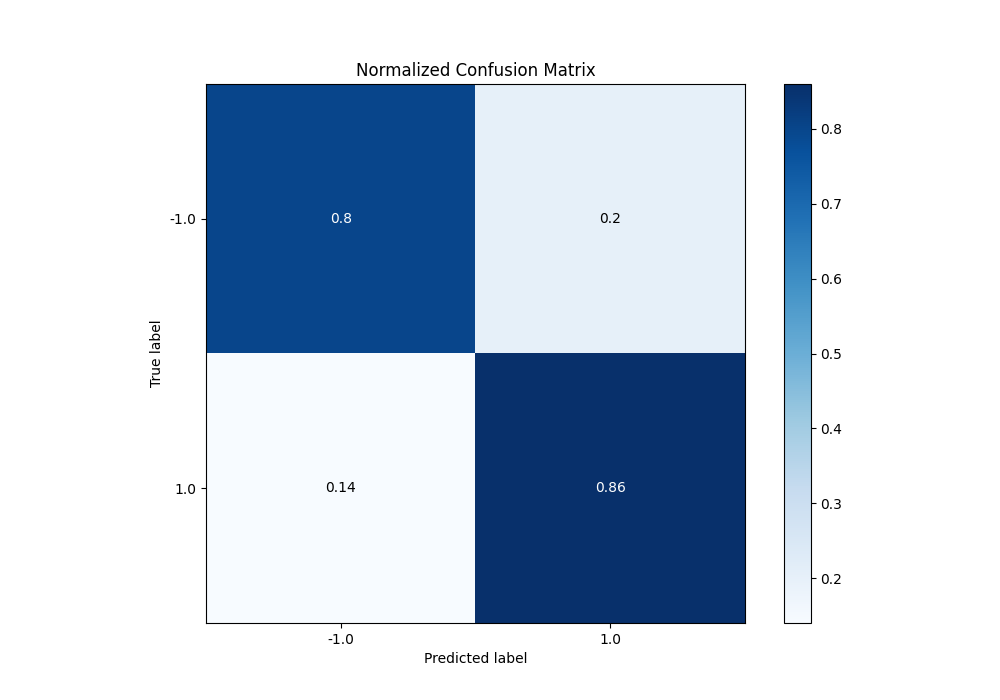
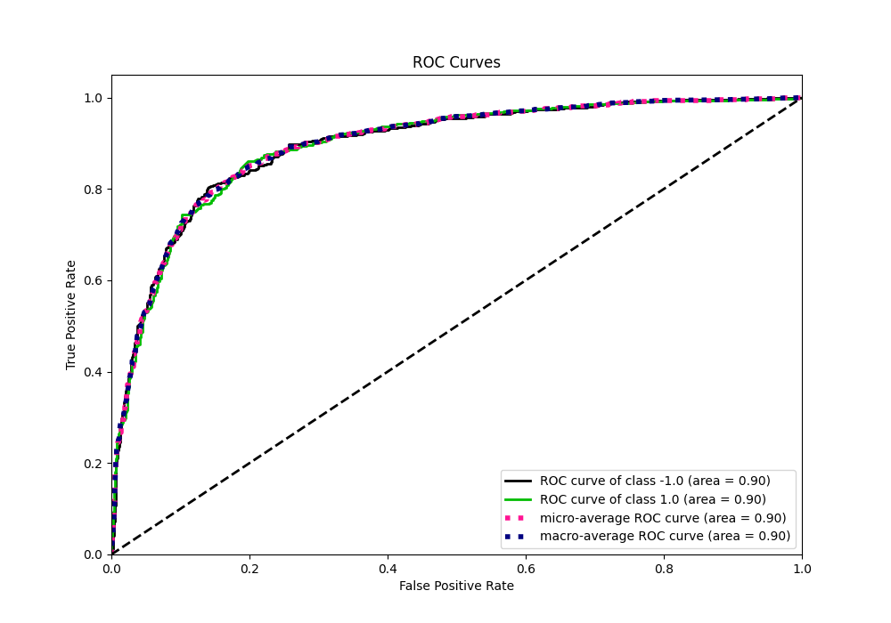
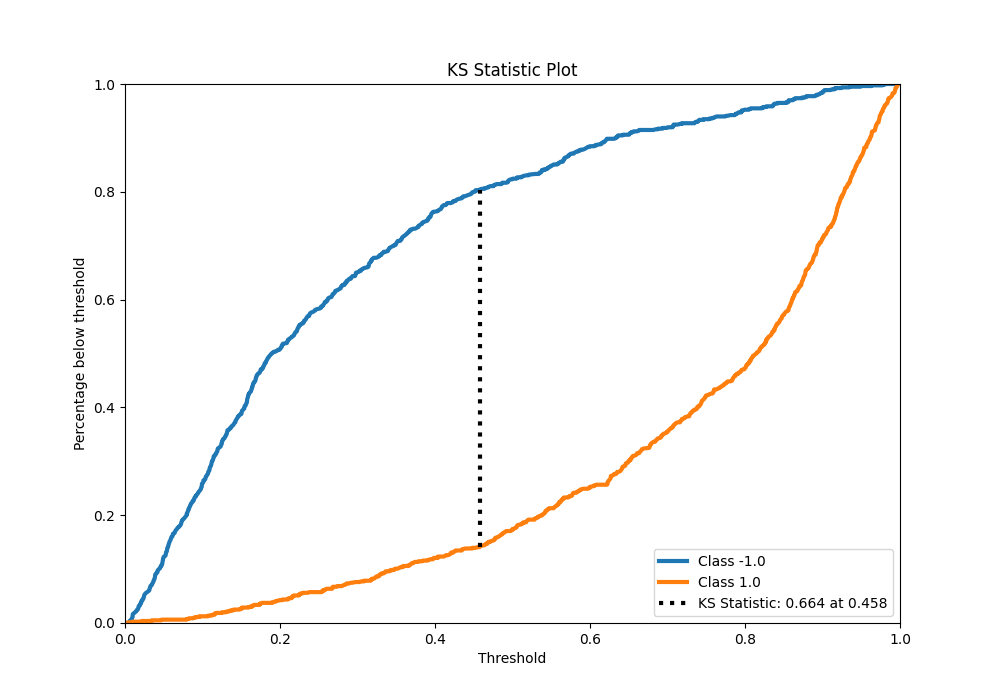
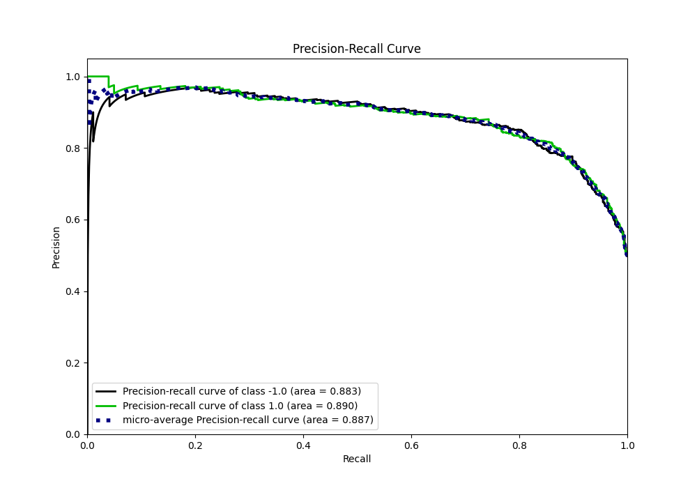
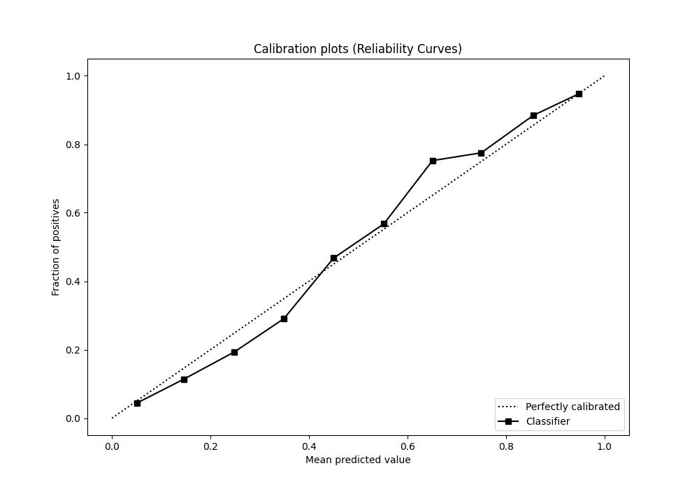
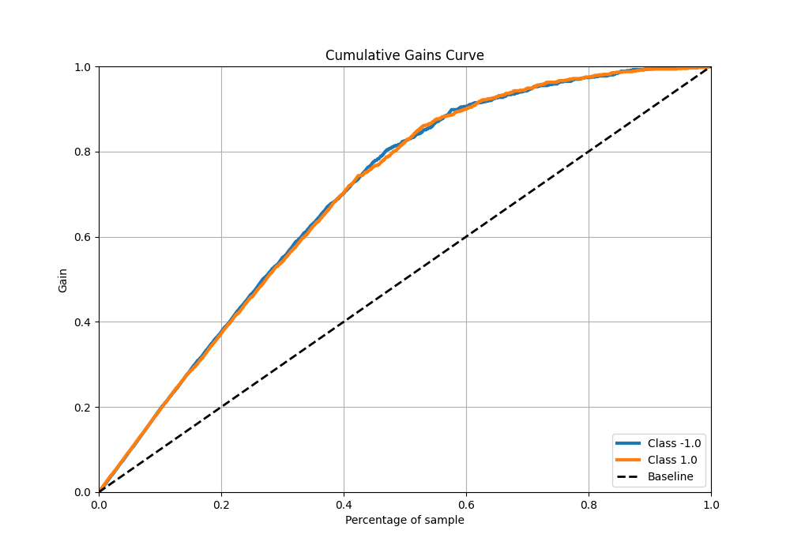
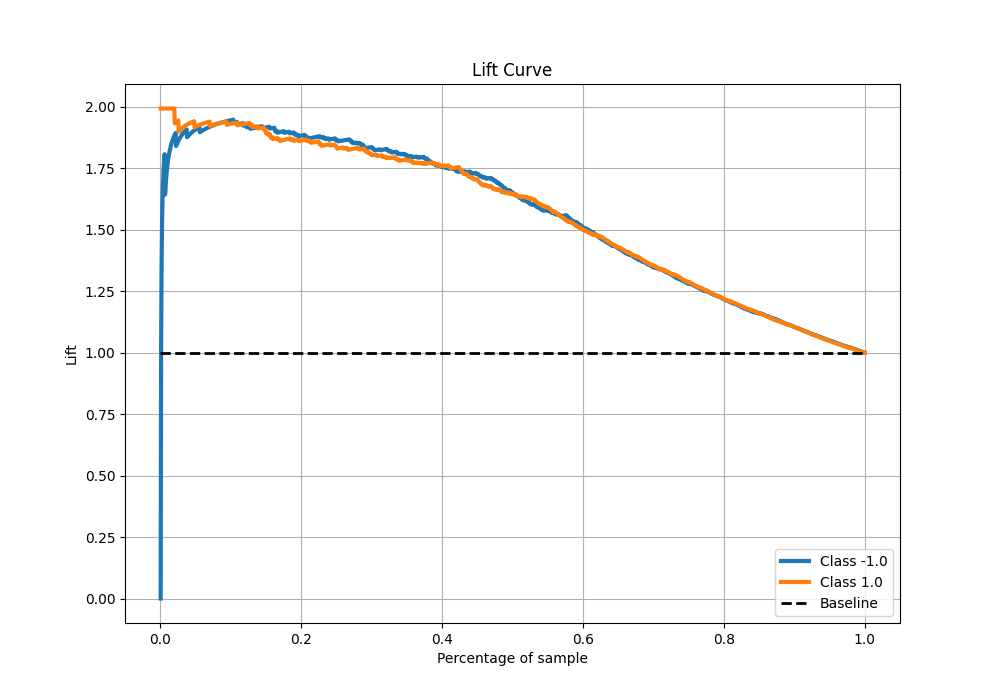

# Summary of 15_Xgboost

[<< Go back](../README.md)

## Extreme Gradient Boosting (Xgboost)
- **n_jobs**: -1
- **objective**: binary:logistic
- **eta**: 0.1
- **max_depth**: 4
- **min_child_weight**: 10
- **subsample**: 0.6
- **colsample_bytree**: 0.6
- **eval_metric**: f1
- **explain_level**: 0

## Validation
 - **validation_type**: kfold
 - **shuffle**: True
 - **stratify**: True
 - **k_folds**: 5

## Optimized metric
f1

## Training time

25.6 seconds

## Metric details
|           |    score |    threshold |
|:----------|---------:|-------------:|
| logloss   | 0.413992 | nan          |
| auc       | 0.895236 | nan          |
| f1        | 0.836364 |   0.45641    |
| accuracy  | 0.83125  |   0.45641    |
| precision | 1        |   0.981865   |
| recall    | 1        |   0.00433139 |
| mcc       | 0.66343  |   0.45641    |

## Metric details with threshold from accuracy metric
|           |    score |   threshold |
|:----------|---------:|------------:|
| logloss   | 0.413992 |   nan       |
| auc       | 0.895236 |   nan       |
| f1        | 0.836364 |     0.45641 |
| accuracy  | 0.83125  |     0.45641 |
| precision | 0.81464  |     0.45641 |
| recall    | 0.859278 |     0.45641 |
| mcc       | 0.66343  |     0.45641 |

## Confusion matrix (at threshold=0.45641)
|                 |   Predicted as -1.0 |   Predicted as 1.0 |
|:----------------|--------------------:|-------------------:|
| Labeled as -1.0 |                 640 |                157 |
| Labeled as 1.0  |                 113 |                690 |

## Learning curves

## Confusion Matrix

## Normalized Confusion Matrix

## ROC Curve

## Kolmogorov-Smirnov Statistic

## Precision-Recall Curve

## Calibration Curve

## Cumulative Gains Curve

## Lift Curve

[<< Go back](../README.md)
