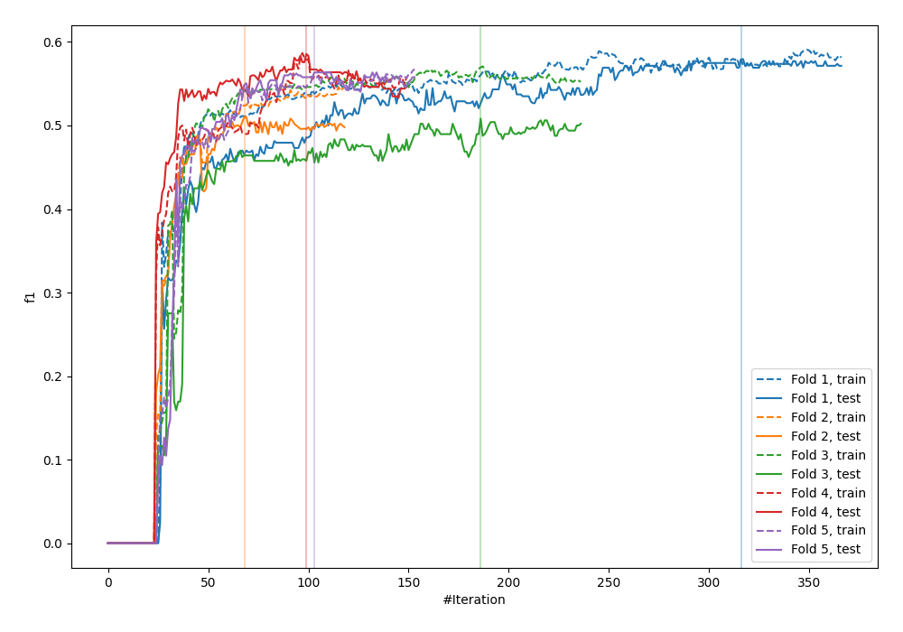
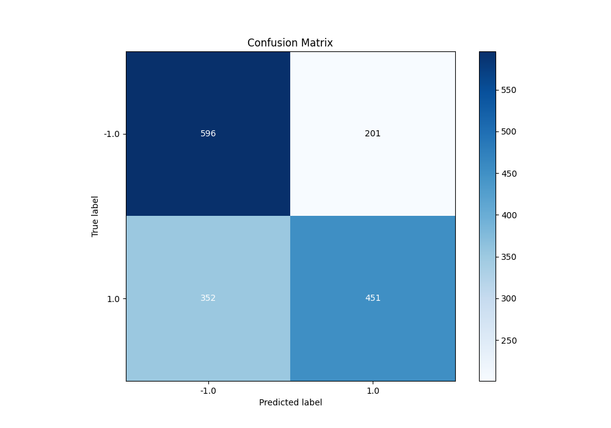
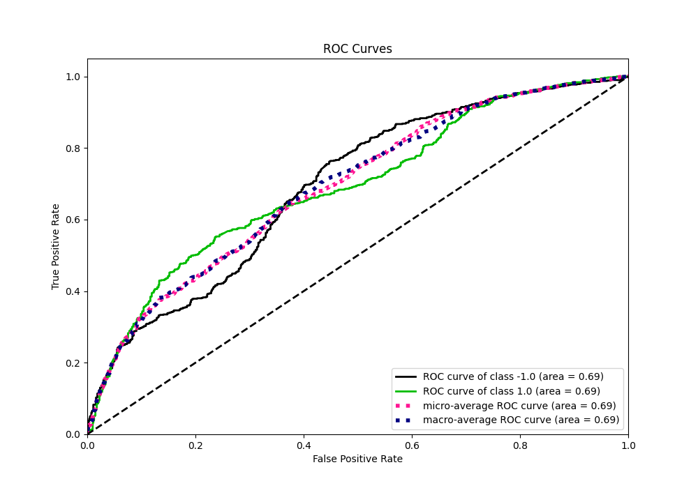
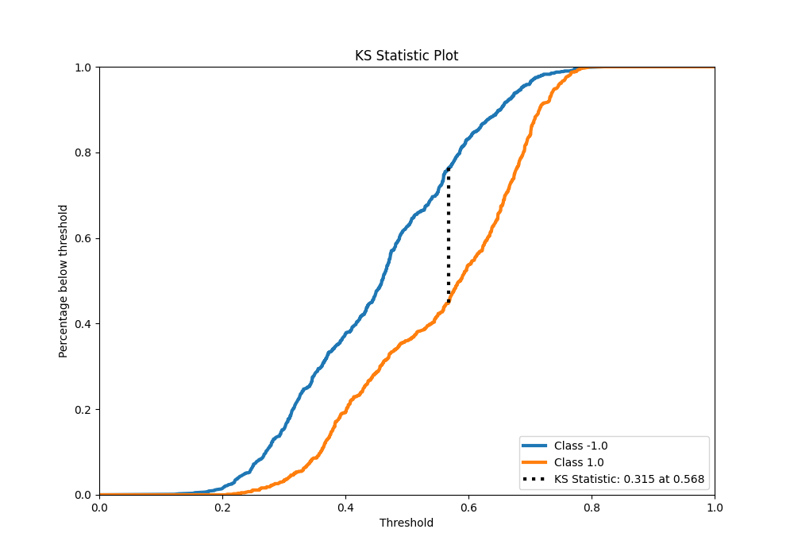
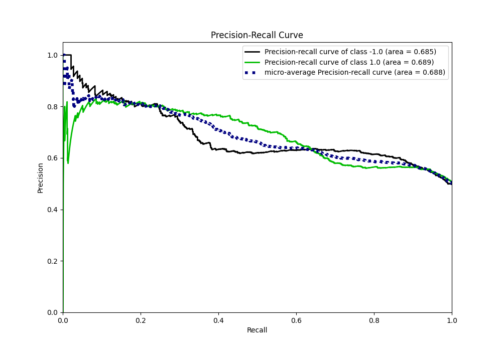
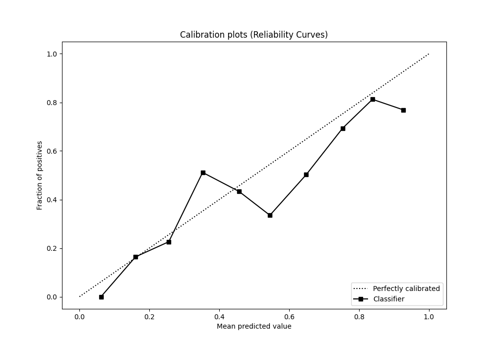
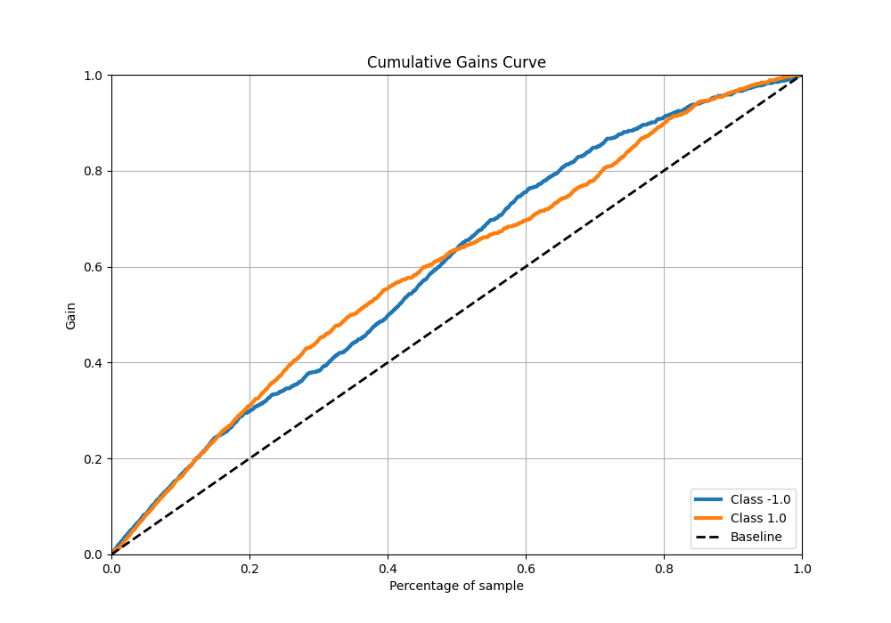
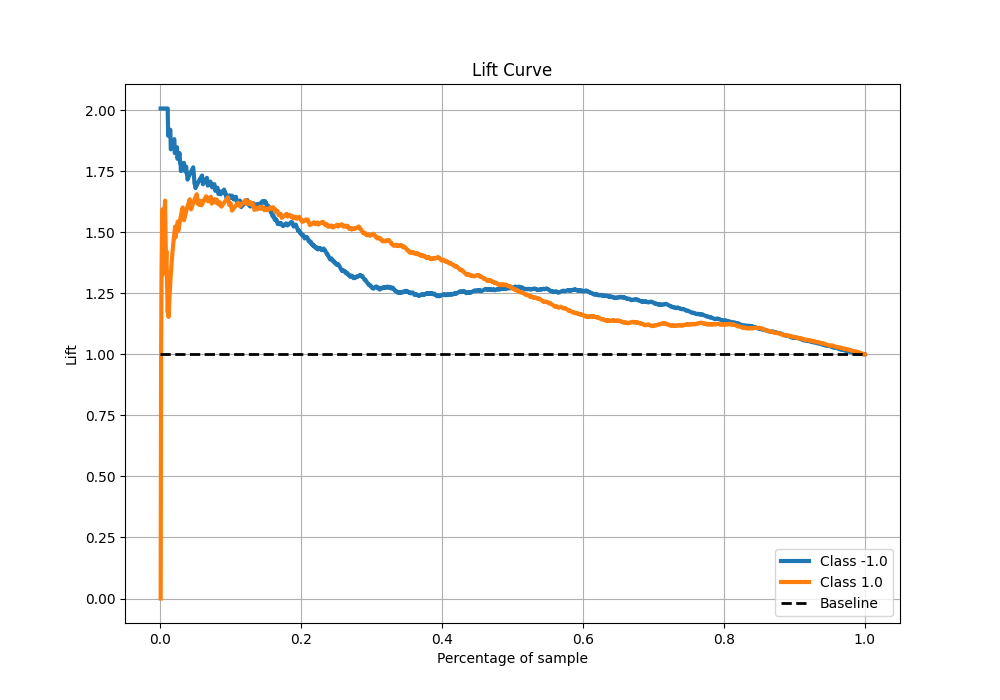

# Summary of 16_Xgboost

[<< Go back](../README.md)

## Extreme Gradient Boosting (Xgboost)
- **n_jobs**: -1
- **objective**: binary:logistic
- **eta**: 0.05
- **max_depth**: 6
- **min_child_weight**: 50
- **subsample**: 0.5
- **colsample_bytree**: 0.7
- **eval_metric**: f1
- **explain_level**: 0

## Validation
 - **validation_type**: kfold
 - **shuffle**: True
 - **stratify**: True
 - **k_folds**: 5

## Optimized metric
f1

## Training time

21.7 seconds

## Metric details
|           |    score |   threshold |
|:----------|---------:|------------:|
| logloss   | 0.634407 |  nan        |
| auc       | 0.693237 |  nan        |
| f1        | 0.699352 |    0.331363 |
| accuracy  | 0.654375 |    0.559753 |
| precision | 0.822785 |    0.730716 |
| recall    | 1        |    0.109954 |
| mcc       | 0.325008 |    0.623022 |

## Metric details with threshold from accuracy metric
|           |    score |   threshold |
|:----------|---------:|------------:|
| logloss   | 0.634407 |  nan        |
| auc       | 0.693237 |  nan        |
| f1        | 0.619931 |    0.559753 |
| accuracy  | 0.654375 |    0.559753 |
| precision | 0.691718 |    0.559753 |
| recall    | 0.561644 |    0.559753 |
| mcc       | 0.314881 |    0.559753 |

## Confusion matrix (at threshold=0.559753)
|                 |   Predicted as -1.0 |   Predicted as 1.0 |
|:----------------|--------------------:|-------------------:|
| Labeled as -1.0 |                 596 |                201 |
| Labeled as 1.0  |                 352 |                451 |

## Learning curves

## Confusion Matrix

## Normalized Confusion Matrix

## ROC Curve

## Kolmogorov-Smirnov Statistic

## Precision-Recall Curve

## Calibration Curve

## Cumulative Gains Curve

## Lift Curve

[<< Go back](../README.md)
