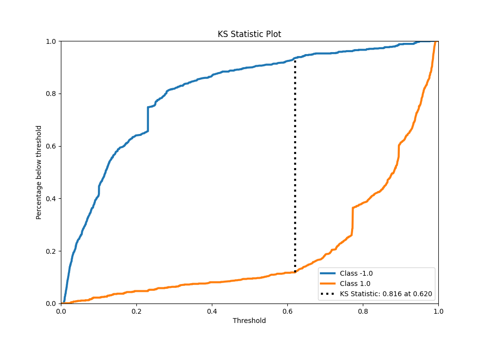

# Summary of 19_Xgboost_Stacked

[<< Go back](../README.md)

## Extreme Gradient Boosting (Xgboost)
- **n_jobs**: -1
- **objective**: binary:logistic
- **eta**: 0.1
- **max_depth**: 8
- **min_child_weight**: 1
- **subsample**: 0.6
- **colsample_bytree**: 0.5
- **eval_metric**: f1
- **explain_level**: 0

## Validation
 - **validation_type**: kfold
 - **shuffle**: True
 - **stratify**: True
 - **k_folds**: 5

## Optimized metric
f1

## Training time

27.1 seconds

## Metric details
|           |    score |    threshold |
|:----------|---------:|-------------:|
| logloss   | 0.299587 | nan          |
| auc       | 0.94455  | nan          |
| f1        | 0.90387  |   0.531753   |
| accuracy  | 0.90625  |   0.628342   |
| precision | 1        |   0.980554   |
| recall    | 1        |   0.00655747 |
| mcc       | 0.814264 |   0.628342   |

## Metric details with threshold from accuracy metric
|           |    score |   threshold |
|:----------|---------:|------------:|
| logloss   | 0.299587 |  nan        |
| auc       | 0.94455  |  nan        |
| f1        | 0.903475 |    0.628342 |
| accuracy  | 0.90625  |    0.628342 |
| precision | 0.934754 |    0.628342 |
| recall    | 0.874222 |    0.628342 |
| mcc       | 0.814264 |    0.628342 |

## Confusion matrix (at threshold=0.628342)
|                 |   Predicted as -1.0 |   Predicted as 1.0 |
|:----------------|--------------------:|-------------------:|
| Labeled as -1.0 |                 748 |                 49 |
| Labeled as 1.0  |                 101 |                702 |

## Learning curves

## Confusion Matrix

## Normalized Confusion Matrix

## ROC Curve

## Kolmogorov-Smirnov Statistic

## Precision-Recall Curve

## Calibration Curve

## Cumulative Gains Curve

## Lift Curve

[<< Go back](../README.md)
