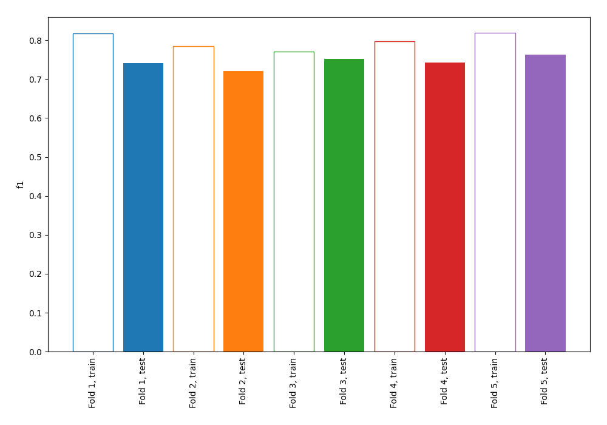
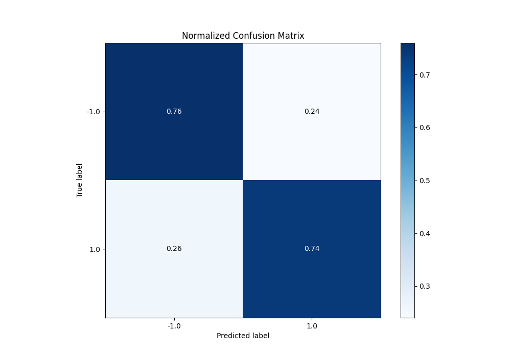
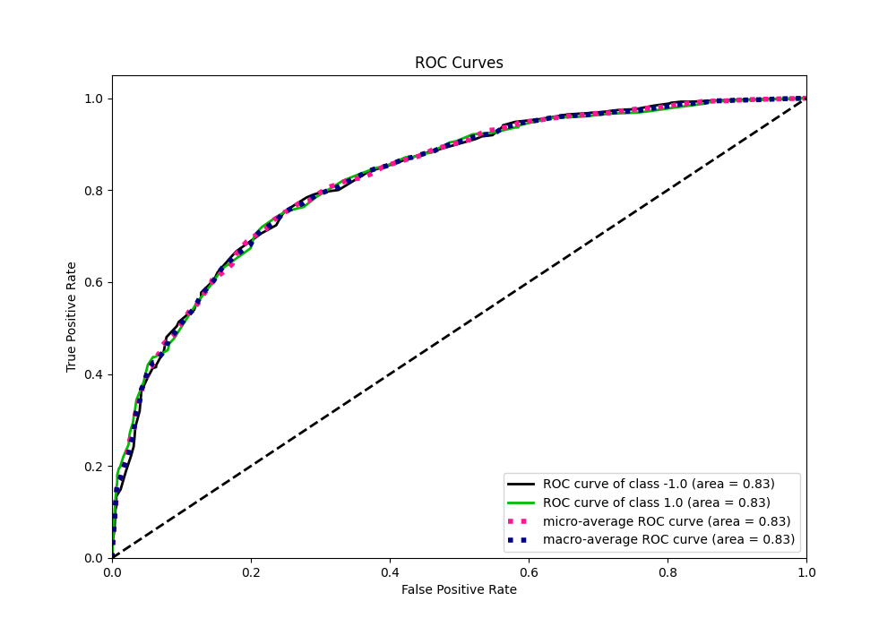
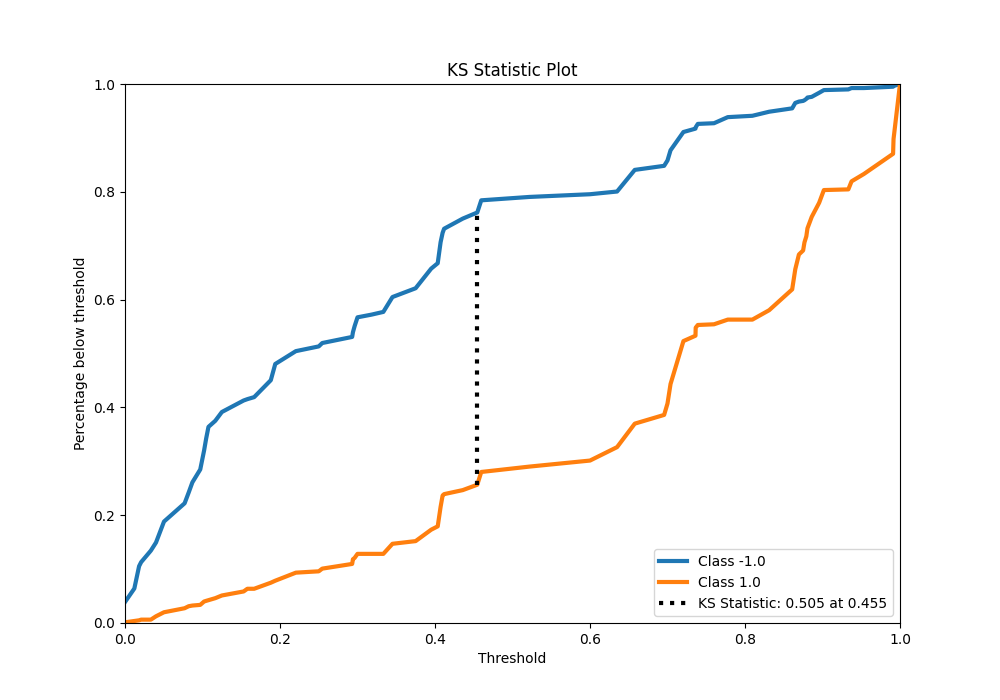
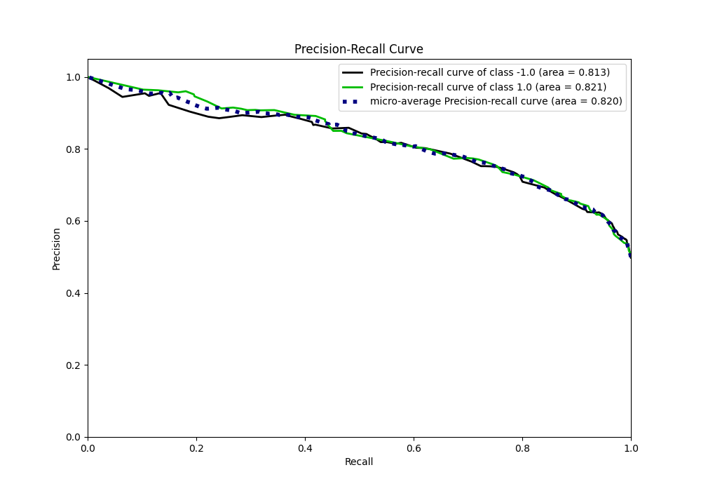
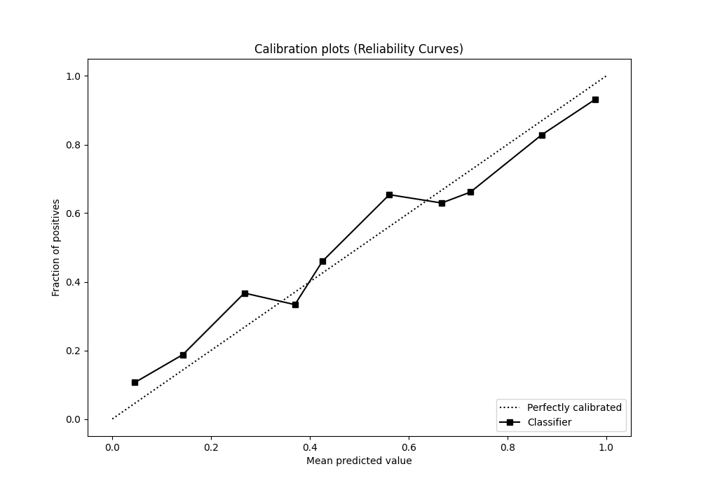
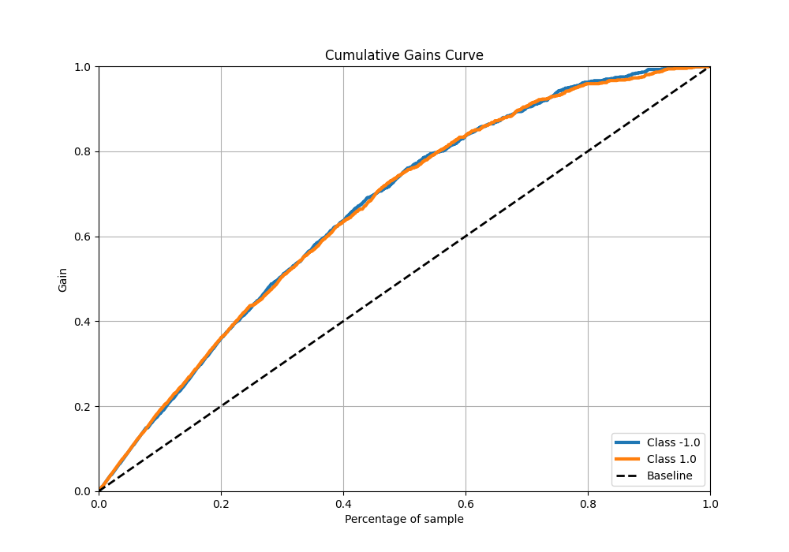
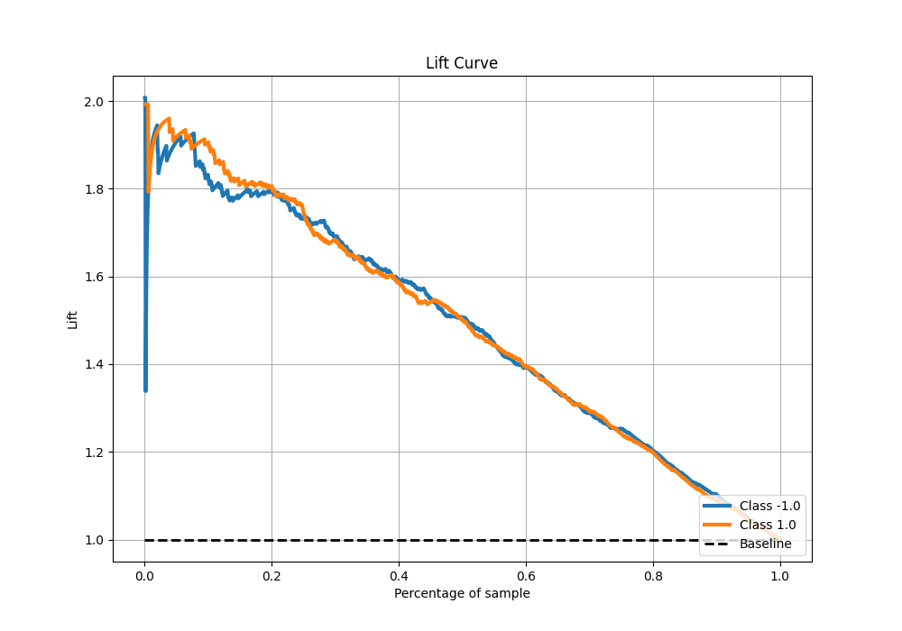

# Summary of 1_DecisionTree

[<< Go back](../README.md)

## Decision Tree
- **n_jobs**: -1
- **criterion**: entropy
- **max_depth**: 4
- **explain_level**: 0

## Validation
 - **validation_type**: kfold
 - **shuffle**: True
 - **stratify**: True
 - **k_folds**: 5

## Optimized metric
f1

## Training time

5.3 seconds

## Metric details
|           |    score |   threshold |
|:----------|---------:|------------:|
| logloss   | 0.545937 |  nan        |
| auc       | 0.82582  |  nan        |
| f1        | 0.763218 |    0.395062 |
| accuracy  | 0.7525   |    0.454545 |
| precision | 0.964706 |    0.991667 |
| recall    | 0.998755 |    0        |
| mcc       | 0.505131 |    0.454545 |

## Metric details with threshold from accuracy metric
|           |    score |   threshold |
|:----------|---------:|------------:|
| logloss   | 0.545937 |  nan        |
| auc       | 0.82582  |  nan        |
| f1        | 0.750943 |    0.454545 |
| accuracy  | 0.7525   |    0.454545 |
| precision | 0.758577 |    0.454545 |
| recall    | 0.743462 |    0.454545 |
| mcc       | 0.505131 |    0.454545 |

## Confusion matrix (at threshold=0.454545)
|                 |   Predicted as -1.0 |   Predicted as 1.0 |
|:----------------|--------------------:|-------------------:|
| Labeled as -1.0 |                 607 |                190 |
| Labeled as 1.0  |                 206 |                597 |

## Learning curves

## Confusion Matrix

## Normalized Confusion Matrix

## ROC Curve

## Kolmogorov-Smirnov Statistic

## Precision-Recall Curve

## Calibration Curve

## Cumulative Gains Curve

## Lift Curve

[<< Go back](../README.md)
