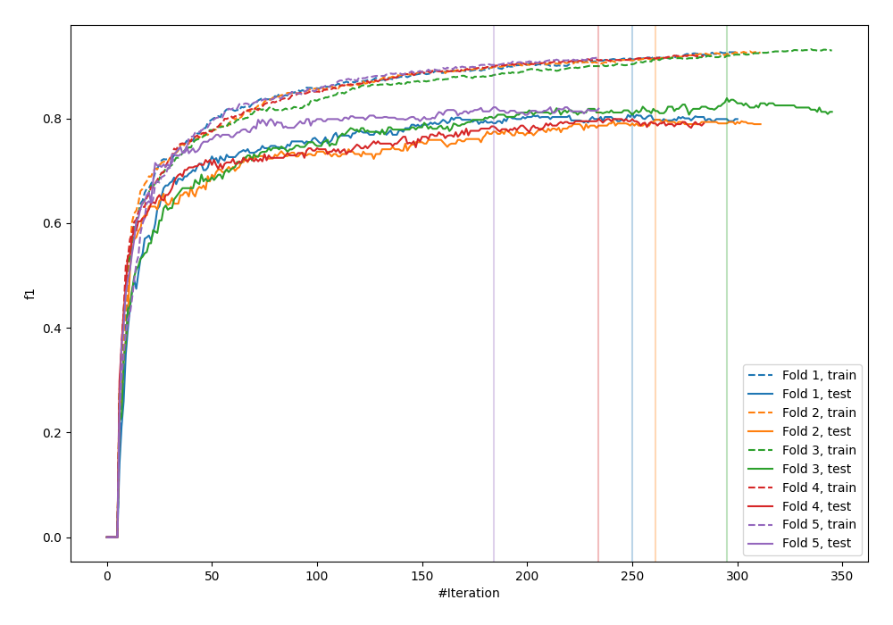
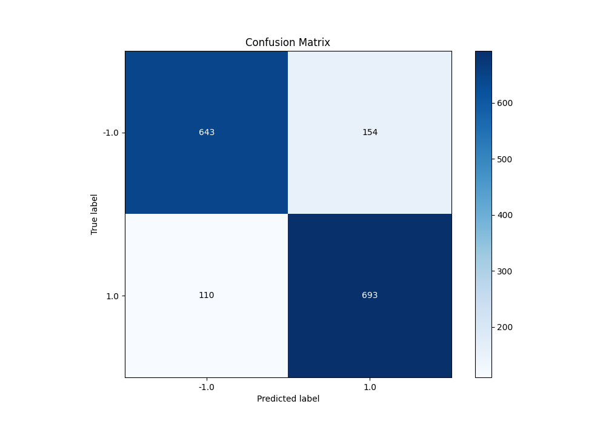
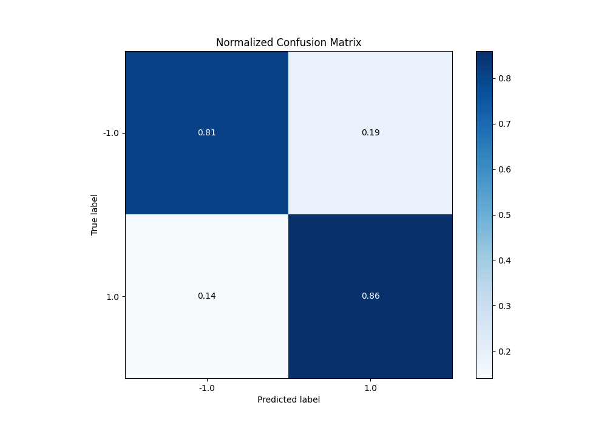
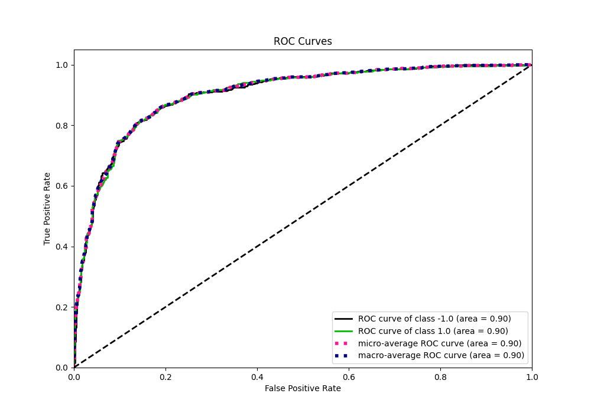
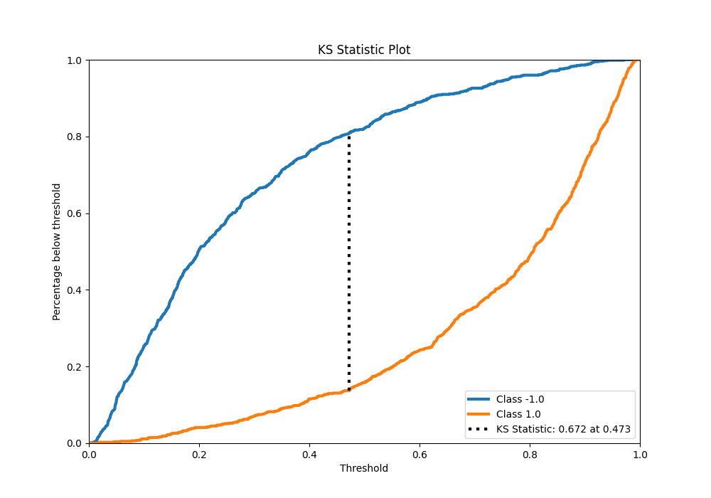
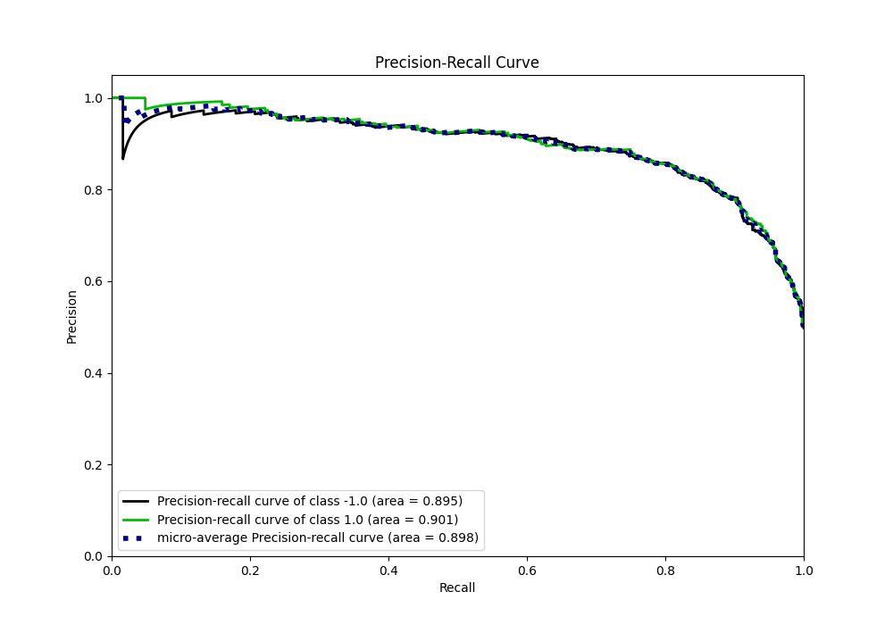
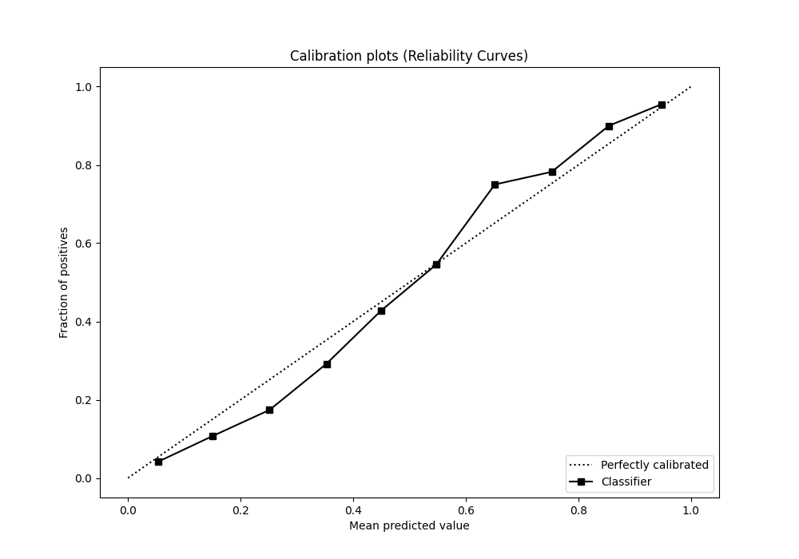
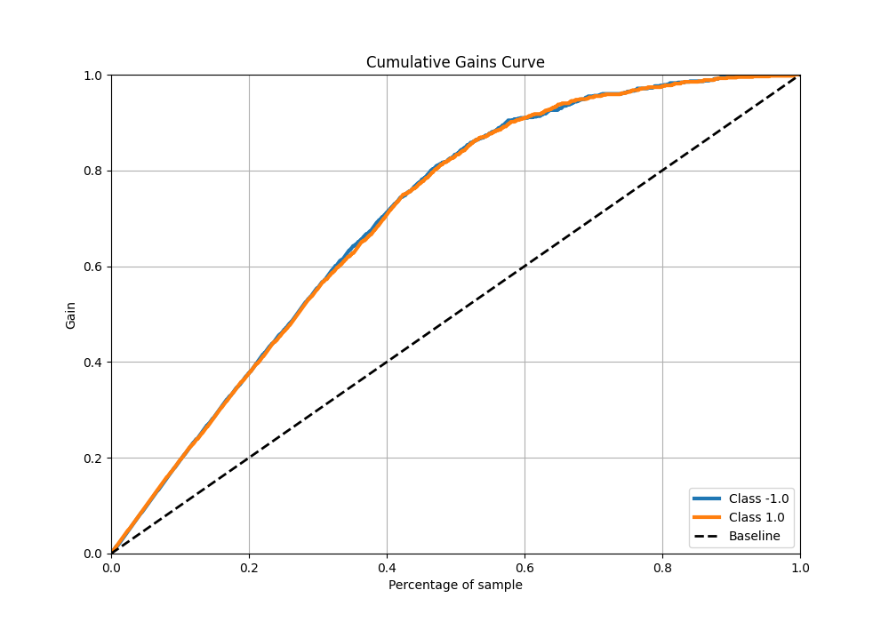
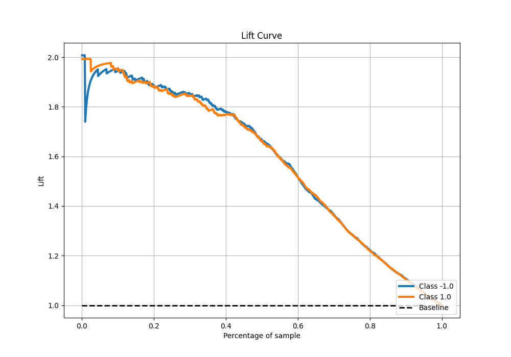

# Summary of 20_Xgboost

[<< Go back](../README.md)

## Extreme Gradient Boosting (Xgboost)
- **n_jobs**: -1
- **objective**: binary:logistic
- **eta**: 0.05
- **max_depth**: 6
- **min_child_weight**: 10
- **subsample**: 0.6
- **colsample_bytree**: 0.6
- **eval_metric**: f1
- **explain_level**: 0

## Validation
 - **validation_type**: kfold
 - **shuffle**: True
 - **stratify**: True
 - **k_folds**: 5

## Optimized metric
f1

## Training time

29.1 seconds

## Metric details
|           |    score |    threshold |
|:----------|---------:|-------------:|
| logloss   | 0.401263 | nan          |
| auc       | 0.90298  | nan          |
| f1        | 0.84     |   0.471524   |
| accuracy  | 0.835    |   0.471524   |
| precision | 1        |   0.975561   |
| recall    | 1        |   0.00443625 |
| mcc       | 0.670943 |   0.471524   |

## Metric details with threshold from accuracy metric
|           |    score |   threshold |
|:----------|---------:|------------:|
| logloss   | 0.401263 |  nan        |
| auc       | 0.90298  |  nan        |
| f1        | 0.84     |    0.471524 |
| accuracy  | 0.835    |    0.471524 |
| precision | 0.818182 |    0.471524 |
| recall    | 0.863014 |    0.471524 |
| mcc       | 0.670943 |    0.471524 |

## Confusion matrix (at threshold=0.471524)
|                 |   Predicted as -1.0 |   Predicted as 1.0 |
|:----------------|--------------------:|-------------------:|
| Labeled as -1.0 |                 643 |                154 |
| Labeled as 1.0  |                 110 |                693 |

## Learning curves

## Confusion Matrix

## Normalized Confusion Matrix

## ROC Curve

## Kolmogorov-Smirnov Statistic

## Precision-Recall Curve

## Calibration Curve

## Cumulative Gains Curve

## Lift Curve

[<< Go back](../README.md)
