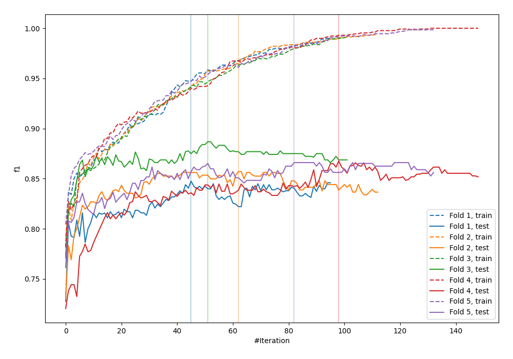
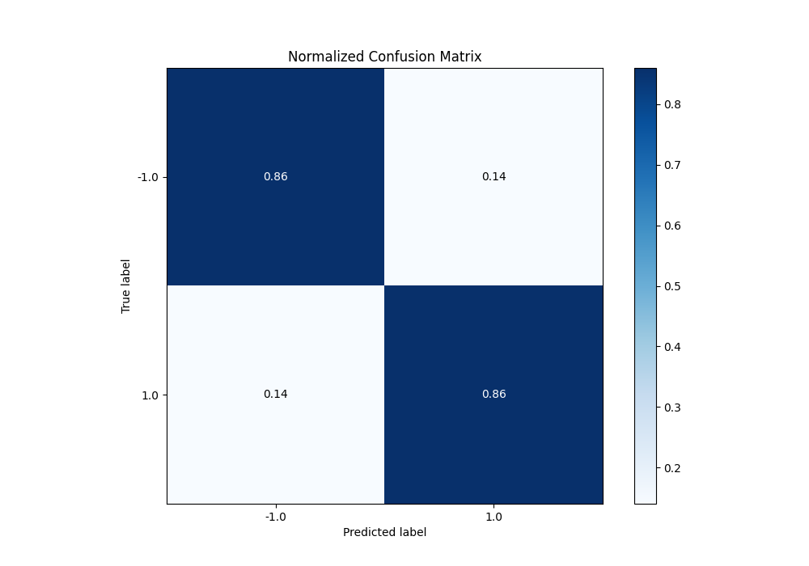
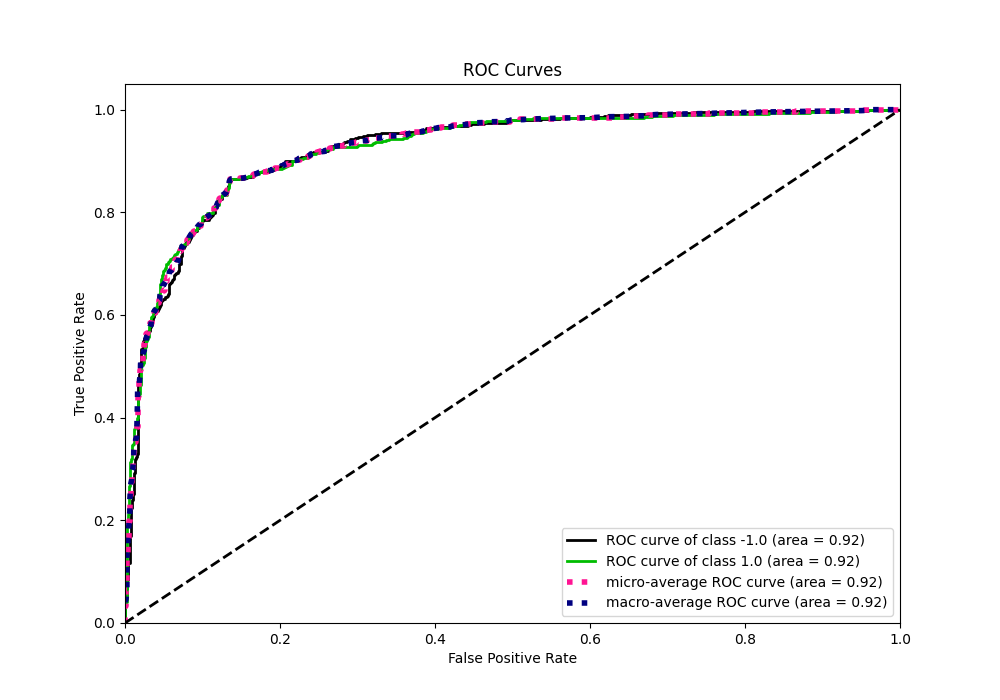
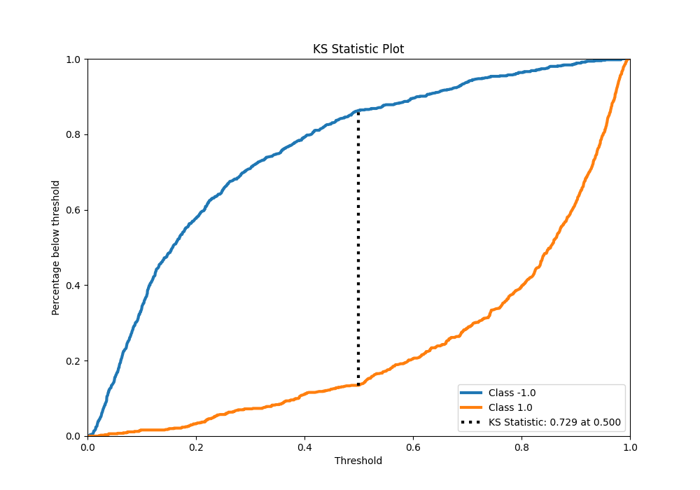
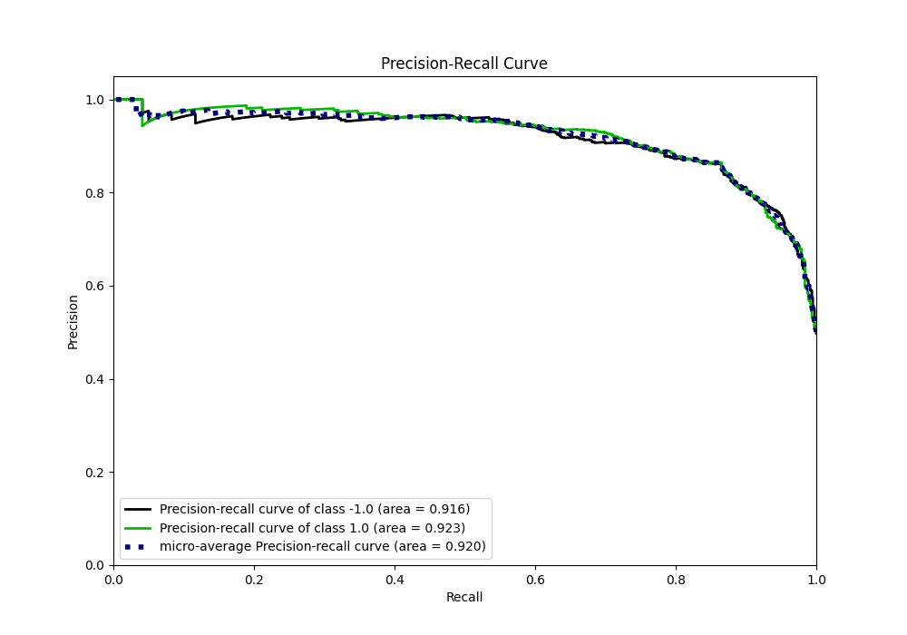
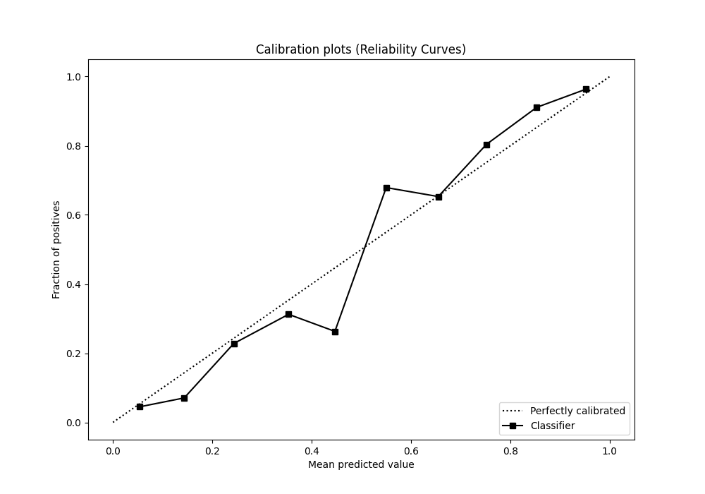
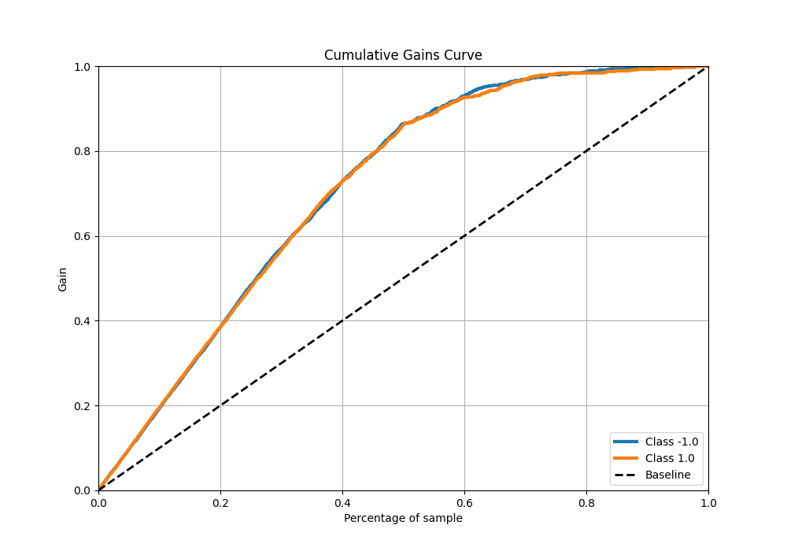
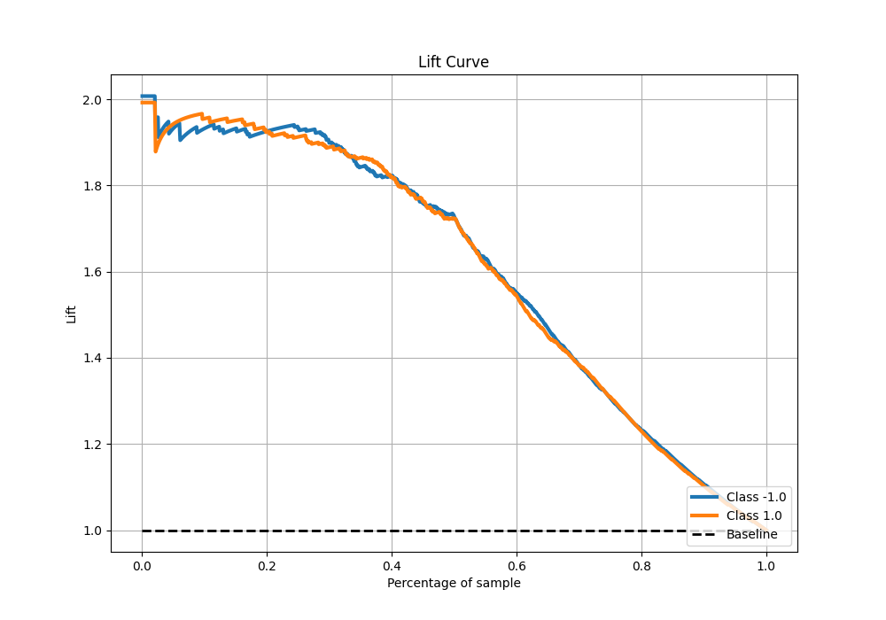

# Summary of 21_LightGBM

[<< Go back](../README.md)

## LightGBM
- **n_jobs**: -1
- **objective**: binary
- **num_leaves**: 95
- **learning_rate**: 0.1
- **feature_fraction**: 0.5
- **bagging_fraction**: 0.8
- **min_data_in_leaf**: 50
- **metric**: custom
- **custom_eval_metric_name**: f1
- **explain_level**: 0

## Validation
 - **validation_type**: kfold
 - **shuffle**: True
 - **stratify**: True
 - **k_folds**: 5

## Optimized metric
f1

## Training time

14.1 seconds

## Metric details
|           |    score |    threshold |
|:----------|---------:|-------------:|
| logloss   | 0.356879 | nan          |
| auc       | 0.924088 | nan          |
| f1        | 0.862672 |   0.508695   |
| accuracy  | 0.8625   |   0.508695   |
| precision | 1        |   0.98472    |
| recall    | 1        |   0.00195589 |
| mcc       | 0.72501  |   0.508695   |

## Metric details with threshold from accuracy metric
|           |    score |   threshold |
|:----------|---------:|------------:|
| logloss   | 0.356879 |  nan        |
| auc       | 0.924088 |  nan        |
| f1        | 0.862672 |    0.508695 |
| accuracy  | 0.8625   |    0.508695 |
| precision | 0.864831 |    0.508695 |
| recall    | 0.860523 |    0.508695 |
| mcc       | 0.72501  |    0.508695 |

## Confusion matrix (at threshold=0.508695)
|                 |   Predicted as -1.0 |   Predicted as 1.0 |
|:----------------|--------------------:|-------------------:|
| Labeled as -1.0 |                 689 |                108 |
| Labeled as 1.0  |                 112 |                691 |

## Learning curves

## Confusion Matrix

## Normalized Confusion Matrix

## ROC Curve

## Kolmogorov-Smirnov Statistic

## Precision-Recall Curve

## Calibration Curve

## Cumulative Gains Curve

## Lift Curve

[<< Go back](../README.md)
