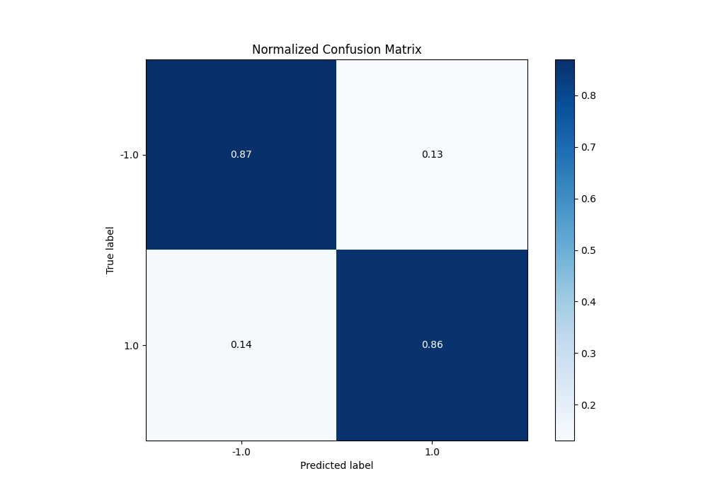
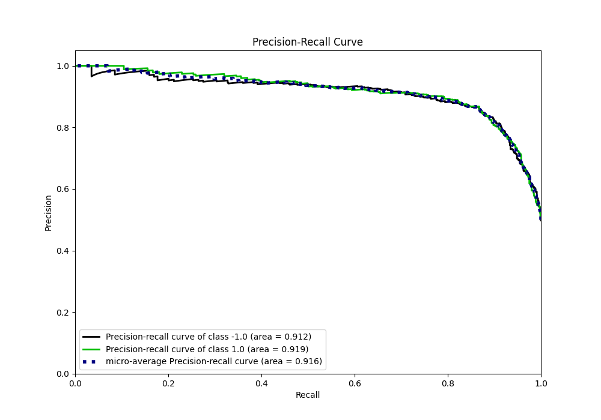
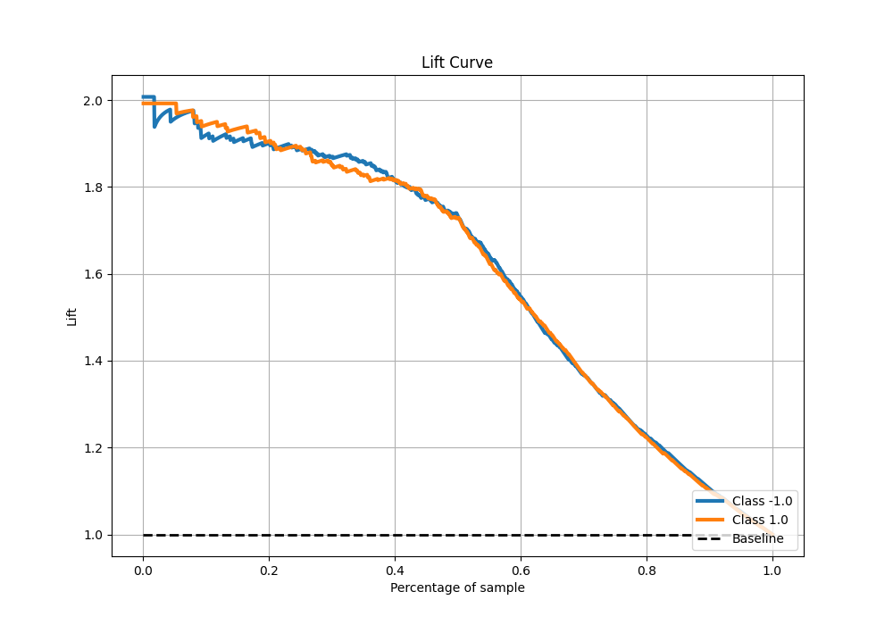

# Summary of 22_LightGBM

[<< Go back](../README.md)

## LightGBM
- **n_jobs**: -1
- **objective**: binary
- **num_leaves**: 15
- **learning_rate**: 0.1
- **feature_fraction**: 0.8
- **bagging_fraction**: 0.5
- **min_data_in_leaf**: 5
- **metric**: custom
- **custom_eval_metric_name**: f1
- **explain_level**: 0

## Validation
 - **validation_type**: kfold
 - **shuffle**: True
 - **stratify**: True
 - **k_folds**: 5

## Optimized metric
f1

## Training time

16.2 seconds

## Metric details
|           |    score |   threshold |
|:----------|---------:|------------:|
| logloss   | 0.361791 | nan         |
| auc       | 0.919341 | nan         |
| f1        | 0.865169 |   0.507883  |
| accuracy  | 0.865    |   0.507883  |
| precision | 1        |   0.991084  |
| recall    | 1        |   0.0022886 |
| mcc       | 0.73001  |   0.507883  |

## Metric details with threshold from accuracy metric
|           |    score |   threshold |
|:----------|---------:|------------:|
| logloss   | 0.361791 |  nan        |
| auc       | 0.919341 |  nan        |
| f1        | 0.865169 |    0.507883 |
| accuracy  | 0.865    |    0.507883 |
| precision | 0.867334 |    0.507883 |
| recall    | 0.863014 |    0.507883 |
| mcc       | 0.73001  |    0.507883 |

## Confusion matrix (at threshold=0.507883)
|                 |   Predicted as -1.0 |   Predicted as 1.0 |
|:----------------|--------------------:|-------------------:|
| Labeled as -1.0 |                 691 |                106 |
| Labeled as 1.0  |                 110 |                693 |

## Learning curves

## Confusion Matrix

## Normalized Confusion Matrix

## ROC Curve

## Kolmogorov-Smirnov Statistic

## Precision-Recall Curve

## Calibration Curve

## Cumulative Gains Curve

## Lift Curve

[<< Go back](../README.md)
