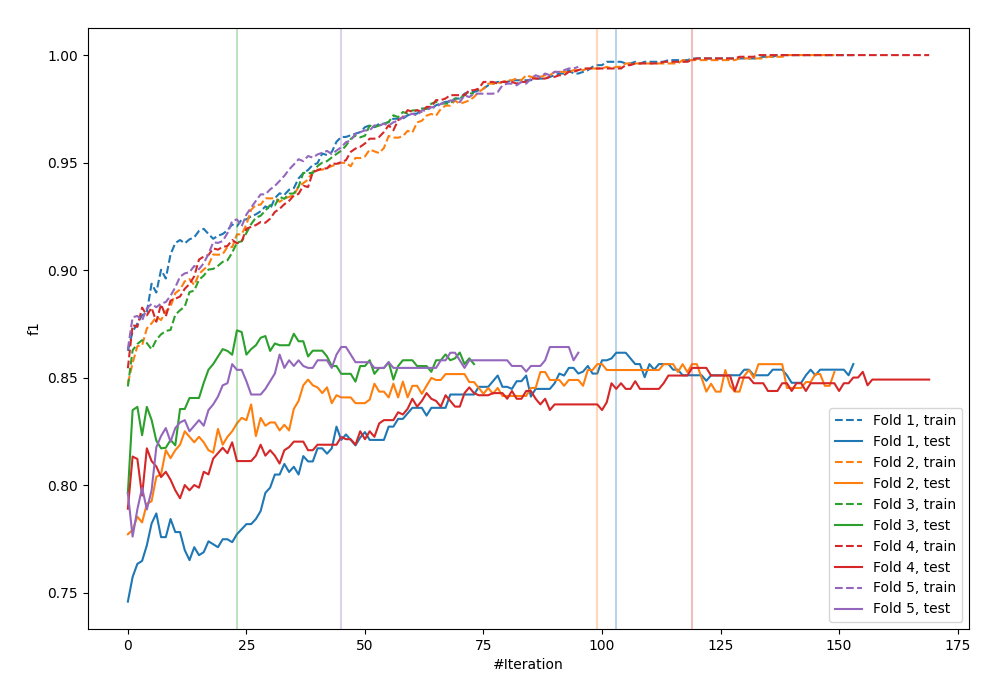
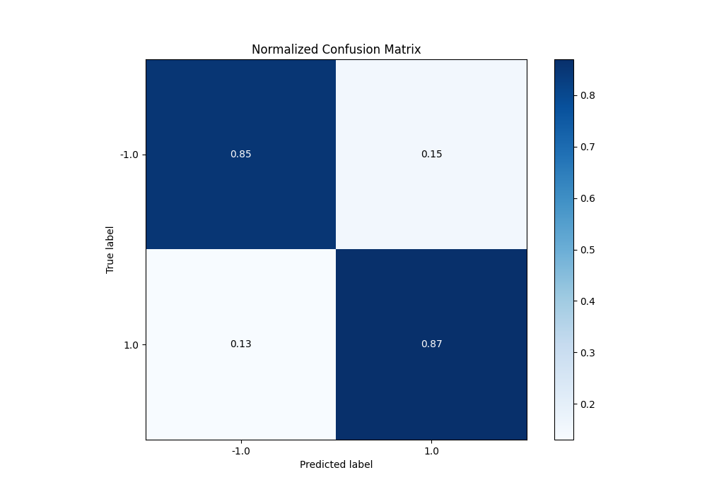
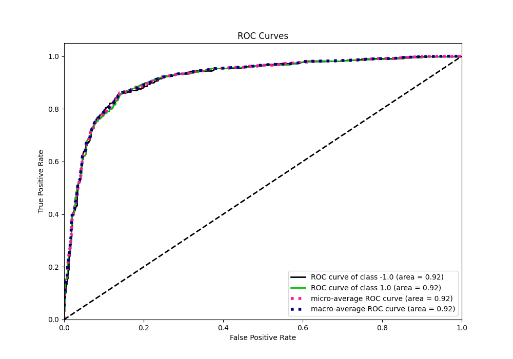
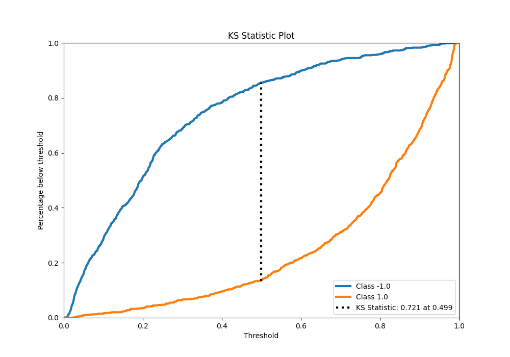
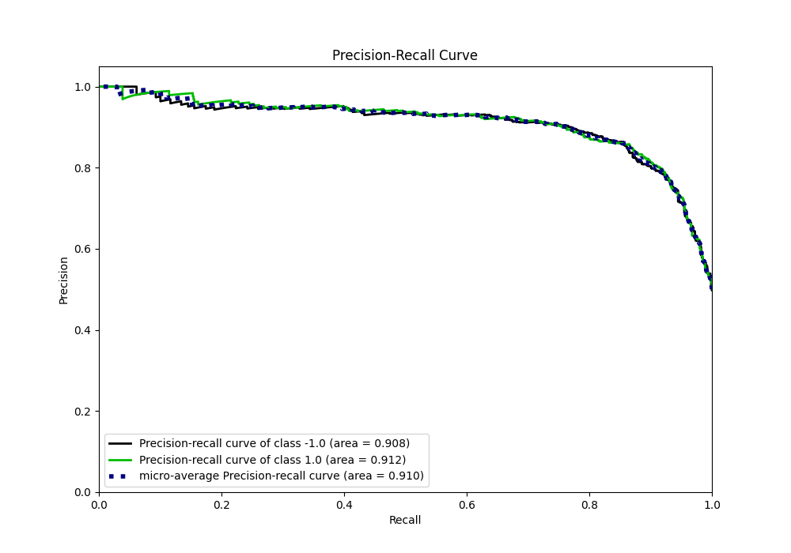
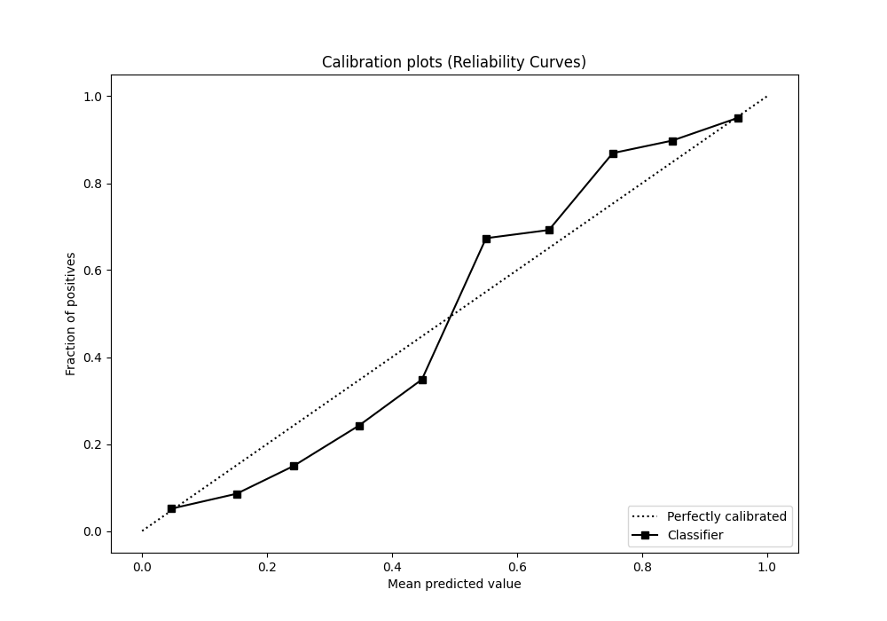
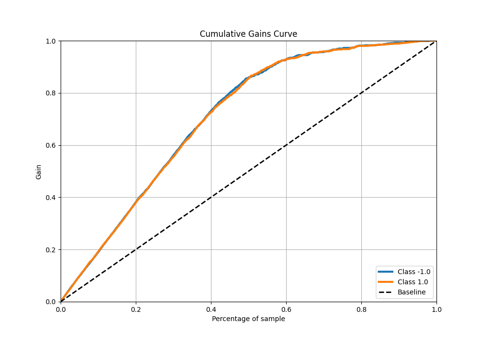
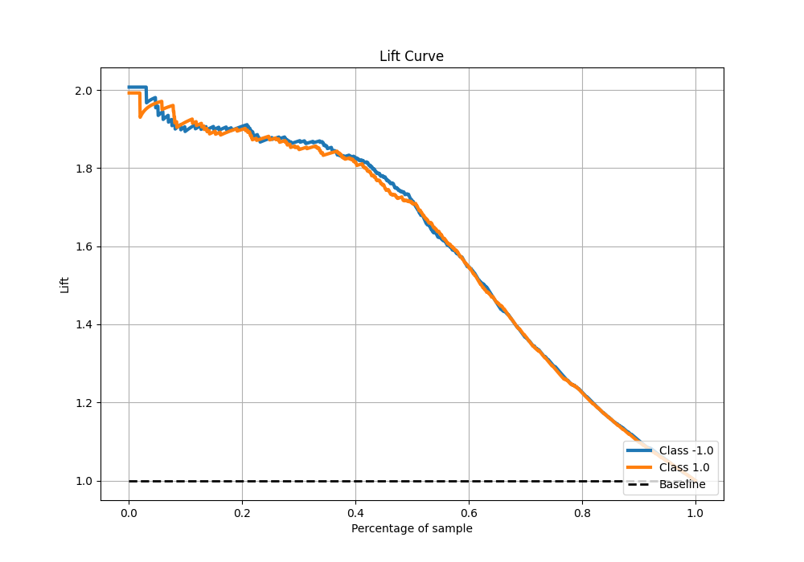

# Summary of 23_LightGBM

[<< Go back](../README.md)

## LightGBM
- **n_jobs**: -1
- **objective**: binary
- **num_leaves**: 31
- **learning_rate**: 0.05
- **feature_fraction**: 0.9
- **bagging_fraction**: 0.9
- **min_data_in_leaf**: 20
- **metric**: custom
- **custom_eval_metric_name**: f1
- **explain_level**: 0

## Validation
 - **validation_type**: kfold
 - **shuffle**: True
 - **stratify**: True
 - **k_folds**: 5

## Optimized metric
f1

## Training time

18.0 seconds

## Metric details
|           |    score |   threshold |
|:----------|---------:|------------:|
| logloss   | 0.376531 | nan         |
| auc       | 0.916285 | nan         |
| f1        | 0.860321 |   0.493722  |
| accuracy  | 0.85875  |   0.493722  |
| precision | 1        |   0.98463   |
| recall    | 1        |   0.0051316 |
| mcc       | 0.717561 |   0.493722  |

## Metric details with threshold from accuracy metric
|           |    score |   threshold |
|:----------|---------:|------------:|
| logloss   | 0.376531 |  nan        |
| auc       | 0.916285 |  nan        |
| f1        | 0.860321 |    0.493722 |
| accuracy  | 0.85875  |    0.493722 |
| precision | 0.853988 |    0.493722 |
| recall    | 0.86675  |    0.493722 |
| mcc       | 0.717561 |    0.493722 |

## Confusion matrix (at threshold=0.493722)
|                 |   Predicted as -1.0 |   Predicted as 1.0 |
|:----------------|--------------------:|-------------------:|
| Labeled as -1.0 |                 678 |                119 |
| Labeled as 1.0  |                 107 |                696 |

## Learning curves

## Confusion Matrix

## Normalized Confusion Matrix

## ROC Curve

## Kolmogorov-Smirnov Statistic

## Precision-Recall Curve

## Calibration Curve

## Cumulative Gains Curve

## Lift Curve

[<< Go back](../README.md)
