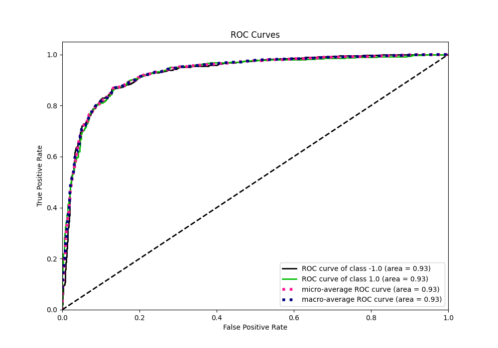

# Summary of 24_LightGBM

[<< Go back](../README.md)

## LightGBM
- **n_jobs**: -1
- **objective**: binary
- **num_leaves**: 95
- **learning_rate**: 0.05
- **feature_fraction**: 0.9
- **bagging_fraction**: 0.8
- **min_data_in_leaf**: 10
- **metric**: custom
- **custom_eval_metric_name**: f1
- **explain_level**: 0

## Validation
 - **validation_type**: kfold
 - **shuffle**: True
 - **stratify**: True
 - **k_folds**: 5

## Optimized metric
f1

## Training time

129.6 seconds

## Metric details
|           |    score |    threshold |
|:----------|---------:|-------------:|
| logloss   | 0.337575 | nan          |
| auc       | 0.929427 | nan          |
| f1        | 0.866747 |   0.420138   |
| accuracy  | 0.865    |   0.510645   |
| precision | 1        |   0.976894   |
| recall    | 1        |   0.00524135 |
| mcc       | 0.73001  |   0.510645   |

## Metric details with threshold from accuracy metric
|           |    score |   threshold |
|:----------|---------:|------------:|
| logloss   | 0.337575 |  nan        |
| auc       | 0.929427 |  nan        |
| f1        | 0.865169 |    0.510645 |
| accuracy  | 0.865    |    0.510645 |
| precision | 0.867334 |    0.510645 |
| recall    | 0.863014 |    0.510645 |
| mcc       | 0.73001  |    0.510645 |

## Confusion matrix (at threshold=0.510645)
|                 |   Predicted as -1.0 |   Predicted as 1.0 |
|:----------------|--------------------:|-------------------:|
| Labeled as -1.0 |                 691 |                106 |
| Labeled as 1.0  |                 110 |                693 |

## Learning curves

## Confusion Matrix

## Normalized Confusion Matrix

## ROC Curve

## Kolmogorov-Smirnov Statistic

## Precision-Recall Curve

## Calibration Curve

## Cumulative Gains Curve

## Lift Curve

[<< Go back](../README.md)
