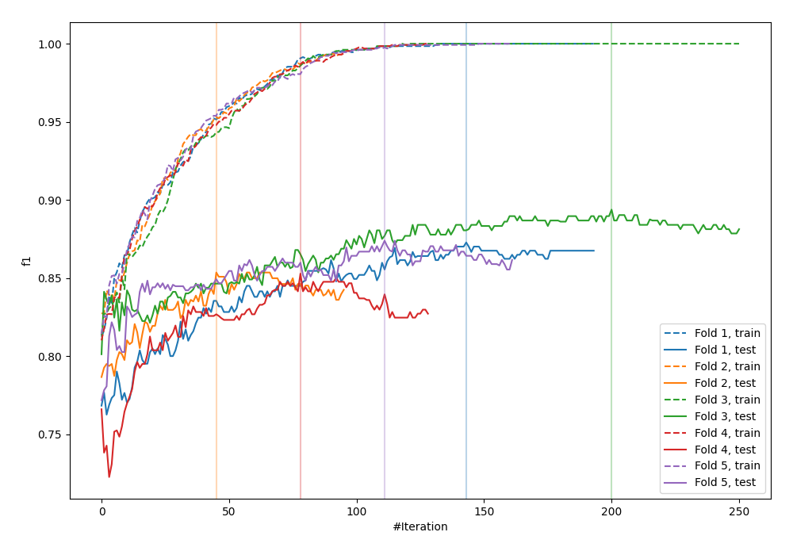
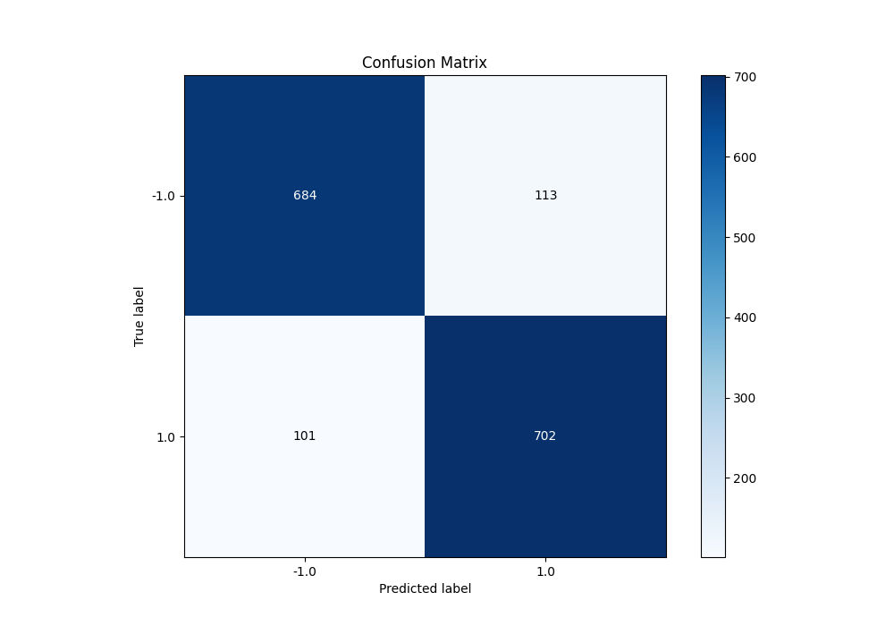
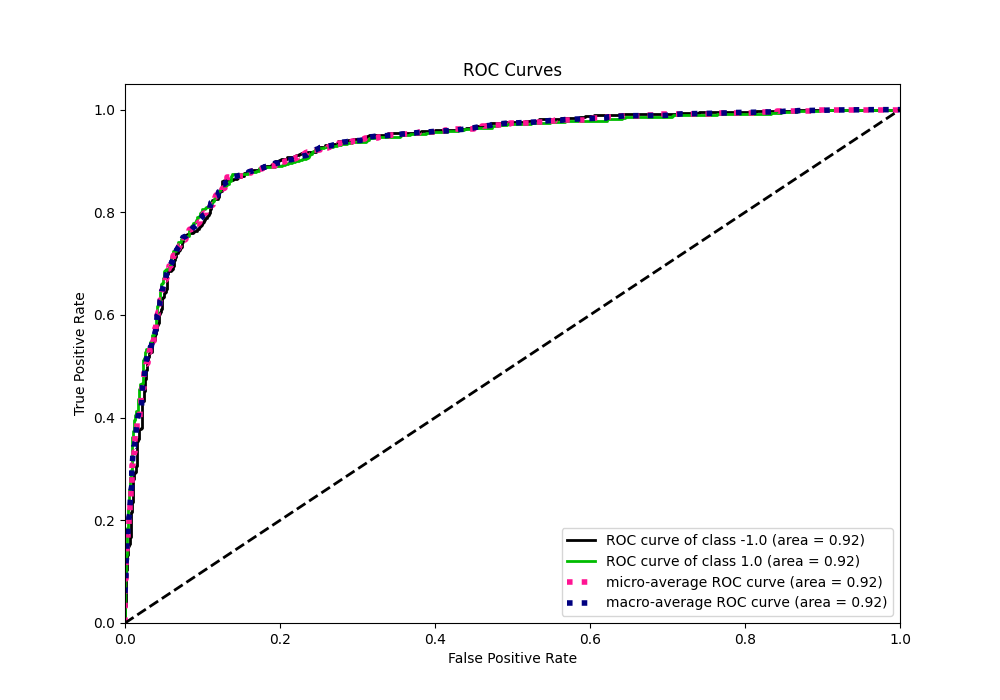
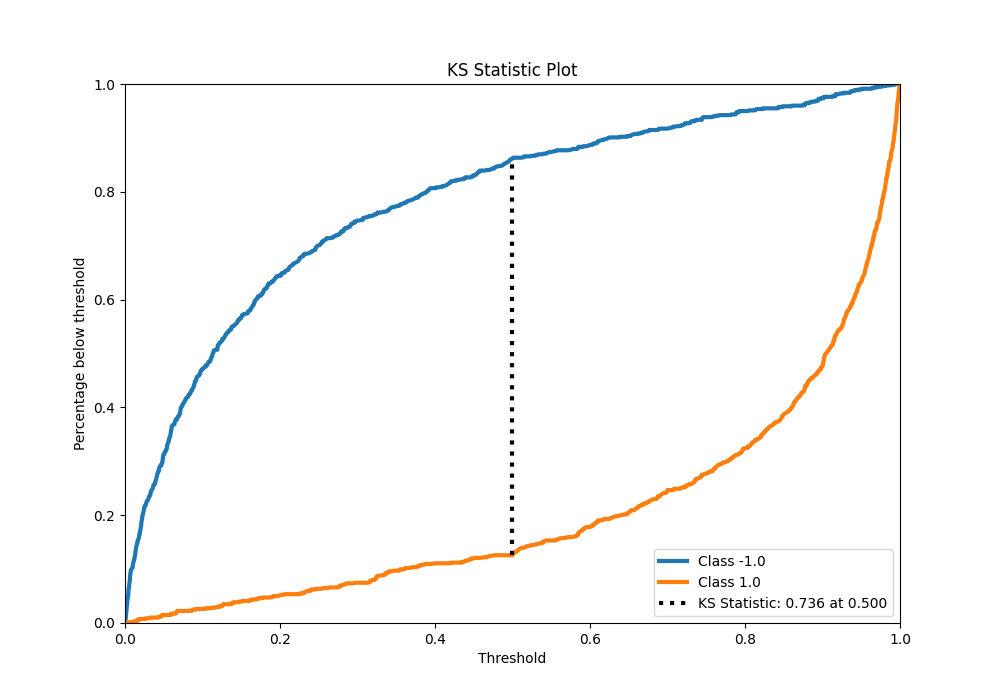
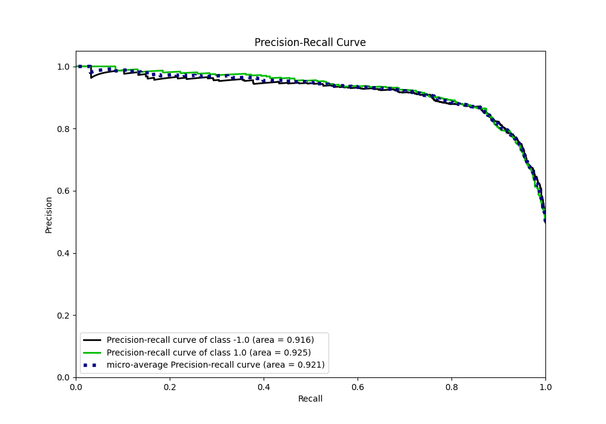
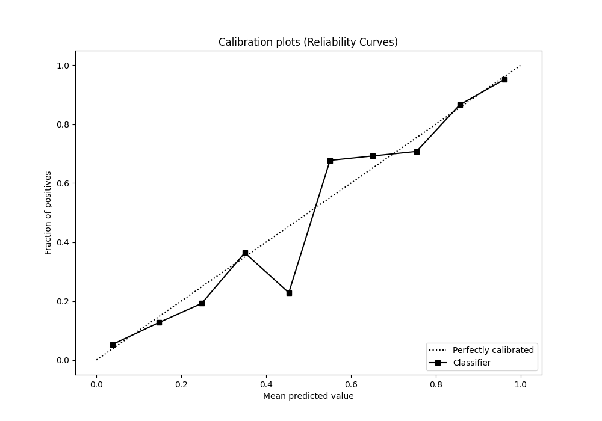
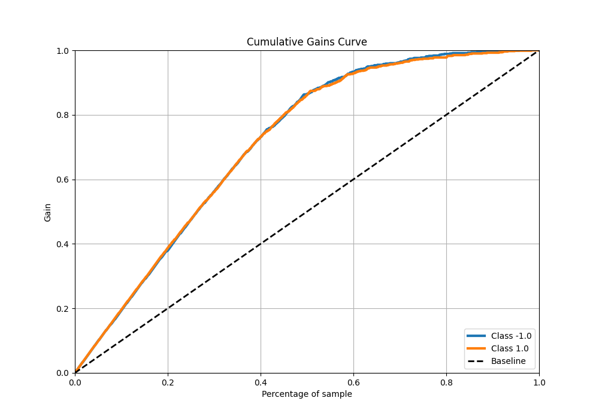
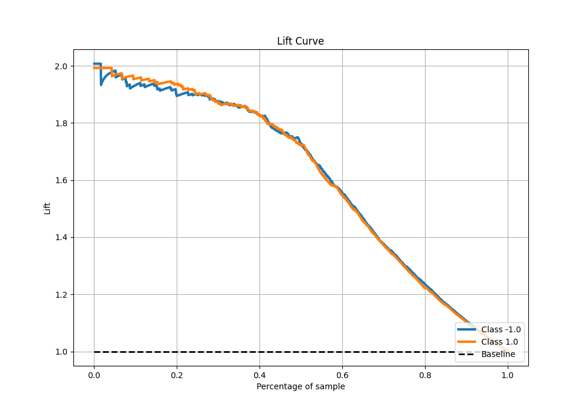

# Summary of 27_LightGBM

[<< Go back](../README.md)

## LightGBM
- **n_jobs**: -1
- **objective**: binary
- **num_leaves**: 127
- **learning_rate**: 0.1
- **feature_fraction**: 1.0
- **bagging_fraction**: 1.0
- **min_data_in_leaf**: 50
- **metric**: custom
- **custom_eval_metric_name**: f1
- **explain_level**: 0

## Validation
 - **validation_type**: kfold
 - **shuffle**: True
 - **stratify**: True
 - **k_folds**: 5

## Optimized metric
f1

## Training time

105.6 seconds

## Metric details
|           |    score |     threshold |
|:----------|---------:|--------------:|
| logloss   | 0.351931 | nan           |
| auc       | 0.924147 | nan           |
| f1        | 0.867738 |   0.496486    |
| accuracy  | 0.86625  |   0.496486    |
| precision | 1        |   0.993813    |
| recall    | 1        |   0.000170539 |
| mcc       | 0.732564 |   0.496486    |

## Metric details with threshold from accuracy metric
|           |    score |   threshold |
|:----------|---------:|------------:|
| logloss   | 0.351931 |  nan        |
| auc       | 0.924147 |  nan        |
| f1        | 0.867738 |    0.496486 |
| accuracy  | 0.86625  |    0.496486 |
| precision | 0.86135  |    0.496486 |
| recall    | 0.874222 |    0.496486 |
| mcc       | 0.732564 |    0.496486 |

## Confusion matrix (at threshold=0.496486)
|                 |   Predicted as -1.0 |   Predicted as 1.0 |
|:----------------|--------------------:|-------------------:|
| Labeled as -1.0 |                 684 |                113 |
| Labeled as 1.0  |                 101 |                702 |

## Learning curves

## Confusion Matrix

## Normalized Confusion Matrix

## ROC Curve

## Kolmogorov-Smirnov Statistic

## Precision-Recall Curve

## Calibration Curve

## Cumulative Gains Curve

## Lift Curve

[<< Go back](../README.md)
