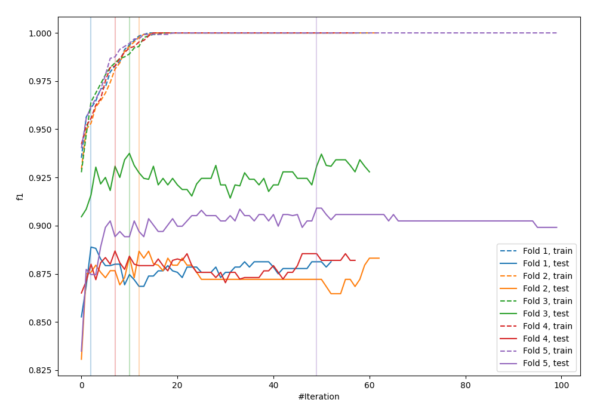
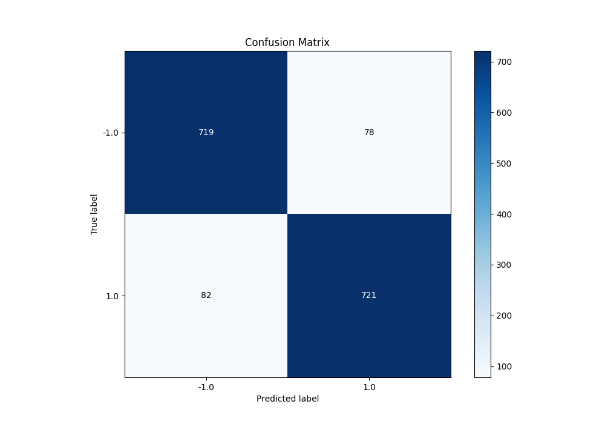
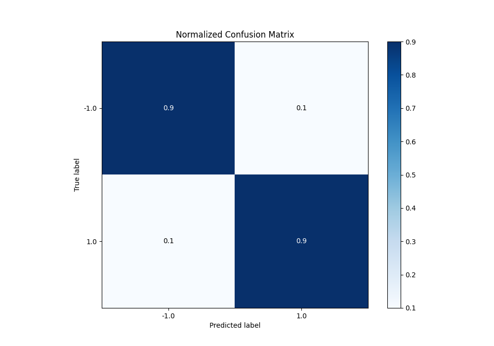
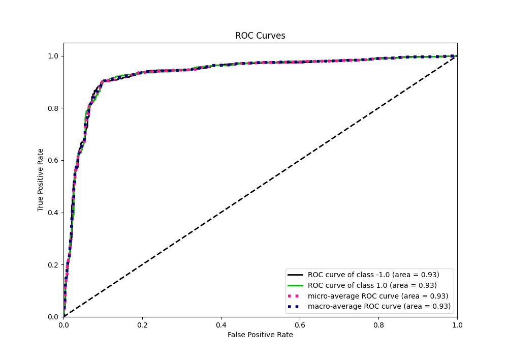
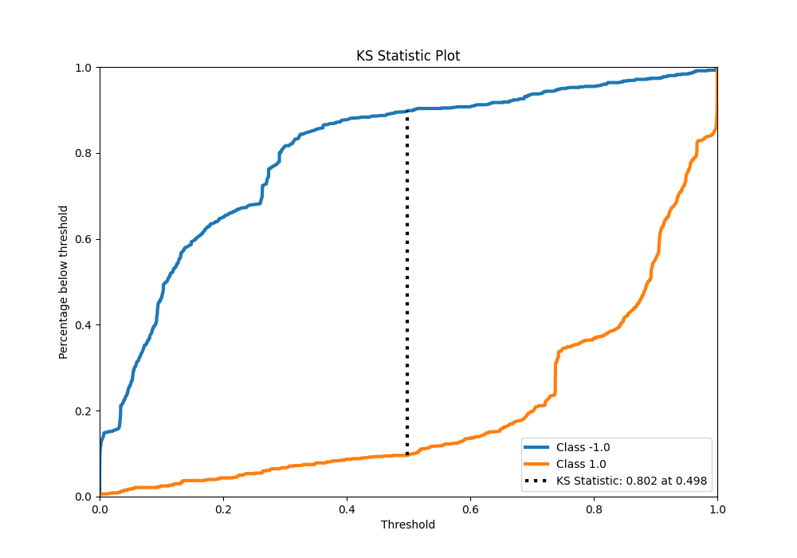
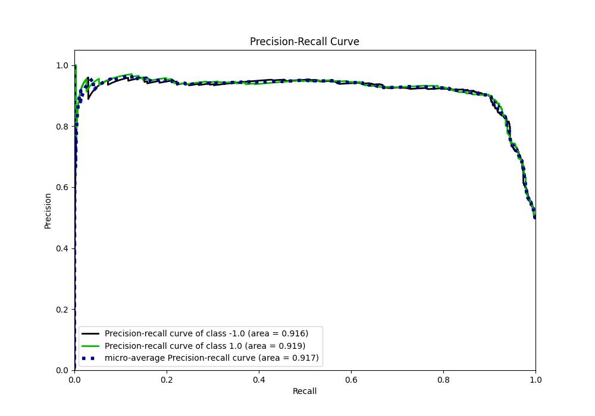
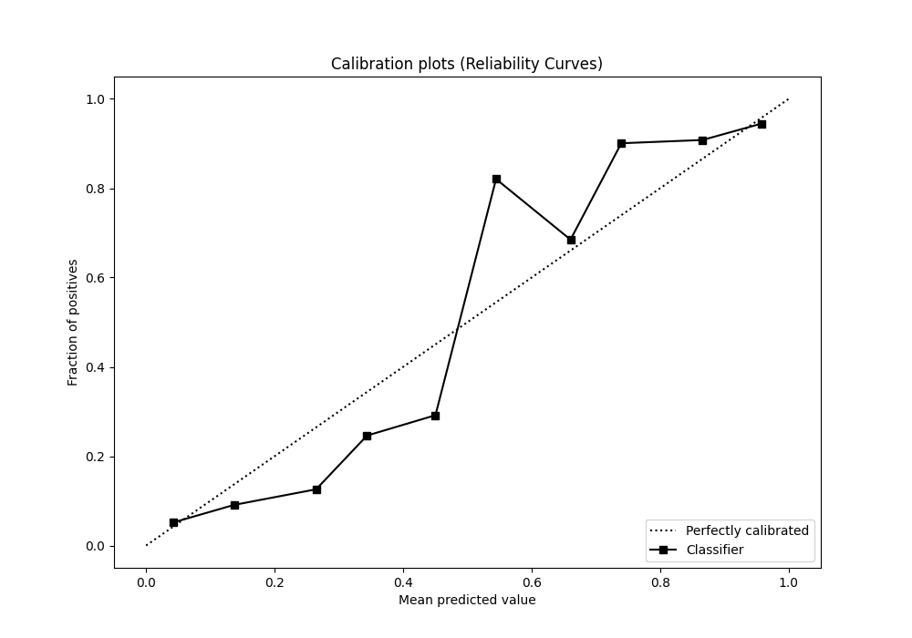
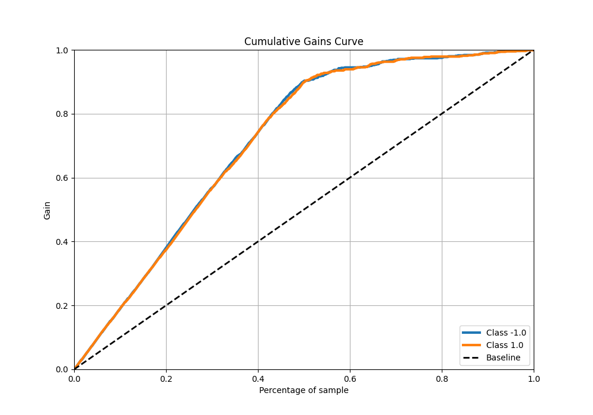
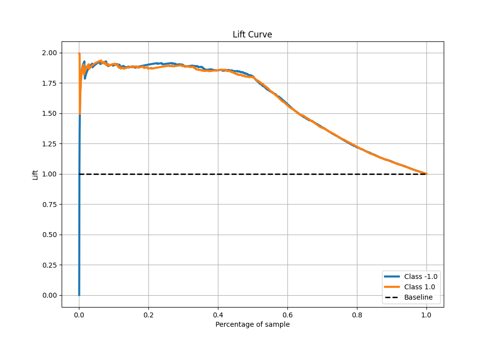

# Summary of 29_LightGBM_Stacked

[<< Go back](../README.md)

## LightGBM
- **n_jobs**: -1
- **objective**: binary
- **num_leaves**: 63
- **learning_rate**: 0.2
- **feature_fraction**: 1.0
- **bagging_fraction**: 0.9
- **min_data_in_leaf**: 10
- **metric**: custom
- **custom_eval_metric_name**: f1
- **explain_level**: 0

## Validation
 - **validation_type**: kfold
 - **shuffle**: True
 - **stratify**: True
 - **k_folds**: 5

## Optimized metric
f1

## Training time

24.9 seconds

## Metric details
|           |    score |     threshold |
|:----------|---------:|--------------:|
| logloss   | 0.356461 | nan           |
| auc       | 0.932251 | nan           |
| f1        | 0.900125 |   0.513646    |
| accuracy  | 0.9      |   0.513646    |
| precision | 0.968421 |   0.999325    |
| recall    | 1        |   1.76931e-05 |
| mcc       | 0.800011 |   0.513646    |

## Metric details with threshold from accuracy metric
|           |    score |   threshold |
|:----------|---------:|------------:|
| logloss   | 0.356461 |  nan        |
| auc       | 0.932251 |  nan        |
| f1        | 0.900125 |    0.513646 |
| accuracy  | 0.9      |    0.513646 |
| precision | 0.902378 |    0.513646 |
| recall    | 0.897883 |    0.513646 |
| mcc       | 0.800011 |    0.513646 |

## Confusion matrix (at threshold=0.513646)
|                 |   Predicted as -1.0 |   Predicted as 1.0 |
|:----------------|--------------------:|-------------------:|
| Labeled as -1.0 |                 719 |                 78 |
| Labeled as 1.0  |                  82 |                721 |

## Learning curves

## Confusion Matrix

## Normalized Confusion Matrix

## ROC Curve

## Kolmogorov-Smirnov Statistic

## Precision-Recall Curve

## Calibration Curve

## Cumulative Gains Curve

## Lift Curve

[<< Go back](../README.md)
