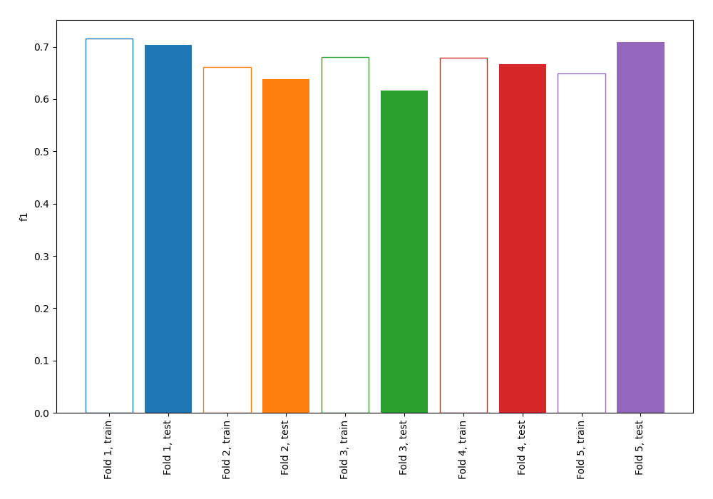
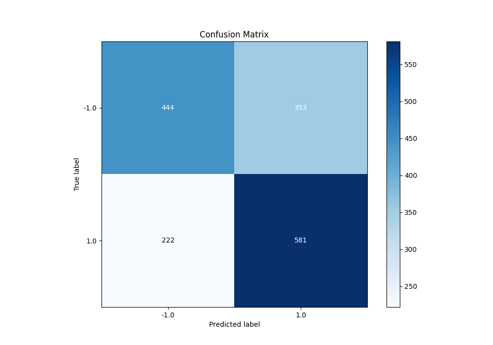
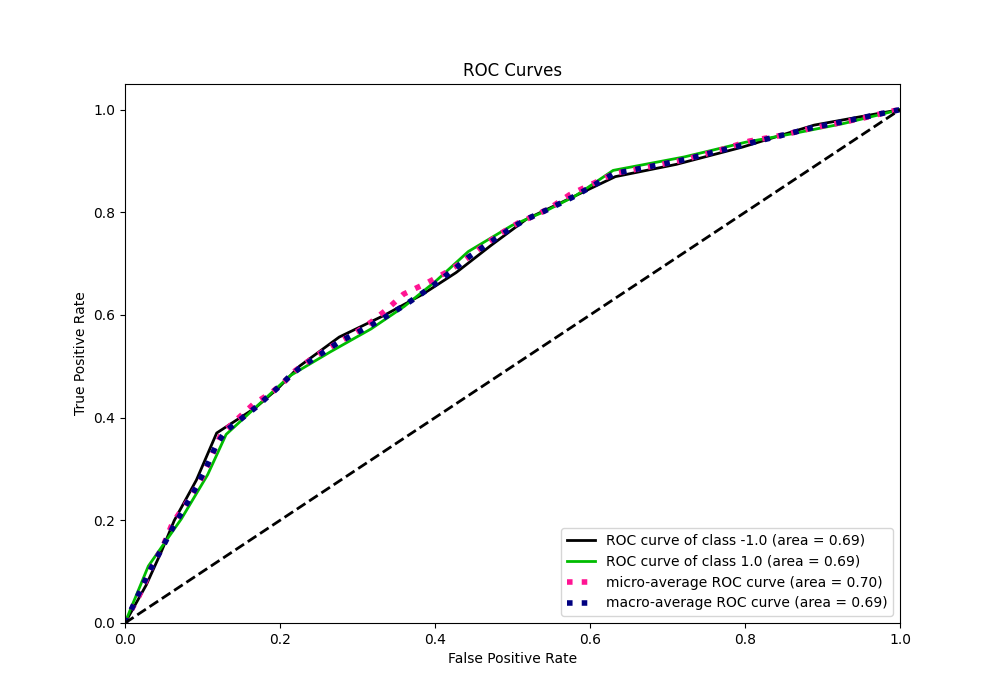
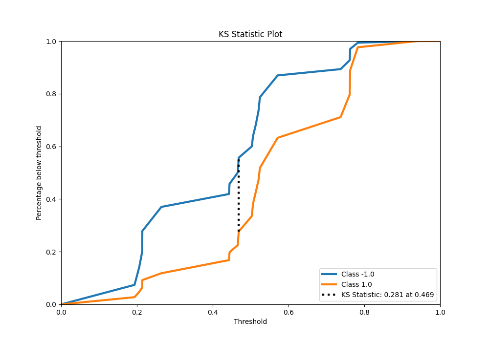
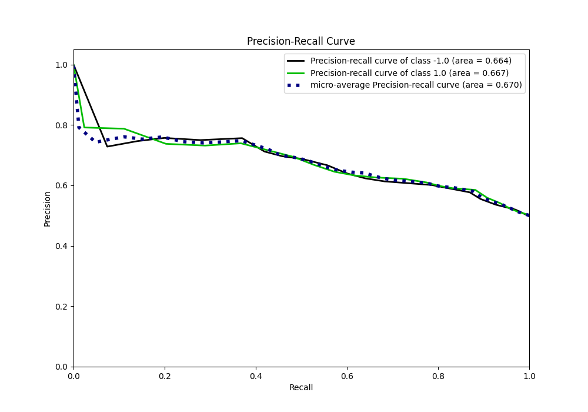
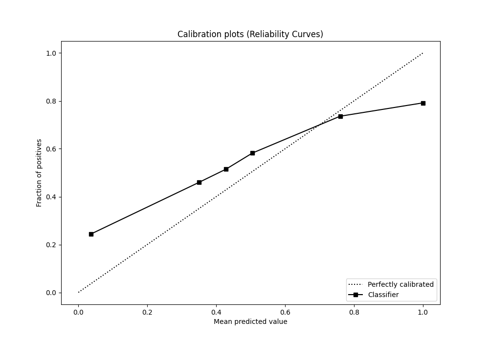
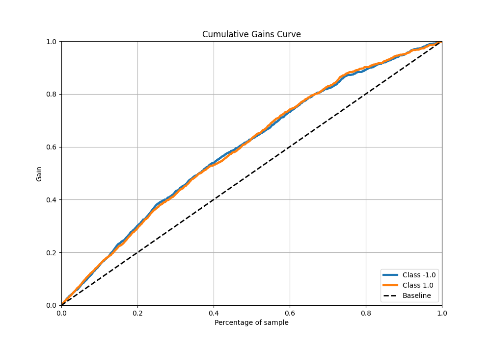
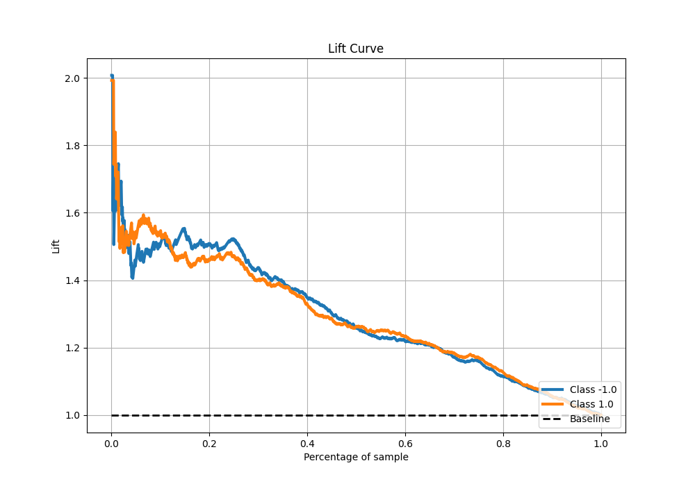

# Summary of 2_DecisionTree

[<< Go back](../README.md)

## Decision Tree
- **n_jobs**: -1
- **criterion**: entropy
- **max_depth**: 2
- **explain_level**: 0

## Validation
 - **validation_type**: kfold
 - **shuffle**: True
 - **stratify**: True
 - **k_folds**: 5

## Optimized metric
f1

## Training time

7.3 seconds

## Metric details
|           |    score |   threshold |
|:----------|---------:|------------:|
| logloss   | 0.631924 |  nan        |
| auc       | 0.692591 |  nan        |
| f1        | 0.703428 |    0.264535 |
| accuracy  | 0.640625 |    0.468553 |
| precision | 0.791667 |    0.782875 |
| recall    | 1        |    0.174296 |
| mcc       | 0.293273 |    0.264535 |

## Metric details with threshold from accuracy metric
|           |    score |   threshold |
|:----------|---------:|------------:|
| logloss   | 0.631924 |  nan        |
| auc       | 0.692591 |  nan        |
| f1        | 0.668969 |    0.468553 |
| accuracy  | 0.640625 |    0.468553 |
| precision | 0.622056 |    0.468553 |
| recall    | 0.723537 |    0.468553 |
| mcc       | 0.284645 |    0.468553 |

## Confusion matrix (at threshold=0.468553)
|                 |   Predicted as -1.0 |   Predicted as 1.0 |
|:----------------|--------------------:|-------------------:|
| Labeled as -1.0 |                 444 |                353 |
| Labeled as 1.0  |                 222 |                581 |

## Learning curves

## Confusion Matrix

## Normalized Confusion Matrix

## ROC Curve

## Kolmogorov-Smirnov Statistic

## Precision-Recall Curve

## Calibration Curve

## Cumulative Gains Curve

## Lift Curve

[<< Go back](../README.md)
