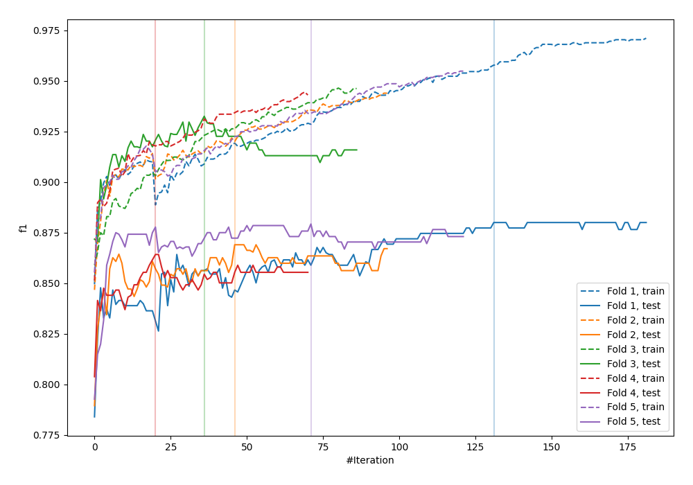

# Summary of 32_CatBoost

[<< Go back](../README.md)

## CatBoost
- **n_jobs**: -1
- **learning_rate**: 0.025
- **depth**: 9
- **rsm**: 0.9
- **loss_function**: Logloss
- **eval_metric**: F1
- **explain_level**: 0

## Validation
 - **validation_type**: kfold
 - **shuffle**: True
 - **stratify**: True
 - **k_folds**: 5

## Optimized metric
f1

## Training time

30.5 seconds

## Metric details
|           |    score |   threshold |
|:----------|---------:|------------:|
| logloss   | 0.393188 | nan         |
| auc       | 0.934424 | nan         |
| f1        | 0.882571 |   0.495725  |
| accuracy  | 0.88125  |   0.495725  |
| precision | 1        |   0.911426  |
| recall    | 1        |   0.0367581 |
| mcc       | 0.762569 |   0.495725  |

## Metric details with threshold from accuracy metric
|           |    score |   threshold |
|:----------|---------:|------------:|
| logloss   | 0.393188 |  nan        |
| auc       | 0.934424 |  nan        |
| f1        | 0.882571 |    0.495725 |
| accuracy  | 0.88125  |    0.495725 |
| precision | 0.876074 |    0.495725 |
| recall    | 0.889166 |    0.495725 |
| mcc       | 0.762569 |    0.495725 |

## Confusion matrix (at threshold=0.495725)
|                 |   Predicted as -1.0 |   Predicted as 1.0 |
|:----------------|--------------------:|-------------------:|
| Labeled as -1.0 |                 696 |                101 |
| Labeled as 1.0  |                  89 |                714 |

## Learning curves

## Confusion Matrix

## Normalized Confusion Matrix

## ROC Curve

## Kolmogorov-Smirnov Statistic

## Precision-Recall Curve

## Calibration Curve

## Cumulative Gains Curve

## Lift Curve

[<< Go back](../README.md)
