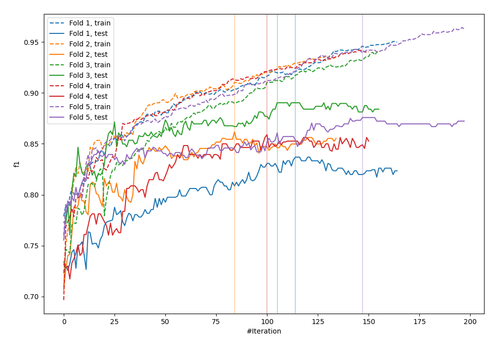
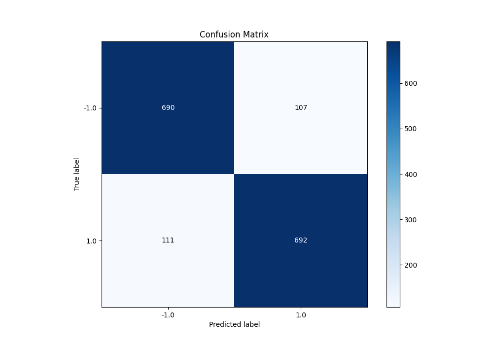
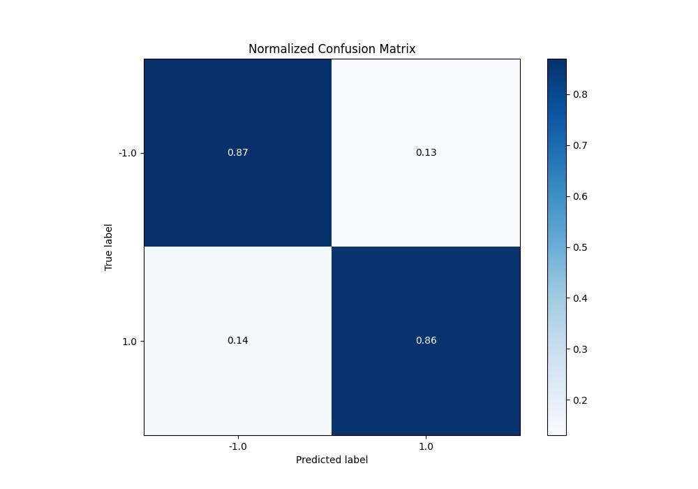
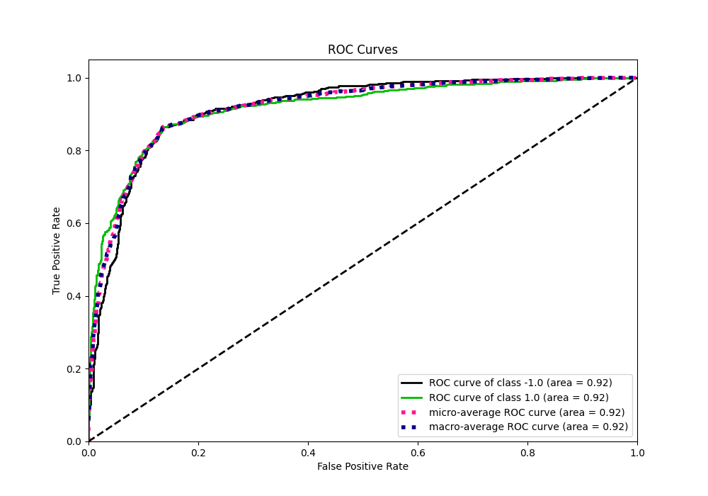
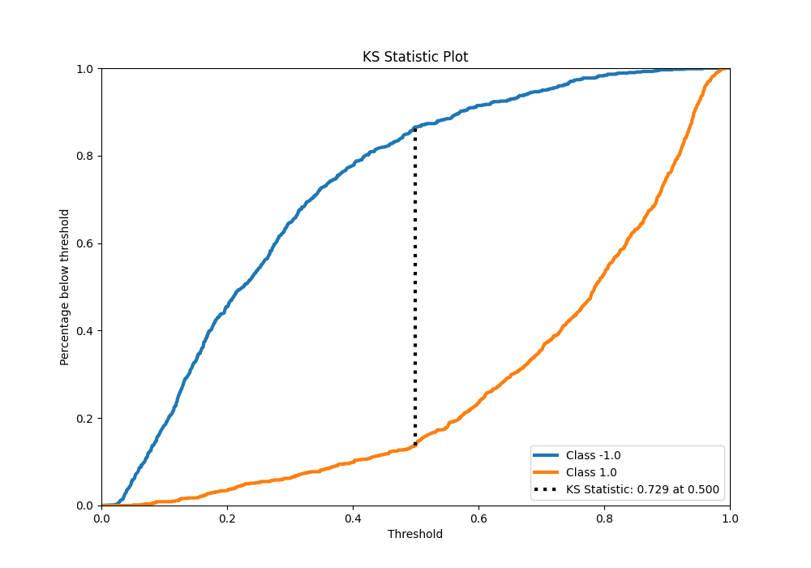
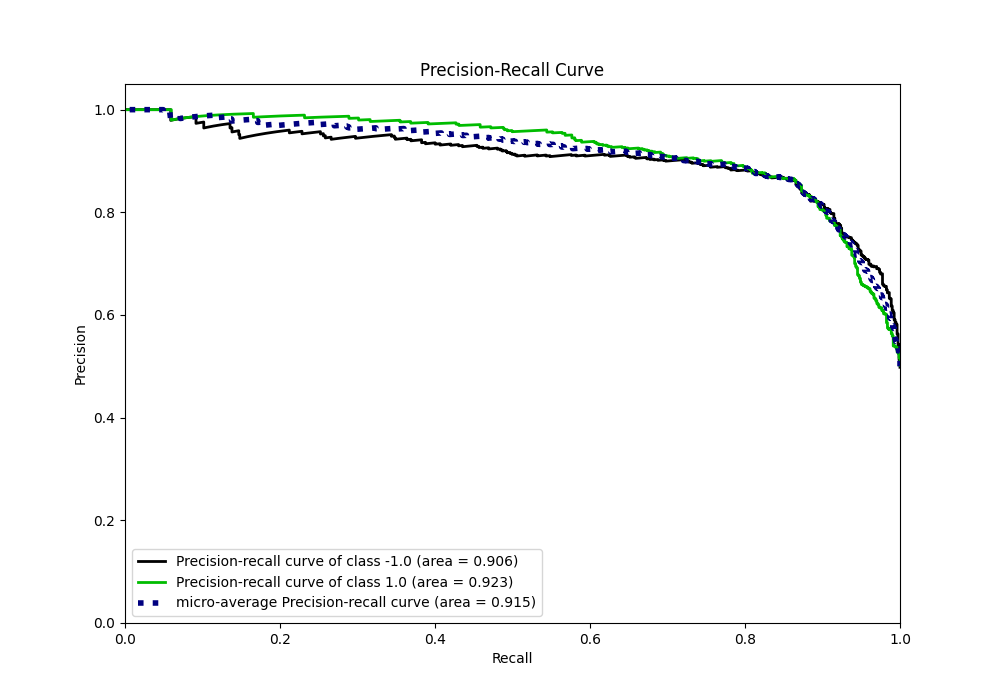
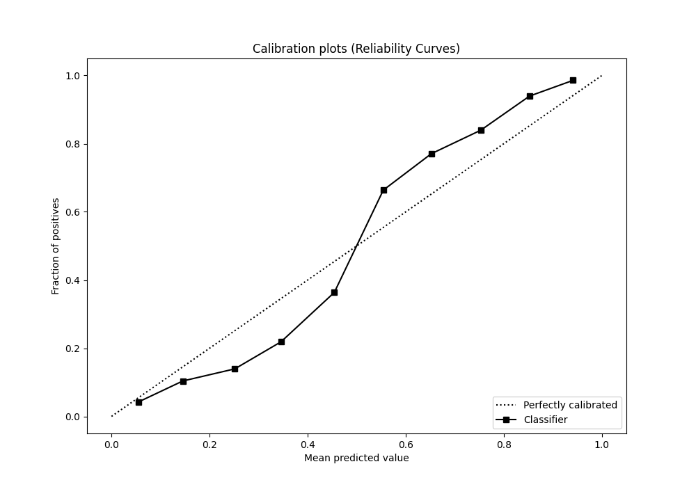
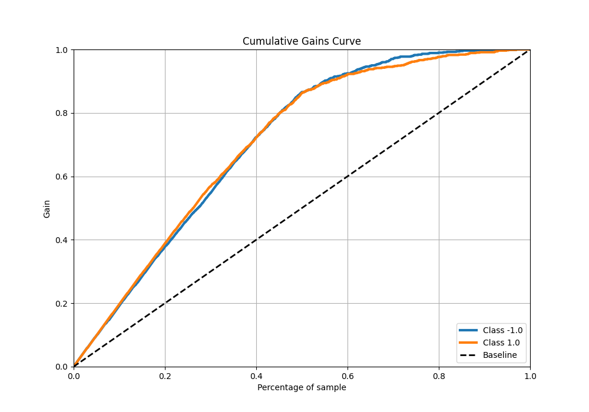
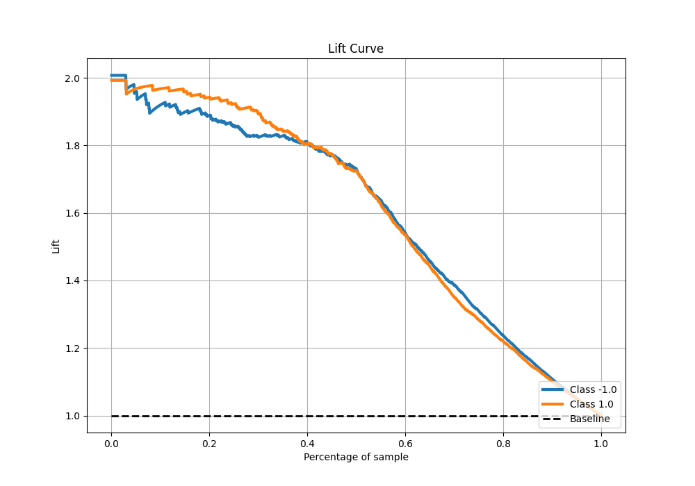

# Summary of 33_CatBoost

[<< Go back](../README.md)

## CatBoost
- **n_jobs**: -1
- **learning_rate**: 0.1
- **depth**: 4
- **rsm**: 0.9
- **loss_function**: Logloss
- **eval_metric**: F1
- **explain_level**: 0

## Validation
 - **validation_type**: kfold
 - **shuffle**: True
 - **stratify**: True
 - **k_folds**: 5

## Optimized metric
f1

## Training time

14.3 seconds

## Metric details
|           |    score |   threshold |
|:----------|---------:|------------:|
| logloss   | 0.384439 | nan         |
| auc       | 0.917883 | nan         |
| f1        | 0.86392  |   0.5005    |
| accuracy  | 0.86375  |   0.5005    |
| precision | 1        |   0.956817  |
| recall    | 1        |   0.0164406 |
| mcc       | 0.72751  |   0.5005    |

## Metric details with threshold from accuracy metric
|           |    score |   threshold |
|:----------|---------:|------------:|
| logloss   | 0.384439 |    nan      |
| auc       | 0.917883 |    nan      |
| f1        | 0.86392  |      0.5005 |
| accuracy  | 0.86375  |      0.5005 |
| precision | 0.866083 |      0.5005 |
| recall    | 0.861768 |      0.5005 |
| mcc       | 0.72751  |      0.5005 |

## Confusion matrix (at threshold=0.5005)
|                 |   Predicted as -1.0 |   Predicted as 1.0 |
|:----------------|--------------------:|-------------------:|
| Labeled as -1.0 |                 690 |                107 |
| Labeled as 1.0  |                 111 |                692 |

## Learning curves

## Confusion Matrix

## Normalized Confusion Matrix

## ROC Curve

## Kolmogorov-Smirnov Statistic

## Precision-Recall Curve

## Calibration Curve

## Cumulative Gains Curve

## Lift Curve

[<< Go back](../README.md)
