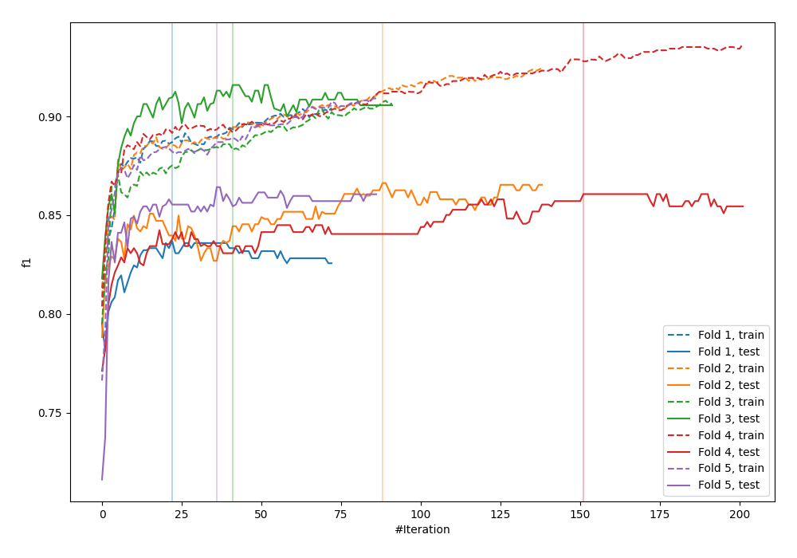
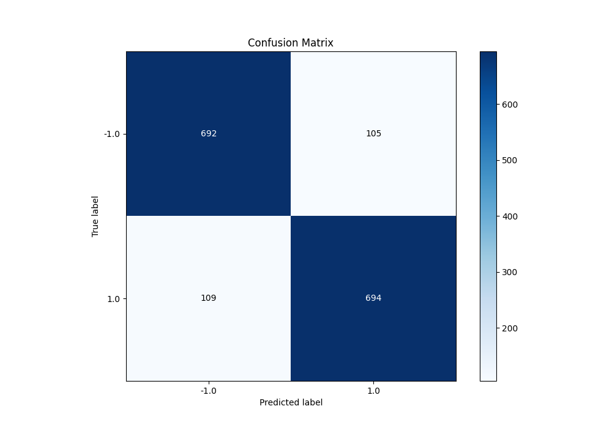
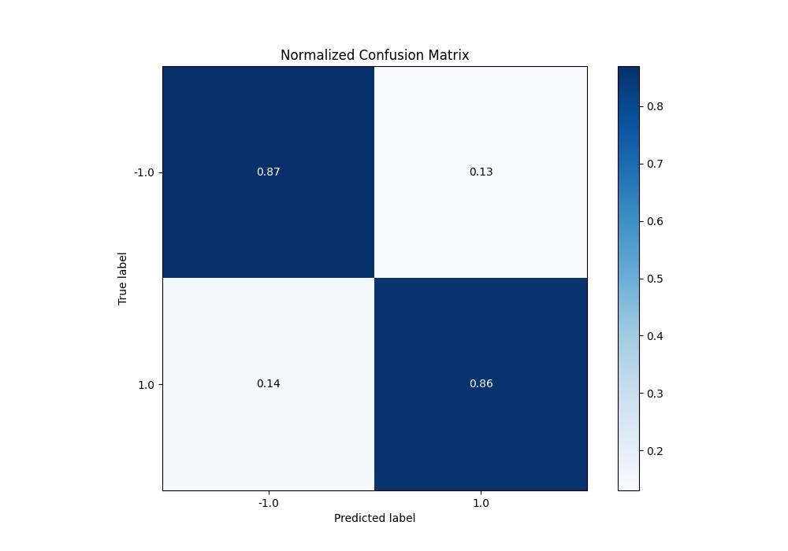
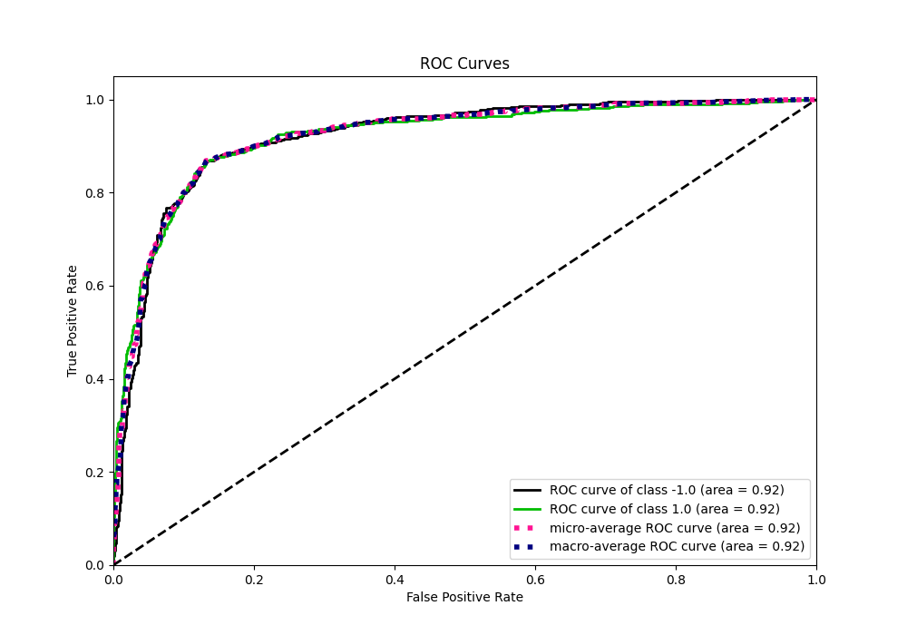
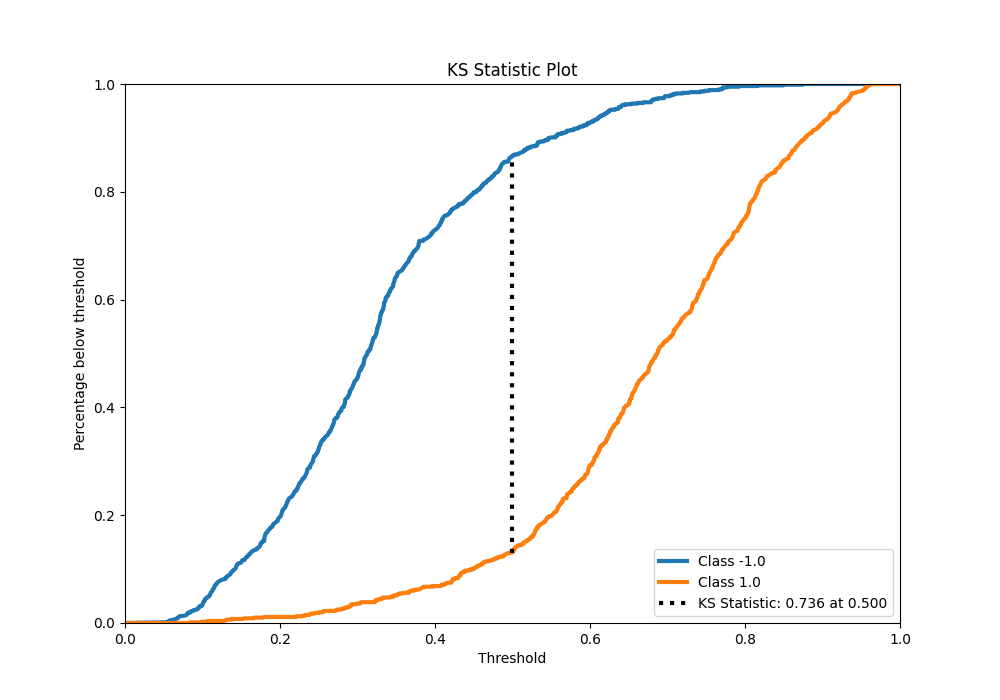
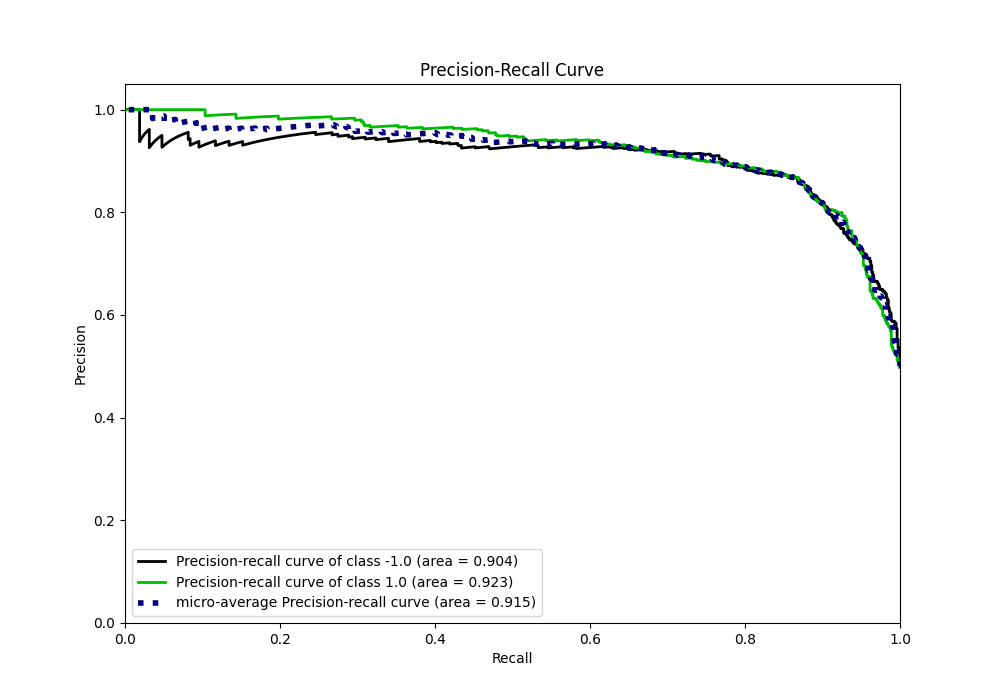
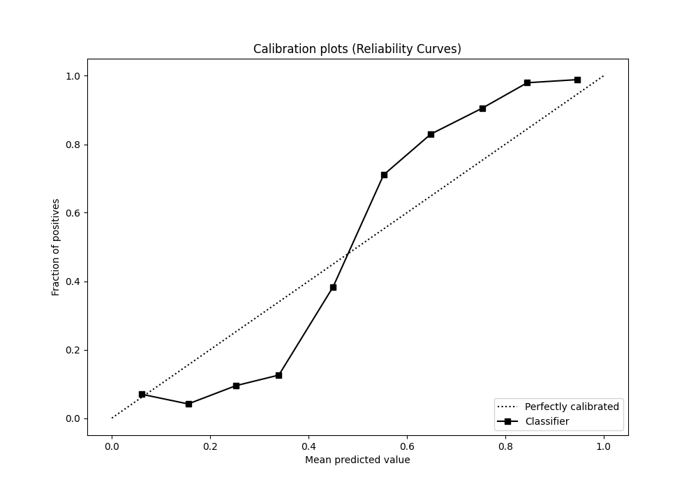
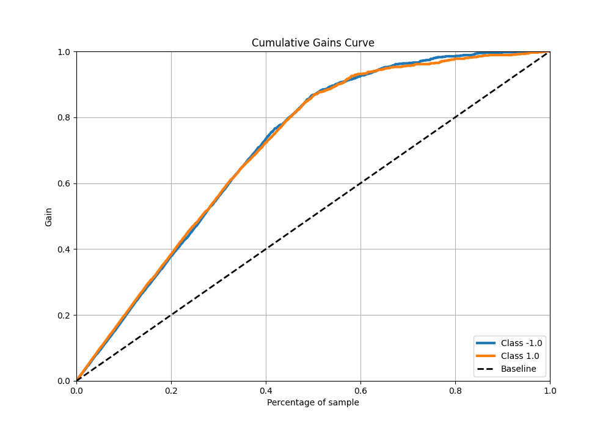
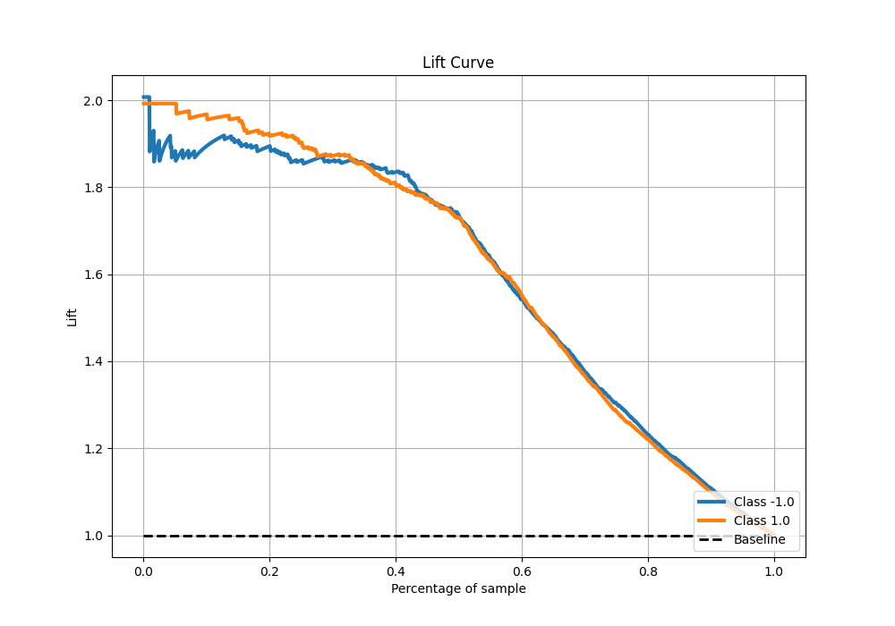

# Summary of 34_CatBoost

[<< Go back](../README.md)

## CatBoost
- **n_jobs**: -1
- **learning_rate**: 0.025
- **depth**: 6
- **rsm**: 0.9
- **loss_function**: Logloss
- **eval_metric**: F1
- **explain_level**: 0

## Validation
 - **validation_type**: kfold
 - **shuffle**: True
 - **stratify**: True
 - **k_folds**: 5

## Optimized metric
f1

## Training time

14.5 seconds

## Metric details
|           |    score |   threshold |
|:----------|---------:|------------:|
| logloss   | 0.43519  | nan         |
| auc       | 0.920305 | nan         |
| f1        | 0.866417 |   0.502177  |
| accuracy  | 0.86625  |   0.502177  |
| precision | 1        |   0.879257  |
| recall    | 1        |   0.0458389 |
| mcc       | 0.73251  |   0.502177  |

## Metric details with threshold from accuracy metric
|           |    score |   threshold |
|:----------|---------:|------------:|
| logloss   | 0.43519  |  nan        |
| auc       | 0.920305 |  nan        |
| f1        | 0.866417 |    0.502177 |
| accuracy  | 0.86625  |    0.502177 |
| precision | 0.868586 |    0.502177 |
| recall    | 0.864259 |    0.502177 |
| mcc       | 0.73251  |    0.502177 |

## Confusion matrix (at threshold=0.502177)
|                 |   Predicted as -1.0 |   Predicted as 1.0 |
|:----------------|--------------------:|-------------------:|
| Labeled as -1.0 |                 692 |                105 |
| Labeled as 1.0  |                 109 |                694 |

## Learning curves

## Confusion Matrix

## Normalized Confusion Matrix

## ROC Curve

## Kolmogorov-Smirnov Statistic

## Precision-Recall Curve

## Calibration Curve

## Cumulative Gains Curve

## Lift Curve

[<< Go back](../README.md)
