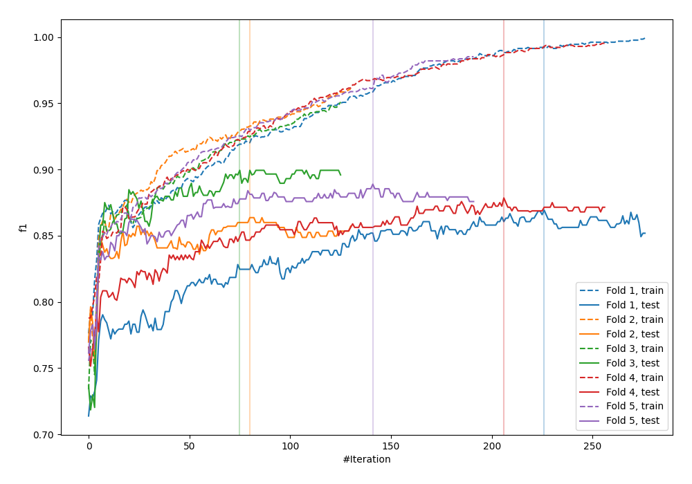
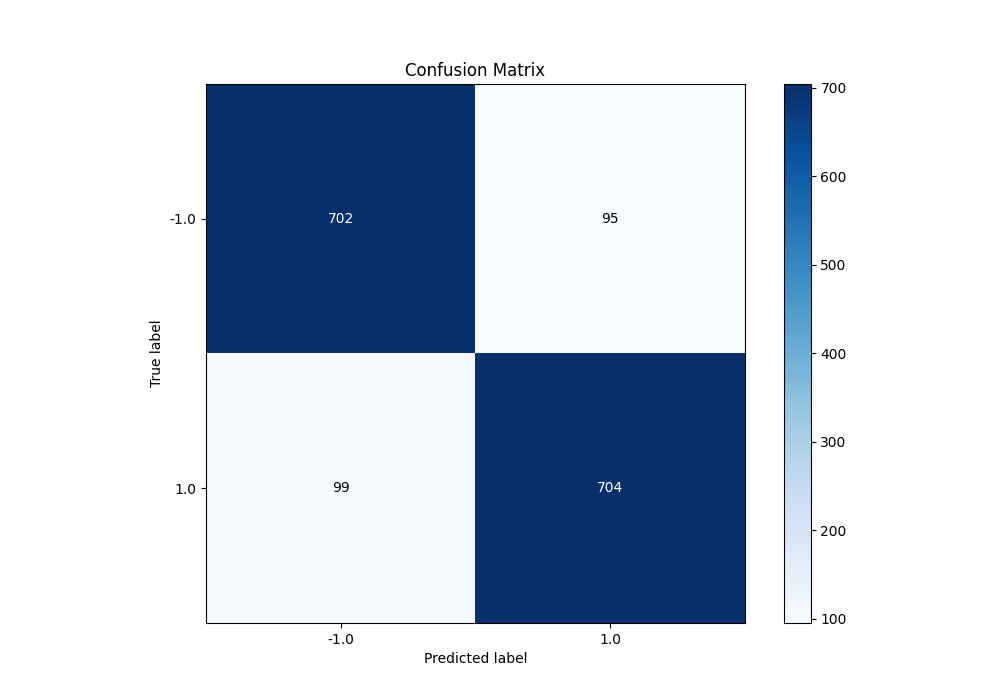
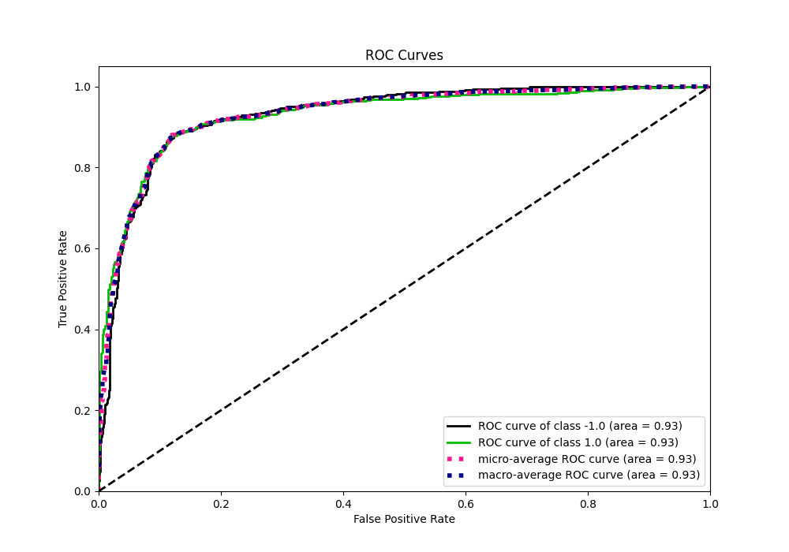
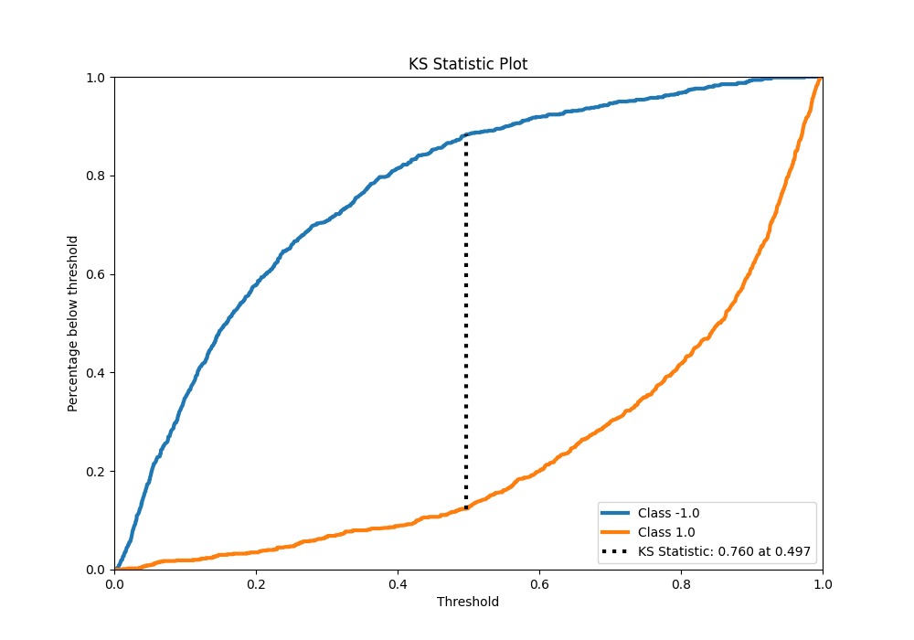
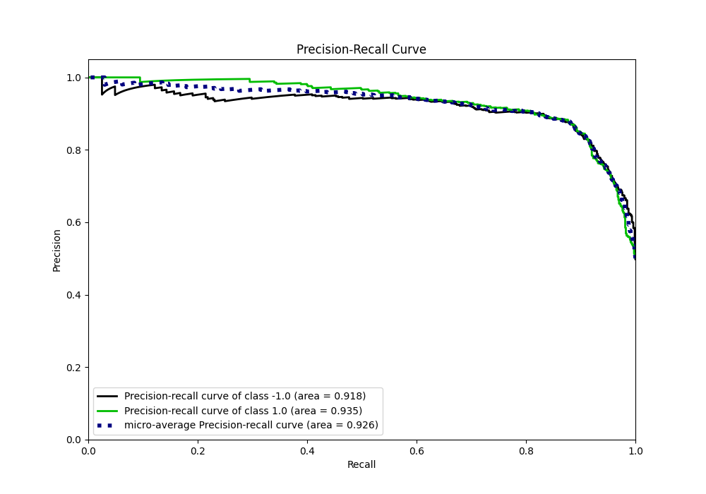
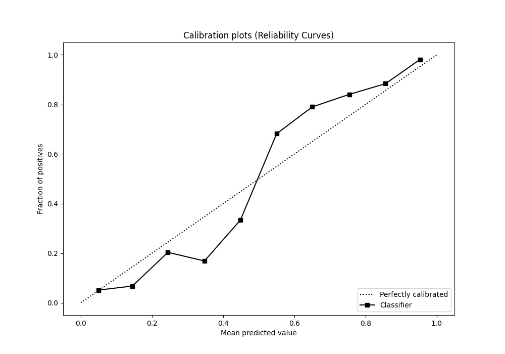
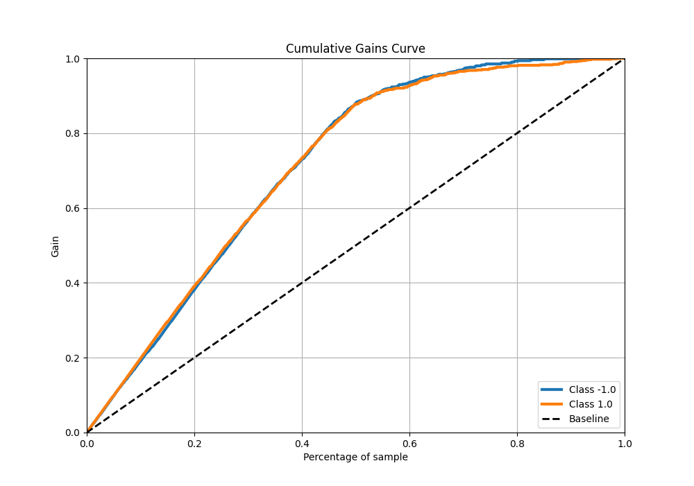
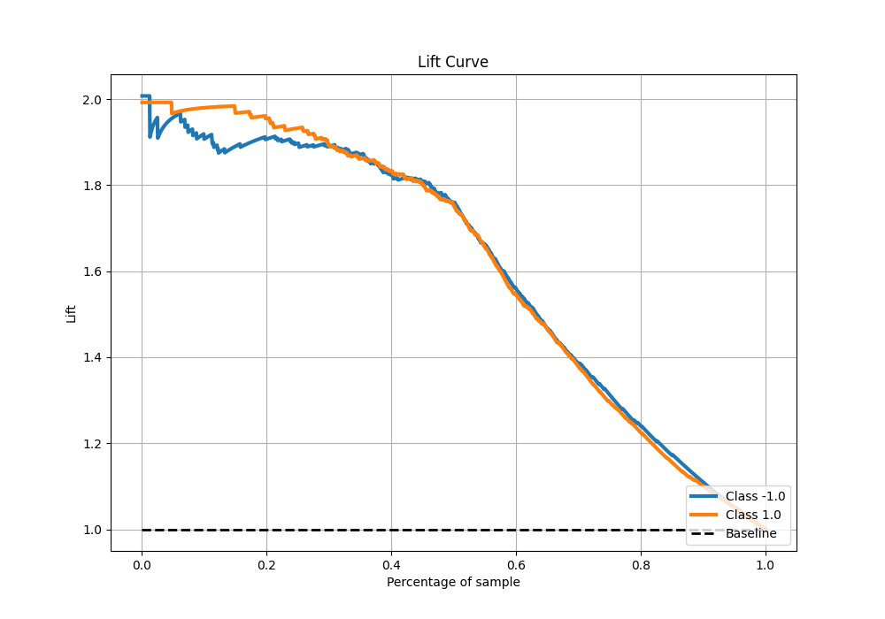

# Summary of 35_CatBoost

[<< Go back](../README.md)

## CatBoost
- **n_jobs**: -1
- **learning_rate**: 0.1
- **depth**: 5
- **rsm**: 0.8
- **loss_function**: Logloss
- **eval_metric**: F1
- **explain_level**: 0

## Validation
 - **validation_type**: kfold
 - **shuffle**: True
 - **stratify**: True
 - **k_folds**: 5

## Optimized metric
f1

## Training time

16.3 seconds

## Metric details
|           |    score |    threshold |
|:----------|---------:|-------------:|
| logloss   | 0.344876 | nan          |
| auc       | 0.930622 | nan          |
| f1        | 0.878901 |   0.495988   |
| accuracy  | 0.87875  |   0.495988   |
| precision | 1        |   0.980118   |
| recall    | 1        |   0.00245361 |
| mcc       | 0.757511 |   0.495988   |

## Metric details with threshold from accuracy metric
|           |    score |   threshold |
|:----------|---------:|------------:|
| logloss   | 0.344876 |  nan        |
| auc       | 0.930622 |  nan        |
| f1        | 0.878901 |    0.495988 |
| accuracy  | 0.87875  |    0.495988 |
| precision | 0.881101 |    0.495988 |
| recall    | 0.876712 |    0.495988 |
| mcc       | 0.757511 |    0.495988 |

## Confusion matrix (at threshold=0.495988)
|                 |   Predicted as -1.0 |   Predicted as 1.0 |
|:----------------|--------------------:|-------------------:|
| Labeled as -1.0 |                 702 |                 95 |
| Labeled as 1.0  |                  99 |                704 |

## Learning curves

## Confusion Matrix

## Normalized Confusion Matrix

## ROC Curve

## Kolmogorov-Smirnov Statistic

## Precision-Recall Curve

## Calibration Curve

## Cumulative Gains Curve

## Lift Curve

[<< Go back](../README.md)
