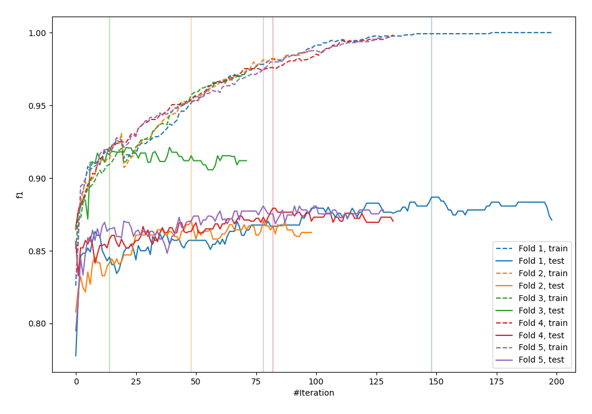
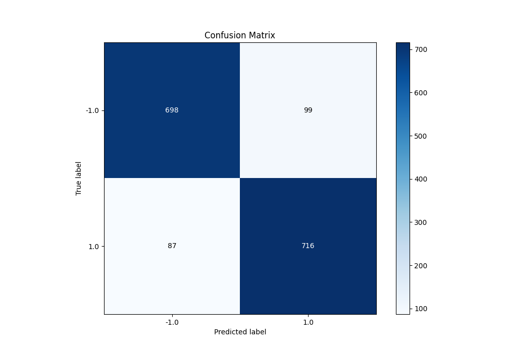
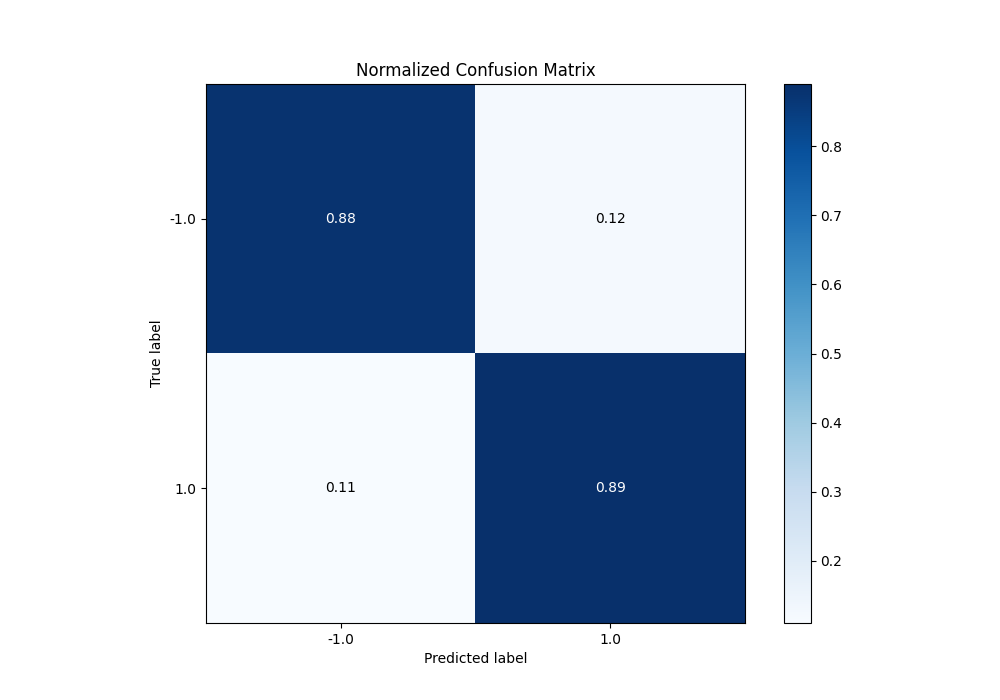
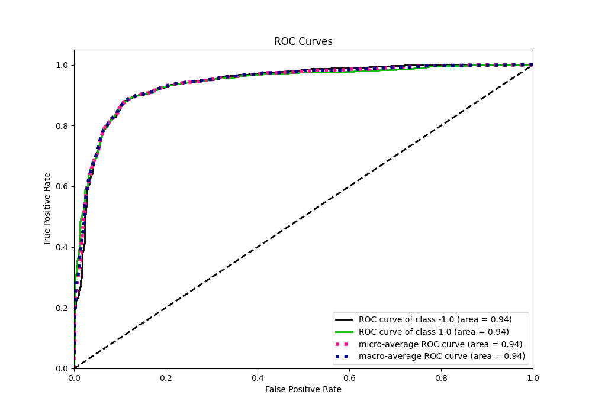
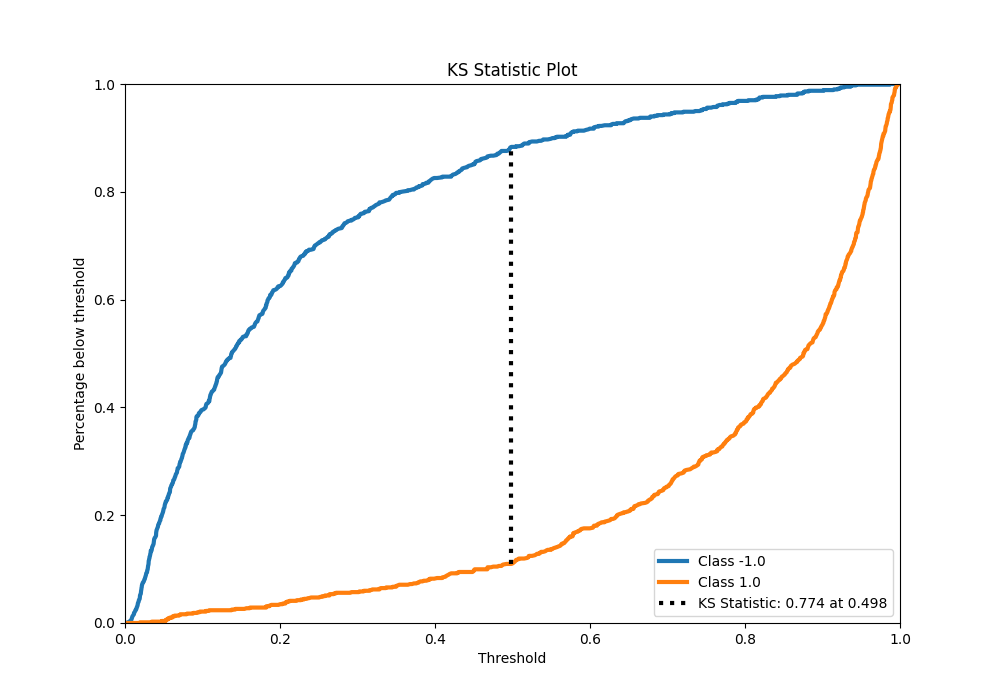
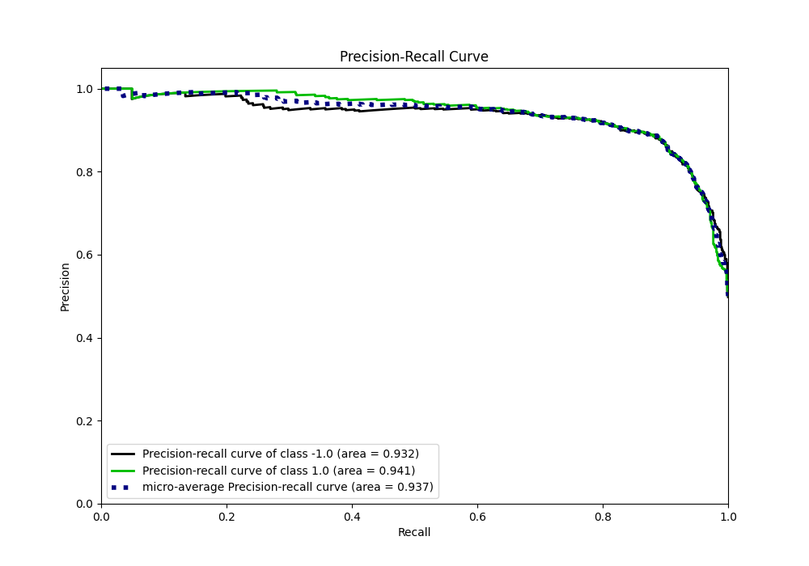
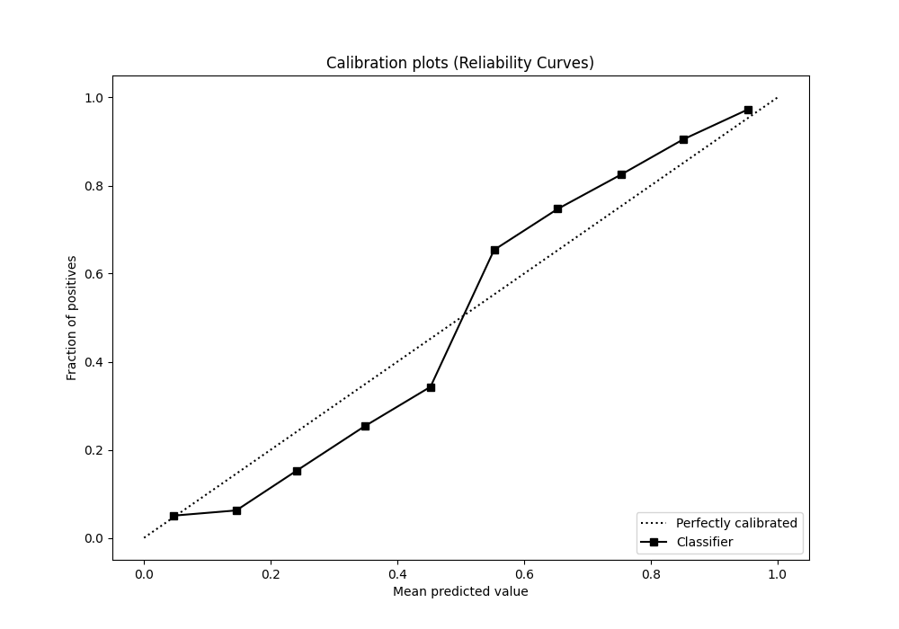
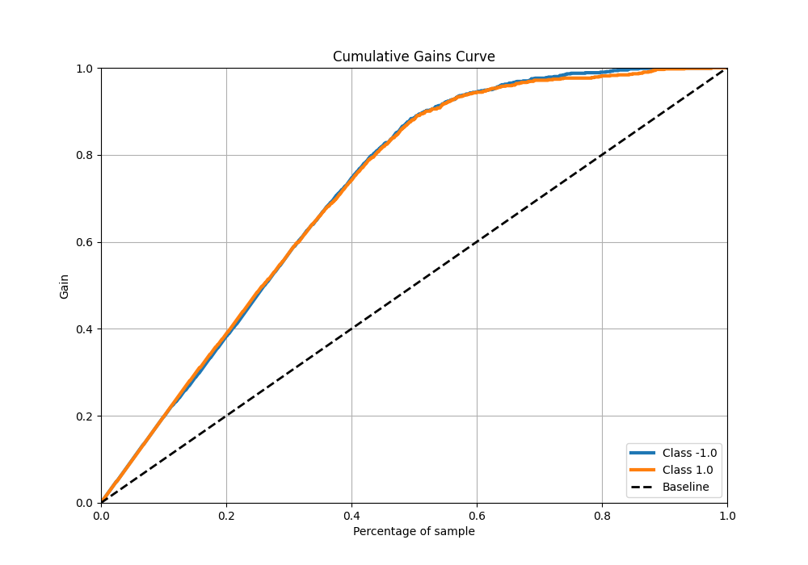
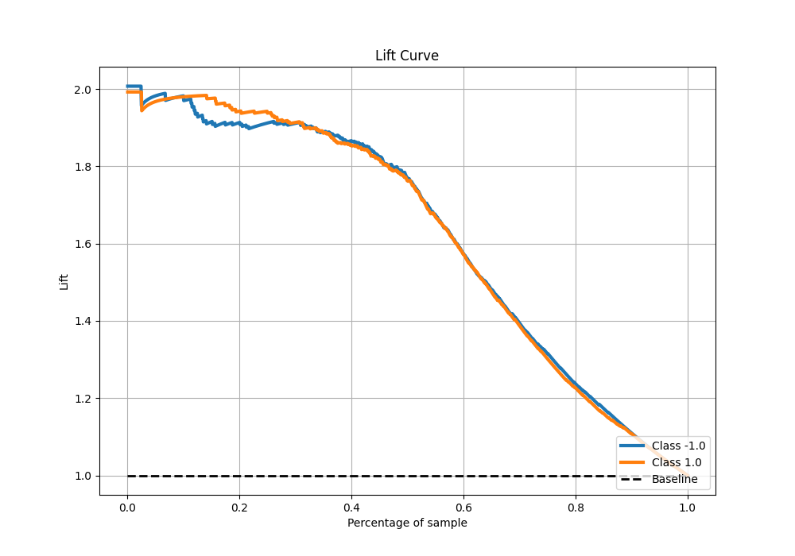

# Summary of 37_CatBoost

[<< Go back](../README.md)

## CatBoost
- **n_jobs**: -1
- **learning_rate**: 0.1
- **depth**: 8
- **rsm**: 1.0
- **loss_function**: Logloss
- **eval_metric**: F1
- **explain_level**: 0

## Validation
 - **validation_type**: kfold
 - **shuffle**: True
 - **stratify**: True
 - **k_folds**: 5

## Optimized metric
f1

## Training time

21.9 seconds

## Metric details
|           |    score |    threshold |
|:----------|---------:|-------------:|
| logloss   | 0.320798 | nan          |
| auc       | 0.939329 | nan          |
| f1        | 0.885043 |   0.489874   |
| accuracy  | 0.88375  |   0.489874   |
| precision | 1        |   0.988311   |
| recall    | 1        |   0.00472569 |
| mcc       | 0.76757  |   0.489874   |

## Metric details with threshold from accuracy metric
|           |    score |   threshold |
|:----------|---------:|------------:|
| logloss   | 0.320798 |  nan        |
| auc       | 0.939329 |  nan        |
| f1        | 0.885043 |    0.489874 |
| accuracy  | 0.88375  |    0.489874 |
| precision | 0.878528 |    0.489874 |
| recall    | 0.891656 |    0.489874 |
| mcc       | 0.76757  |    0.489874 |

## Confusion matrix (at threshold=0.489874)
|                 |   Predicted as -1.0 |   Predicted as 1.0 |
|:----------------|--------------------:|-------------------:|
| Labeled as -1.0 |                 698 |                 99 |
| Labeled as 1.0  |                  87 |                716 |

## Learning curves

## Confusion Matrix

## Normalized Confusion Matrix

## ROC Curve

## Kolmogorov-Smirnov Statistic

## Precision-Recall Curve

## Calibration Curve

## Cumulative Gains Curve

## Lift Curve

[<< Go back](../README.md)
