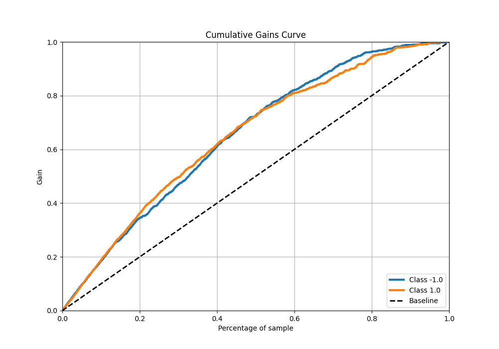

# Summary of 40_RandomForest

[<< Go back](../README.md)

## Random Forest
- **n_jobs**: -1
- **criterion**: entropy
- **max_features**: 1.0
- **min_samples_split**: 20
- **max_depth**: 3
- **eval_metric_name**: f1
- **explain_level**: 0

## Validation
 - **validation_type**: kfold
 - **shuffle**: True
 - **stratify**: True
 - **k_folds**: 5

## Optimized metric
f1

## Training time

13.7 seconds

## Metric details
|           |    score |   threshold |
|:----------|---------:|------------:|
| logloss   | 0.562797 |  nan        |
| auc       | 0.801686 |  nan        |
| f1        | 0.739477 |    0.435267 |
| accuracy  | 0.73     |    0.493782 |
| precision | 0.963964 |    0.872779 |
| recall    | 1        |    0.034035 |
| mcc       | 0.46216  |    0.524542 |

## Metric details with threshold from accuracy metric
|           |    score |   threshold |
|:----------|---------:|------------:|
| logloss   | 0.562797 |  nan        |
| auc       | 0.801686 |  nan        |
| f1        | 0.735618 |    0.493782 |
| accuracy  | 0.73     |    0.493782 |
| precision | 0.723225 |    0.493782 |
| recall    | 0.748443 |    0.493782 |
| mcc       | 0.460204 |    0.493782 |

## Confusion matrix (at threshold=0.493782)
|                 |   Predicted as -1.0 |   Predicted as 1.0 |
|:----------------|--------------------:|-------------------:|
| Labeled as -1.0 |                 567 |                230 |
| Labeled as 1.0  |                 202 |                601 |

## Learning curves

## Confusion Matrix

## Normalized Confusion Matrix

## ROC Curve

## Kolmogorov-Smirnov Statistic

## Precision-Recall Curve

## Calibration Curve

## Cumulative Gains Curve

## Lift Curve

[<< Go back](../README.md)
