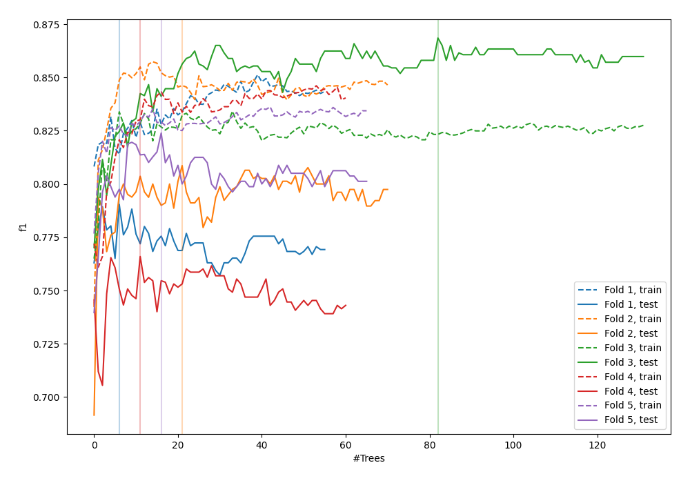
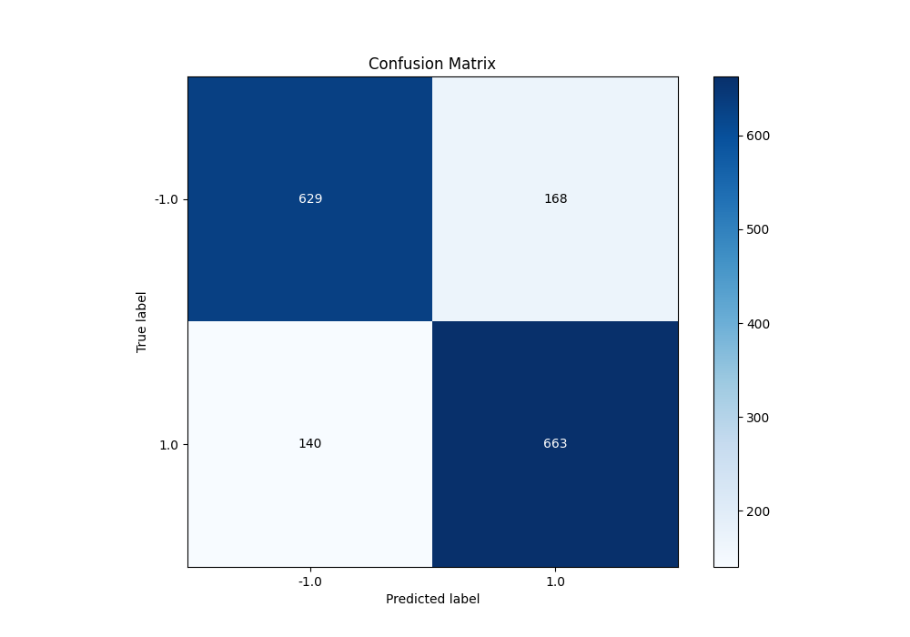
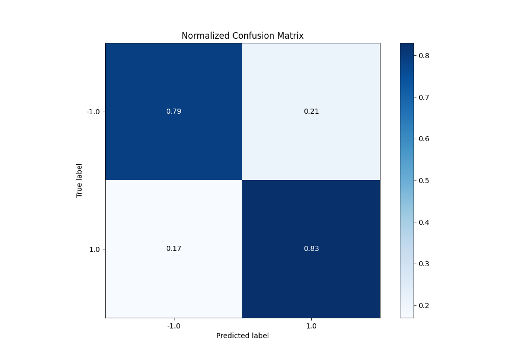
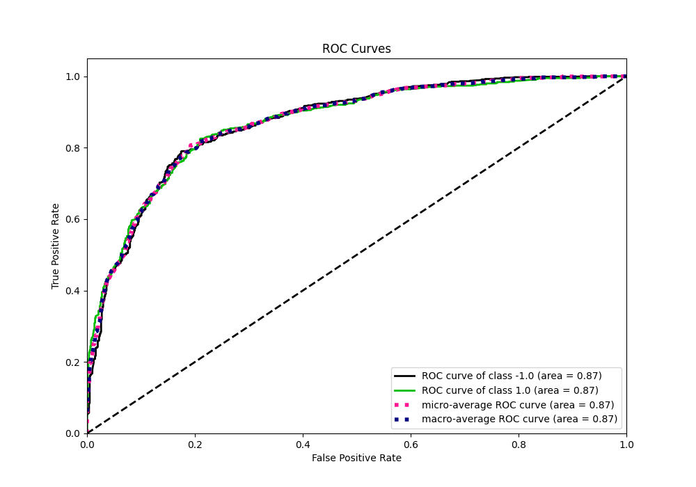
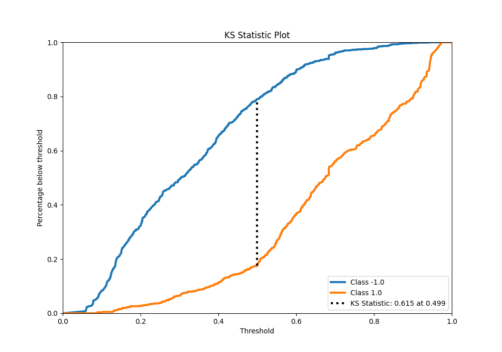
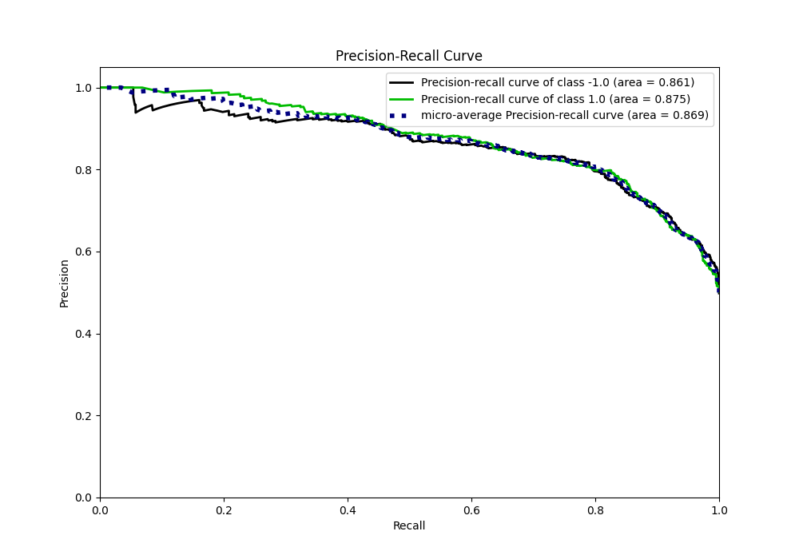
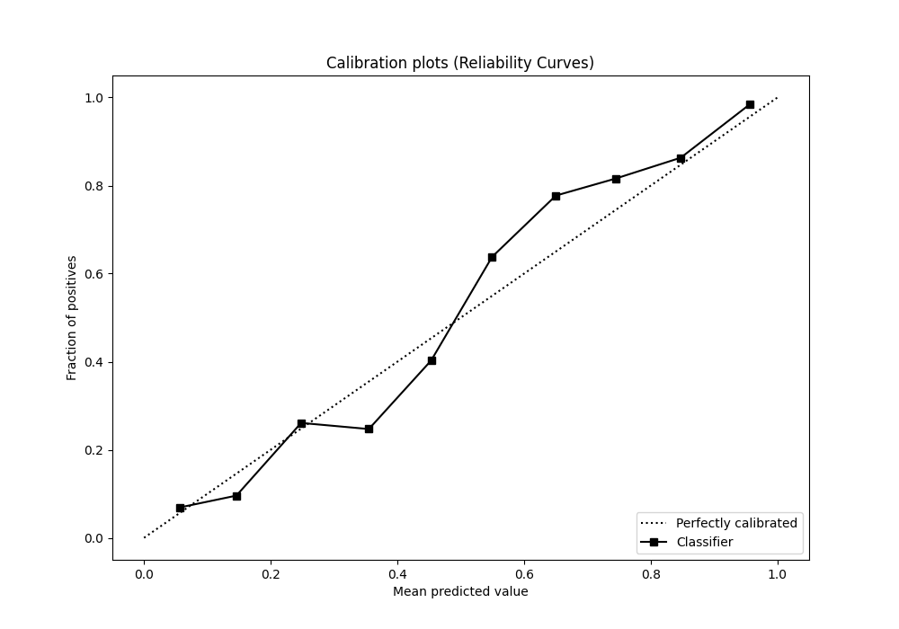
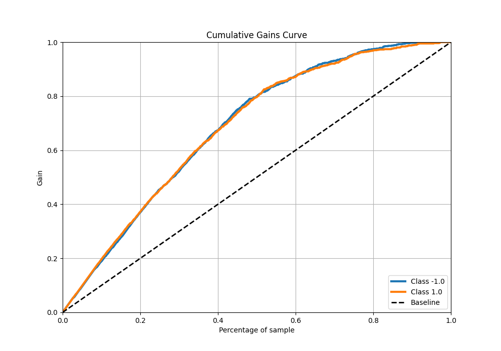
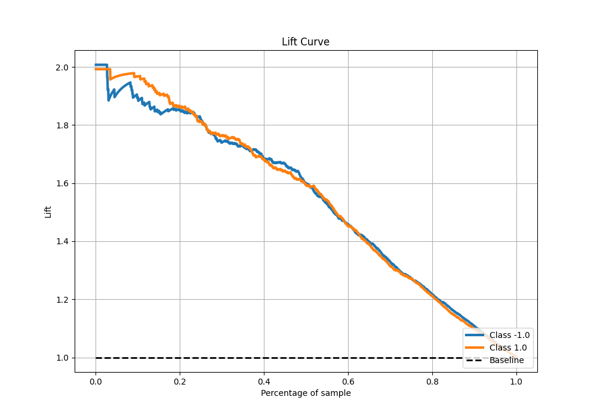

# Summary of 42_RandomForest

[<< Go back](../README.md)

## Random Forest
- **n_jobs**: -1
- **criterion**: gini
- **max_features**: 0.8
- **min_samples_split**: 50
- **max_depth**: 4
- **eval_metric_name**: f1
- **explain_level**: 0

## Validation
 - **validation_type**: kfold
 - **shuffle**: True
 - **stratify**: True
 - **k_folds**: 5

## Optimized metric
f1

## Training time

17.5 seconds

## Metric details
|           |    score |   threshold |
|:----------|---------:|------------:|
| logloss   | 0.465294 | nan         |
| auc       | 0.870311 | nan         |
| f1        | 0.811506 |   0.498937  |
| accuracy  | 0.8075   |   0.498937  |
| precision | 1        |   0.944381  |
| recall    | 1        |   0.0525254 |
| mcc       | 0.615321 |   0.498937  |

## Metric details with threshold from accuracy metric
|           |    score |   threshold |
|:----------|---------:|------------:|
| logloss   | 0.465294 |  nan        |
| auc       | 0.870311 |  nan        |
| f1        | 0.811506 |    0.498937 |
| accuracy  | 0.8075   |    0.498937 |
| precision | 0.797834 |    0.498937 |
| recall    | 0.825654 |    0.498937 |
| mcc       | 0.615321 |    0.498937 |

## Confusion matrix (at threshold=0.498937)
|                 |   Predicted as -1.0 |   Predicted as 1.0 |
|:----------------|--------------------:|-------------------:|
| Labeled as -1.0 |                 629 |                168 |
| Labeled as 1.0  |                 140 |                663 |

## Learning curves

## Confusion Matrix

## Normalized Confusion Matrix

## ROC Curve

## Kolmogorov-Smirnov Statistic

## Precision-Recall Curve

## Calibration Curve

## Cumulative Gains Curve

## Lift Curve

[<< Go back](../README.md)
