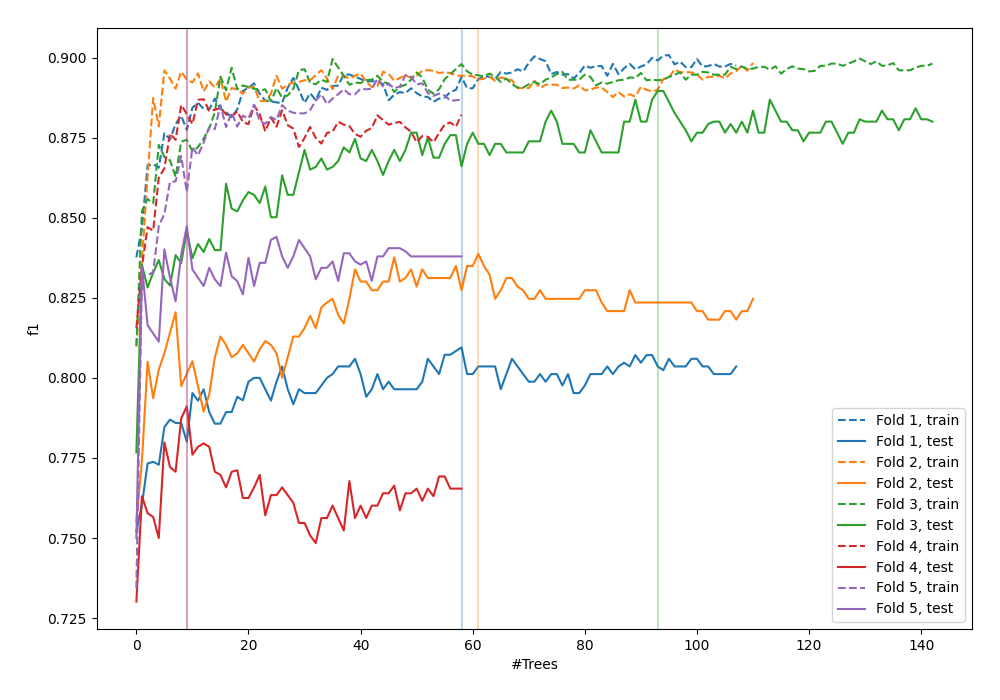

# Summary of 44_RandomForest

[<< Go back](../README.md)

## Random Forest
- **n_jobs**: -1
- **criterion**: entropy
- **max_features**: 0.9
- **min_samples_split**: 20
- **max_depth**: 5
- **eval_metric_name**: f1
- **explain_level**: 0

## Validation
 - **validation_type**: kfold
 - **shuffle**: True
 - **stratify**: True
 - **k_folds**: 5

## Optimized metric
f1

## Training time

21.9 seconds

## Metric details
|           |    score |    threshold |
|:----------|---------:|-------------:|
| logloss   | 0.423153 | nan          |
| auc       | 0.900974 | nan          |
| f1        | 0.832709 |   0.501639   |
| accuracy  | 0.8325   |   0.501639   |
| precision | 1        |   0.990296   |
| recall    | 1        |   0.00828024 |
| mcc       | 0.66501  |   0.501639   |

## Metric details with threshold from accuracy metric
|           |    score |   threshold |
|:----------|---------:|------------:|
| logloss   | 0.423153 |  nan        |
| auc       | 0.900974 |  nan        |
| f1        | 0.832709 |    0.501639 |
| accuracy  | 0.8325   |    0.501639 |
| precision | 0.834793 |    0.501639 |
| recall    | 0.830635 |    0.501639 |
| mcc       | 0.66501  |    0.501639 |

## Confusion matrix (at threshold=0.501639)
|                 |   Predicted as -1.0 |   Predicted as 1.0 |
|:----------------|--------------------:|-------------------:|
| Labeled as -1.0 |                 665 |                132 |
| Labeled as 1.0  |                 136 |                667 |

## Learning curves

## Confusion Matrix

## Normalized Confusion Matrix

## ROC Curve

## Kolmogorov-Smirnov Statistic

## Precision-Recall Curve

## Calibration Curve

## Cumulative Gains Curve

## Lift Curve

[<< Go back](../README.md)
